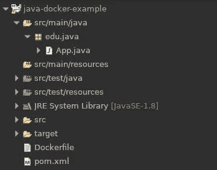
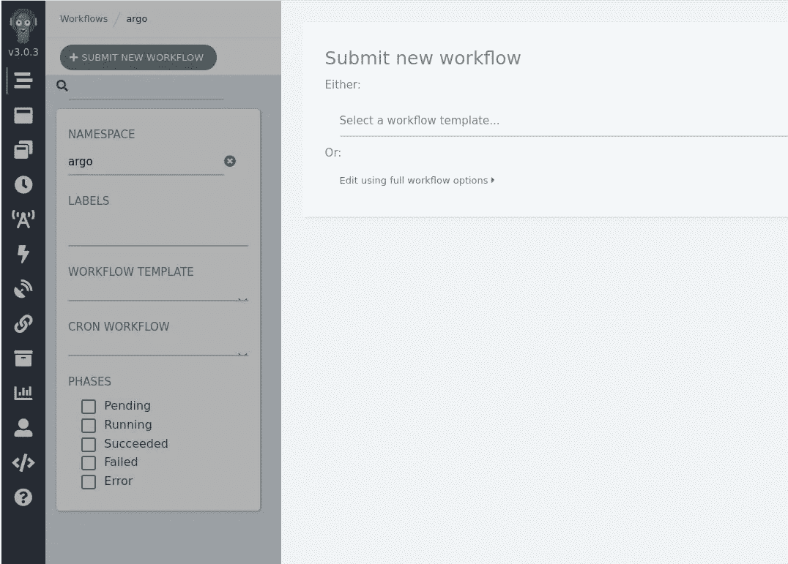
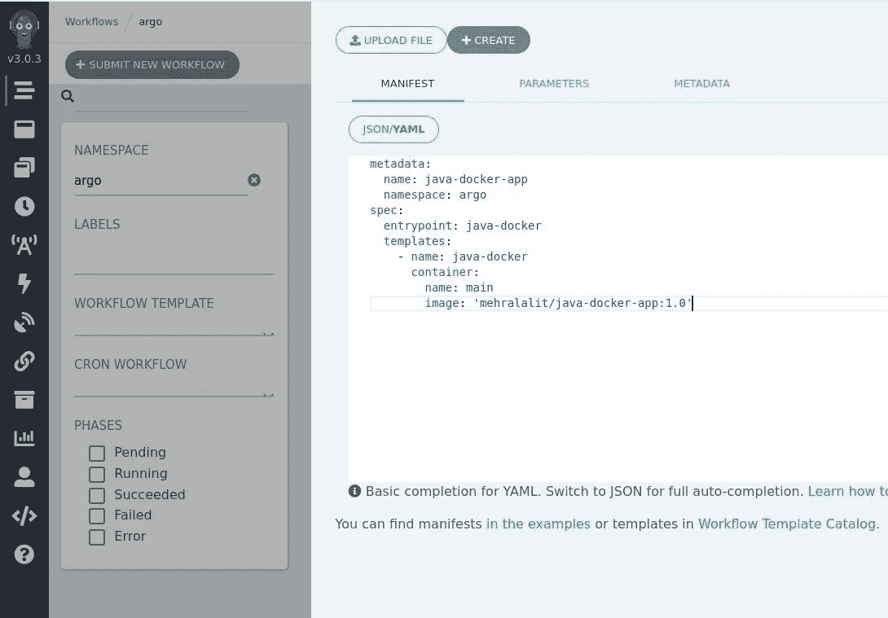
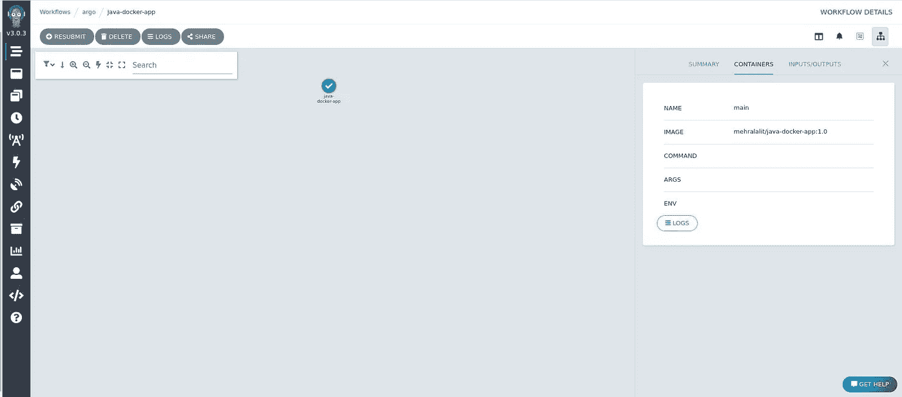
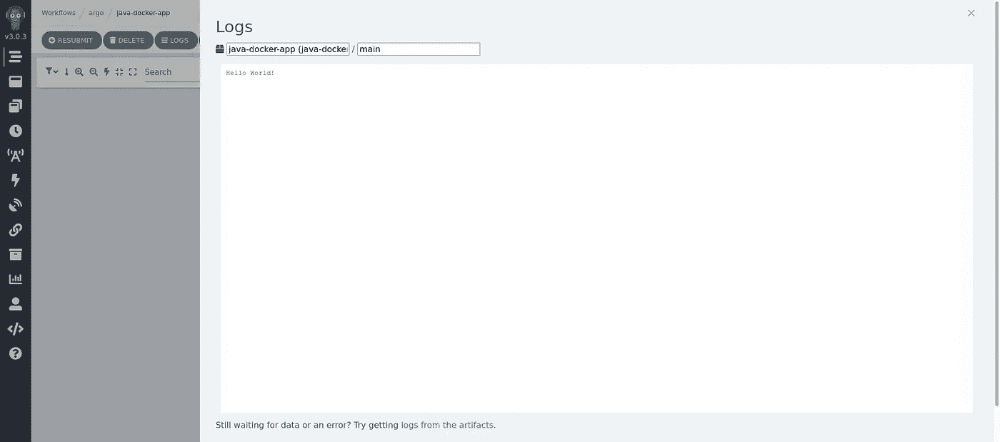

# 使用 Argo 工作流部署 Java 应用程序

> 原文：<https://medium.com/codex/deploy-a-java-application-using-argo-workflows-92d4699877c6?source=collection_archive---------4----------------------->


本文演示了如何通过 argo 工作流部署一个简单的 java 应用程序。在本文中，我们将创建一个简单的 java 应用程序，使用 maven 打包它，创建打包的 jar 的 docker 映像，并使用 argo 工作流部署它。

# 先决条件

1.  Kubernetes、Docker 和 Argo 的工作设置
2.  安装在开发机器上的 Java JDK 和 Maven

# 1.创建一个简单的 java 应用程序

我们将从创建一个打印“Hello World！”的简单 java 应用程序开始。



java 应用程序的结构

## App.java

```
package edu.java;public class App {
 public static void main(String[] args) {
  System.out.println("Hello World!");
 }
}
```

## pom.xml

```
<project ae mm" href="http://maven.apache.org/POM/4.0.0" rel="noopener ugc nofollow" target="_blank">http://maven.apache.org/POM/4.0.0" 
  xmlns:xsi="[http://www.w3.org/2001/XMLSchema-instance](http://www.w3.org/2001/XMLSchema-instance)" 
  xsi:schemaLocation="[http://maven.apache.org/POM/4.0.0](http://maven.apache.org/POM/4.0.0) 
                      [https://maven.apache.org/xsd/maven-4.0.0.xsd](https://maven.apache.org/xsd/maven-4.0.0.xsd)">

  <modelVersion>4.0.0</modelVersion>
  <groupId>edu.lalit</groupId>
  <artifactId>java-docker-example</artifactId>
  <version>0.0.1-SNAPSHOT</version>
  <name>JavaDockerExample</name>
  <description>Sample Java Docker Application</description>
  <properties>
      <project.build.sourceEncoding>UTF-8</project.build.sourceEncoding>
      <maven.compiler.source>1.8</maven.compiler.source>
      <maven.compiler.target>1.8</maven.compiler.target>
      <java.version>1.8</java.version>
  </properties><build>
      <finalName>java-docker-app</finalName>
      <plugins>

          <plugin>
              <groupId>org.apache.maven.plugins</groupId>
              <artifactId>maven-compiler-plugin</artifactId>
              <version>3.8.0</version>
              <configuration>
                  <source>${java.version}</source>
                  <target>${java.version}</target>
              </configuration>
          </plugin>

          <plugin>
              <groupId>org.apache.maven.plugins</groupId>
              <artifactId>maven-jar-plugin</artifactId>
              <version>3.2.0</version>
              <configuration>
                  <archive>
                      <manifest>
                          <addClasspath>true</addClasspath>
                          <mainClass>edu.java.App</mainClass>
                          <classpathPrefix>lib/</classpathPrefix>
                      </manifest>
                  </archive>
              </configuration>
          </plugin>

          <plugin>
              <groupId>org.apache.maven.plugins</groupId>
              <artifactId>maven-dependency-plugin</artifactId>
              <version>3.1.1</version>
              <executions>
                  <execution>
                      <id>copy-dependencies</id>
                      <phase>package</phase>
                      <goals>
                          <goal>copy-dependencies</goal>
                      </goals>
                      <configuration>
                          <outputDirectory>
                              ${project.build.directory}/lib/
                          </outputDirectory>
                      </configuration>
                  </execution>
              </executions>
          </plugin>

      </plugins>
  </build>
</project>
```

# 2.使用 Maven 打包应用程序

## 包装应用

```
# cd <path to application directory> 
$ mvn clean compile package
```

## 通过命令行运行来测试应用程序

```
# change location to application directory
$ cd /home/mehral/eclipse-workspace/java-docker-example# run java application
$ java -jar target/java-docker-app.jar
Hello World!
```

# 3.创建 Docker 图像

既然我们已经成功地测试了我们的应用程序，我们将继续创建 Dockerfile，如下所述。创建 docker 映像只需要这个文件。它描述了创建 docker 映像应该遵循的所有步骤和命令。

## Dockerfile 文件

```
FROM openjdk:8-jdk-alpine# properties
ARG JAR_FILE=target/java-docker-app.jar
ARG JAR_LIB_FILE=target/lib/# change working directory # cd path-to-your-working-directory
WORKDIR /home/mehral/docker-builds# copy target/java-docker-app.jar path-to-your-working-directory/app.jar
COPY ${JAR_FILE} app.jar# java -jar path-to-your-working-directory/app.jar
ENTRYPOINT ["java","-jar","app.jar"]
```

## 建立 docker 形象

```
# change location to application directory that contains Dockerfile
$ cd /home/mehral/eclipse-workspace/java-docker-example# build docker image
$ docker build -t java-docker-app:1.0 .
Sending build context to Docker daemon  33.79kB
Step 1/6 : FROM openjdk:8-jdk-alpine
 ---> a3562aa0b991
Step 2/6 : ARG JAR_FILE=target/java-docker-app.jar
 ---> Running in 0f3533fe1cb9
Removing intermediate container 0f3533fe1cb9
 ---> 548b36cde2ea
Step 3/6 : ARG JAR_LIB_FILE=target/lib/
 ---> Running in a0a8248b4883
Removing intermediate container a0a8248b4883
 ---> f80663dd30d6
Step 4/6 : WORKDIR /home/mehral/docker-builds
 ---> Running in adc408bb847f
Removing intermediate container adc408bb847f
 ---> fcb51ac88cb6
Step 5/6 : COPY ${JAR_FILE} app.jar
 ---> 9b7772d1adb4
Step 6/6 : ENTRYPOINT ["java","-jar","app.jar"]
 ---> Running in 4d9a98033eab
Removing intermediate container 4d9a98033eab
 ---> 7b2bdcd00941
Successfully built 7b2bdcd00941
Successfully tagged java-docker-app:1.0# verify that the docker image is created
$ docker images
REPOSITORY        TAG   IMAGE ID      CREATED              SIZE
java-docker-app   1.0   574745237661  About a minute ago   105MB
```

## 验证映像是否按预期工作

```
# run docker image in a container
$ docker run --name java-docker java-docker-app:1.0
Hello World!
```

## 将图像推送到 docker hub

```
# login to your docker account
$ docker login# tag the docker image with your username
# docker image tag <image:version> <username>/<image:version>
$ docker image tag java-docker-app:1.0 mehralalit/java-docker-app:1.0# push image to docker hub
$ docker image push mehralalit/java-docker-app:1.0# delete image from local machine
$ docker rmi mehralalit/java-docker-app:1.0# pull image from docker hub to verify that the image is accessible
$ docker pull mehralalit/java-docker-app:1.0# alternatively you can search the image on docker hub
$ docker search mehralalit/java-docker-app
```

# 4.使用 argo 工作流进行部署

## Argo 清单文件

```
metadata:
  name: java-docker-app
  namespace: argo
spec:
  entrypoint: java-docker
  templates:
    - name: java-docker
      container:
        name: main
        image: 'mehralalit/java-docker-app:1.0'
```

## 创建新的工作流



**点击提交新的工作流**



**点击编辑使用完整工作流程选项**



**点击前一个屏幕中的“创建”并使其运行**



**点击上一屏幕的日志按钮查看日志**

我们在第一步中创建的简单 java 应用程序通过四个简单的步骤使用 Argo 工作流成功部署到一个容器中。:)

> 这是我最近写的关于设计模式的书的链接。希望你会觉得有用。

[](https://www.amazon.in/Software-Design-Patterns-Java-Developers/dp/9391392474) [## 面向 Java 开发人员的软件设计模式:专家主导的构建可重用软件的方法和…

### 面向 Java 开发人员的软件设计模式讨论了软件设计的基础，以及公认的…

www .亚马逊. in](https://www.amazon.in/Software-Design-Patterns-Java-Developers/dp/9391392474)