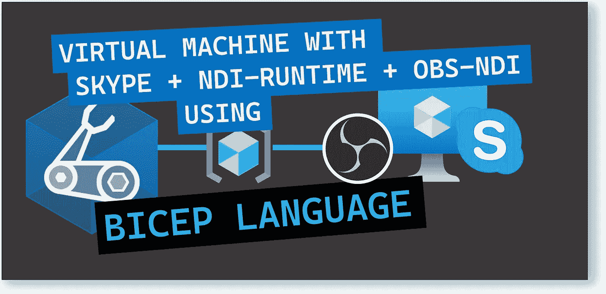
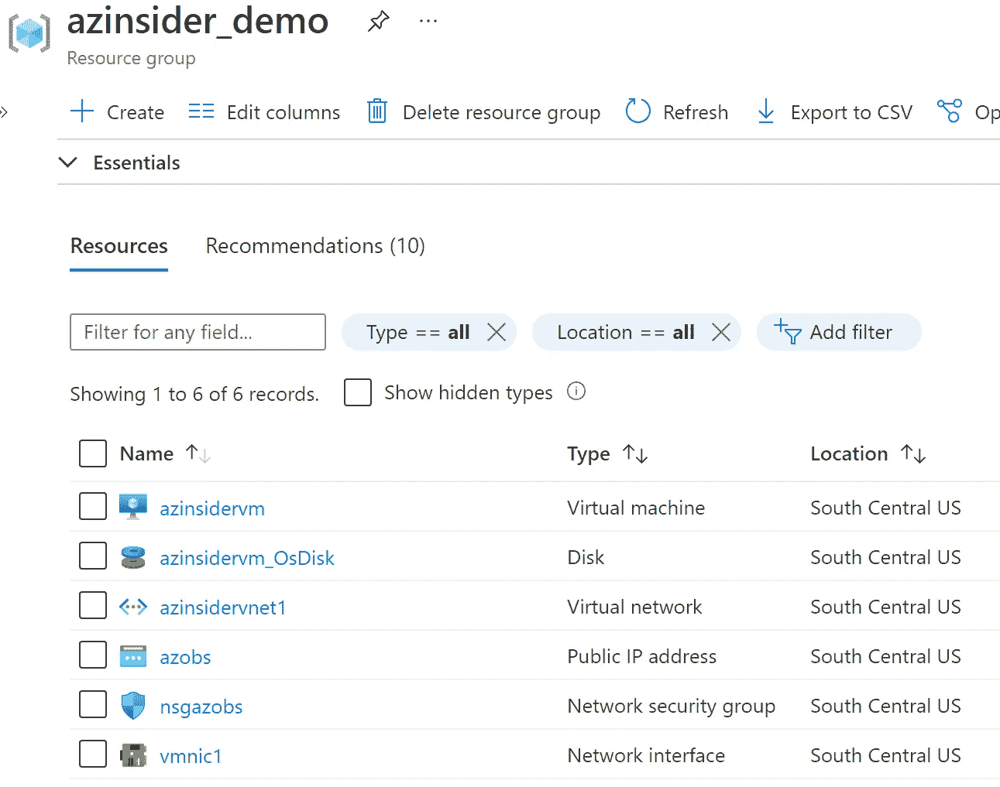
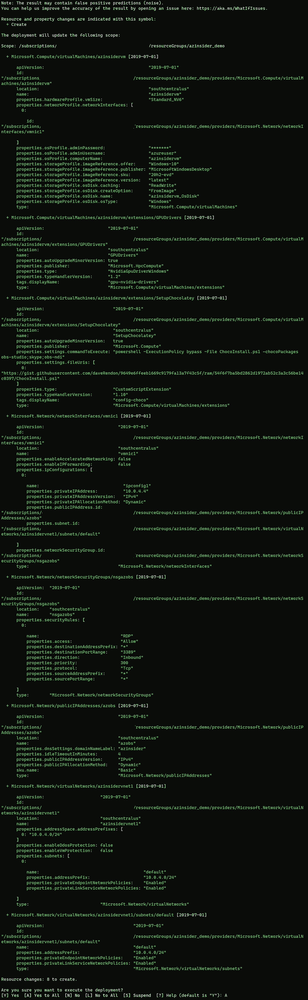
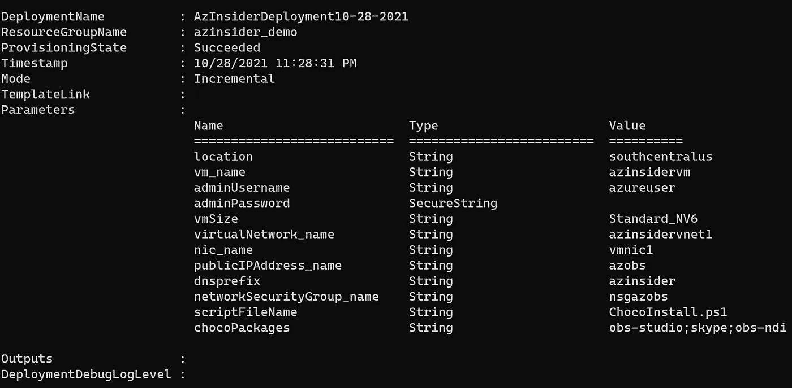
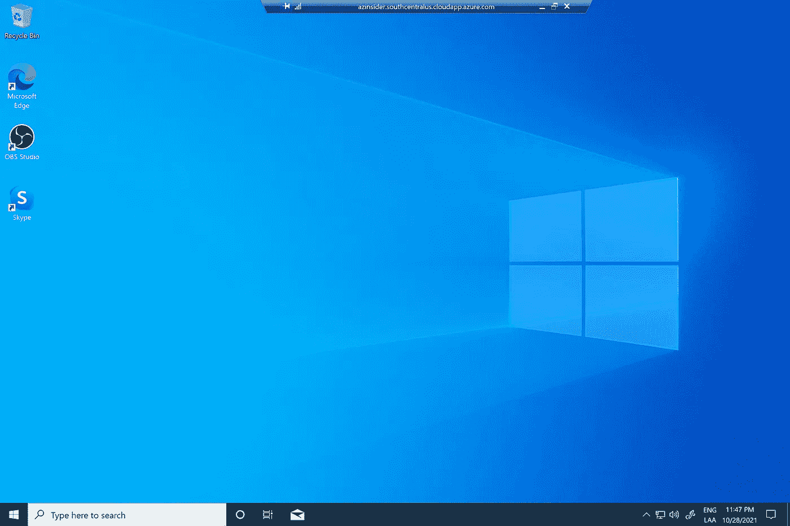
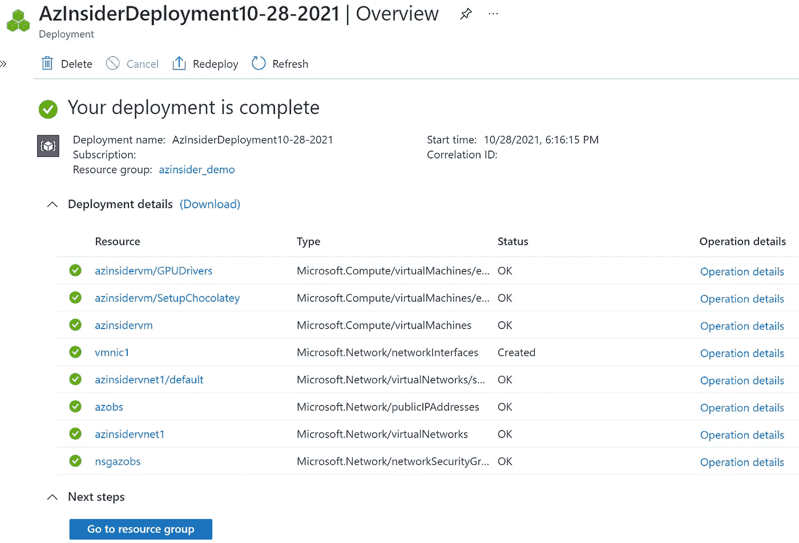
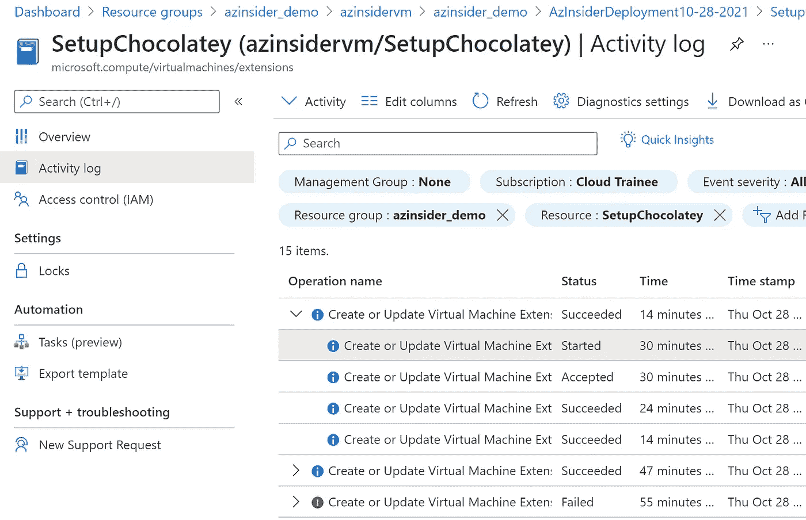

# 💪使用 Bicep 部署安装了 Skype、NDI 运行时和 OBS-NDI 的虚拟机

> 原文：<https://medium.com/codex/deploy-a-virtual-machine-with-skype-ndi-runtime-and-obs-ndi-installed-using-bicep-c216437f88f2?source=collection_archive---------6----------------------->

使用预装了 OBS Studio 和 Skype 的 Windows GPU VM (Windows 10)准备您的流媒体环境。



使用 Bicep 部署安装了 Skype、NDI 运行时和 OBS-NDI 的虚拟机

本文旨在展示如何使用 Bicep(一种用于声明式部署 Azure 资源的领域特定语言(DSL ))的基础设施即代码，通过一些预配置的工具(如 Skype、NDI 运行时和 OBS-NDI)部署虚拟机。

# 先决条件

*   一个活跃的 Azure 账户:你可以[免费](https://azure.microsoft.com/free/)创建一个账户。
*   [Azure 二头肌](https://github.com/azure/bicep)安装在你的本地机器上。
*   Azure PowerShell。参见:[安装 Azure PowerShell](https://docs.microsoft.com/en-us/powershell/azure/install-az-ps) 。
*   Azure 订阅中的资源组

我们开始吧！

# 解决方案概述

我们将创作一个 Bicep 模板，在 Azure 中创建一个基于 Windows 的虚拟机，安装 Skype、NDI 运行时和 OBS-NDI。

该解决方案将包括以下文件:

*   *main.bicep* :这是二头肌模板
*   *azure deploy . parameters . JSON*:这个参数文件包含用于部署 Bicep 模板的值
*   ChocoInstall.ps1:这是一个将作为“自定义扩展”执行的 PowerShell 脚本。

# 部署的资源

*   Windows 10 虚拟机
*   IP 地址(公有和私有)
*   虚拟网络和子网
*   唱片
*   网络安全配置



安装了 Skype、NDI 运行时和 OBS-NDI 的虚拟机

现在让我们使用 Bicep 模板在 Azure 上部署 Moodle。

# 1.Azure 二头肌模板-参数

在您的工作目录中创建一个新文件，并将其命名为' *main.bicep* '。我们将定义以下参数:

```
@description('Location of resources')
param location string = resourceGroup().location@description('Local name for the VM can be whatever you want')
param vm_name string@description('User name for the Virtual Machine.')
param adminUsername string@description('Password for the Virtual Machine.')
@secure()
param adminPassword string@description('Desired Size of the VM. Any valid option accepted but if you choose premium storage type you must choose a DS class VM size.')
param vmSize string = 'Standard_NV6'
param virtualNetwork_name string = 'stream-vnet'
param nic_name string = 'stream-nic'
param publicIPAddress_name string = 'stream-ip'
param dnsprefix string = 'streamvm'
param networkSecurityGroup_name string = 'stream-nsg'@description('PowerShell script name to execute')
param scriptFileName string = 'ChocoInstall.ps1'@description('List of Chocolatey packages to install separated by a semi-colon eg. linqpad;sysinternals')
param chocoPackages string = 'obs-studio;skype'
```

# 2.Azure 二头肌模板-变量

我们将定义以下变量:

```
var vmImagePublisher = 'MicrosoftWindowsDesktop'
var vmImageOffer = 'Windows-10'
var sku = '20h2-evd'@description('Public uri location of PowerShell Chocolately setup script')
var scriptLocation = 'https://gist.githubusercontent.com/daveRendon/9649e6ffeeb1669c9179fa13a7f43c5f/raw/54f6f7ba5bd2862d1972ab52c3a3c56be14c0397/ChocoInstall.ps1'
```

注意我们使用一个变量来指定脚本的位置。此位置应该可以公开访问，或者您可以使用存储帐户。

您有两个选择:使用 gist，然后引用完整的' **raw** ' URL，或者创建一个存储帐户，然后上传您的脚本，然后生成 SAS 令牌来访问脚本。

# 3.Azure 二头肌模板—资源

我们将定义以下资源:

```
resource networkSecurityGroup_name_resource 'Microsoft.Network/networkSecurityGroups@2019-07-01' = {
  name: networkSecurityGroup_name
  location: location
  properties: {
    securityRules: [
      {
        name: 'RDP'
        properties: {
          protocol: 'Tcp'
          sourcePortRange: '*'
          destinationPortRange: '3389'
          sourceAddressPrefix: '*'
          destinationAddressPrefix: '*'
          access: 'Allow'
          priority: 300
          direction: 'Inbound'
        }
      }
    ]
  }
}resource virtualNetwork_name_default 'Microsoft.Network/virtualNetworks/subnets@2019-07-01' = {
  parent: virtualNetwork_name_resource
  name: 'default'
  properties: {
    addressPrefix: '10.0.4.0/24'
    privateEndpointNetworkPolicies: 'Enabled'
    privateLinkServiceNetworkPolicies: 'Enabled'
  }
}resource virtualNetwork_name_resource 'Microsoft.Network/virtualNetworks@2019-07-01' = {
  name: virtualNetwork_name
  location: location
  properties: {
    addressSpace: {
      addressPrefixes: [
        '10.0.4.0/24'
      ]
    }
    subnets: [
      {
        name: 'default'
        properties: {
          addressPrefix: '10.0.4.0/24'
          privateEndpointNetworkPolicies: 'Enabled'
          privateLinkServiceNetworkPolicies: 'Enabled'
        }
      }
    ]
    enableDdosProtection: false
    enableVmProtection: false
  }
}resource pip 'Microsoft.Network/publicIPAddresses@2019-07-01' = {
  name: publicIPAddress_name
  location: location
  sku: {
    name: 'Basic'
  }
  properties: {
    publicIPAddressVersion: 'IPv4'
    publicIPAllocationMethod: 'Dynamic'
    idleTimeoutInMinutes: 4
    dnsSettings: {
      domainNameLabel: dnsprefix
    }
  }
}resource nic_name_resource 'Microsoft.Network/networkInterfaces@2019-07-01' = {
  name: nic_name
  location: location
  properties: {
    ipConfigurations: [
      {
        name: 'ipconfig1'
        properties: {
          privateIPAddress: '10.0.4.4'
          privateIPAllocationMethod: 'Dynamic'
          publicIPAddress: {
            id: pip.id
          }
          subnet: {
            id: virtualNetwork_name_default.id
          }
          primary: true
          privateIPAddressVersion: 'IPv4'
        }
      }
    ]
    enableAcceleratedNetworking: false
    enableIPForwarding: false
    networkSecurityGroup: {
      id: networkSecurityGroup_name_resource.id
    }
  }
}resource vm_name_resource 'Microsoft.Compute/virtualMachines@2019-07-01' = {
  name: vm_name
  location: location
  properties: {
    hardwareProfile: {
      vmSize: vmSize
    }
    storageProfile: {
      imageReference: {
        publisher: vmImagePublisher
        offer: vmImageOffer
        sku: sku
        version: 'latest'
      }
      osDisk: {
        osType: 'Windows'
        name: '${vm_name}_OsDisk'
        createOption: 'FromImage'
        caching: 'ReadWrite'
      }
    }
    osProfile: {
      computerName: vm_name
      adminUsername: adminUsername
      adminPassword: adminPassword
    }
    networkProfile: {
      networkInterfaces: [
        {
          id: nic_name_resource.id
        }
      ]
    }
  }
}resource vm_name_GPUDrivers 'Microsoft.Compute/virtualMachines/extensions@2019-07-01' = {
  parent: vm_name_resource
  name: 'GPUDrivers'
  location: location
  tags: {
    displayName: 'gpu-nvidia-drivers'
  }
  properties: {
    publisher: 'Microsoft.HpcCompute'
    type: 'NvidiaGpuDriverWindows'
    typeHandlerVersion: '1.2'
    autoUpgradeMinorVersion: true
  }
  dependsOn: [
    vm_name_SetupChocolatey
  ]
}resource vm_name_SetupChocolatey 'Microsoft.Compute/virtualMachines/extensions@2019-07-01' = {
  parent: vm_name_resource
  name: 'SetupChocolatey'
  location: location
  tags: {
    displayName: 'config-choco'
  }
  properties: {
    publisher: 'Microsoft.Compute'
    type: 'CustomScriptExtension'
    typeHandlerVersion: '1.10'
    autoUpgradeMinorVersion: true
    settings: {
      fileUris: [
        scriptLocation
      ]
      commandToExecute: 'powershell -ExecutionPolicy bypass -File ${scriptFileName} -chocoPackages ${chocoPackages}'
    }
  }
}
```

这就完成了二头肌模板。现在让我们处理参数文件。

# 4.参数文件

创建一个名为“*azure deploy . parameters . JSON*”的新文件。下面的代码显示了参数文件的定义:

```
{
    "$schema": "[https://schema.management.azure.com/schemas/2019-04-01/deploymentParameters.json#](https://schema.management.azure.com/schemas/2019-04-01/deploymentParameters.json#)",
    "contentVersion": "1.0.0.0",
    "parameters": {
        "location": {
            "value": "southcentralus"
        },
        "vm_name": {
            "value": "GEN-UNIQUE-8"
        },
        "adminUsername": {
            "value": "GEN-UNIQUE"
        },
        "adminPassword": {
            "value": "GEN-PASSWORD"
        },
        "virtualNetwork_name": {
            "value": "GEN-VNET-NAME"
        },
        "nic_name": {
            "value": "GEN-UNIQUE-8"
        },
        "publicIPAddress_name": {
            "value": "GEN-UNIQUE-8"
        },
        "dnsprefix": {
            "value": "GEN-UNIQUE-13"
        },
        "networkSecurityGroup_name": {
            "value": "GEN-UNIQUE-8"
        },
        "scriptFileName": {
            "value": "ChocoInstall.ps1"
        },
        "chocoPackages": {
            "value": "obs-studio;skype;obs-ndi"
        }
    }
}
```

# 5.PowerShell 脚本—“chocoinstall . PS1”

下面的代码显示了 ChocoInstall.ps1 —该脚本必须可以公开访问，或者您可以使用存储帐户。

# 6.Azure Bicep 模板-部署

我们将使用下面的命令来部署我们的二头肌模板:

```
$date = Get-Date -Format "MM-dd-yyyy"
$deploymentName = "AzInsiderDeployment"+"$date"New-AzResourceGroupDeployment -Name $deploymentName -ResourceGroupName azinsider_demo -TemplateFile .\main.bicep -TemplateParameterFile .\azuredeploy.parameters.json -c
```

下图显示了部署的预览:



部署预览

然后我们将执行部署。下图显示了部署输出:



部署输出

现在，您可以 RDP 到虚拟机。您应该能够看到已经安装的工具。



使用 Bicep 安装了 Skype、NDI 运行时和 OBS-NDI 的虚拟机

# 故障排除。

除了部署的预览和执行部署的实际输出之外，您还可以访问 Azure 门户，查看部署操作是否有问题，如下所示:



Azure 门户—部署

您还可以深入每个操作，并查看“活动日志”中的详细信息，如下图所示:



活动日志

该解决方案的完整代码可以在以下 URL 中找到。请随意投稿！

[](https://github.com/daveRendon/azinsider/tree/main/application-workloads/create-win-vm-with-obs-ndi-skype) [## azin sider/应用程序工作负载/create-win-VM-with-OBS-ndi-Skype at main Dave rendon/azin sider

### 在 GitHub 上创建一个帐户，为 daveRendon/azinsider 开发做出贡献。

github.com](https://github.com/daveRendon/azinsider/tree/main/application-workloads/create-win-vm-with-obs-ndi-skype) 

👉 [*在此加入****azin sider****邮箱列表。*](http://eepurl.com/gKmLdf)

*-戴夫·r·*