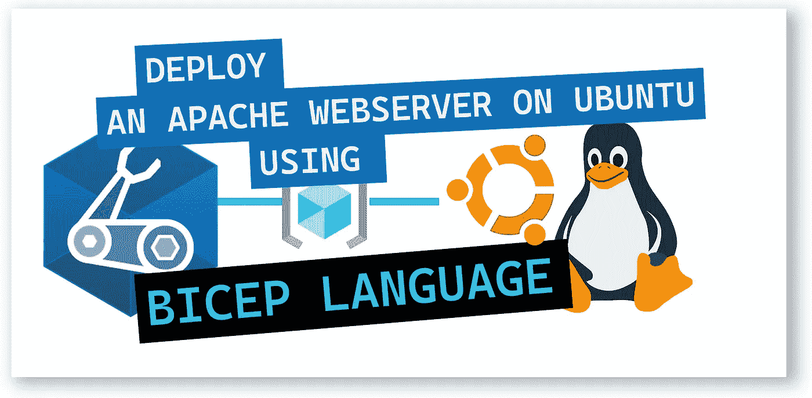
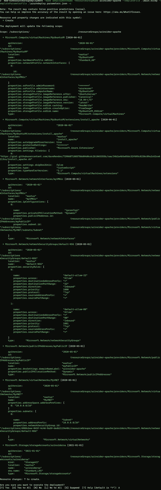
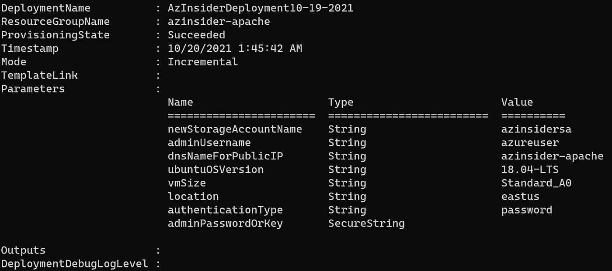
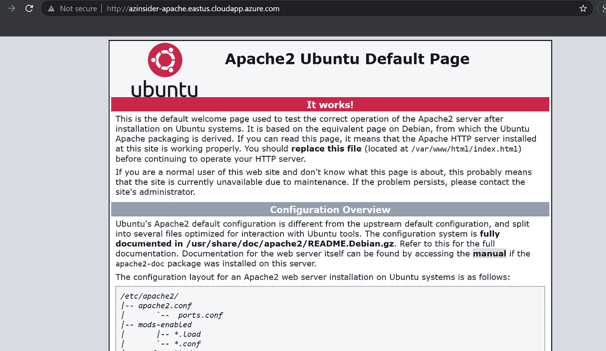

# 💪使用 Bicep 在 Ubuntu VM 上部署 Apache 服务器

> 原文：<https://medium.com/codex/deploy-an-apache-webserver-on-ubuntu-vm-using-bicep-2a47bdfbe9be?source=collection_archive---------2----------------------->

使用 Bicep 在 Azure 中快速部署 Apache 服务器



💪使用 Bicep 在 Ubuntu VM 上部署 Apache 服务器

本文将展示如何使用 Bicep 在 Azure 上的 Ubuntu VM 上快速部署 Apache Webserver，Bicep 是一种新的领域特定语言(DSL ),用于以声明方式部署 Azure 资源。

## 先决条件:

*   Azure 二头肌已安装
*   有效的 Azure 订阅
*   在您的订阅中创建的资源组

我们将使用 Azure Linux CustomScript 扩展来部署 Apache webserver。

## 该解决方案由以下文件组成:

*   这是我们主要的二头肌模板
*   *azure deploy . parameters . JSON*:这是将在部署时传递的参数文件
*   *install_script.sh* :这是一个脚本，一旦虚拟机被部署，它将作为“自定义脚本”被执行。

现在让我们开始制作二头肌模板。

我们将定义以下参数:

```
@description('Unique DNS Name for the Storage Account where the Virtual Machine\'s disks will be placed.')
param newStorageAccountName string@description('User name for the Virtual Machine.')
param adminUsername string@description('Unique DNS Name for the Public IP used to access the Virtual Machine.')
param dnsNameForPublicIP string@allowed([
  '18.04-LTS'
  '16.04.0-LTS'
  '14.04.5-LTS'
])
@description('The Ubuntu version for the VM. This will pick a fully patched image of this given Ubuntu version. Allowed values: 18.04-LTS, 16.04.0-LTS, 14.04.5-LTS.')
param ubuntuOSVersion string = '18.04-LTS'@description('Size of the virtual machine')
param vmSize string = 'Standard_A0'@description('Location for all resources.')
param location string = resourceGroup().location@allowed([
  'sshPublicKey'
  'password'
])
@description('Type of authentication to use on the Virtual Machine. SSH key is recommended.')
param authenticationType string = 'password'@description('SSH Key or password for the Virtual Machine. SSH key is recommended.')
@secure()
param adminPasswordOrKey string
```

注意，我们允许使用密码或 SSH 密钥来部署 Ubuntu VM，在本例中，我们将传递一个密码值。您可以选择使用 SSH 密钥。

现在我们将定义如下所示的变量:

```
var imagePublisher = 'Canonical'
var imageOffer = 'UbuntuServer'
var nicName_var = 'myVMNic'
var addressPrefix = '10.0.0.0/16'
var subnetName = 'Subnet'
var subnetPrefix = '10.0.0.0/24'
var publicIPAddressName_var = 'myPublicIP'
var publicIPAddressType = 'Dynamic'
var vmName_var = 'MyUbuntuVM'
var virtualNetworkName_var = 'MyVNET'
var subnetRef = resourceId('Microsoft.Network/virtualNetworks/subnets', virtualNetworkName_var, subnetName)
var linuxConfiguration = {
  disablePasswordAuthentication: true
  ssh: {
    publicKeys: [
      {
        path: '/home/${adminUsername}/.ssh/authorized_keys'
        keyData: adminPasswordOrKey
      }
    ]
  }
}
var networkSecurityGroupName_var = 'default-NSG'
```

您可以根据需要修改虚拟网络和子网定义的值。

接下来，我们将定义资源:

```
resource newStorageAccountName_resource 'Microsoft.Storage/storageAccounts@2021-01-01' = {
  name: newStorageAccountName
  location: location
  sku: {
    name: 'Standard_LRS'
  }
  kind: 'StorageV2'
}resource publicIPAddressName 'Microsoft.Network/publicIPAddresses@2020-05-01' = {
  name: publicIPAddressName_var
  location: location
  properties: {
    publicIPAllocationMethod: publicIPAddressType
    dnsSettings: {
      domainNameLabel: dnsNameForPublicIP
    }
  }
}resource networkSecurityGroupName 'Microsoft.Network/networkSecurityGroups@2020-05-01' = {
  name: networkSecurityGroupName_var
  location: location
  properties: {
    securityRules: [
      {
        name: 'default-allow-22'
        properties: {
          priority: 1000
          access: 'Allow'
          direction: 'Inbound'
          destinationPortRange: '22'
          protocol: 'Tcp'
          sourceAddressPrefix: '*'
          sourcePortRange: '*'
          destinationAddressPrefix: '*'
        }
      }
      {
        name: 'default-allow-80'
        properties: {
          priority: 1001
          access: 'Allow'
          direction: 'Inbound'
          destinationPortRange: '80'
          protocol: 'Tcp'
          sourceAddressPrefix: '*'
          sourcePortRange: '*'
          destinationAddressPrefix: '*'
        }
      }
    ]
  }
}resource virtualNetworkName 'Microsoft.Network/virtualNetworks@2020-05-01' = {
  name: virtualNetworkName_var
  location: location
  properties: {
    addressSpace: {
      addressPrefixes: [
        addressPrefix
      ]
    }
    subnets: [
      {
        name: subnetName
        properties: {
          addressPrefix: subnetPrefix
          networkSecurityGroup: {
            id: networkSecurityGroupName.id
          }
        }
      }
    ]
  }
}resource nicName 'Microsoft.Network/networkInterfaces@2020-05-01' = {
  name: nicName_var
  location: location
  properties: {
    ipConfigurations: [
      {
        name: 'ipconfig1'
        properties: {
          privateIPAllocationMethod: 'Dynamic'
          publicIPAddress: {
            id: publicIPAddressName.id
          }
          subnet: {
            id: subnetRef
          }
        }
      }
    ]
  }
  dependsOn: [
    virtualNetworkName
  ]
}resource vmName 'Microsoft.Compute/virtualMachines@2020-06-01' = {
  name: vmName_var
  location: location
  properties: {
    hardwareProfile: {
      vmSize: vmSize
    }
    osProfile: {
      computerName: vmName_var
      adminUsername: adminUsername
      adminPassword: adminPasswordOrKey
      linuxConfiguration: ((authenticationType == 'password') ? json('null') : linuxConfiguration)
    }
    storageProfile: {
      imageReference: {
        publisher: imagePublisher
        offer: imageOffer
        sku: ubuntuOSVersion
        version: 'latest'
      }
      osDisk: {
        name: '${vmName_var}_OSDisk'
        caching: 'ReadWrite'
        createOption: 'FromImage'
      }
    }
    networkProfile: {
      networkInterfaces: [
        {
          id: nicName.id
        }
      ]
    }
  }
  dependsOn: [
    newStorageAccountName_resource
  ]
}resource vmName_install_apache 'Microsoft.Compute/virtualMachines/extensions@2020-06-01' = {
  parent: vmName
  name: 'install_apache'
  location: location
  properties: {
    publisher: 'Microsoft.Azure.Extensions'
    type: 'CustomScript'
    typeHandlerVersion: '2.1'
    autoUpgradeMinorVersion: true
    settings: {
      skipDos2Unix: false
      fileUris: [
        '[https://gist.githubusercontent.com/daveRendon/72986871085786d04d0cdc2b1065355b/raw/34b2a4b5e05dc32f695c8236c89a2c62ce6213ca/install_apache.sh'](https://gist.githubusercontent.com/daveRendon/72986871085786d04d0cdc2b1065355b/raw/34b2a4b5e05dc32f695c8236c89a2c62ce6213ca/install_apache.sh')
      ]
    }
    protectedSettings: {
      commandToExecute: 'sh install_apache.sh'
    }
  }
}
```

请注意，我们正在利用自定义脚本功能。这些脚本可以嵌入模板或外部脚本文件中。

一旦部署了虚拟机，您将能够引用想要作为“扩展”执行的脚本。

您可以指定脚本语言和平台。目前支持 Linux 环境下的 Azure PowerShell 和 Azure CLI 部署脚本。

在本例中，我们将使用一个名为“install_apache.sh”的脚本。

定制脚本可以从诸如 Gist 的外部资源消费，并且优选地通过将它们存储在存储账户中，然后引用 URL 和 SAS 令牌来访问脚本。

您可以从这里获得“install_apache.sh”的代码:

下一步是定义参数文件。虽然您可以在部署期间手动传递它们，但是我们将使用一个单独的文件来代替。

下面的代码显示了参数文件的定义:

```
{
    "$schema": "https://schema.management.azure.com/schemas/2019-04-01/deploymentParameters.json#",
    "contentVersion": "1.0.0.0",
    "parameters": {
      "newStorageAccountName": {
        "value": "Your-Storage-Accoung"
      },
      "adminUsername": {
        "value": "Your-Admin-username"
      },
      "dnsNameForPublicIP": {
        "value": "Your-DNS-Name"
      },
      "adminPasswordOrKey": {
        "value": "Your-Password-or-Key"
      }
    }
  }
```

你可以在这里找到二头肌模板的完整代码:

现在我们将使用下面的命令部署 Bicep 模板:

```
$date = Get-Date -Format "MM-dd-yyyy"
$deploymentName = "AzInsiderDeployment"+"$date"New-AzResourceGroupDeployment -Name $deploymentName -ResourceGroupName azinsider-apache -TemplateFile .\main.bicep -TemplateParameterFile .\azuredeploy.parameters.json -c
```

下图显示了部署的预览。



部署预览

几分钟后，您应该能够看到部署已成功完成:



Azure Bicep 在 ubuntu 上部署 apache webserver

现在，您可以进入浏览器，使用分配给资源的 DNS 名称进行测试:



Apache 2 Ubuntu 默认页面

希望您发现这很容易部署！

👉 [*在此加入****azin sider****邮箱列表。*](http://eepurl.com/gKmLdf)

*-戴夫·r*