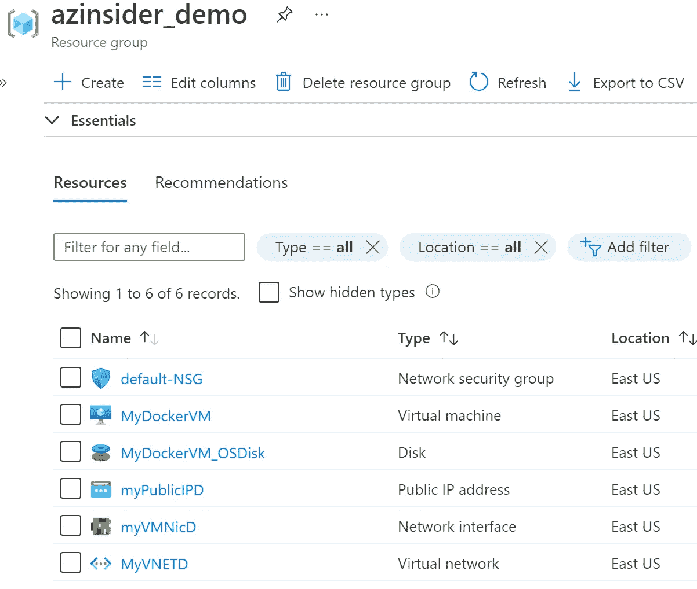
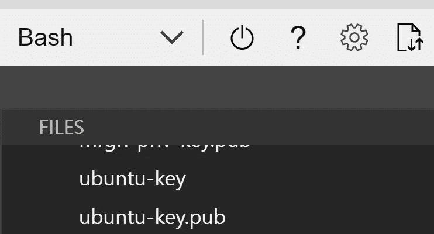
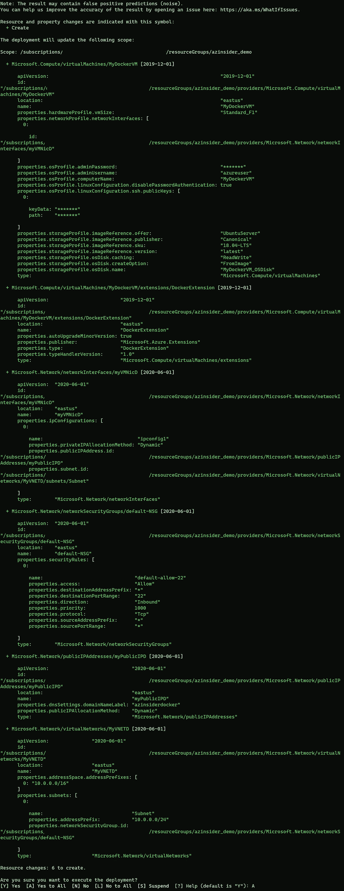
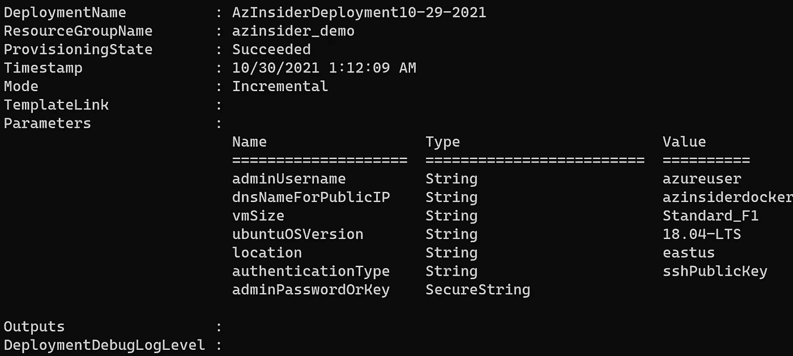
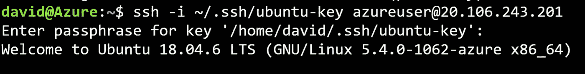
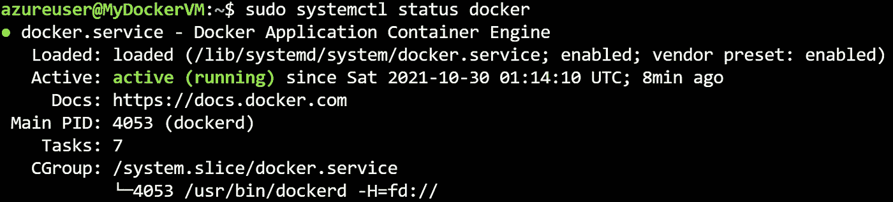

# 💪使用 Azure Bicep 通过 Docker 部署 Ubuntu 虚拟机

> 原文：<https://medium.com/codex/deploy-an-ubuntu-virtual-machine-with-docker-using-azure-bicep-c0c16925106a?source=collection_archive---------2----------------------->

使用 Azure Bicep 在 Ubuntu 上运行 Docker


💪使用 Azure Bicep 通过 Docker 部署 Ubuntu 虚拟机

本文将展示如何使用 Azure Bicep 和 Docker 部署 Ubuntu 虚拟机，这是一种用于声明式部署 Azure 资源的领域特定语言(DSL)。

# 先决条件

*   一个活跃的 Azure 账户:你可以[免费](https://azure.microsoft.com/free/)创建一个账户。
*   [Azure 二头肌](https://github.com/azure/bicep)安装在你的本地机器上。
*   Azure PowerShell。参见:[安装 Azure PowerShell](https://docs.microsoft.com/en-us/powershell/azure/install-az-ps) 。
*   Azure 订阅中的资源组

我们开始吧！

# 解决方案概述

我们将创作一个 Bicep 模板，在安装了 Docker 的 Azure 中创建一个基于 Linux 的虚拟机。

该解决方案将包括以下文件:

*   ***main.bicep*** :这是二头肌模板
*   ***azure deploy . parameters . JSON***:该参数文件包含用于部署 Bicep 模板的值

# 部署的资源

*   Ubuntu 虚拟机
*   IP 地址(公有和私有)
*   虚拟网络和子网
*   唱片
*   网络安全配置



# 1.创建 SSH 密钥对

第一步是创建一个 SSH 密钥对；您可以查看以下关于如何在 Azure 中为 Linux 虚拟机创建 SSH 密钥对的文章—[https://docs . Microsoft . com/en-us/Azure/virtual-machines/Linux/MAC-create-SSH-keys](https://docs.microsoft.com/en-us/azure/virtual-machines/linux/mac-create-ssh-keys)

在本例中，我们将使用 Azure Bash 控制台创建一个 SSH 密钥对。在 Azure 门户中，请求一个新的控制台，如下图所示:


云壳— Azure 门户

然后，我们将使用下面的命令生成一个 SSH 密钥:

```
ssh-keygen \
    -m PEM \
    -t rsa \
    -b 4096 \
    -C "ubuntu-vm" \
    -f ~/.ssh/ubuntu-key \
    -N yourpasshphrase
```

这将在文件共享中的 SSH 目录下生成密钥:



SSH 密钥

如果您不熟悉 SSH 公钥的格式，可以使用下面的 cat 命令显示您的公钥，替换' *~/。如果需要，ssh/id_rsa.pub* '带有您自己的公钥文件的路径和文件名:

```
cat ~/.ssh/ubuntu-key.pub
```

上面的命令将在控制台中显示 SSH 公钥。我们将在部署期间需要它，所以请将它放在手边。

酷！现在我们有了 SSH 密钥对。

# 2.Azure 二头肌模板-参数

在您的工作目录中创建一个新文件，并将其命名为' *main.bicep* '。我们将定义以下参数:

```
[@description](http://twitter.com/description)('Username for the Virtual Machine.')
param adminUsername string@description('Unique DNS Name for the Public IP used to access the Virtual Machine.')
param dnsNameForPublicIP string@description('VM size for the Docker host.')
param vmSize string = 'Standard_F1'@allowed([
  '14.04.5-LTS'
  '16.04-LTS'
  '18.04-LTS'
])
@description('The Ubuntu version for deploying the Docker containers. This will pick a fully patched image of this given Ubuntu version. Allowed values: 15.10, 16.04.0-LTS, 18.04-LTS')
param ubuntuOSVersion string = '18.04-LTS'@description('Location for all resources.')
param location string = resourceGroup().location@allowed([
  'sshPublicKey'
  'password'
])
@description('Type of authentication to use on the Virtual Machine. SSH key is recommended.')
param authenticationType string = 'sshPublicKey'@description('SSH Key or password for the Virtual Machine. SSH key is recommended.')
@secure()
param adminPasswordOrKey string
```

# 3.Azure 二头肌模板-变量

我们将定义以下变量:

```
var imagePublisher = 'Canonical'
var imageOffer = 'UbuntuServer'
var nicName_var = 'myVMNicD'
var extensionName = 'DockerExtension'
var addressPrefix = '10.0.0.0/16'
var subnetName = 'Subnet'
var subnetPrefix = '10.0.0.0/24'
var diskStorageType = 'Standard_LRS'
var publicIPAddressName_var = 'myPublicIPD'
var publicIPAddressType = 'Dynamic'
var vmName_var = 'MyDockerVM'
var virtualNetworkName_var = 'MyVNETD'
var subnetRef = resourceId('Microsoft.Network/virtualNetworks/subnets', virtualNetworkName_var, subnetName)
var linuxConfiguration = {
  disablePasswordAuthentication: true
  ssh: {
    publicKeys: [
      {
        path: '/home/${adminUsername}/.ssh/authorized_keys'
        keyData: adminPasswordOrKey
      }
    ]
  }
}
var networkSecurityGroupName_var = 'default-NSG'
```

# 4.Azure 二头肌模板—资源

我们将定义以下资源:

```
resource pip 'Microsoft.Network/publicIPAddresses@2020-06-01' = {
  name: publicIPAddressName_var
  location: location
  properties: {
    publicIPAllocationMethod: publicIPAddressType
    dnsSettings: {
      domainNameLabel: dnsNameForPublicIP
    }
  }
}resource networkSecurityGroupName 'Microsoft.Network/networkSecurityGroups@2020-06-01' = {
  name: networkSecurityGroupName_var
  location: location
  properties: {
    securityRules: [
      {
        name: 'default-allow-22'
        properties: {
          priority: 1000
          access: 'Allow'
          direction: 'Inbound'
          destinationPortRange: '22'
          protocol: 'Tcp'
          sourceAddressPrefix: '*'
          sourcePortRange: '*'
          destinationAddressPrefix: '*'
        }
      }
    ]
  }
}resource virtualNetworkName 'Microsoft.Network/virtualNetworks@2020-06-01' = {
  name: virtualNetworkName_var
  location: location
  properties: {
    addressSpace: {
      addressPrefixes: [
        addressPrefix
      ]
    }
    subnets: [
      {
        name: subnetName
        properties: {
          addressPrefix: subnetPrefix
          networkSecurityGroup: {
            id: networkSecurityGroupName.id
          }
        }
      }
    ]
  }
}resource nicName 'Microsoft.Network/networkInterfaces@2020-06-01' = {
  name: nicName_var
  location: location
  properties: {
    ipConfigurations: [
      {
        name: 'ipconfig1'
        properties: {
          privateIPAllocationMethod: 'Dynamic'
          publicIPAddress: {
            id: pip.id
          }
          subnet: {
            id: subnetRef
          }
        }
      }
    ]
  }
  dependsOn: [
    virtualNetworkName
  ]
}resource vmName 'Microsoft.Compute/virtualMachines@2019-12-01' = {
  name: vmName_var
  location: location
  properties: {
    hardwareProfile: {
      vmSize: vmSize
    }
    osProfile: {
      computerName: vmName_var
      adminUsername: adminUsername
      adminPassword: adminPasswordOrKey
      linuxConfiguration: ((authenticationType == 'password') ? json('null') : linuxConfiguration)
    }
    storageProfile: {
      imageReference: {
        publisher: imagePublisher
        offer: imageOffer
        sku: ubuntuOSVersion
        version: 'latest'
      }
      osDisk: {
        name: '${vmName_var}_OSDisk'
        caching: 'ReadWrite'
        createOption: 'FromImage'
        managedDisk: {
          storageAccountType: diskStorageType
        }
      }
    }
    networkProfile: {
      networkInterfaces: [
        {
          id: nicName.id
        }
      ]
    }
  }
}resource vmName_extensionName 'Microsoft.Compute/virtualMachines/extensions@2019-12-01' = {
  parent: vmName
  name: extensionName
  location: location
  properties: {
    publisher: 'Microsoft.Azure.Extensions'
    type: 'DockerExtension'
    typeHandlerVersion: '1.0'
    autoUpgradeMinorVersion: true
  }
}
```

# 5.参数文件

创建一个名为“*azure deploy . parameters . JSON*”的新文件。下面的代码显示了参数文件的定义:

```
{
    "$schema": "https://schema.management.azure.com/schemas/2019-04-01/deploymentParameters.json#",
    "contentVersion": "1.0.0.0",
    "parameters": {
      "adminUsername": {
        "value": "GEN-UNIQUE"
      },
      "dnsNameForPublicIP": {
        "value": "GEN-UNIQUE"
      },
      "adminPasswordOrKey": {
        "value": "GEN-SSH-PUB-KEY"
      }
    }
  }
```

# 6.Azure Bicep 模板-部署

我们将使用下面的命令来部署我们的二头肌模板:

```
$date = Get-Date -Format "MM-dd-yyyy"
$deploymentName = "AzInsiderDeployment"+"$date"New-AzResourceGroupDeployment -Name $deploymentName -ResourceGroupName azinsider_demo -TemplateFile .\main.bicep -TemplateParameterFile .\azuredeploy.parameters.json -c
```

下图显示了部署的预览:



部署预览

然后我们将执行部署。下图显示了部署输出:



部署输出

现在，您可以 SSH 到虚拟机。您可以使用相同的 Azure Cloud Shell SSH 到虚拟机。



SSH 到 Ubuntu

现在让我们用下面的命令来验证 Docker 的状态:

```
sudo systemctl status docker
```



码头状态

[](https://github.com/daveRendon/azinsider/tree/main/application-workloads/docker-on-ubuntu) [## azin sider/应用程序工作负载/docker-on-Ubuntu at main daveRendon/azin sider

### 在 GitHub 上创建一个帐户，为 daveRendon/azinsider 开发做出贡献。

github.com](https://github.com/daveRendon/azinsider/tree/main/application-workloads/docker-on-ubuntu) 

👉 [*在此加入****azin sider****邮箱列表。*](http://eepurl.com/gKmLdf)

*-戴夫·r*