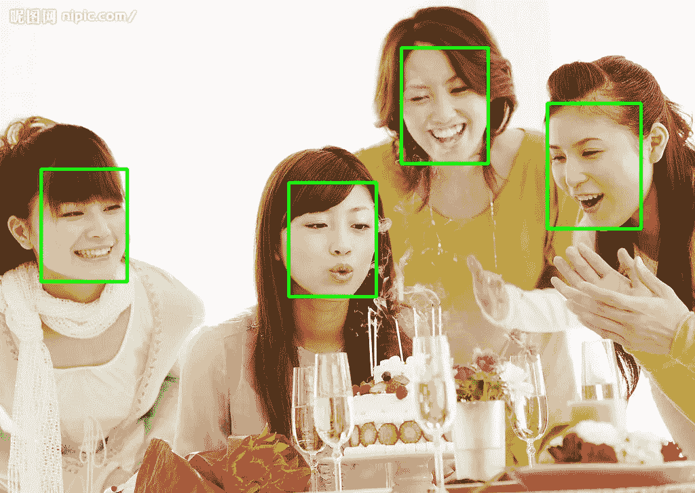

# 部署和服务人工智能模型(第 2 部分— TensorFlow 服务)

> 原文：<https://medium.com/codex/deploy-and-serve-ai-models-part2-tensorflow-serving-f144c4cf5ea7?source=collection_archive---------12----------------------->


约书亚·索蒂诺在 [Unsplash](https://unsplash.com?utm_source=medium&utm_medium=referral) 上拍摄的照片

这是我关于在生产场景中部署 AI 模型的系列文章的继续([第一部分](/codex/deploy-and-server-ai-models-part-1-bf309dc41f4b))。TensorFlow 服务允许开发人员独立于客户端系统配置，将 ML 模型预测、检测或分类集成到云或本地服务器中。因此应用程序用户不需要担心运行 DNN 模型所需的大量计算能力。AI 应用程序客户端可以在不实际安装 TensorFlow 甚至不与实际模型有任何联系的情况下对数据进行推断，以及用一个模型实例服务多个客户端的能力。

**如何设置张量流服务**

首先，你需要一个模型来为推论服务。我已经用一个 TensorFlow 模型实现了 [MTCNN](https://github.com/blaueck/tf-mtcnn) 人脸检测器。在设置服务环境之前，需要将模型从冻结格式转换为 SavedModel 格式，以便与 [TensorFlow 服务](https://www.tensorflow.org/tfx/serving/tutorials/Serving_REST_simple)一起使用。

*使用的环境*

```
Tensorflow 2.3.1
tensorflow-serving-api 2.3.0
```

*冻结 MTCNN 的 Python 代码，以保存模型转换*

```
from os.path import join
import tensorflow.compat.v1 as tftf.disable_v2_behavior()
tf.compat.v1.disable_eager_execution()
from tensorflow.python.saved_model import signature_constantsdef read_pb_model(pb_model_path):
    with tf.gfile.GFile(pb_model_path, "rb") as f:
        graph_def = tf.GraphDef()
        graph_def.ParseFromString(f.read())
        return graph_defgraph_def = read_pb_model(join('models', 'mtcnn.pb'))
builder = tf.saved_model.builder.SavedModelBuilder('./mtcnn/1')sigs = {}
with tf.Session(graph=tf.Graph()) as sess:
    tf.import_graph_def(graph_def, name="")
    graph_model = tf.get_default_graph()
    tf.initialize_all_variables().run()
    input_image_tensor = graph_model.get_tensor_by_name('input:0')
    input_min_size_tensor = graph_model.get_tensor_by_name('min_size:0')
    input_thresholds_tensor = graph_model.get_tensor_by_name('thresholds:0')
    input_factor_tensor = graph_model.get_tensor_by_name('factor:0')output_prob_tensor = graph_model.get_tensor_by_name('prob:0')
    output_landmarks_tensor = graph_model.get_tensor_by_name('landmarks:0')
    output_box_tensor = graph_model.get_tensor_by_name('box:0')sigs[signature_constants.DEFAULT_SERVING_SIGNATURE_DEF_KEY] = \
        tf.saved_model.signature_def_utils.predict_signature_def(
            {'input': input_image_tensor, 'min_size': input_min_size_tensor,
                    'thresholds': input_thresholds_tensor,
                    'factor': input_factor_tensor},
            {'prob': output_prob_tensor, 'landmarks': output_landmarks_tensor,
                     'box': output_box_tensor})
    builder.add_meta_graph_and_variables(
        sess=sess,
        tags=[tf.saved_model.tag_constants.SERVING],
        signature_def_map=sigs)
    builder.save()
```

*模型库结构*

```
mtcnn
  |
  |__ 1
  |     |saved_model.pb
  |     |__variables
```

*设置张量流服务*

```
echo "deb http://storage.googleapis.com/tensorflow-serving-apt stable tensorflow-model-server tensorflow-model-server-universal" | sudo tee /etc/apt/sources.list.d/tensorflow-serving.listcurl https://storage.googleapis.com/tensorflow-serving-apt/tensorflow-serving.release.pub.gpg | apt-key add -apt updateapt-get install tensorflow-model-server
```

*开始 TensorFlow 发球*

```
tensorflow_model_server --rest_api_port=8504 --model_name=mtcnn --model_base_path="/tmp/mtcnn"rest_api_port: The port that you'll use for REST requestsmodel_name: You'll use this in the URL of REST requests. It can be anything.model_base_path: This is the path to the directory where you've saved your model
```

一旦 Tensorflow 服务开始，您就可以检查模型元数据

```
import grpc
from tensorflow_serving.apis import prediction_service_pb2_grpc
from tensorflow_serving.apis import get_model_metadata_pb2request = get_model_metadata_pb2.GetModelMetadataRequest()
request.model_spec.name = 'mtcnn'
request.metadata_field.append('signature_def')
channel = grpc.insecure_channel(target='0.0.0.0:8500')
stub = prediction_service_pb2_grpc.PredictionServiceStub(channel)
result = stub.GetModelMetadata(request, 5.0)
# Verify response
print(result)
```

MTCNN 元数据的响应，这可以用于准备原始模型推断的输入请求

```
model_spec {
  name: "mtcnn"
  version {
    value: 1
  }
}
metadata {
  key: "signature_def"
  value {
    type_url: "type.googleapis.com/tensorflow.serving.SignatureDefMap"
    value: "\n\262\002\n\017serving_default\022\236\002\n$\n\nthresholds\022\026\n\014thresholds:0\020\001\032\004\022\002\010\003\n4\n\005input\022+\n\007input:0\020\001\032\036\022\013\010\377\377\377\377\377\377\377\377\377\001\022\013\010\377\377\377\377\377\377\377\377\377\001\022\002\010\003\n\036\n\010min_size\022\022\n\nmin_size:0\020\001\032\002\030\001\n\032\n\006factor\022\020\n\010factor:0\020\001\032\002\030\001\022\024\n\003box\022\r\n\005box:0\020\001\032\002\030\001\022!\n\004prob\022\031\n\006prob:0\020\001\032\r\022\013\010\377\377\377\377\377\377\377\377\377\001\022/\n\tlandmarks\022\"\n\013landmarks:0\020\001\032\021\022\013\010\377\377\377\377\377\377\377\377\377\001\022\002\010\n\032\032tensorflow/serving/predict"
  }
}
```

## 使用 TensorFlow 服务运行人脸检测

*   开始张量流服务
*   创建一个 python 文件 mtcnn_detection.py 并导入所有必需的模块

```
import json

import grpc
import requests
import cv2
import tensorflow as tf
from tensorflow_serving.apis import predict_pb2
from tensorflow_serving.apis import prediction_service_pb2_grpc
from tensorflow_serving.apis import get_model_metadata_pb2
```

*   从测试文件中读取图像

```
image = cv2.imread(image_file)
```

*   为上菜准备输入请求。TensorFlow 分别为 gRPC 和 HTTP rest API 请求提供公开端口' 8500 '和 8504。在此示例中，我们使用 gRPC 协议从客户端应用程序与 TensorFlow 服务器进行通信。预期的输入和输出名称将从之前执行的模型元数据中获得。

```
channel = grpc.insecure_channel(target='localhost:8500')
stub = prediction_service_pb2_grpc.PredictionServiceStub(channel)
request = predict_pb2.PredictRequest()
equest.model_spec.name = 'mtcnn'

request.model_spec.signature_name = 'serving_default'input = tf.make_tensor_proto(image, dtype=tf.float32, shape=image.shape)
min_size = tf.make_tensor_proto(40, dtype=tf.float32, shape=())
factor = tf.make_tensor_proto(0.7, dtype=tf.float32, shape=())
thresholds = tf.make_tensor_proto([0.6, 0.7, 0.8], dtype=tf.float32, shape=[3])request.inputs['input'].CopyFrom(input)
request.inputs['min_size'].CopyFrom(min_size)
request.inputs['factor'].CopyFrom(factor)
request.inputs['thresholds'].CopyFrom(thresholds)
```

*   请求面部检测

```
result = stub.Predict(request,10.0)
```

*   将结果转换为数组，并为检测到的人脸绘制边界框

```
bbox_data_list = tf.make_ndarray(result.outputs['box'])
for bbox_data in bbox_data_list:
    box = bbox_data.astype('int32')
    img = cv2.rectangle(img, (box[1], box[0]), (box[3], box[2]), (0, 255    , 0), 3)
```

*   保存图像

```
cv2.imwrite('test1.png', image)
```

*结果*



## 结论

使用 TensorFlow 进行推理使得将模型投入生产的过程更加容易和快速。它是大规模运行多个模型的理想选择，有助于新模型的部署和[运行实验](https://tensorflow.github.io/serving/serving_advanced)，同时保持相同的服务器架构和 API。但是，它只支持 TensorFlow SavedModel 格式，在使用之前需要转换这种格式。