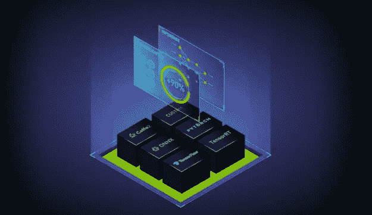
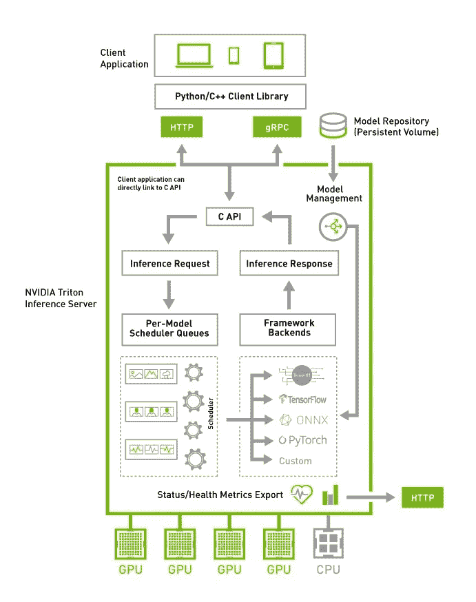

# 部署和服务人工智能模型(第 1 部分)

> 原文：<https://medium.com/codex/deploy-and-server-ai-models-part-1-bf309dc41f4b?source=collection_archive---------7----------------------->

来源 Nvidia

模型创建只是创建真实世界 AI 解决方案的一步。此外，AI 模型需要部署、托管和服务，以便在现实世界场景中运行输入的预测、检测和分类(通常运行模型推理)。大多数人工智能应用程序都有以下工作流程

*   基于模型捕获输入数据。例如用于对象检测的来自视频源的帧。
*   对输入数据进行预处理。大多数模型期望输入数据具有特定的格式或维度。示例将图像裁剪成特定的大小，应用标准化或改变数据的维度等。
*   使用对象检测、预测、识别或分类的输入数据运行模型推理
*   对推理结果进行后处理。有时需要根据阈值从输出中丢弃数据，或者需要为对象检测结果选择最合适的边界框(非最大抑制)。

## 人工智能模型的推理

深度学习推理是运行经过训练的 DNN 模型的过程，以针对以前从未见过的数据进行检测、预测或分类。因此，在人工智能推理应用中，将经过训练的 DNN 模型部署到适当的平台是非常重要的，因为它需要更多的计算和存储能力。AI 应用程序的性能和延迟(从向 DNN 输入数据到收到结果的响应时间)取决于所部署系统的计算能力。所以大多数时候人工智能训练的模型应该被优化(剪枝和量化)以降低计算能力和延迟。

模型推理可以在内部完成，也可以在云中使用 CPU 或 GPU 完成。以便可以从桌面、移动或 web 应用程序或云服务访问这些内容。

此外，我们将关注模型部署/推理。部署策略应取决于应用类型(桌面、web 应用等)、模式(离线或在线)或实时和延迟。

## 人工智能模型的离线部署

如果您的应用程序对 internet 的访问有限，或者网络通信时间在您的应用程序决策过程中至关重要，那么这种方法会更好。例如，火灾探测系统应该从摄像机实时产生低延迟的警报。在这种情况下，人工智能模型需要与应用程序一起提供，并在内部运行推理。

可以在用户 PC 或单板计算机(如 nano jetson 或 raspberry pi)上运行的独立应用程序更适合这种类型。这种方法的主要缺点是，主机应该像 GPU 一样具有高计算能力，以便通过并行化深度学习执行来加速。

如果您计划跨平台开发，QT 或 Python 是构建这类应用程序的合适框架。QT 是一个强大的框架，可以在 c++中构建跨平台的独立应用程序，还提供 python 绑定来在 python 环境中构建应用程序。如果您的应用程序是性能关键型的，QT c++是一个合适的选择。大多数 ML 框架如 TensorFlow、PyTorch 都提供 python 和 c++环境下的 API。

## 人工智能模型的在线部署

经过训练的 AI 模型可以部署在云中或本地服务器上，并且可以通过网络连接从客户端应用程序访问，以进行模型推断。这种方法适用于所有类型的应用程序，但是与离线应用程序相比，您需要考虑网络延迟。这通过使用 HTTP/REST 和 GRPC 协议为客户端应用程序提供了远程推理能力。使得用户不需要像 GPU 那样配备很大的计算能力，降低了成本。有很多服务提供商像 AWS、Azure、GCP 等提供云设施来部署和托管你的 ML 模型。但是我更关注推理服务器。

[Tensorflow serving](https://www.tensorflow.org/tfx/guide/serving) 和 [Nvidia Triton 推理服务器](https://github.com/triton-inference-server/server)是最受欢迎的推理服务器，允许托管您的模型。然而，Triton 服务器支持多种框架，如 TensorFlow、TensorRT、PyTorch、ONNX 运行时，甚至自定义框架后端。此外，它支持为推理服务创建定制的 python 后端。它提供了选择项目框架的灵活性。Triton 高性能推理允许在 GPU 上并发运行模型以最大化利用率，支持基于 CPU 的推理，并提供模型集成和流推理等高级功能。

来源[英伟达](https://developer.nvidia.com/sites/default/files/akamai/ai-for-enterprise-print-update-to-triton-diagram-1339418-final-r3.jpg)

**Triton 服务器优势**

1.  从本地存储或云平台加载模型
2.  无需重启服务器即可轻松更新模型
3.  从相同或不同的框架中运行多个模型
4.  支持实时推理和批量推理
5.  支持模型集成

## 结论

这个主题只是讨论了 ML 模型的基本部署策略，以便为最终用户构建应用程序。在接下来的系列中，我将更多地关注如何使用推理服务器(如服务于 T1 和 T2 的 Tensorflow)来服务 ML 模型，以及如何在没有单独服务器的情况下适应后置和预处理逻辑(整体模型)。