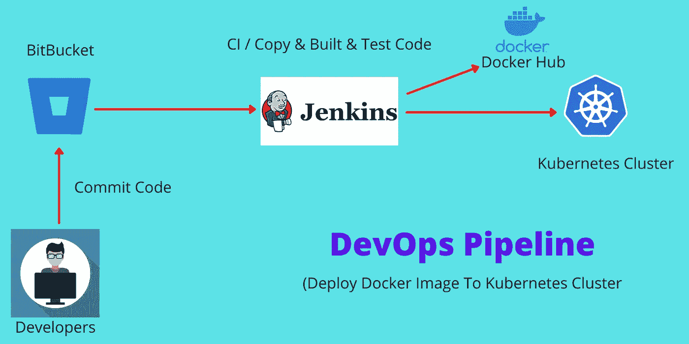

# 使用 Jenkins 将 Docker 映像部署到 Kubernetes 集群

> 原文：<https://medium.com/codex/deploy-docker-image-to-kubernetes-cluster-using-jenkins-8182cc0a8de7?source=collection_archive---------0----------------------->

## 本文解释了完整的 DevOps 管道设置，从创建项目到使用 Jenkins 将 Docker 映像部署到 Kubernetes 集群。

DevOps 管道

之前我们已经看到了[如何使用 Jenkins](/codex/how-to-push-a-docker-image-to-docker-hub-using-jenkins-487fb1fcbe25) 将 Docker 映像推送到 Docker hub。这篇文章是…的续篇