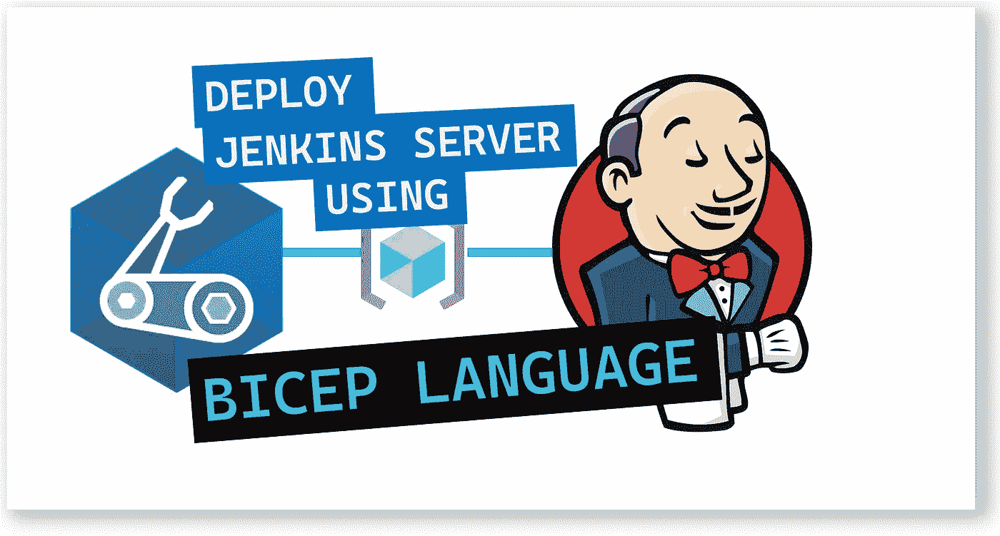
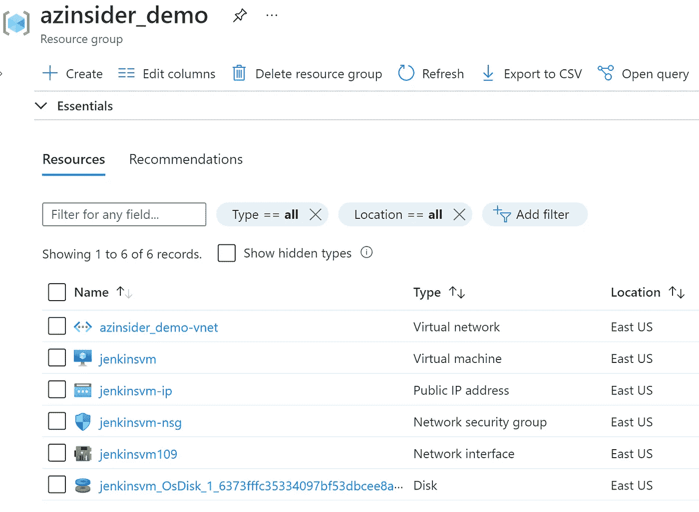
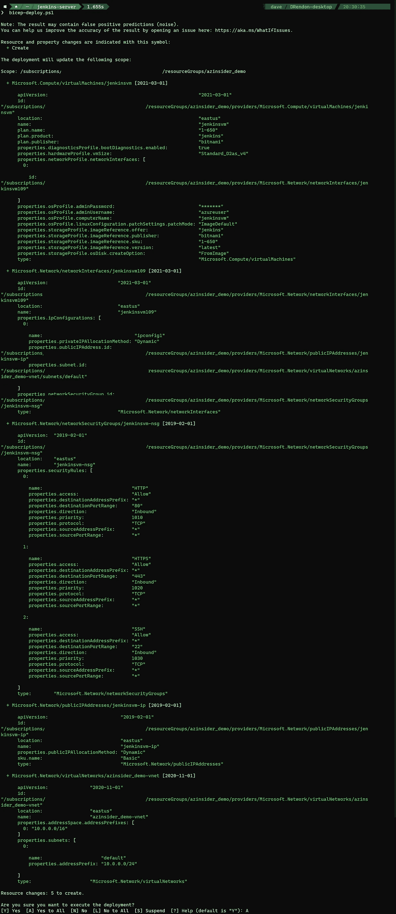
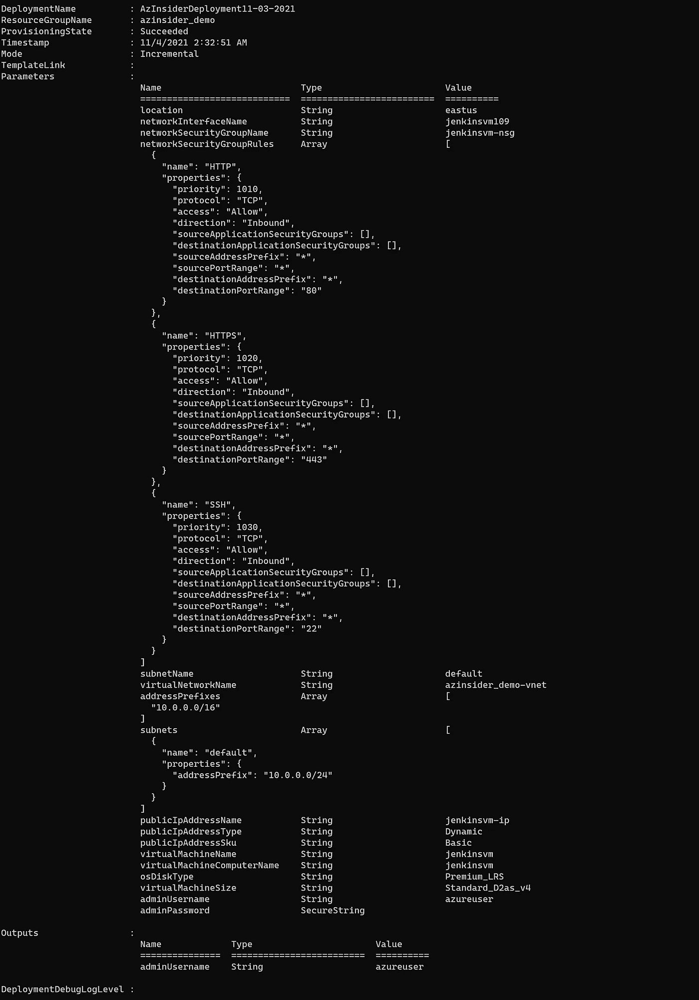
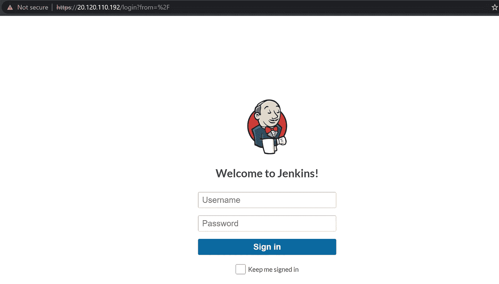

# 💪使用基础设施即代码(Bicep)在 Azure 上部署 Jenkins 服务器

> 原文：<https://medium.com/codex/deploy-jenkins-server-on-azure-using-infrastructure-as-code-bicep-d7781f90d957?source=collection_archive---------5----------------------->

了解如何使用 Azure Bicep 部署 Jenkins 服务器。



使用基础设施即代码在 Azure 上部署 Jenkins 服务器。

本文将展示如何通过 Azure Bicep 使用基础设施即代码来部署 Jenkins，Azure Bicep 是一种用于以声明方式部署 Azure 资源的领域特定语言(DSL)。

Jenkins 是一个开源的自动化服务器，可以帮助您跨多个平台自动构建、测试和部署任何项目。

Jenkins 有助于避免破坏性的更改，以便您可以节省时间并确保交付高质量的软件。它的 web 界面提供了一种在将应用程序投入生产之前管理和测试应用程序的简单方法。

这个 Bicep 模板包含了社区推荐的插件的最新版本，包括管道和 Git 集成。

# 先决条件

要部署该解决方案，您需要以下各项:

*   一个活跃的 Azure 账户:你可以[免费](https://azure.microsoft.com/free/)创建一个账户。
*   [Azure 二头肌](https://github.com/azure/bicep)安装在你的本地机器上。
*   Azure PowerShell。参见:[安装 Azure PowerShell](https://docs.microsoft.com/en-us/powershell/azure/install-az-ps) 。
*   Azure 订阅中的资源组

我们开始吧！

*   注意:在部署此解决方案之前，我们必须接受虚拟机映像的法律条款。要阅读并接受法律条款，您可以使用 PowerShell 通过下面的 cmdlet 接受条款和条件:

```
Get-AzMarketplaceTerms `
-Publisher 'bitnami' `
-Product 'jenkins' `
-Name '1-650' |
Set-AzMarketplaceTerms -Accept
```

# 解决方案概述

我们将创作一个创建 Jenkin 服务器的 Bicep 模板。

该解决方案将包括以下文件:

*   ***main.bicep*** :这是二头肌模板
*   ***azure deploy . parameters . JSON***:该参数文件包含用于部署 Bicep 模板的值。

该模板提供安装所需的存储帐户、虚拟网络、可用性集、公共 IP 地址和网络接口。



詹金斯部署

现在让我们开始制作二头肌模板。

# 1.Azure 二头肌模板-参数

在您的工作目录中创建一个新文件，并将其命名为' *main.bicep* '。我们将定义以下参数:

```
param location string
param networkInterfaceName string
param networkSecurityGroupName string
param networkSecurityGroupRules array
param subnetName string
param virtualNetworkName string
param addressPrefixes array
param subnets array
param publicIpAddressName string
param publicIpAddressType string
param publicIpAddressSku string
param virtualMachineName string
param virtualMachineComputerName string
param osDiskType string
param virtualMachineSize string
param adminUsername string[@secure](http://twitter.com/secure)()
param adminPassword string
```

# 2.Azure 二头肌模板-变量

我们将定义以下变量:

```
var nsgId = resourceId(resourceGroup().name, 'Microsoft.Network/networkSecurityGroups', networkSecurityGroupName)
var vnetId = resourceId(resourceGroup().name, 'Microsoft.Network/virtualNetworks', virtualNetworkName)
var subnetRef = '${vnetId}/subnets/${subnetName}'
```

# 3.Azure 二头肌模板—资源

我们将定义以下资源:

```
resource networkInterfaceName_resource 'Microsoft.Network/networkInterfaces@2021-03-01' = {
  name: networkInterfaceName
  location: location
  properties: {
    ipConfigurations: [
      {
        name: 'ipconfig1'
        properties: {
          subnet: {
            id: subnetRef
          }
          privateIPAllocationMethod: 'Dynamic'
          publicIPAddress: {
            id: pip.id
          }
        }
      }
    ]
    networkSecurityGroup: {
      id: nsgId
    }
  }
  dependsOn: [
    networkSecurityGroupName_resource
    virtualNetworkName_resource
    pip
  ]
}resource networkSecurityGroupName_resource 'Microsoft.Network/networkSecurityGroups@2019-02-01' = {
  name: networkSecurityGroupName
  location: location
  properties: {
    securityRules: networkSecurityGroupRules
  }
}resource virtualNetworkName_resource 'Microsoft.Network/virtualNetworks@2020-11-01' = {
  name: virtualNetworkName
  location: location
  properties: {
    addressSpace: {
      addressPrefixes: addressPrefixes
    }
    subnets: subnets
  }
}resource pip 'Microsoft.Network/publicIpAddresses@2019-02-01' = {
  name: publicIpAddressName
  location: location
  properties: {
    publicIPAllocationMethod: publicIpAddressType
  }
  sku: {
    name: publicIpAddressSku
  }
}resource virtualMachineName_resource 'Microsoft.Compute/virtualMachines@2021-03-01' = {
  name: virtualMachineName
  location: location
  properties: {
    hardwareProfile: {
      vmSize: virtualMachineSize
    }
    storageProfile: {
      osDisk: {
        createOption: 'FromImage'
        managedDisk: {
          storageAccountType: osDiskType
        }
      }
      imageReference: {
        publisher: 'bitnami'
        offer: 'jenkins'
        sku: '1-650'
        version: 'latest'
      }
    }
    networkProfile: {
      networkInterfaces: [
        {
          id: networkInterfaceName_resource.id
        }
      ]
    }
    osProfile: {
      computerName: virtualMachineComputerName
      adminUsername: adminUsername
      adminPassword: adminPassword
      linuxConfiguration: {
        patchSettings: {
          patchMode: 'ImageDefault'
        }
      }
    }
    diagnosticsProfile: {
      bootDiagnostics: {
        enabled: true
      }
    }
  }
  plan: {
    name: '1-650'
    publisher: 'bitnami'
    product: 'jenkins'
  }
}
```

# 4.参数文件

创建一个名为“*azure deploy . parameters . JSON*”的新文件。下面的代码显示了参数文件的定义:

```
{
    "$schema": "[https://schema.management.azure.com/schemas/2015-01-01/deploymentParameters.json#](https://schema.management.azure.com/schemas/2015-01-01/deploymentParameters.json#)",
    "contentVersion": "1.0.0.0",
    "parameters": {
        "location": {
            "value": "eastus"
        },
        "networkInterfaceName": {
            "value": "jenkinsvm109"
        },
        "networkSecurityGroupName": {
            "value": "jenkinsvm-nsg"
        },
        "networkSecurityGroupRules": {
            "value": [
                {
                    "name": "HTTP",
                    "properties": {
                        "priority": 1010,
                        "protocol": "TCP",
                        "access": "Allow",
                        "direction": "Inbound",
                        "sourceApplicationSecurityGroups": [],
                        "destinationApplicationSecurityGroups": [],
                        "sourceAddressPrefix": "*",
                        "sourcePortRange": "*",
                        "destinationAddressPrefix": "*",
                        "destinationPortRange": "80"
                    }
                },
                {
                    "name": "HTTPS",
                    "properties": {
                        "priority": 1020,
                        "protocol": "TCP",
                        "access": "Allow",
                        "direction": "Inbound",
                        "sourceApplicationSecurityGroups": [],
                        "destinationApplicationSecurityGroups": [],
                        "sourceAddressPrefix": "*",
                        "sourcePortRange": "*",
                        "destinationAddressPrefix": "*",
                        "destinationPortRange": "443"
                    }
                },
                {
                    "name": "SSH",
                    "properties": {
                        "priority": 1030,
                        "protocol": "TCP",
                        "access": "Allow",
                        "direction": "Inbound",
                        "sourceApplicationSecurityGroups": [],
                        "destinationApplicationSecurityGroups": [],
                        "sourceAddressPrefix": "*",
                        "sourcePortRange": "*",
                        "destinationAddressPrefix": "*",
                        "destinationPortRange": "22"
                    }
                }
            ]
        },
        "subnetName": {
            "value": "default"
        },
        "virtualNetworkName": {
            "value": "YOUR-VNET-NAME"
        },
        "addressPrefixes": {
            "value": [
                "10.0.0.0/16"
            ]
        },
        "subnets": {
            "value": [
                {
                    "name": "default",
                    "properties": {
                        "addressPrefix": "10.0.0.0/24"
                    }
                }
            ]
        },
        "publicIpAddressName": {
            "value": "PUBLIC-IP-NAME"
        },
        "publicIpAddressType": {
            "value": "Dynamic"
        },
        "publicIpAddressSku": {
            "value": "Basic"
        },
        "virtualMachineName": {
            "value": "VM-NAME"
        },
        "virtualMachineComputerName": {
            "value": "YOUR-VM-COMPUTER-NAME"
        },
        "osDiskType": {
            "value": "Premium_LRS"
        },
        "virtualMachineSize": {
            "value": "Standard_D2as_v4"
        },
        "adminUsername": {
            "value": "YOUR-ADMIN-USERNAME"
        },
        "adminPassword": {
            "value": "YOUR-PASSWORD"
        }
    }
}
```

# 5.Azure Bicep 模板-部署

我们将使用下面的命令来部署我们的二头肌模板:

```
$date = Get-Date -Format "MM-dd-yyyy"
$deploymentName = "AzInsiderDeployment"+"$date"New-AzResourceGroupDeployment -Name $deploymentName -ResourceGroupName azinsider_demo -TemplateFile .\main.bicep -TemplateParameterFile .\azuredeploy.parameters.json -c
```

下图显示了部署的预览:



部署预览

然后我们将执行部署。下图显示了部署输出:



部署输出

现在让我们验证一下詹金斯的状态。您可以使用虚拟机的公共 IP 地址，并通过使用端口 443 的浏览器访问 Jenkins:



詹金斯

此解决方案的完整代码可在此处找到:

[](https://github.com/daveRendon/azinsider/tree/main/application-workloads/jenkins-server) [## azin sider/应用程序-工作负载/Jenkins-位于主 daveRendon/azinsider 的服务器

### 在 GitHub 上创建一个帐户，为 daveRendon/azinsider 开发做出贡献。

github.com](https://github.com/daveRendon/azinsider/tree/main/application-workloads/jenkins-server) 

👉 [*在此加入****azin sider****邮箱列表。*](http://eepurl.com/gKmLdf)

*-戴夫·r·*