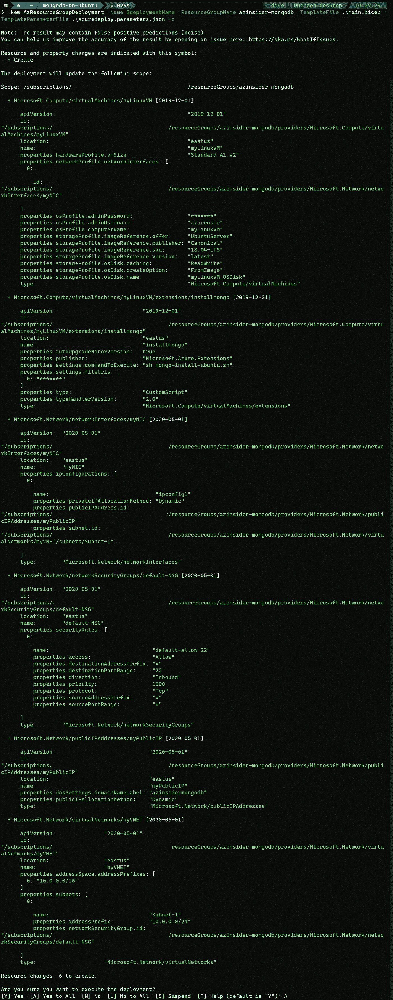
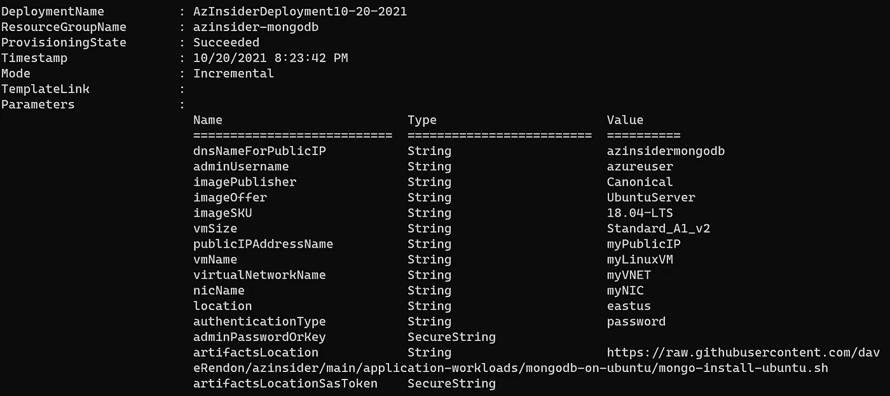
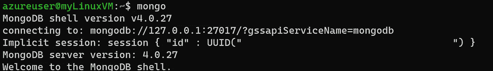

# 💪使用 Bicep 在 Ubuntu 上部署 MongoDB

> 原文：<https://medium.com/codex/deploy-mongodb-on-ubuntu-using-bicep-102a2b4436e6?source=collection_archive---------3----------------------->

## 使用基础设施即代码在 Azure 中快速部署 MongoDB


💪使用 Bicep 在 Ubuntu 上部署 MongoDB

本文将回顾如何使用 Bicep 在 Ubuntu 虚拟机上部署 MongoDB，Bicep 是一种新的领域特定语言(DSL ),用于以声明方式部署 Azure 资源。

# 该解决方案由以下文件组成:

*   *main.bicep* :这是我们部署解决方案的 bicep 模板
*   *azure deploy . parameters . JSON*:参数文件包含部署时传递的值。
*   *mongo-install-ubuntu.sh* :这是一个在 ubuntu 虚拟机上安装 MongoDB 的脚本。一旦使用“自定义脚本”部署了虚拟机，就会执行该脚本。

# 先决条件:

*   Azure 二头肌已安装
*   有效的 Azure 订阅
*   在您的订阅中创建的资源组

现在让我们开始制作二头肌模板。

我们将定义以下参数:

```
@description('DNS Name for Public IP')
param dnsNameForPublicIP string@description('Admin Username')
param adminUsername string@description('Image Publisher')
param imagePublisher string = 'Canonical'@description('Image Offer')
param imageOffer string = 'UbuntuServer'@description('Image SKU')
param imageSKU string = '18.04-LTS'@description('VM Size')
param vmSize string = 'Standard_A1_v2'@description('Public IP Address Name')
param publicIPAddressName string = 'myPublicIP'@description('Vm Name')
param vmName string = 'myLinuxVM'@description('Virtual Network Name')
param virtualNetworkName string = 'myVNET'@description('NIC Name')
param nicName string = 'myNIC'@description('Location for all resources.')
param location string = resourceGroup().location@allowed([
  'sshPublicKey'
  'password'
])
@description('Type of authentication to use on the Virtual Machine. SSH key is recommended.')
param authenticationType string = 'password'@description('SSH Key or password for the Virtual Machine. SSH key is recommended.')
@secure()
param adminPasswordOrKey string@description('The base URI where artifacts required by this template are located. For example, if stored on a public GitHub repo, you\'d use the following URI: https://raw.githubusercontent.com/Azure/azure-quickstart-templates/master/mongodb-on-ubuntu/.')
param artifactsLocation string = 'https://raw.githubusercontent.com/daveRendon/azinsider/main/application-workloads/mongodb-on-ubuntu/mongo-install-ubuntu.sh'@description('The sasToken required to access _artifactsLocation.  If your artifacts are stored on a public repo or public storage account you can leave this blank.')
@secure()
param artifactsLocationSasToken string = ''
```

请注意，我们允许使用密码或 SSH 密钥来部署 Ubuntu VM，在本例中，我们将传递一个密码值。您可以选择使用 SSH 密钥。

现在我们将定义如下所示的变量:

```
var addressPrefix = '10.0.0.0/16'
var subnet1Name = 'Subnet-1'
var subnet1Prefix = '10.0.0.0/24'
var publicIPAddressType = 'Dynamic'
var linuxConfiguration = {
  disablePasswordAuthentication: true
  ssh: {
    publicKeys: [
      {
        path: '/home/${adminUsername}/.ssh/authorized_keys'
        keyData: adminPasswordOrKey
      }
    ]
  }
}
var networkSecurityGroupName_var = 'default-NSG'
```

接下来，我们将定义资源，包括虚拟机的组件和资源类型“扩展”,它将执行脚本来安装 MongoDB:

```
resource publicIPAddressName_resource 'Microsoft.Network/publicIPAddresses@2020-05-01' = {
  name: publicIPAddressName
  location: location
  properties: {
    publicIPAllocationMethod: publicIPAddressType
    dnsSettings: {
      domainNameLabel: dnsNameForPublicIP
    }
  }
}resource networkSecurityGroupName 'Microsoft.Network/networkSecurityGroups@2020-05-01' = {
  name: networkSecurityGroupName_var
  location: location
  properties: {
    securityRules: [
      {
        name: 'default-allow-22'
        properties: {
          priority: 1000
          access: 'Allow'
          direction: 'Inbound'
          destinationPortRange: '22'
          protocol: 'Tcp'
          sourceAddressPrefix: '*'
          sourcePortRange: '*'
          destinationAddressPrefix: '*'
        }
      }
    ]
  }
}resource virtualNetworkName_resource 'Microsoft.Network/virtualNetworks@2020-05-01' = {
  name: virtualNetworkName
  location: location
  properties: {
    addressSpace: {
      addressPrefixes: [
        addressPrefix
      ]
    }
    subnets: [
      {
        name: subnet1Name
        properties: {
          addressPrefix: subnet1Prefix
          networkSecurityGroup: {
            id: networkSecurityGroupName.id
          }
        }
      }
    ]
  }
}resource nicName_resource 'Microsoft.Network/networkInterfaces@2020-05-01' = {
  name: nicName
  location: location
  properties: {
    ipConfigurations: [
      {
        name: 'ipconfig1'
        properties: {
          privateIPAllocationMethod: 'Dynamic'
          publicIPAddress: {
            id: publicIPAddressName_resource.id
          }
          subnet: {
            id: resourceId('Microsoft.Network/virtualNetworks/subnets', virtualNetworkName, subnet1Name)
          }
        }
      }
    ]
  }
  dependsOn: [
    virtualNetworkName_resource
  ]
}resource vmName_resource 'Microsoft.Compute/virtualMachines@2019-12-01' = {
  name: vmName
  location: location
  properties: {
    hardwareProfile: {
      vmSize: vmSize
    }
    osProfile: {
      computerName: vmName
      adminUsername: adminUsername
      adminPassword: adminPasswordOrKey
      linuxConfiguration: ((authenticationType == 'password') ? json('null') : linuxConfiguration)
    }
    storageProfile: {
      imageReference: {
        publisher: imagePublisher
        offer: imageOffer
        sku: imageSKU
        version: 'latest'
      }
      osDisk: {
        name: '${vmName}_OSDisk'
        caching: 'ReadWrite'
        createOption: 'FromImage'
      }
    }
    networkProfile: {
      networkInterfaces: [
        {
          id: nicName_resource.id
        }
      ]
    }
  }
}resource vmName_installmongo 'Microsoft.Compute/virtualMachines/extensions@2019-12-01' = {
  parent: vmName_resource
  name: 'installmongo'
  location: location
  properties: {
    publisher: 'Microsoft.Azure.Extensions'
    type: 'CustomScript'
    typeHandlerVersion: '2.0'
    autoUpgradeMinorVersion: true
    settings: {
      fileUris: [
        uri(artifactsLocation, 'mongo-install-ubuntu.sh${artifactsLocationSasToken}')
      ]
      commandToExecute: 'sh mongo-install-ubuntu.sh'
    }
  }
}
```

# 在 Ubuntu 虚拟机上部署 MongoDB 的 Azure Bicep 模板

下面的代码展示了使用 Bicep 在 Ubuntu 虚拟机上部署 MongoDB 的完整模板:

在 Ubuntu 虚拟机上部署 MongoDB 的 Azure Bicep 模板

现在我们有了二头肌模板，让我们回顾一下参数文件。

# 参数文件。

在参数文件中，我们将传递虚拟机的管理员用户名、密码或 SSH 密钥值以及 DNS 名称:

```
{
    "$schema": "https://schema.management.azure.com/schemas/2019-04-01/deploymentParameters.json#",
    "contentVersion": "1.0.0.0",
    "parameters": {
      "adminUsername": {
        "value": "Your-Username"
      },
      "dnsNameForPublicIP": {
        "value": "Your-DNS-Name-For-PublicIP"
      },
      "adminPasswordOrKey": {
        "value": "Your-password-or-Key"
      }
    }
  }
```

最后，我们将引用下面的代码来安装 MongoDB:

```
# Configure mongodb.list file with the correct location
sudo apt-key adv --keyserver hkp://keyserver.ubuntu.com:80 --recv 9DA31620334BD75D9DCB49F368818C72E52529D4
echo "deb [http://repo.mongodb.org/apt/ubuntu](http://repo.mongodb.org/apt/ubuntu) "$(lsb_release -sc)"/mongodb-org/4.0 multiverse" | sudo tee /etc/apt/sources.list.d/mongodb-org-4.0.list# Disable THP
sudo echo never > /sys/kernel/mm/transparent_hugepage/enabled
sudo echo never > /sys/kernel/mm/transparent_hugepage/defrag
sudo grep -q -F 'transparent_hugepage=never' /etc/default/grub || echo 'transparent_hugepage=never' >> /etc/default/grub# Install updates
sudo apt-get -y update# Modified tcp keepalive according to [https://docs.mongodb.org/ecosystem/platforms/windows-azure/](https://docs.mongodb.org/ecosystem/platforms/windows-azure/)
sudo bash -c "sudo echo net.ipv4.tcp_keepalive_time = 120 >> /etc/sysctl.conf"#Install Mongo DB
sudo apt-get install -y mongodb-org# Uncomment this to bind to all ip addresses
sudo sed -i -e 's/bindIp: 127.0.0.1/bindIp: 0.0.0.0/g' /etc/mongod.conf
sudo service mongod restart
```

请随意从以下 URL 获取该解决方案的完整代码:

[](https://github.com/daveRendon/azinsider/tree/main/application-workloads/mongodb-on-ubuntu) [## azin sider/应用程序工作负载/MongoDB-on-Ubuntu at main daveRendon/azin sider

### 在 GitHub 上创建一个帐户，为 daveRendon/azinsider 开发做出贡献。

github.com](https://github.com/daveRendon/azinsider/tree/main/application-workloads/mongodb-on-ubuntu) 

现在，让我们部署这个解决方案。

我们将使用命令来部署我们的 Bicep 模板:

```
$date = Get-Date -Format "MM-dd-yyyy"
$deploymentName = "AzInsiderDeployment"+"$date"New-AzResourceGroupDeployment -Name $deploymentName -ResourceGroupName azinsider-mongodb -TemplateFile .\main.bicep -TemplateParameterFile .\azuredeploy.parameters.json -c
```

注意，我们之前创建了一个名为“azinsider-mongodb”的资源组。

上述命令将提供部署的预览，如下所示:



使用 Bicep 的 Ubuntu 上的 MongoDB 部署预览

一旦部署生效，我们将执行它。下图显示了部署的输出。



使用 Bicep 的 Ubuntu 虚拟机上的 MongoDB 部署输出

# 验证 MongoDB 安装。

现在，我们可以使用下面的命令 SSH 到虚拟机:

```
ssh your-admin-username@your-vm-ip
```

然后，我们将使用命令“mongo”验证 MongoDB 正在运行:



验证 MongoDB 安装

希望这能让您更好地理解如何使用 Bicep 在 Linux 虚拟机上执行定制脚本。

👉 [*在此加入****azin sider****邮箱列表。*](http://eepurl.com/gKmLdf)

*-戴夫·r·*