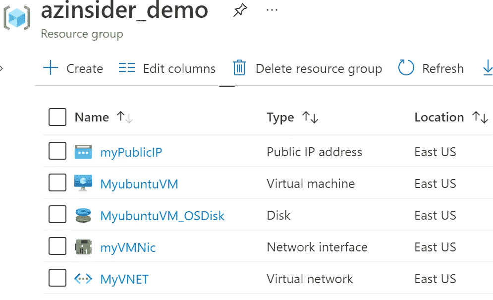
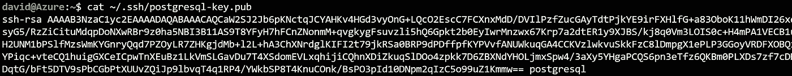
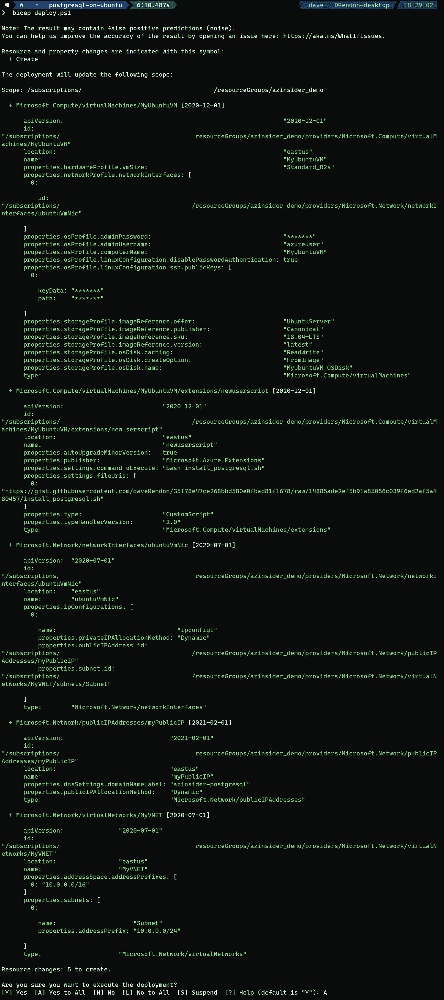
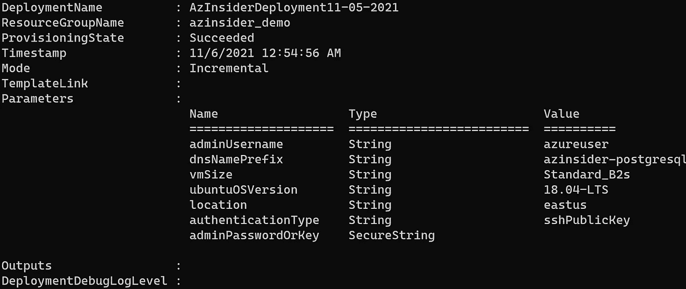
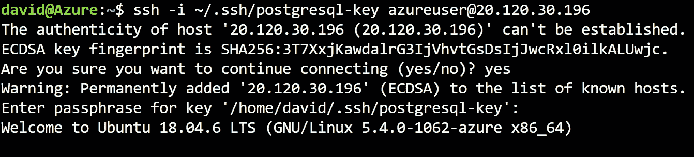
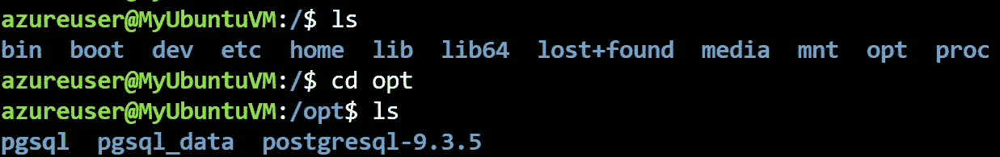

# 💪使用基础设施即代码(Azure Bicep)部署 PostgreSQL

> 原文：<https://medium.com/codex/deploy-postgresql-using-infrastructure-as-code-azure-bicep-3b563dc6427f?source=collection_archive---------4----------------------->

使用 Azure Bicep 部署带有 PostgreSQL 的 Ubuntu 虚拟机


使用基础设施即代码(Azure Bicep)部署 PostgreSQL

本文将展示如何使用 Azure Bicep 部署带有 PostgreSQL 的 Ubuntu 虚拟机，这是一种用于声明式部署 Azure 资源的领域特定语言(DSL)。

我们将利用 Azure Linux CustomScript 扩展在 Ubuntu 虚拟机中安装 PostgreSQL 服务器。

# 先决条件

*   一个活跃的 Azure 账户:你可以[免费](https://azure.microsoft.com/free/)创建一个账户。
*   [Azure 二头肌](https://github.com/azure/bicep)安装在你的本地机器上。
*   Azure PowerShell。参见:[安装 Azure PowerShell](https://docs.microsoft.com/en-us/powershell/azure/install-az-ps) 。
*   Azure 订阅中的资源组

我们开始吧！

# 解决方案概述

我们将创建一个 Bicep 模板来创建 Ubuntu VM，并使用 Azure Linux CustomScript 扩展来安装 PostgreSQL 服务器，版本:9.3.5。

安装包括:

*   港口:1999 年，
*   数据目录:m/opt/pgsql_data，
*   安装目录:/opt/pgsql，
*   用户:postgres

该解决方案将包括以下文件:

*   **📄 *main.bicep*** :这是二头肌模板
*   **📄*azure deploy . parameters . JSON***:这个参数文件包含用于部署 Bicep 模板的值。
*   📁工件:该文件夹将包含一个名为' *install_postgresql.sh* '的脚本。

该模板还提供安装所需的存储帐户、虚拟网络、公共 IP 地址和网络接口。



部署的资源

# 1.创建 SSH 密钥对

第一步是创建一个 SSH 密钥对；您可以查看以下关于如何在 Azure 中为 Linux 虚拟机创建 SSH 密钥对的文章—[https://docs . Microsoft . com/en-us/Azure/virtual-machines/Linux/MAC-create-SSH-keys](https://docs.microsoft.com/en-us/azure/virtual-machines/linux/mac-create-ssh-keys)

在本例中，我们将使用 Azure Bash 控制台创建一个 SSH 密钥对。在 Azure 门户中，请求一个新的控制台，如下图所示:


云壳— Azure 门户

然后，我们将使用下面的命令生成一个 SSH 密钥:

```
ssh-keygen \
    -m PEM \
    -t rsa \
    -b 4096 \
    -C "postgresql" \
    -f ~/.ssh/postgresql-key \
    -N yourpasshphrase
```

这将在文件共享中的 SSH 目录下生成密钥。

如果您不熟悉 SSH 公钥的格式，可以使用下面的 cat 命令显示您的公钥，替换' *~/。如果需要，ssh/id_rsa.pub* '带有您自己的公钥文件的路径和文件名:

```
cat ~/.ssh/postgresql-key.pub
```

上面的命令将在控制台中显示 SSH 公钥。我们将在部署期间需要它，所以请将它放在手边。

酷！现在我们有了 SSH 密钥对。我们将在参数文件中传递这个 SSH 密钥的值。



SSH 密钥

下一步是准备工件的位置。你有两个选择:一个选择是在 Azure 中创建一个存储帐户，然后创建一个名为‘artifacts’的容器。然后在该容器中上传以下文件。

第二个选项是将工件(名为' *install_postgresql.sh* '的脚本)存储在公共存储库中。在本例中，我们将使用该选项。

***注意*** *:如果您喜欢使用第一个选项，请确保您生成了正确的共享访问令牌(sa ),以便在部署期间可以访问文件/工件。传递两个参数值:SAS 令牌和位置(工件位置的 URL)。*

# 2.Azure 二头肌模板-参数

在您的工作目录中创建一个新文件，并将其命名为' *main.bicep* '。我们将定义以下参数:

```
@description('User name for the Virtual Machine.')
param adminUsername string@description('DNS Name for the publicly accessible node. Must be lowercase. It should match with the following regular expression: ^[a-z][a-z0-9-]{1,61}[a-z0-9]$ or it will raise an error.')
param dnsNamePrefix string@description('The size of the virtual machines used when provisioning')
param VmSize string = 'Standard_B2s'@allowed([
  '18.04-LTS'
  '16.04.0-LTS'
  '14.04.5-LTS'
])
@description('The Ubuntu version for the VM. This will pick a fully patched image of this given Ubuntu version.')
param ubuntuOSVersion string = '18.04-LTS'@description('Location for all resources.')
param location string = resourceGroup().location@allowed([
  'sshPublicKey'
  'password'
])
@description('Type of authentication to use on the Virtual Machine. SSH key is recommended.')
param authenticationType string = 'sshPublicKey'@description('SSH Key or password for the Virtual Machine. SSH key is recommended.')
@secure()
param adminPasswordOrKey string// @description('The base URI where artifacts required by this template are located. When the template is deployed using the accompanying scripts, a private location in the subscription will be used and this value will be automatically generated.')
// param artifactsLocation string = 'https://gist.githubusercontent.com/daveRendon/35f78e47ce268bbd580e0fbad81f1678/raw/14885ade2ef5b91a85056c039f6ed2af5a480457/install_postgresql.sh'// @description('The sasToken required to access _artifactsLocation.  When the template is deployed using the accompanying scripts, a sasToken will be automatically generated.')
//@secure()
//param artifactsLocationSasToken string = ''
```

注意，我们将脚本存储在一个公共存储库中，以便在部署时访问它。作为最佳实践，您可以部署存储帐户，然后将脚本存储在存储帐户中，并生成 SAS 令牌以在部署时访问脚本。

# 3.Azure 二头肌模板-变量

我们将定义以下变量:

```
var imagePublisher = 'Canonical'
var imageOffer = 'UbuntuServer'
var nicName_var = 'ubuntuVmNic'
var addressPrefix = '10.0.0.0/16'
var subnetName = 'Subnet'
var subnetPrefix = '10.0.0.0/24'
var publicIPAddressName_var = 'myPublicIP'
var publicIPAddressType = 'Dynamic'
var vmName_var = 'MyUbuntuVM'
var virtualNetworkName_var = 'MyVNET'
var subnetRef = resourceId('Microsoft.Network/virtualNetworks/subnets', virtualNetworkName_var, subnetName)
var linuxConfiguration = {
  disablePasswordAuthentication: true
  ssh: {
    publicKeys: [
      {
        path: '/home/${adminUsername}/.ssh/authorized_keys'
        keyData: adminPasswordOrKey
      }
    ]
  }
}
```

# 4.Azure 二头肌模板—资源

我们将定义以下资源:

```
resource pip 'Microsoft.Network/publicIPAddresses@2021-02-01' = {
  name: publicIPAddressName_var
  location: location
  properties: {
    publicIPAllocationMethod: publicIPAddressType
    dnsSettings: {
      domainNameLabel: dnsNamePrefix
    }
  }
}resource virtualNetworkName 'Microsoft.Network/virtualNetworks@2020-07-01' = {
  name: virtualNetworkName_var
  location: location
  properties: {
    addressSpace: {
      addressPrefixes: [
        addressPrefix
      ]
    }
    subnets: [
      {
        name: subnetName
        properties: {
          addressPrefix: subnetPrefix
        }
      }
    ]
  }
}resource nicName 'Microsoft.Network/networkInterfaces@2020-07-01' = {
  name: nicName_var
  location: location
  properties: {
    ipConfigurations: [
      {
        name: 'ipconfig1'
        properties: {
          privateIPAllocationMethod: 'Dynamic'
          publicIPAddress: {
            id: pip.id
          }
          subnet: {
            id: subnetRef
          }
        }
      }
    ]
  }
  dependsOn: [
    virtualNetworkName
  ]
}resource vmName 'Microsoft.Compute/virtualMachines@2020-12-01' = {
  name: vmName_var
  location: location
  properties: {
    hardwareProfile: {
      vmSize: VmSize
    }
    osProfile: {
      computerName: vmName_var
      adminUsername: adminUsername
      adminPassword: adminPasswordOrKey
      linuxConfiguration: ((authenticationType == 'password') ? json('null') : linuxConfiguration)
    }
    storageProfile: {
      imageReference: {
        publisher: imagePublisher
        offer: imageOffer
        sku: ubuntuOSVersion
        version: 'latest'
      }
      osDisk: {
        name: '${vmName_var}_OSDisk'
        caching: 'ReadWrite'
        createOption: 'FromImage'
      }
    }
    networkProfile: {
      networkInterfaces: [
        {
          id: nicName.id
        }
      ]
    }
  }
}resource vmName_newuserscript 'Microsoft.Compute/virtualMachines/extensions@2020-12-01' = {
  parent: vmName
  name: 'newuserscript'
  location: location
  properties: {
    publisher: 'Microsoft.Azure.Extensions'
    type: 'CustomScript'
    typeHandlerVersion: '2.0'
    autoUpgradeMinorVersion: true
    settings: {
      fileUris: [
        '[https://gist.githubusercontent.com/daveRendon/35f78e47ce268bbd580e0fbad81f1678/raw/14885ade2ef5b91a85056c039f6ed2af5a480457/install_postgresql.sh'](https://gist.githubusercontent.com/daveRendon/35f78e47ce268bbd580e0fbad81f1678/raw/14885ade2ef5b91a85056c039f6ed2af5a480457/install_postgresql.sh')
      ]
      commandToExecute: 'bash install_postgresql.sh'
    }
  }
}
```

注意我们使用 Azure Linux CustomScript 扩展来部署 PostgreSQL 服务器。

# 5.参数文件

创建一个名为“*azure deploy . parameters . JSON*”的新文件。下面的代码显示了参数文件的定义:

```
{
    "$schema": "[https://schema.management.azure.com/schemas/2019-04-01/deploymentParameters.json#](https://schema.management.azure.com/schemas/2019-04-01/deploymentParameters.json#)",
    "contentVersion": "1.0.0.0",
    "parameters": {
      "adminUsername": {
        "value": "GEN-UNIQUE"
      },
      "dnsNamePrefix": {
        "value": "GEN-UNIQUE"
      },
      "adminPasswordOrKey": {
        "value": "GEN-SSH-PUB-KEY"
      }
    }
  }
```

# 6.Azure Bicep 模板-部署

我们将使用下面的命令来部署我们的二头肌模板:

```
$date = Get-Date -Format "MM-dd-yyyy"
$deploymentName = "AzInsiderDeployment"+"$date"New-AzResourceGroupDeployment -Name $deploymentName -ResourceGroupName azinsider_demo -TemplateFile .\main.bicep -TemplateParameterFile .\azuredeploy.parameters.json -c
```

下图显示了部署的预览:



使用假设分析进行部署预览

然后我们将执行部署。下图显示了部署输出:



部署输出—使用 Azure Bicep 的 PostgreSQL

现在，您可以 SSH 到虚拟机。您可以使用相同的 Azure Cloud Shell SSH 到虚拟机。



使用 Azure 云外壳 SSH 到 Azure 上的 Ubuntu VM

进入虚拟机后，您可以验证部署



一种数据库系统

您可以在下面的 URL 中找到这个解决方案的代码，请随意投稿！

 [## azin sider/应用程序工作负载/postgresql-on-ubuntu，位于主 daveRendon/azinsider

### 在 GitHub 上创建一个帐户，为 daveRendon/azinsider 开发做出贡献。

github.com](https://github.com/daveRendon/azinsider/tree/main/application-workloads/postgresql-on-ubuntu) 

👉 [*在此加入****azin sider****邮件列表。*](http://eepurl.com/gKmLdf)

*-戴夫·r·*