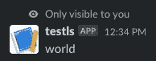

# 将 Kotlin 应用程序部署到铁路(一个 Slack bot)

> 原文：<https://medium.com/codex/deploying-a-kotlin-app-in-railway-a-slack-bot-f1d7a2386652?source=collection_archive---------1----------------------->

## 我们将部署一个“Hello world”Slack bot 到 Railway，来源于 GitHub(用 Kotlin 编写)。


照片由[埃里克·克鲁尔](https://unsplash.com/@ekrull?utm_source=medium&utm_medium=referral)在 [Unsplash](https://unsplash.com?utm_source=medium&utm_medium=referral) 上拍摄

既然 Heroku 不再有免费计划，是时候为我们的实验性 JVM 应用找到一个新家了。[铁路](https://railway.app/)做[的工作](https://nixpacks.com/docs/providers/java)。

# 1.代码库

1.  [**创建一个新的 Kotlin 项目**](https://lsoares.medium.com/kotlin-gradle-junit-starter-project-a113a2cc9cbb) **。**
2.  如果你还没有做`git init`，你应该现在就做。
3.  确保在根目录下有一个`.gitignore`文件，包含:

```
/.gradle
/.idea
/build
```

4.*我们将使用 GitHub 作为 app 代码库的来源；Railway 将访问它，并从那里部署应用程序。创建一个新的 GitHub 库(可以是私有的或者公共的)，命名为`slack-hello-bot`或者类似的名字。*

5.提交并推送至您的新存储库:

```
git remote add origin GITHUB_REPOSITORY_LINK
git push -u origin main
```

# 2.铁路项目

我们需要建立一个铁路项目，为我们之前创建的 Kotlin 应用程序提供服务。

1.  [转到 Railway](https://railway.app/)\\\\\\\\\\\\\\\\\\\\\\\\\\\\\\\\\\\\\\\\\\\\\\\\\\\\\\\\\\\\\\\\\\\\\\\\\\\\\\\\\
2.  在 Kotlin app 的根文件夹下，创建[一个名为](https://nixpacks.com/docs/configuration/procfile) `[Procfile](https://nixpacks.com/docs/configuration/procfile)`的文件，内容如下:
    `web: java -jar build/libs/**PROJ_ID**-1.0-SNAPSHOT-all.jar`
    (要获取`**PROJ_ID**`，勾选`settings.gradle.kts`)。
    *这代表 Railway 运行启动 web app 的命令。*
3.  *铁路需要一个* `*stage*` *目标。* 在`build.gradle.kts`的末尾，添加:

```
task("stage") {
    dependsOn("shadowJar")
}
```

# 3.松弛螺栓应用程序

1.  将以下依赖项添加到`build.gradle.kts`:

```
dependencies {
  implementation("org.slf4j:slf4j-simple:1.+") 
  implementation("com.slack.api:bolt:1.+")
  implementation("com.slack.api:bolt-servlet:1.+")
  implementation("com.slack.api:bolt-jetty:1.+")
}
```

2.添加渐变阴影`build.gradle.kts`。*这将允许创建一个单独的 fat jar，稍后可以在 Railway 中运行。*

```
plugins {
   id("com.github.johnrengelman.shadow") version "7.+"
   application
}
// at the bottom:
application {
    mainClass.set("SlackMainKt")
}
```

📝*您可能需要单击 IDE 中文件右上角的按钮来刷新 Gradle。*

3.在`src/main/kotlin/SlackMain.kt`，放:

```
fun main() {
   val app = App()
   app.command("/hello") { _, _ ->
      Response.ok("world")
   }
   SlackAppServer(app, getenv("PORT")?.toInt() ?: 8080)
       .start()
}
```

📝`*PORT*` *是铁路提供的环境变量。它代表铁路暴露的港口。* [*因此，我们需要从那个端口为我们的应用程序提供服务。*](https://docs.railway.app/deploy/exposing-your-app)

4.提交并**推送**所有本地 Git 更改。*推送将自动触发铁路部署。您可以在* [*铁路仪表盘*](https://railway.app/dashboard) *查看部署状态和日志。*

# 4.松弛应用程序配置

*基于官方文档:* [*用 Bolt 搭建 app for Java*](https://api.slack.com/start/building/bolt-java)*[*Bolt 入门*](https://slack.dev/java-slack-sdk/guides/getting-started-with-bolt) *。**

1.  *进入 [**时差应用**](https://api.slack.com/apps) 点击“创建新应用”。*
2.  *选择“从头开始”,单击“下一步”,命名应用程序，将其分配到工作区。*
3.  *在左侧菜单中，转到“OAuth & Permissions”，滚动到“Scopes”，添加`chat:write`。*
4.  *在菜单上，单击“斜杠命令”υ“创建新命令”。*
5.  *详细填写:
    **命令** : `hello` **请求网址** : `BASE_APP_URL/slack/events` 获取`BASE_APP_URL`，[前往铁路仪表盘](https://railway.app/dashboard)↓挑选 app▏web▏设置▏域。
    **简短描述** : `hello world` 保存修改。*
6.  **我们需要将 Slack UI 中的 Slack 环境变量复制到 Railway:*
    进入“基本信息”υ“App 凭据”υ“签约秘笈”υ点击“显示”υ复制即可。[进入铁路仪表板](https://railway.app/dashboard)│选择已创建的应用程序▏“web”Ⓡ“Variables”Ⓡ“New Variable”名为`SLACK_SIGNING_SECRET`，带有之前复制的值。*
7.  *返回 Slack UI，转到“OAuth & Permissions”，单击“Install to Workspace”按钮，复制“Bot User OAuth Token”处的值。回到铁路创建另一个名为`SLACK_BOT_TOKEN`的环境变量，粘贴复制的值。*
8.  **该测试 app 了！*进入松弛状态在任意频道中键入`/hello`,按回车键。*你应该得到* `*world*` *作为回复*。*

***[](https://github.com/lsoares/slack-bot-kotlin-sample) [## GitHub-iso ares/slack-bot-kot Lin-sample

### 此时您不能执行该操作。您已使用另一个标签页或窗口登录。您已在另一个选项卡中注销，或者…

github.com](https://github.com/lsoares/slack-bot-kotlin-sample)*