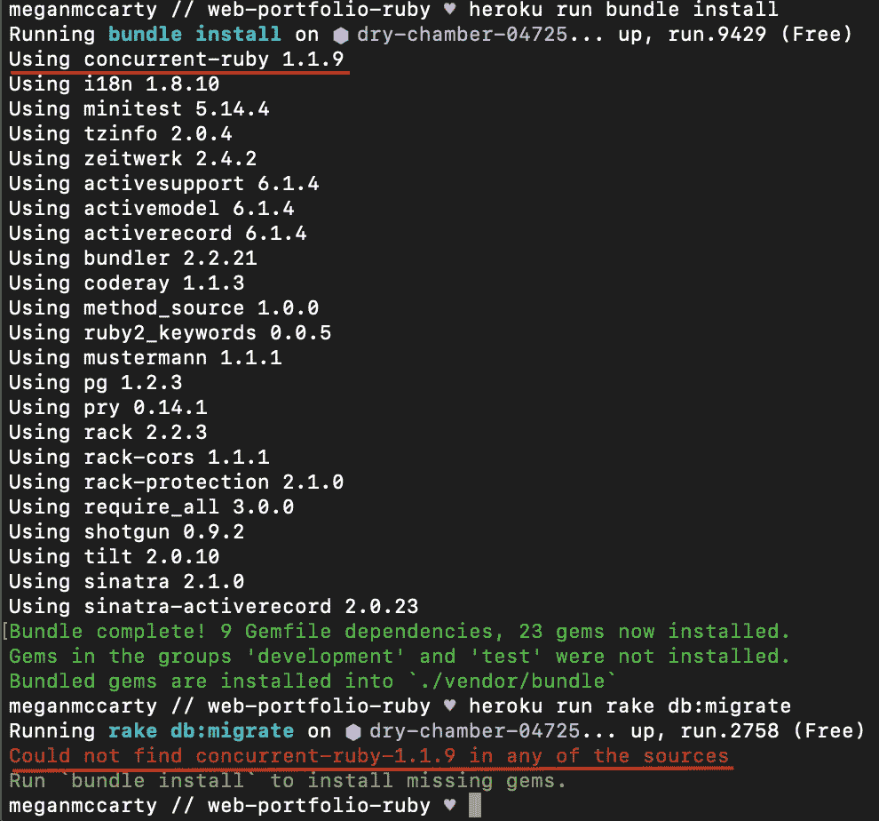

# 将机架应用程序部署到 Heroku

> 原文：<https://medium.com/codex/deploying-a-rack-app-to-heroku-6d160b14904c?source=collection_archive---------12----------------------->


我最近在 Heroku 上部署了我的第一个 Rack 应用。这个过程并不简单，在这个过程中，我遇到了许多问题/错误。因为 Rack 不像 Rails 那样常用，所以我很难找到关于部署 Rack 应用程序的信息。在从开发数据库(SQLite)切换到生产数据库(Heroku 使用的 PostgreSQL)时，我也有些纠结。然而，我确实成功地将我的应用程序部署到了 Heroku，所以我想我应该将我采取的步骤作为一个(有点长的)教程来分享！

# 步骤 1:安装所需的软件

如果你和我或我的开发人员朋友一样，你可能非常渴望开始这个过程，以至于你浏览了教程的开头，却错过了完成最重要的步骤 1。不要像我一样，你以后会省去一些头疼的事情！

打开终端并导航到您的主目录。我们将安装一些东西，我将使用的命令假设你在 Mac 上(使用非 M1 芯片；如果你的设置和我的不同，你必须做一些额外的谷歌搜索来找到正确的命令。

首先，运行`brew install postgresql`。这是我们将要切换到的数据库(假设您像我一样在开发中使用 SQLite)。安装完成后，运行`brew services start postgresql`在您的计算机上开始运行数据库服务器(这对以后非常重要！)

接下来，运行`brew install pgloader`。这将帮助我们将数据从 SQLite 数据库移动到 PostgreSQL 数据库。

最后运行`brew tap heroku/brew && brew install heroku`。稍后我们将使用 Heroku CLI 进行部署。

# 步骤 2:备份您的 SQLite 数据库

继续前进，导航到项目目录的根目录，并在您喜欢的代码编辑器中打开它。找到你的数据库文件(应该是类似于`<your-database-name>.sqlite3`的东西)，复制并粘贴到同一个目录中。您可以将副本重命名为类似于`<your-database-name-backup>.sqlite3`的名称。现在你有一个备份副本，以防发生什么事情！

# 第 3 步:配置你的`database.yml`文件

这是重要的一步，因为我已经看到了许多关于如何正确配置这个文件的变体(并不是所有的都适合我)。我首先注释掉文件中的任何现有代码，这是我使用的代码(大致符合 Heroku 为 Rails 应用程序推荐的代码):

```
# database.yml file# Swap <app-name> for whatever your project's name is (without the '<>')default: &default
 adapter: postgresql
 encoding: unicode
 pool: 5development:
 <<: *default
 database: <app-name>_devtest:
 <<: *default
 database: <app-name>_testproduction:
 <<: *default
 database: <app-name>
```

# 步骤 4:设置 PostgreSQL 数据库

在终端中导航到您的项目的根目录，如果您不在那里，然后运行`rake db:setup`。这将创建我们在`database.yml`文件中概述的数据库。如果您在这里遇到错误，请确保您完成了上面最重要的步骤 1(特别是运行`brew services start postgresql`的部分)。

一旦创建了数据库，运行`pgloader ./db/development.sqlite3 postgresql:///<app-name>_dev`(使用您在`database.yml`文件中命名的开发数据库)。这将把数据从 SQLite 数据库移动到新创建的 PostgreSQL 数据库。

# 步骤 5:配置您的 Gemfile

这是另一个重要的步骤，因为我最初缺少一个 gem，并在尝试部署时以一个恼人的错误结束。不要像我一样，现在就配置您的 Gemfile，然后再尝试部署！



我犯了一个令人讨厌的错误。你可能会认为这是因为我没有在我的 gem 文件中包含 gem 'concurrent-ruby'。事实上，我错过了“耙子”宝石。谢谢，超级有用的错误信息！

在您的终端中，确保您在项目的根目录中。运行`bundle add pg`，完成后运行`bundle add rake`。使用`bundle add`命令不仅可以安装所需的 gem，还可以将它们及其版本号自动添加到您的 gem 文件中。

还有，我们不应该再需要宝石了。继续从 gem 文件中删除它，然后运行`bundle install`。

另一个注意事项:Heroku(以及许多其他在线教程)建议将您的 Ruby 版本添加到 Gemfile 中。对我来说，这不起作用。当我这样做的时候，我结束了更多的错误，所以如果你正在部署一个 Rack 应用程序，我会首先尝试*而不是*添加它。如果遇到麻烦，被要求在 Gemfile 中指定一个 Ruby 版本，您可以随时返回到这一步并添加它。

# 第 6 步:检查本地的一切工作正常

好了，关键时刻到了！在您的终端中，运行`shotgun`命令(或您用来启动 Rack server 的任何命令)，并检查您是否可以在 [http://localhost:9393](http://localhost:9393) (或您正在使用的任何端口)访问您的应用程序。它应该在这一点上工作，使用 PostgreSQL 数据库。如果没有，请尝试再次执行前面的步骤，并在谷歌上搜索您得到的错误。

# 第 7 步:提交您的更改！

一切都在本地工作，这很好，但是我们需要实际地提交这些更改！首先，你可以通过按`Control-C`来杀死机架式服务器。我假设您已经在项目中设置了 git，所以只需运行`git add .`然后运行`git commit -m “<your-message-here>”`。您可以通过运行`git status`来仔细检查所有的事情都被提交了，并且您在您的主分支上。

# 步骤 8:创建一个新的 Heroku 应用程序

在你的终端里，运行`heroku login`。应该会在新的浏览器窗口中提示您登录您的帐户。成功登录后，确保您仍然在项目的根目录中。然后，运行`heroku create`。这将为您创建一个新的应用程序。

创建 Heroku 应用程序后，运行`git config --list | grep heroku`。此命令为您的项目创建新的远程控件。现在，运行`git push heroku main`。当东西被取出并安装到 Heroku 应用程序中时，你会在终端中收到一条很长的消息。如果它成功了，你会在最后看到这样的东西:

```
remote: Verifying deploy... done.
To [https://git.heroku.com/secret-tor-42278.git](https://git.heroku.com/secret-tor-42278.git)
* [new branch] main -> main
```

我们快完成了！你只需要运行命令`heroku run rake db:migrate`，只要你没有得到错误，你应该是好的！

完成后，您可以通过运行`heroku open`来访问您部署的应用程序。

恭喜你！您刚刚将 Rack 应用程序部署到 Heroku！

## 资源

顺便说一句，我非常依赖 [Dan William 的 StackOverflow 答案](https://stackoverflow.com/a/51068611)和 [Heroku 的 Rails 文档](https://devcenter.heroku.com/articles/getting-started-with-rails5)，不仅是为了部署我的应用程序，也是为了编写本教程！