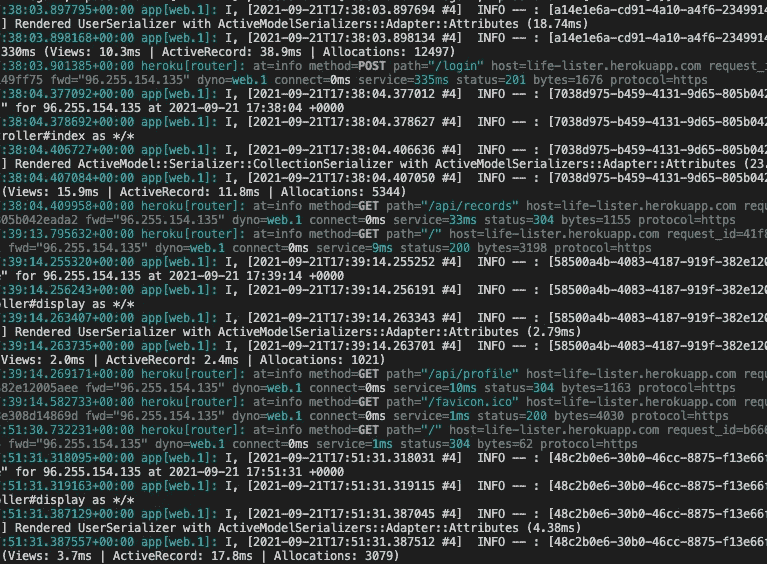

# 使用会话和 CSRF 令牌部署 Rails API/React 应用程序

> 原文：<https://medium.com/codex/deploying-a-rails-api-react-app-with-sessions-and-csrf-tokens-d33d2924639?source=collection_archive---------2----------------------->



我盯着看了无数个小时的东西

在部署 React/Rails API 应用程序的过程中，我获得了多么好的学习体验啊！这个过程比我预想的要困难得多，我花了几十个小时在谷歌上搜索问题。我遇到的主要问题包括如何正确地构建和配置我的项目，以使用 Rails 会话和 CSRF 令牌。

我的问题都是从分开部署后端和前端的天真想法开始的…

# 问题#1:项目结构

因此，我决定将我的 Rails API 部署到 Heroku，将我的 React 前端部署到 Netlify。毕竟，让后端和前端在不同的端口上本地运行就很好，那么部署到不同的主机提供商又有什么不同呢？

嗯，事实证明，这实际上是很不一样的，尤其是当涉及到用户认证的时候！部署后，我发现 Rails 会话完全停止工作，这破坏了我的应用程序。用户可以“登录”，但是如果他们刷新页面，他们会立即被注销。用户无法向我的一个资源发出成功的 POST 请求，因为`session_id`是空的。

这是为什么？在最初的谷歌搜索之后，发现 Rails 将`session_id`存储在一个 cookie 中，并且 cookie 不会跨域传输。这意味着，如果我想使用会话，我的前端和后端需要一起部署，而不是在单独的托管平台上。

我没有重组我的回购协议，而是在我的前端目录中运行`npm run build`，并将生成的`/build`文件夹的内容复制到我后端的`/public`目录中。因为我在我的项目中使用了 React Router，所以我不得不在我的`application_controller.rb`文件和 Rails 的`config/routes.rb`文件中调整一些代码，以呈现 React 生成的`index.html`(感谢 Heroku 的 Charlie Gleason 编写了[一个惊人的教程](https://blog.heroku.com/a-rock-solid-modern-web-stack)，它在这里极大地帮助了我！)

```
# application_controller.rb# NOTE: ActionController needs to inherit from ::Base, NOT ::API, in order to render the index.html file:
# [https://stackoverflow.com/a/59387177/11860889](https://stackoverflow.com/a/59387177/11860889)class ApplicationController < ActionController::Base
  include ActionController::Cookies def fallback_index_html
    render file: 'public/index.html'
  end
end# config/routes.rb...get '*path', to: "application#fallback_index_html", constraints: ->(request) do
  !request.xhr? && request.format.html?
end
```

好的，完美！现在，我已经准备好把这个回购重新部署到 Heroku！

或者是我吗？

# 问题#2:无法验证 CSRF 令牌的真实性

在 Heroku 上将我的项目重新部署为一个 repo 之后，我遇到了一个问题，我无法执行任何类型的非 GET 请求。相反，迎接我的是一个可爱的`422 Unprocessable Entity`错误，详情如下:

```
Can't verify CSRF token authenticity
Completed 422 Unprocessable Entity in 1ms (Active Record: 0.0s)ActionController::InvalidAuthenticityToken (ActionController::InvalidAuthenticityToken)
```

因为我的 ActionController 现在是从::Base 继承的，所以 Rails 期望任何非 GET 请求在头中包含一个 CSRF 令牌。

我找到了一个快速的“修复”方法，通过在我的`application_controller.rb`文件中添加下面一行来禁用 CSRF 保护:

```
skip_before_action :verify_authenticity_token
```

我的应用程序现在可以像在本地一样工作了！但我并不满意，因为我认为让我的应用程序工作而禁用安全性是一种懒惰。所以回到谷歌搜索！

## 一点 CSRF 的背景

CSRF 代表跨站点请求伪造，这是一种通常被称为“一次点击攻击”的安全攻击。例如，假设您在一个没有 CSRF 保护的网站上有一个帐户，例如 www.my-bank.com。你登录后，一个带有你的`session_id`的 cookie 存储在你的浏览器中，当你浏览网站时，它会让你保持登录状态。然后，在没有注销的情况下，你碰巧访问了一个恶意网站，里面有一些隐藏代码；当单击一个链接或当页面简单加载时，可能会触发此代码。嵌入的代码向 www.my-bank.com 发出一个非 GET 请求(比如更改你的电子邮件地址或者把你的钱转出你的账户)，而且，因为包含你在 www.my-bank.com 的`session_id`的 cookie 仍然在你的浏览器中，www.my-bank.com 被骗以为发出了一个有效的请求。你的账户在你不知情的情况下被盗用了！

CSRF 令牌是对此类攻击的一种对策。本质上，令牌是在后端创建的，并发送给浏览器。然后，每当浏览器向后端发送非 GET 请求时，CSRF 令牌就在请求的报头中发送，后端可以在报头中验证其真实性。恶意网站无法访问此令牌，因此当您浏览此类网站时触发的任何非 GET 请求都不会影响您的 www.my-bank.com 帐户。

# 第三个问题:让 CSRF 代币玩好会话

现在的挑战是通过会话启用 CSRF 保护。我尝试了许多启用 CSRF 保护的方法，但是许多解决方案要么使用 Axios 在 React 前端获取数据，要么需要全栈 Rails 应用程序。以下是唯一对我有效的解决方案(感谢托马斯·瓦伦特关于 Rails 中 CSRF 令牌的精彩博文[；它拯救了我的理智！).](https://blog.eq8.eu/article/rails-api-authentication-with-spa-csrf-tokens.html)

我编辑了我的`application_controller.rb`文件，如下所示:

```
# application_controller.rbclass ApplicationController < ActionController::Base
  include ActionController::Cookies
  after_action :set_csrf_cookie def fallback_index_html
    render file: 'public/index.html'
  end private def set_csrf_cookie
    cookies["CSRF-TOKEN"] = {
      value: form_authenticity_token,
      secure: true,
      same_site: :strict
      domain: 'life-lister.herokuapp.com'
    }
  end
end
```

你会注意到我确实创建了 CSRF 令牌并将其存储在 cookie 中，这从理论上意味着恶意站点可以使用它，就像它可以使用`session_id`来危害某人一样。然而，当 Rails 收到请求时，它不会从 cookie 中读取令牌，而是从请求头中读取。

在为我的 CSRF 令牌创建 cookie 时，我还使用了一些设置来增强安全性。如果请求是通过不太安全的 HTTP 协议(而不是 HTTPS)发出的，设置`secure: true`会阻止我的 Rails 后端接受令牌。此外，我设置了`same_site: :strict`，这意味着令牌将只接受来自我的域的令牌(我也在 cookie 中定义了这个域)。我可以设置`httponly: true`，这将阻止恶意网站读取我的 CSRF 令牌，但这样做也将阻止我的前端读取它！(我的前端需要读取令牌以在请求头中发送它)。

现在，在我的前端，我不得不调整一些代码。我创建了一个新文件来处理从 CSRF 令牌读取和获取值的逻辑。

```
# cookies.jsfunction CSRFToken(cookies) {
  const splitCookies = cookies.split('; ');
  return splitCookies.find(cookie => cookie.startsWith("CSRF-TOKEN=")).split('=')[1];
}export default CSRFToken;
```

然后，在任何发出非 GET 请求的 React 组件中，我导入了该函数，并在请求头中使用它:

```
# Component that needs to send a non-GET requestimport CSRFToken from './cookies';...function handleSubmit(e) {
  e.preventDefault();
  fetch("/login", {
    method: "POST",
    headers: {
      "Content-Type": "application/json",
      "X-CSRF-Token": CSRFToken(document.cookie)
    },
    body: ...
  }
  ...
}
```

在这里，我将`document.cookie`作为参数传递给我的`CSRFToken()`函数，该函数获取存储在我的应用程序的域中的所有 cookies。然后，这个函数解析出 CSRF 令牌的值并返回它，它被设置在`“X-CSRF-Token”`头中。

现在，经过另一次重新部署，我的应用程序工作正常，没有禁用 CSRF 保护！:)

## 资源

*   [一个坚如磐石的现代 Web 堆栈——Rails 5 API+active admin+Heroku 上的 Create React App](https://blog.heroku.com/a-rock-solid-modern-web-stack)
*   [使用 SPA CSRF 令牌的 Rails API 认证](https://blog.eq8.eu/article/rails-api-authentication-with-spa-csrf-tokens.html)
*   [Ruby on Rails CSRF 保护用 React.js & Webpacker](/@zayneabraham/ruby-on-rails-csrf-protection-with-react-js-65dd84b8edad)
*   stack overflow:[Heroku 路线上带有 React 应用程序的 Rails 在刷新时不起作用](https://stackoverflow.com/questions/56863391/rails-with-react-app-on-heroku-routes-dont-work-on-refresh)
*   StackOverflow: [Rails:发出 POST 请求时无法验证 CSRF 令牌的真实性](https://stackoverflow.com/questions/35181340/rails-cant-verify-csrf-token-authenticity-when-making-a-post-request)