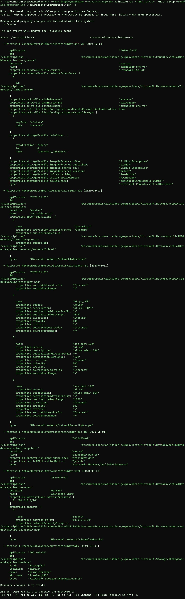
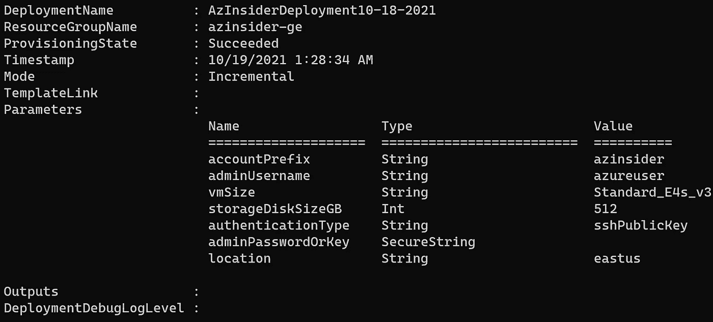
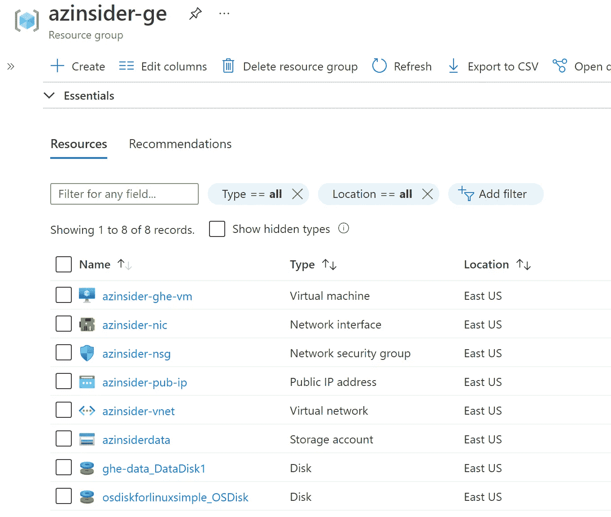

# 💪使用 Bicep 在 Azure 上部署 GitHub 企业服务器

> 原文：<https://medium.com/codex/deploying-github-enterprise-server-on-azure-using-bicep-be765c9aa46?source=collection_archive---------10----------------------->

了解如何使用基础设施即代码在 Azure 上部署 GitHub Enterprise Server。


💪使用 Bicep 在 Azure 上部署 GitHub 企业服务器

在本文中，我们将利用 Bicep，一种用于声明式部署 Azure 资源的新语言，并创作一个 Bicep 模板来部署 GitHub Enterprise Server。

我们将执行以下步骤:

1.  创建 SSH 密钥对
2.  创建我们的二头肌模板
3.  部署二头肌模板

# 1.创建 SSH 密钥对

第一步是创建一个 SSH 密钥对；您可以查看以下关于如何在 Azure 中为 Linux 虚拟机创建 SSH 密钥对的文章—[https://docs . Microsoft . com/en-us/Azure/virtual-machines/Linux/MAC-create-SSH-keys](https://docs.microsoft.com/en-us/azure/virtual-machines/linux/mac-create-ssh-keys)

在本例中，我们将使用 Azure Bash 控制台创建一个 SSH 密钥对。在 Azure 门户中，请求一个新的控制台，如下图所示:


Azure 门户— Bash

然后，我们将使用下面的命令生成一个 SSH 密钥:

```
ssh-keygen \
    -m PEM \
    -t rsa \
    -b 4096 \
    -C "github-enterprise" \
    -f ~/.ssh/ge-priv-key \
    -N yourpasshphrase
```

这将在文件共享中的 SSH 目录下生成密钥:


SSH 密钥

如果您不熟悉 SSH 公钥的格式，可以使用下面的 cat 命令显示您的公钥，替换' *~/。ssh/id_rsa.pub* ，如果需要的话，带有您自己的公钥文件的路径和文件名:

```
cat ~/.ssh/ge-priv-key.pub
```

上面的命令将在控制台中显示 SSH 公钥。我们将在部署期间需要它，所以请将它放在手边。

酷！现在我们有了 SSH 密钥对。

# 2.Azure 二头肌模板-参数

我们将通过定义虚拟机的参数来定义 start。

下面的代码显示了此部署要使用的参数:

```
@description('Unique prefix for your Storage Account and VM name. Must be all lower case letters or numbers. No spaces or special characters.')
param accountPrefix string@description('Username for the VM. This value is ignored.')
param adminUsername string@description('VM Size. Select an ES v3 Series VM with at least 32 GB of RAM. Default value: Standard_E4s_v3')
param vmSize string = 'Standard_E4s_v3'@description('Select a Premium Storage disk capacity for your source code, in GB. Default value: 512.')
param storageDiskSizeGB int = 512@allowed([
  'sshPublicKey'
  'password'
])
@description('Type of authentication to use on the Virtual Machine. SSH key is recommended.')
param authenticationType string = 'sshPublicKey'@description('SSH Key or password for the Virtual Machine. SSH key is recommended.')
@secure()
param adminPasswordOrKey string@description('Location for all resources.')
param location string = resourceGroup().location
```

注意，我们使用了一个*“@ secure()”*装饰器来安全地传递 SSH 密钥。我建议您看看这篇关于如何利用 [*@secure()* 装饰器](/codex/azure-bicep-secure-secrets-in-parameters-secure-decorator-ce6317cc0c23)安全地传递参数中的秘密的文章。

# 3.Azure 二头肌模板-变量

接下来，我们将定义以下变量:

```
var imagePublisher = 'GitHub'
var imageOffer = 'GitHub-Enterprise'
var OSDiskName = 'osdiskforlinuxsimple'
var nicName_var = '${replace(replace(accountPrefix, '.', ''), '_', '-')}-nic'
var addressPrefix = '10.0.0.0/16'
var subnetName = 'Subnet'
var subnetPrefix = '10.0.0.0/24'
var storageAccountType = 'Premium_LRS'
var storageAccountName_var = '${replace(replace(replace(accountPrefix, '.', ''), '_', ''), '-', '')}data'
var publicIPAddressName_var = '${replace(replace(accountPrefix, '.', ''), '_', '-')}-pub-ip'
var publicIPAddressType = 'Dynamic'
var dnsNameForPublicIP = '${accountPrefix}-ghe'
var vmName_var = '${replace(replace(accountPrefix, '.', ''), '_', '-')}-ghe-vm'
var virtualNetworkName_var = '${replace(replace(accountPrefix, '.', ''), '_', '-')}-vnet'
var networkSecurityGroupName_var = '${replace(replace(accountPrefix, '.', ''), '_', '-')}-nsg'
var subnetRef = resourceId('Microsoft.Network/virtualNetworks/subnets', virtualNetworkName_var, subnetName)
var dataDiskName = 'ghe-data'
var linuxConfiguration = {
  disablePasswordAuthentication: true
  ssh: {
    publicKeys: [
      {
        path: '/home/${adminUsername}/.ssh/authorized_keys'
        keyData: adminPasswordOrKey
      }
    ]
  }
}
```

然后我们将定义资源。

# 4.Azure 二头肌模板—资源

我们现在将资源定义如下:

```
resource storageAccountName 'Microsoft.Storage/storageAccounts@2021-01-01' = {
  name: storageAccountName_var
  location: location
  sku: {
    name: storageAccountType
  }
  kind: 'StorageV2'
}resource publicIPAddressName 'Microsoft.Network/publicIPAddresses@2020-05-01' = {
  name: publicIPAddressName_var
  location: location
  properties: {
    publicIPAllocationMethod: publicIPAddressType
    dnsSettings: {
      domainNameLabel: dnsNameForPublicIP
    }
  }
}resource virtualNetworkName 'Microsoft.Network/virtualNetworks@2020-05-01' = {
  name: virtualNetworkName_var
  location: location
  properties: {
    addressSpace: {
      addressPrefixes: [
        addressPrefix
      ]
    }
    subnets: [
      {
        name: subnetName
        properties: {
          addressPrefix: subnetPrefix
          networkSecurityGroup: {
            id: networkSecurityGroupName.id
          }
        }
      }
    ]
  }
}resource nicName 'Microsoft.Network/networkInterfaces@2020-05-01' = {
  name: nicName_var
  location: location
  properties: {
    ipConfigurations: [
      {
        name: 'ipconfig1'
        properties: {
          privateIPAllocationMethod: 'Dynamic'
          publicIPAddress: {
            id: publicIPAddressName.id
          }
          subnet: {
            id: subnetRef
          }
        }
      }
    ]
  }
  dependsOn: [
    virtualNetworkName
  ]
}resource vmName 'Microsoft.Compute/virtualMachines@2019-12-01' = {
  name: vmName_var
  location: location
  properties: {
    hardwareProfile: {
      vmSize: vmSize
    }
    osProfile: {
      computerName: vmName_var
      adminUsername: adminUsername
      adminPassword: adminPasswordOrKey
      linuxConfiguration: ((authenticationType == 'password') ? json('null') : linuxConfiguration)
    }
    storageProfile: {
      imageReference: {
        publisher: imagePublisher
        offer: imageOffer
        sku: imageOffer
        version: 'latest'
      }
      osDisk: {
        name: '${OSDiskName}_OSDisk'
        caching: 'ReadWrite'
        createOption: 'FromImage'
      }
      dataDisks: [
        {
          name: '${dataDiskName}_DataDisk1'
          diskSizeGB: storageDiskSizeGB
          createOption: 'Empty'
          lun: 0
        }
      ]
    }
    networkProfile: {
      networkInterfaces: [
        {
          id: nicName.id
        }
      ]
    }
  }
  dependsOn: [
    storageAccountName
  ]
}resource networkSecurityGroupName 'Microsoft.Network/networkSecurityGroups@2020-05-01' = {
  name: networkSecurityGroupName_var
  location: location
  properties: {
    securityRules: [
      {
        name: 'https_8443'
        properties: {
          description: 'https'
          protocol: '*'
          sourcePortRange: '*'
          destinationPortRange: '8443'
          sourceAddressPrefix: 'Internet'
          destinationAddressPrefix: '*'
          access: 'Allow'
          priority: 100
          direction: 'Inbound'
        }
      }
      {
        name: 'http_8080'
        properties: {
          description: 'http plain text'
          protocol: '*'
          sourcePortRange: '*'
          destinationPortRange: '8080'
          sourceAddressPrefix: 'Internet'
          destinationAddressPrefix: '*'
          access: 'Allow'
          priority: 101
          direction: 'Inbound'
        }
      }
      {
        name: 'ssh_port_122'
        properties: {
          description: 'Allow admin SSH'
          protocol: '*'
          sourcePortRange: '*'
          destinationPortRange: '122'
          sourceAddressPrefix: 'Internet'
          destinationAddressPrefix: '*'
          access: 'Allow'
          priority: 102
          direction: 'Inbound'
        }
      }
      {
        name: 'vpn_1194'
        properties: {
          description: 'Allow VPN'
          protocol: '*'
          sourcePortRange: '*'
          destinationPortRange: '1194'
          sourceAddressPrefix: 'Internet'
          destinationAddressPrefix: '*'
          access: 'Allow'
          priority: 103
          direction: 'Inbound'
        }
      }
      {
        name: 'snmp_161'
        properties: {
          description: 'Allow SNMP'
          protocol: '*'
          sourcePortRange: '*'
          destinationPortRange: '161'
          sourceAddressPrefix: 'Internet'
          destinationAddressPrefix: '*'
          access: 'Allow'
          priority: 104
          direction: 'Inbound'
        }
      }
      {
        name: 'https_443'
        properties: {
          description: 'Allow HTTPS'
          protocol: '*'
          sourcePortRange: '*'
          destinationPortRange: '443'
          sourceAddressPrefix: 'Internet'
          destinationAddressPrefix: '*'
          access: 'Allow'
          priority: 105
          direction: 'Inbound'
        }
      }
      {
        name: 'http_80'
        properties: {
          description: 'Allow HTTP'
          protocol: '*'
          sourcePortRange: '*'
          destinationPortRange: '80'
          sourceAddressPrefix: 'Internet'
          destinationAddressPrefix: '*'
          access: 'Allow'
          priority: 106
          direction: 'Inbound'
        }
      }
      {
        name: 'ssh_22'
        properties: {
          description: 'Allow Git SSH'
          protocol: '*'
          sourcePortRange: '*'
          destinationPortRange: '22'
          sourceAddressPrefix: 'Internet'
          destinationAddressPrefix: '*'
          access: 'Allow'
          priority: 107
          direction: 'Inbound'
        }
      }
      {
        name: 'git_9418'
        properties: {
          description: 'Allow Git'
          protocol: '*'
          sourcePortRange: '*'
          destinationPortRange: '9418'
          sourceAddressPrefix: 'Internet'
          destinationAddressPrefix: '*'
          access: 'Allow'
          priority: 108
          direction: 'Inbound'
        }
      }
      {
        name: 'smtp_25'
        properties: {
          description: 'Allow SMTP'
          protocol: '*'
          sourcePortRange: '*'
          destinationPortRange: '25'
          sourceAddressPrefix: 'Internet'
          destinationAddressPrefix: '*'
          access: 'Allow'
          priority: 109
          direction: 'Inbound'
        }
      }
    ]
  }
}
```

最后，我们将传递一个参数文件。

# 5.参数文件。

参数文件将只包含一些参数，如资源名称、磁盘大小和 SSH 密钥。创建这个新文件，并将其另存为*azure deploy . parameters . JSON*

```
{
    "$schema": "[https://schema.management.azure.com/schemas/2019-04-01/deploymentParameters.json#](https://schema.management.azure.com/schemas/2019-04-01/deploymentParameters.json#)",
    "contentVersion": "1.0.0.0",
    "parameters": {
      "accountPrefix": {
        "value": "azinsider"
      },
      "vmSize": {
        "value": "Standard_E4s_v3"
      },
      "storageDiskSizeGB": {
        "value": 512
      },
      "adminUsername": {
        "value": "azureuser"
      },
      "adminPasswordOrKey": {
        "value": "ssh-rsa AAAAB3NzaC1yc2...== github-enterprise"
      }
    }
  }
```

以下是完整的二头肌模板:

# 6.Azure 二头肌部署

作为最佳实践，我建议您使用标志-C 预览部署。我们将使用下面的命令来启用部署预览:

```
New-AzResourceGroupDeployment -Name $deploymentName -ResourceGroupName azinsider-ge -TemplateFile .\main.bicep -TemplateParameterFile .\azuredeploy.parameters.json -c
```

注意，我们在命令的末尾添加了标志-c；这将启用假设验证。这样，您可以在进行实际部署之前预览部署操作。

下图显示了部署的预览:



Azure Bicep —部署预览— GitHub 企业服务器

一旦所有的配置都正确，我们将继续进行部署。下图显示了部署的输出:



Azure Bicep —部署输出— GitHub 企业服务器

您还可以访问 Azure 门户网站，检查从该部署创建的所有资源，如下所示:



Azure Bicep 部署— GitHub 企业服务器

我希望这篇文章能帮助你踏上 Bicep 之旅，以及如何利用 Bicep 在 Azure 上部署 GitHub Enterprise Server。

👉 [*在此加入****azin sider****邮箱列表。*](http://eepurl.com/gKmLdf)

*-戴夫·r·*