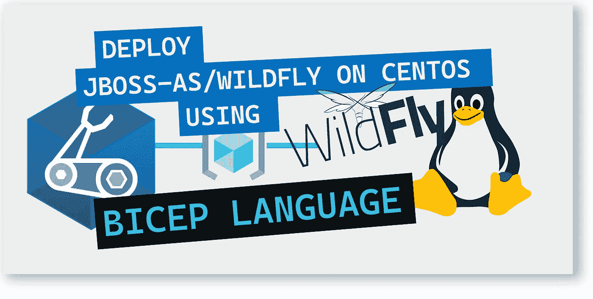
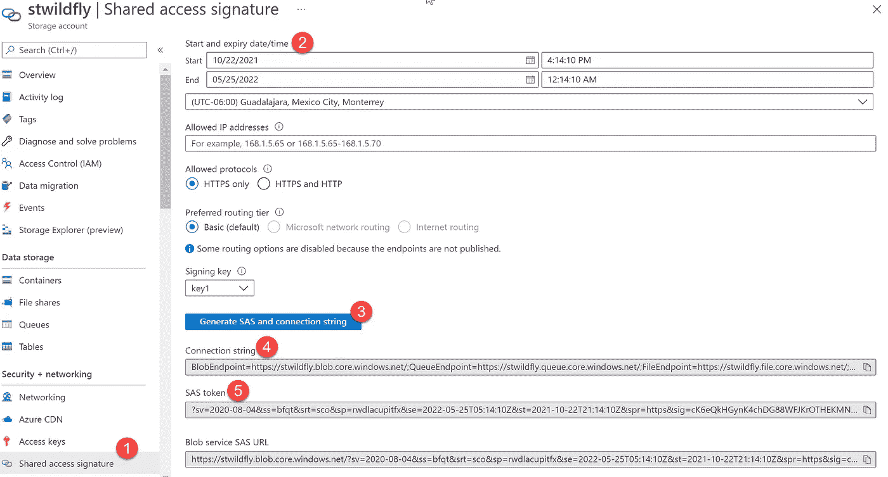
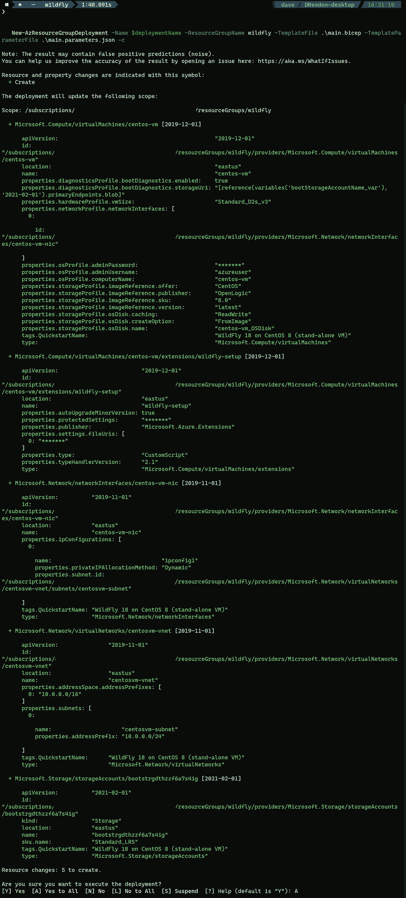
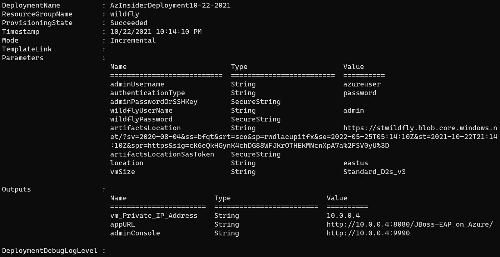
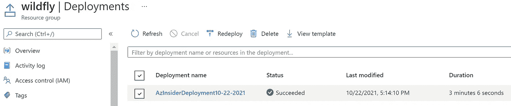
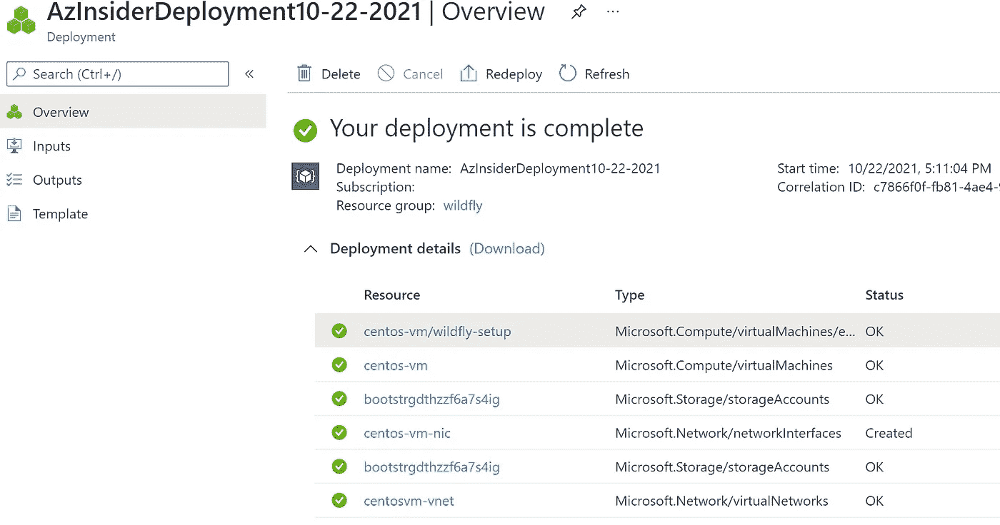

# 💪使用 Bicep 在 CentOS 上部署 JBoss AS/Wildfly

> 原文：<https://medium.com/codex/deploying-jboss-as-wildfly-on-centos-using-bicep-4eef5206318f?source=collection_archive---------4----------------------->

了解如何使用基础设施即代码在 Azure 的 CentOS 上部署 WildFly 节点。



💪使用 Bicep 在 CentOS 上部署 JBoss AS/Wildfly

本文将回顾如何通过 Azure Bicep 利用基础设施即代码在 CentOS 虚拟机上部署 Wildfly。

# 什么是野花？

WildFly，原名 JBoss AS，或简称 JBoss，是由 JBoss 创作的应用服务器。WildFly 是一个开源的、健壮的、模块化的、轻量级的应用服务器，可以帮助您构建令人惊叹的应用程序。

WildFly 提供了一个 Java web 应用程序，它是对 JVM 的扩展，具有完整的运行时环境，可以创建一端的数据库到另一端的 web 客户机的连接。

它是雅加达 EE 8 全平台和网络配置文件兼容。你可以在这里查看官方网站:

 [## 野花

### WildFly 中的配置是集中的、简单的和以用户为中心的。配置文件由子系统组织…

www.wildfly.org](https://www.wildfly.org/) 

# JBoss 和 WildFly 有什么区别？

JBoss AS/WildFly 是可以测试的社区项目的名称**。这个社区项目最终会成为 JBoss EAP。“WildFly”只是“AS”的新名称，它代表应用服务器。**

# 该解决方案将由以下组件组成:

*   CentOS 8 虚拟机
*   虚拟网络
*   野花 18.0.1 .决赛
*   部署在 WildFly 上的名为 JBoss-EAP on Azure 的示例 Java 应用程序
*   存储帐户

## 先决条件:

*   有效的 Azure 订阅
*   Azure 二头肌已安装
*   Azure PowerShell 已安装
*   Azure 订阅中的资源组
*   访问 WildFly 管理控制台的 WildFly 用户名和密码。

## 👨‍💻我们的解决方案将包括以下文件:

*   📄 ***main.bicep*** :这是我们主要的二头肌模板
*   📄***main . parameters . JSON***:该文件包含部署时传递的参数
*   📁 ***脚本*** :该文件夹将包含两个脚本(*wildly-setup . sh*和 *JBoss-EAP_on_Azure.war* )，您应该将它们存储/上传到一个存储帐户中。

您可以从该回购中获取文件:

[](https://github.com/daveRendon/azinsider/tree/main/application-workloads/wildfly) [## 主 daveRendon/azinsider 的 azin sider/应用程序工作负载/wildfly

### 在 GitHub 上创建一个帐户，为 daveRendon/azinsider 开发做出贡献。

github.com](https://github.com/daveRendon/azinsider/tree/main/application-workloads/wildfly) 

在我们开始使用 Bicep 模板之前，创建一个资源组和一个存储帐户是很重要的。我们将在存储帐户中创建一个名为“脚本”的容器，并上传这两个脚本(*wildly-setup . sh*和 *JBoss-EAP_on_Azure.war* )。

然后，确保您提供存储帐户的访问权限。如下图所示设置共享访问签名:



如上图所示，您可以通过转到您的存储帐户，选择共享访问签名选项来配置访问权限。然后指定开始和到期日期/时间。最后，确保只选择 HTTPS，并生成 SAS 和连接字符串。

连接字符串将是 *artifactsLocation* 参数。SAS 令牌将是 *artifactsLocationSASToken 参数。*

不是让我们开始工作在我们的二头肌模板。

# 1.Azure 二头肌模板-参数。

现在让我们来研究参数。我们将定义以下内容:

```
@description('Linux VM user account name')
param adminUsername string@allowed([
  'password'
  'sshPublicKey'
])
@description('Type of authentication to use on the Virtual Machine')
param authenticationType string = 'password'@description('Password or SSH key for the Virtual Machine')
@secure()
param adminPasswordOrSSHKey string@description('User name for WildFly Manager')
param wildflyUserName string@minLength(12)
@description('Password for WildFly Manager')
@secure()
param wildflyPassword string@description('The base URI where artifacts required by this template are located.')
param artifactsLocation string@description('The sasToken required to access _artifactsLocation.')
@secure()
param artifactsLocationSasToken string@description('Location for all resources')
param location string = resourceGroup().location@description('The size of the Virtual Machine')
param vmSize string = 'Standard_D2s_v3'
```

请注意，我们引用了 artifactsLocation 和 SAS 令牌。我们将脚本作为自定义扩展来执行。

现在让我们定义变量。

# 2.Azure 二头肌模板-变量。

我们将定义以下变量:

```
var singlequote = '\''
var imagePublisher = 'OpenLogic'
var imageOffer = 'CentOS'
var imageSKU = '8.0'
var nicName_var = 'centos-vm-nic'
var addressPrefix = '10.0.0.0/16'
var subnetName = 'centosvm-subnet'
var subnetPrefix = '10.0.0.0/24'
var vmName_var = 'centos-vm'
var virtualNetworkName_var = 'centosvm-vnet'
var bootStorageAccountName_var = 'bootstrg${uniqueString(resourceGroup().id)}'
var storageAccountType = 'Standard_LRS'
var linuxConfiguration = {
  disablePasswordAuthentication: true
  ssh: {
    publicKeys: [
      {
        path: '/home/${adminUsername}/.ssh/authorized_keys'
        keyData: adminPasswordOrSSHKey
      }
    ]
  }
}
var subnetRef = resourceId('Microsoft.Network/virtualNetworks/subnets', virtualNetworkName_var, subnetName)
var scriptFolder = 'scripts'
var fileToBeDownloaded = 'JBoss-EAP_on_Azure.war'
var scriptArgs = '-a ${uri(artifactsLocation, '.')} -t "${artifactsLocationSasToken}" -p ${scriptFolder} -f ${fileToBeDownloaded}'
```

注意，我们使用变量“scriptArgs”来引用工件，并包含对“JBoss-EAP_on_Azure.war”文件的引用。

接下来，我们来定义资源。

# 3.Azure 二头肌模板—参考资料。

下面的代码显示了资源定义:

```
resource bootStorageAccountName 'Microsoft.Storage/storageAccounts@2021-02-01' = {
  name: bootStorageAccountName_var
  location: location
  sku: {
    name: storageAccountType
  }
  kind: 'Storage'
  tags: {
    QuickstartName: 'WildFly 18 on CentOS 8 (stand-alone VM)'
  }
}resource virtualNetworkName 'Microsoft.Network/virtualNetworks@2019-11-01' = {
  name: virtualNetworkName_var
  location: location
  tags: {
    QuickstartName: 'WildFly 18 on CentOS 8 (stand-alone VM)'
  }
  properties: {
    addressSpace: {
      addressPrefixes: [
        addressPrefix
      ]
    }
    subnets: [
      {
        name: subnetName
        properties: {
          addressPrefix: subnetPrefix
        }
      }
    ]
  }
}resource nicName 'Microsoft.Network/networkInterfaces@2019-11-01' = {
  name: nicName_var
  location: location
  tags: {
    QuickstartName: 'WildFly 18 on CentOS 8 (stand-alone VM)'
  }
  properties: {
    ipConfigurations: [
      {
        name: 'ipconfig1'
        properties: {
          privateIPAllocationMethod: 'Dynamic'
          subnet: {
            id: subnetRef
          }
        }
      }
    ]
  }
  dependsOn: [
    virtualNetworkName
  ]
}resource vmName 'Microsoft.Compute/virtualMachines@2019-12-01' = {
  name: vmName_var
  location: location
  tags: {
    QuickstartName: 'WildFly 18 on CentOS 8 (stand-alone VM)'
  }
  properties: {
    hardwareProfile: {
      vmSize: vmSize
    }
    osProfile: {
      computerName: vmName_var
      adminUsername: adminUsername
      adminPassword: adminPasswordOrSSHKey
      linuxConfiguration: ((authenticationType == 'password') ? json('null') : linuxConfiguration)
    }
    storageProfile: {
      imageReference: {
        publisher: imagePublisher
        offer: imageOffer
        sku: imageSKU
        version: 'latest'
      }
      osDisk: {
        name: '${vmName_var}_OSDisk'
        caching: 'ReadWrite'
        createOption: 'FromImage'
      }
    }
    networkProfile: {
      networkInterfaces: [
        {
          id: nicName.id
        }
      ]
    }
    diagnosticsProfile: {
      bootDiagnostics: {
        enabled: true
        storageUri: reference(bootStorageAccountName_var, '2021-02-01').primaryEndpoints.blob
      }
    }
  }
  dependsOn: [
    bootStorageAccountName
  ]
}resource vmName_wildfly_setup 'Microsoft.Compute/virtualMachines/extensions@2019-12-01' = {
  parent: vmName
  name: 'wildfly-setup'
  location: location
  properties: {
    publisher: 'Microsoft.Azure.Extensions'
    type: 'CustomScript'
    typeHandlerVersion: '2.1'
    autoUpgradeMinorVersion: true
    settings: {
      fileUris: [
        uri(artifactsLocation, 'scripts/wildfly-setup.sh${artifactsLocationSasToken}')
      ]
    }
    protectedSettings: {
      commandToExecute: 'sh wildfly-setup.sh ${scriptArgs} ${wildflyUserName} ${singlequote}${wildflyPassword}${singlequote}'
      }
  }
}output vm_Private_IP_Address string = nicName.properties.ipConfigurations[0].properties.privateIPAddress
output appURL string = '[http://${nicName.properties.ipConfigurations[0].properties.privateIPAddress}:8080/JBoss-EAP_on_Azure/'](http://${nicName.properties.ipConfigurations[0].properties.privateIPAddress}:8080/JBoss-EAP_on_Azure/')
output adminConsole string = '[http://${nicName.properties.ipConfigurations[0].properties.privateIPAddress}:9990'](http://${nicName.properties.ipConfigurations[0].properties.privateIPAddress}:9990')
```

注意我们用的是微软的“*”。compute/virtual machines/extensions*资源类型，并引用带有要执行的命令的脚本。

最后，我们将包括一些输出，如下所示:

```
output vm_Private_IP_Address string = nicName.properties.ipConfigurations[0].properties.privateIPAddress
output appURL string = '[http://${nicName.properties.ipConfigurations[0].properties.privateIPAddress}:8080/JBoss-EAP_on_Azure/'](http://${nicName.properties.ipConfigurations[0].properties.privateIPAddress}:8080/JBoss-EAP_on_Azure/')
output adminConsole string = '[http://${nicName.properties.ipConfigurations[0].properties.privateIPAddress}:9990'](http://${nicName.properties.ipConfigurations[0].properties.privateIPAddress}:9990')
```

以下是完整的二头肌模板:

您可以在此找到完整的解决方案:

[](https://github.com/daveRendon/azinsider/tree/main/application-workloads/wildfly) [## 主 daveRendon/azinsider 的 azin sider/应用程序工作负载/wildfly

### 在 GitHub 上创建一个帐户，为 daveRendon/azinsider 开发做出贡献。

github.com](https://github.com/daveRendon/azinsider/tree/main/application-workloads/wildfly) 

# 使用 Bicep 在 CentOS 上部署 JBoss AS/Wildfly

我们将使用下面的命令来部署我们的二头肌模板:

```
$date = Get-Date -Format "MM-dd-yyyy"
$deploymentName = "AzInsiderDeployment"+"$date"New-AzResourceGroupDeployment -Name $deploymentName -ResourceGroupName wildfly -TemplateFile .\main.bicep -TemplateParameterFile .\main.parameters.json -c
```

在上面的命令中，我们使用标志-c 来预览部署。

下图显示了部署的预览。



使用 Bicep 部署 JBoss / Wildfly

现在，我们将继续执行部署。下图显示了部署的输出。



部署输出

我们还可以去 Azure 门户网站验证部署:



JBoss / Wildfly 部署

您可以选择部署名称并查看此部署的详细信息:



JBoss / Wildfly 部署细节

👉 [*在此加入****azin sider****邮箱列表。*](http://eepurl.com/gKmLdf)

*-戴夫·r*