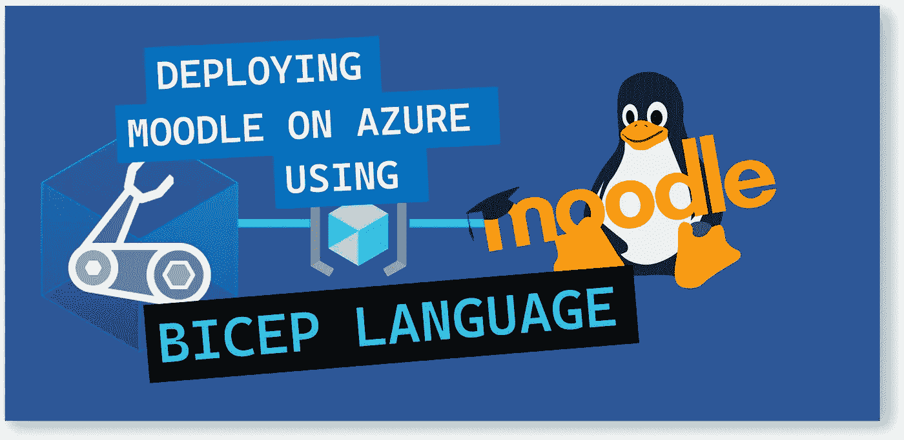

# 💪使用 Bicep 语言在 Azure 上部署 Moodle

> 原文：<https://medium.com/codex/deploying-moodle-on-azure-using-bicep-language-48da6111d0d1?source=collection_archive---------2----------------------->

简化 Moodle 在 Azure 上的部署和供应



💪使用 Bicep 语言在 Azure 上部署 Moodle

在本文中，我们将回顾如何使用基础设施即代码在 Azure 中部署 Moodle。我们将利用 Bicep，新的领域特定语言(DSL)，以声明方式部署 Azure 资源。

```
 .-..-.
   _____                         | || |
  /____/-.---_  .---.  .---.  .-.| || | .---.
  | |  _   _  |/  _  \/  _  \/  _  || |/  __ \
  * | | | | | || |_| || |_| || |_| || || |___/
    |_| |_| |_|\_____/\_____/\_____||_|\_____)

**Moodle - the world's open source learning platform** 
Moodle <[https://moodle.org](https://moodle.org/)> is a learning platform designed to provide educators, administrators and learners with a single robust, secure and integrated system to create personalised learning environments.
```

# 解决方案概述

这个模板在 Debian VM 上创建一个独立的 Moodle 节点。您可以选择虚拟机的大小。

该解决方案还包括一个私有 IP、一个公共 IP 地址、一个虚拟网络、一个 NSG 和一个存储帐户。它非常适合在 Azure 上开发和测试 Moodle。


Azure 上的 Moodle

# 部署的资源

*   Debian 10.10.VM
*   IP 地址(公有和私有)
*   虚拟网络
*   网络安全配置
*   它可以帮助教育工作者创建高效地在线学习社团。

要了解更多关于 Moodle 的信息，请查看:[https://github.com/moodle/moodle](https://github.com/moodle/moodle)

# 💰订阅和费用

这个 Bicep 模板使用 Azure Debian 10image，这是一个现收现付(PAYG)的虚拟机映像，不需要用户许可。

首次启动实例后，虚拟机将自动获得许可，除了微软的 Linux 虚拟机费率之外，还将按小时向用户收费。 [Linux 虚拟机](https://azure.microsoft.com/pricing/details/virtual-machines/linux/#linux)提供定价详情。

Moodle 作为 GNU 通用公共许可证【https://docs.moodle.org/dev/License><[下的开源软件免费提供。](https://docs.moodle.org/dev/License)

# 在部署到 Azure 之前

确保您具备以下条件:

*   有效的 Azure 订阅
*   Azure 二头肌已安装
*   Azure PowerShell
*   Azure 订阅中的资源组
*   注意:在部署此解决方案之前，您必须接受虚拟机映像的法律条款。要阅读并接受法律条款，您可以使用 PowerShell 通过下面的 cmdlet 接受条款和条件:

```
Get-AzMarketplaceTerms `
-Publisher 'bitnami' `
-Product 'moodle' `
-Name '3-0' |
Set-AzMarketplaceTerms -Accept
```

以上命令适用于 Bitnami 的 Moodle。

您应该会看到以下输出:


阅读并接受法律条款

现在让我们使用 Bicep 模板在 Azure 上部署 Moodle。

# 1.Azure 二头肌模板-参数

我们将定义以下参数:

```
param location string = resourceGroup().location
param networkInterfaceName string
param networkSecurityGroupName string
param networkSecurityGroupRules array
param subnetName string
param virtualNetworkName string
param addressPrefixes array
param subnets array
param publicIpAddressName string
param publicIpAddressType string
param publicIpAddressSku string
param virtualMachineName string
param virtualMachineComputerName string
param osDiskType string
param virtualMachineSize string
param adminUsername string[@secure](http://twitter.com/secure)()
param adminPassword string
```

# 2.Azure 二头肌模板-变量

我们将定义以下变量:

```
var nsgId = resourceId(resourceGroup().name, 'Microsoft.Network/networkSecurityGroups', networkSecurityGroupName)
var vnetId = resourceId(resourceGroup().name, 'Microsoft.Network/virtualNetworks', virtualNetworkName)
var subnetRef = '${vnetId}/subnets/${subnetName}'
```

# 3.Azure 二头肌模板—资源

我们将定义以下资源:

```
resource networkInterfaceName_resource 'Microsoft.Network/networkInterfaces@2021-03-01' = {
  name: networkInterfaceName
  location: location
  properties: {
    ipConfigurations: [
      {
        name: 'ipconfig1'
        properties: {
          subnet: {
            id: subnetRef
          }
          privateIPAllocationMethod: 'Dynamic'
          publicIPAddress: {
            id: pip.id
          }
        }
      }
    ]
    networkSecurityGroup: {
      id: nsgId
    }
  }
  dependsOn: [
    networkSecurityGroupName_resource
    virtualNetworkName_resource
    pip
  ]
}resource networkSecurityGroupName_resource 'Microsoft.Network/networkSecurityGroups@2019-02-01' = {
  name: networkSecurityGroupName
  location: location
  properties: {
    securityRules: networkSecurityGroupRules
  }
}resource virtualNetworkName_resource 'Microsoft.Network/virtualNetworks@2020-11-01' = {
  name: virtualNetworkName
  location: location
  properties: {
    addressSpace: {
      addressPrefixes: addressPrefixes
    }
    subnets: subnets
  }
}resource pip 'Microsoft.Network/publicIpAddresses@2019-02-01' = {
  name: publicIpAddressName
  location: location
  properties: {
    publicIPAllocationMethod: publicIpAddressType
  }
  sku: {
    name: publicIpAddressSku
  }
}resource vm 'Microsoft.Compute/virtualMachines@2021-03-01' = {
  name: virtualMachineName
  location: location
  properties: {
    hardwareProfile: {
      vmSize: virtualMachineSize
    }
    storageProfile: {
      osDisk: {
        createOption: 'FromImage'
        managedDisk: {
          storageAccountType: osDiskType
        }
      }
      imageReference: {
        publisher: 'bitnami'
        offer: 'moodle'
        sku: '3-0'
        version: 'latest'
      }
    }
    networkProfile: {
      networkInterfaces: [
        {
          id: networkInterfaceName_resource.id
        }
      ]
    }
    osProfile: {
      computerName: virtualMachineComputerName
      adminUsername: adminUsername
      adminPassword: adminPassword
      linuxConfiguration: {
        patchSettings: {
          patchMode: 'ImageDefault'
        }
      }
    }
    diagnosticsProfile: {
      bootDiagnostics: {
        enabled: true
      }
    }
  }
  plan: {
    name: '3-0'
    publisher: 'bitnami'
    product: 'moodle'
  }
}
```

# 4.Azure 二头肌模板-输出

我们将定义以下输出:

```
output adminUsername string = adminUsername
```

# 5.Azure Bicep 模板-部署

我们将使用下面的命令来部署我们的二头肌模板:

```
$date = Get-Date -Format "MM-dd-yyyy"
$deploymentName = "AzInsiderDeployment"+"$date"New-AzResourceGroupDeployment -Name $deploymentName -ResourceGroupName moodle -TemplateFile .\main.bicep -TemplateParameterFile .\azuredeploy.parameters.json -c
```

下图显示了部署的预览:


部署预览

然后我们将执行部署。下图显示了部署输出:


部署输出

一旦部署成功，转到部署的输出部分，获取 Debian 虚拟机的 IP 地址。


虚拟机 IP 地址

您可以使用如下所示的 IP 地址在浏览器中访问 Moodle 应用程序:


Azure 上的 Moodle

您可以在以下 GitHub 资源库中找到完整的解决方案:

[](https://github.com/daveRendon/azinsider/tree/main/application-workloads/moodle) [## 主 daveRendon/azinsider 上的 azin sider/应用程序工作负载/moodle

### 在 GitHub 上创建一个帐户，为 daveRendon/azinsider 开发做出贡献。

github.com](https://github.com/daveRendon/azinsider/tree/main/application-workloads/moodle) 

👉 [*在此加入****azin sider****邮箱列表。*](http://eepurl.com/gKmLdf)

*-戴夫·r·*