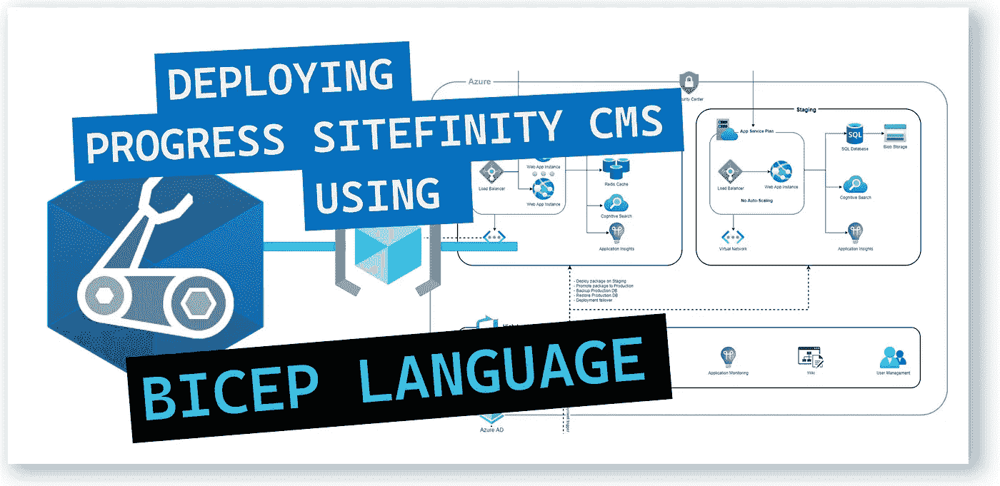
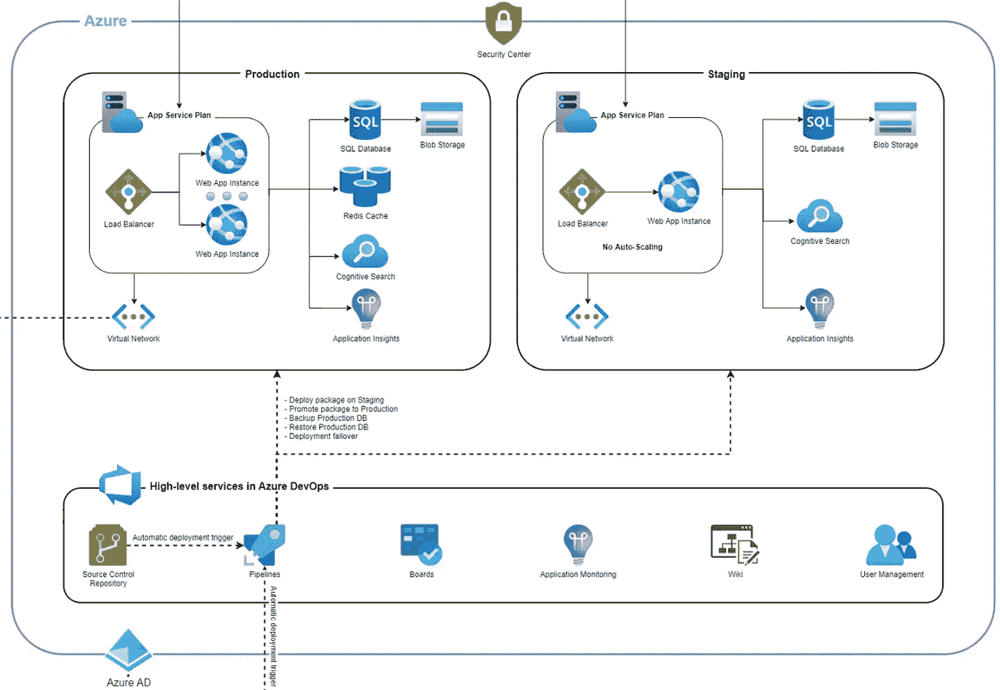
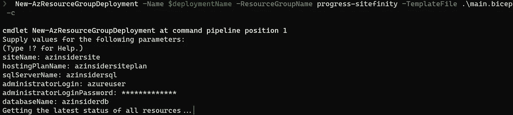
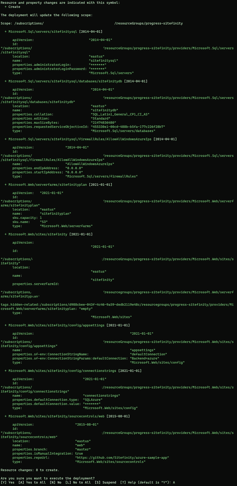
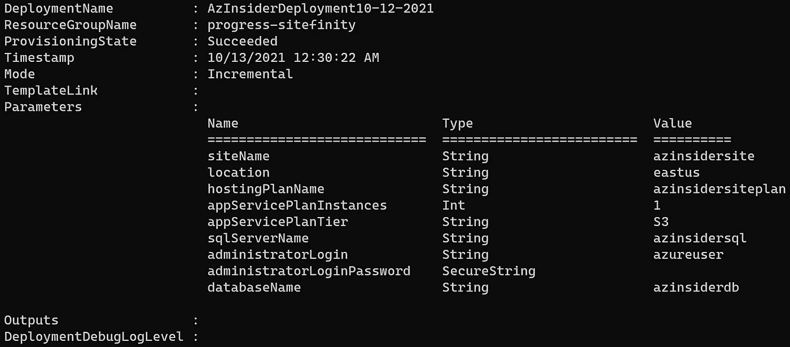
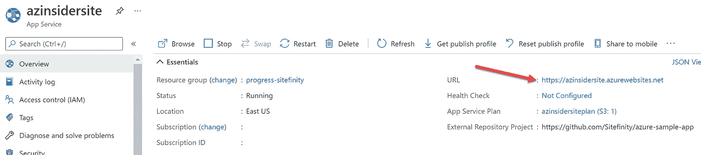
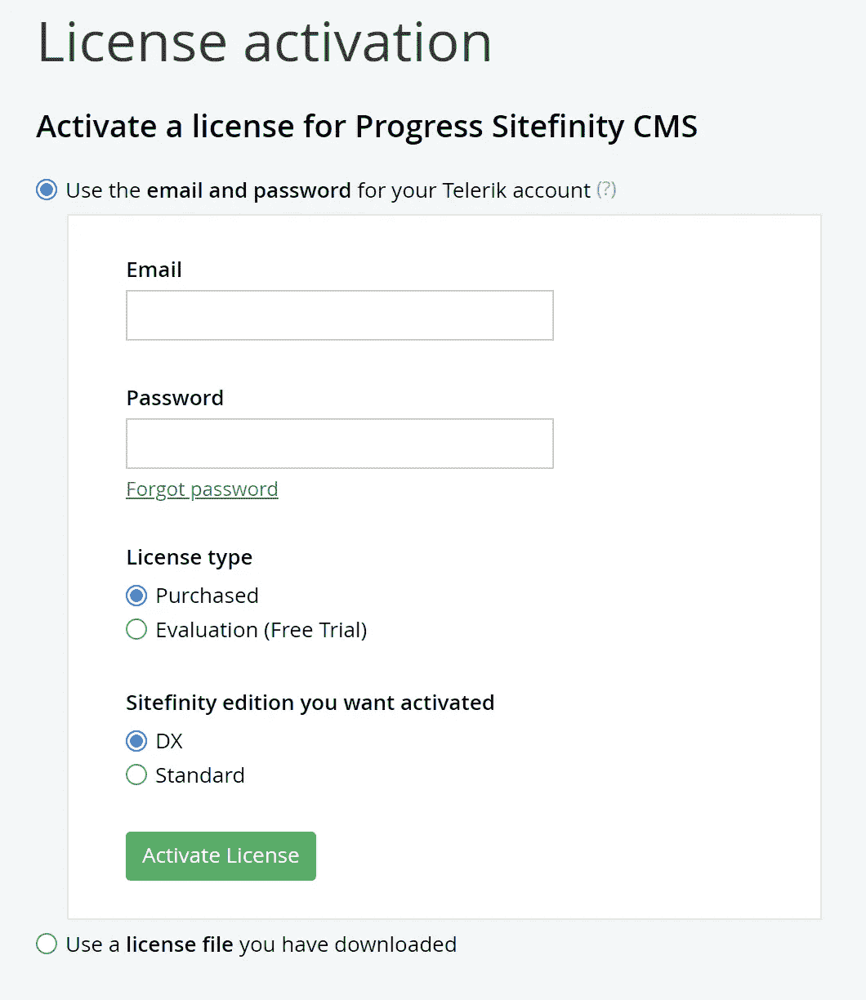

# 💪使用 Bicep 在 Azure 中部署 Progress Sitefinity CMS

> 原文：<https://medium.com/codex/deploying-progress-sitefinity-cms-in-azure-using-bicep-90380de8a106?source=collection_archive---------8----------------------->

通过 Azure Bicep 使用基础设施即代码快速部署灵活的 CMS 平台。



使用 Bicep 在 Azure 中部署 Progress Sitefinity CMS

*Progress Sitefinity* 是一款 PaaS 模式的现代 CMS，可为商业专业人士提供直观的 web 内容管理、强大的 CMS 开发环境和丰富的最终用户体验。

本文将回顾我们如何使用 Bicep 在 Azure 中部署这个平台，Bicep 是一种新的领域特定语言(DSL)，它使用声明性语法来部署 Azure 资源。

## 先决条件:

*   有效的 Azure 订阅
*   具有所有者/贡献者角色的用户
*   Azure 订阅中的资源组
*   Bicep 安装在您的本地机器上
*   Azure PowerShell 安装在您的本地计算机上

那么我们可以用 Progress Sitefinity 做什么呢？Progress Sitefinity 是一个 CMS，您可以在 Azure 中部署它，创建个性化网站、客户和合作伙伴门户、电子商务商店，并实现跨渠道活动管理。

# 进展网站定义架构参考。

下图显示了 Azure 中 Progress Sitefinity 的高级概述:



Progress Sitefinity — Azure 参考架构

本文旨在向您展示如何使用 Bicep 在 Azure 中部署该解决方案的基本组件。所以我们来研究肱二头肌的档案。

# 用于部署进度 Sitefinity 的 Azure Bicep 文件。

我们将在 Bicep 文件中定义以下参数

*   *网站名称*:这是网站的名称
*   *位置*:所有资源的位置
*   *hostingPlanName* :这是 App 服务计划
*   *appServicePlanInstances* :这是应用服务计划实例数
*   *appServicePlanTier* :这是应用服务计划的定价层
*   *SQL server name*:SQL Azure DB 服务器名称
*   *administrator log in*:SQL Server 实例的用户管理员
*   *管理员登录密码*:密码
*   *数据库名*:SQL 数据库名

下面的代码显示了 Bicep 文件中参数的定义:

```
[@description](http://twitter.com/description)('Name of Azure Website')
param siteName string@description('Location for all resources.')
param location string = resourceGroup().location@description('Name of Azure App Service Plan')
param hostingPlanName string@minValue(1)
@maxValue(3)
@description('App Service Plan\'s instance count')
param appServicePlanInstances int = 1@description('App Service Plan\'s pricing tier.')
param appServicePlanTier string = 'S3'@description('SQL Azure DB Server name')
param sqlServerName string@description('SQL Azure DB administrator username')
param administratorLogin string@description('SQL Azure DB administrator password')
@secure()
param administratorLoginPassword string@description('Database name')
param databaseName string
```

现在，我们将定义数据库资源，包括 SQL 服务器、SQL 数据库和防火墙规则:

```
resource sqlServerName_resource 'Microsoft.Sql/servers@2014-04-01' = {
  name: sqlServerName
  location: location
  properties: {
    administratorLogin: administratorLogin
    administratorLoginPassword: administratorLoginPassword
  }
}resource sqlServerName_databaseName 'Microsoft.Sql/servers/databases@2014-04-01' = {
  parent: sqlServerName_resource
  name: databaseName
  location: location
  properties: {
    edition: 'Standard'
    collation: 'SQL_Latin1_General_CP1_CI_AS'
    maxSizeBytes: '21474836480'
    requestedServiceObjectiveId: '455330e1-00cd-488b-b5fa-177c226f28b7'
  }
}resource sqlServerName_AllowAllWindowsAzureIps 'Microsoft.Sql/servers/firewallrules@2014-04-01' = {
  parent: sqlServerName_resource
  name: 'AllowAllWindowsAzureIps'

  properties: {
    endIpAddress: '0.0.0.0'
    startIpAddress: '0.0.0.0'
  }
}
```

下一步是定义 web 组件，包括服务器群和网站:

```
resource hostingPlanName_resource 'Microsoft.Web/serverfarms@2021-01-01' = {
  name: hostingPlanName
  location: location
  sku: {
    name: appServicePlanTier
    capacity: appServicePlanInstances
  }
}resource siteName_resource 'Microsoft.Web/sites@2021-01-01' = {
  name: siteName
  location: resourceGroup().location
  tags: {
    'hidden-related:/subscriptions/${subscription().subscriptionId}/resourcegroups/${resourceGroup().name}/providers/Microsoft.Web/serverfarms/${hostingPlanName}': 'empty'
  }
  properties: {

    serverFarmId: '/subscriptions/${subscription().subscriptionId}/resourcegroups/${resourceGroup().name}/providers/Microsoft.Web/serverfarms/${hostingPlanName}'
  }
  dependsOn: [
    hostingPlanName_resource
  ]
}
```

最后，我们将定义站点的源代码控制和配置:

```
resource siteName_web 'Microsoft.Web/Sites/sourcecontrols@2015-08-01' = {
  parent: siteName_resource
  location: location
  name: 'web'
  properties: {
    repoUrl: '[https://github.com/Sitefinity/azure-sample-app'](https://github.com/Sitefinity/azure-sample-app')
    branch: 'master'
    isManualIntegration: true
  }
}resource siteName_connectionstrings 'Microsoft.Web/sites/config@2021-01-01' = {
  parent: siteName_resource
  name: 'connectionstrings'
  properties: {
    defaultConnection: {

      value: 'Data Source=tcp:${sqlServerName_resource.properties.fullyQualifiedDomainName},1433;Initial Catalog=${databaseName};User Id=${administratorLogin}@${sqlServerName};Password=${administratorLoginPassword};'
      type: 'SQLAzure'
    }
  }
  dependsOn: [
    siteName_web
    sqlServerName_databaseName
  ]
}resource siteName_appsettings 'Microsoft.Web/sites/config@2021-01-01' = {
  parent: siteName_resource
  name: 'appsettings'

  properties: {
    'sf-env:ConnectionStringParams:defaultConnection': 'Backend=azure'
    'sf-env:ConnectionStringName': 'defaultConnection'
  }
}
```

以下是在 Azure 中部署 Progress Sitefinity CMS 的完整 Bicep 文件:

# 在 Azure 中部署 Sitefinity CMS

我们将使用下面的代码来部署上面的 Bicep 模板:

```
$date = Get-Date -Format "MM-dd-yyyy"
$deploymentName = "AzInsiderDeployment"+"$date"New-AzResourceGroupDeployment -Name $deploymentName -ResourceGroupName progress-sitefinity -TemplateFile .\main.bicep -c
```

注您可以选择创建一个参数文件，并在部署时传递它们。在这种情况下，我们将在部署时手动传递参数，如下所示:



进度站点限定—部署预览

然后，我们将预览部署，如下所示:



进度站点限定—部署预览

一旦验证完成，我们就可以执行部署了。部署需要几分钟才能完成。

下图显示了部署的输出:



进度站点有限性—部署输出

我们现在可以进入 Azure 门户网站并获取网站的 URL。



进度网站有限性—网站 URL

导航到应用服务的 URL 后，您应该会看到下面的屏幕:

*   注意:第一次加载可能需要几秒钟。



进度站点定义屏幕

然后就可以申请执照，开始在平台上工作了。

您可以在这里找到带有示例的 GitHub 库来定制您的解决方案:[https://github.com/Sitefinity/azure-sample-app](https://github.com/Sitefinity/azure-sample-app)

[*在此加入****azin sider****邮箱列表。*](http://eepurl.com/gKmLdf)

*-戴夫·r*