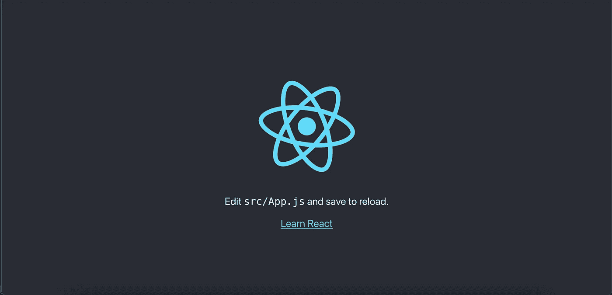

# 通过 Django 的静态文件部署 React:第 1 部分—开发设置

> 原文：<https://medium.com/codex/deploying-react-through-djangos-static-files-part-1-dev-setup-8a3a7b93c809?source=collection_archive---------0----------------------->


我最近想为我的个人网站部署一个 Django 后端 React。我还想以每月 7 美元的价格在 Heroku Hobby Dyno 上运营网站。因此，在这个系列中，我将介绍让 Django 进行反应，然后部署到 Heroku 的过程。

我将在本文中讨论的是如何在开发中使用 Django serving React。

你可以在这里找到代码[。](https://github.com/kieronjmckenna/react-in-django-static-files.git)

# 设置 React 和 Django

我假设您已经设置了 Python、pip 和 Node。我还将使用 pipenv 来管理我的包；如果你不熟悉的话，看看这里的[文档](https://pypi.org/project/pipenv/)。

我在 macOS 上工作，所以确保你调整任何命令到你的 OS 上。

另外，全局安装 Django，这样就可以使用 Django-admin。

在项目的根目录下运行这个程序

```
django-admin startproject backend && npx create-react-app frontend
```

这将建立 Django 和 React 项目。

# **配置 Django 和静态文件**

安装依赖项并启动您的环境。我还将在生产中用白噪声处理静态文件。

```
cd backend && pipenv install django whitenoise && pipenv shell
```

以下是您需要对 Django 设置文件进行的所有更改。

在我们处理 React 的生产版本之前，有些变化可能没有意义，但我们很快就会实现。

# 建立 React 和生产模型

```
cd .. && cd frontend
```

转到/frontend/package.json，我们将创建一个新脚本。

```
{..."scripts": {..."relocate": "react-scripts build && rm -rf ../backend/build && mv -f build ../backend",...},
...}
```

如果您不熟悉将 react 投入生产，当我们运行“react-scripts build”时，React 会压缩项目并在名为 build 的文件夹中输出生产就绪版本。因此，我们对这个新脚本所做的是让 React 创建生产版本。一旦完成，我们想把它转移到 Django 项目中。所以我们用 rm 删除旧的生产文件夹(-rf 这里的意思是；r:删除文件夹中的所有内容，f:不要提示，如果当前没有生产版本，这对我们很有用。否则，该命令将停止)。从那里，我们将文件夹转移到 Django 项目。

如果您回头看看 Django 的设置文件，您会注意到我们告诉 Django 在基本目录的“build”文件夹中查找模板和静态文件(查看变量 TEMPLATES)。React 使用构建文件夹中的文件 index.html 将自己插入 DOM。

当 React 创建其生产构建时，它将所有需要运行的 CSS、JS 和其他静态文件保存在 build/static 文件夹中。你还会注意到，在我们的 Django 设置文件中，我们告诉 Django 在 build/static(变量:STATICFILES_DIRS)中查找静态文件。

不要忘记运行脚本

```
yarn relocate
```

或者

```
npm run relocate
```

# Django 路由

现在 Django 可以访问 React index.html 文件和静态文件；我们需要添加网址。

通常你会把 render_react 函数放在一些 views.py 文件中，但是为了简单起见，我把它放在 urls.py 中，因为我还没有给这个项目添加一个应用程序。

因此，我们正在创建一个函数来渲染出反应 index.html 文件。记住，我们在/back end/back end/settings dir/base . py 中将构建文件夹添加到模板中，这样 Django 就知道 index.html 在哪里了。

你会注意到 re_paths 服务 React 他们充当一个包罗万象。换句话说，与/admin 不匹配的任何其他请求都将被定向作出反应。如果您希望使用 React Router(或另一个包)来创建单页面应用程序，这将非常有用。

如果我们现在跑

```
python manage.py runserver
```

我们应该看看



在港口 8000。

太好了！现在我们需要检查我们是否可以对静态文件使用 Whitenoise 来运行它。需要记住的一个关键点是，Django 的开发服务器(manage.py runserver)会为您处理静态文件。为了在生产中提供文件，还需要更多的配置。

将此文件添加到/back end/back end/settings dir/base . py

```
STATIC_ROOT = os.path.join(BASE_DIR, "staticfiles")
```

并在 Django 项目的根目录(/backend)中创建文件夹静态文件。

```
mkdir staticfiles
```

设置 STATIC_ROOT 用于告诉 Django(和 Whitenoise)在哪里存储所有静态文件。当您在生产环境中使用类似 Gunicorn 的东西运行 Django 时，您想要使用的任何静态文件都需要位于 STATIC_ROOT 指定的文件夹中。

要将文件添加到由 STATIC_ROOT 指定的目录中，请将文件位置添加到 STATICFILES_DIRS，并使用 manage.py collectstatic 命令。如果这没有意义，请查看静态文件[中的 Django 文档。](https://docs.djangoproject.com/en/3.1/ref/settings/#id17)

接下来，我们需要运行

```
python manage.py collectstatic
```

这将从 STATICFILES_DIRS 中指定的位置收集所有文件。

如果我们接着跑

```
python manage.py runserver --nostatic
```

我们应该在 localhost:8000 上看到相同的 React 默认屏幕，只是这一次，Whitenoise 提供文件服务。

这就是我在这篇文章中要说的；这涵盖了通过 Django 的静态文件运行 React 的基本思想。

一个小提示，如果你试图通过在同一个域下服务 React 来使用 Django 的会话认证，不要使用这种方法进行开发！每次你做一个改变，你都会把你的头撞在创建产品的墙上。查看这篇关于在开发中使用反向代理来获得 Django 并在同一个域下做出反应的文章。

[](/swlh/django-rest-framework-and-spa-session-authentication-with-docker-and-nginx-aa64871f29cd) [## Django Rest 框架和 SPA-会话认证(使用 Docker 和 Nginx)

### 在本文中，我假设您熟悉 Django、Django Rest 框架、React 以及一点点 Docker 和…

medium.com](/swlh/django-rest-framework-and-spa-session-authentication-with-docker-and-nginx-aa64871f29cd) 

在下一篇文章中，我将介绍如何使用 Heroku 将它制作成产品。

我目前正致力于这个系列的下一部分；当我完成的时候我会把它链接到这里。