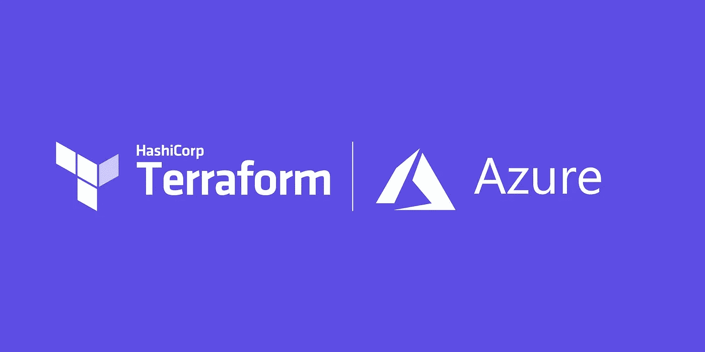

# 使用 Terraform 部署到多个 Azure 订阅

> 原文：<https://medium.com/codex/deploying-to-multiple-azure-subscriptions-using-terraform-81249a58a600?source=collection_archive---------3----------------------->

当使用 Terraform 部署到 Azure 时，您可能需要跨多个订阅部署资源或访问现有资源。

例如，我的“核心”订阅中有一个日志分析工作区和一个密钥库，我的其他订阅需要访问该工作区和密钥库来连接日志分析 VM 代理，并访问机密和证书。