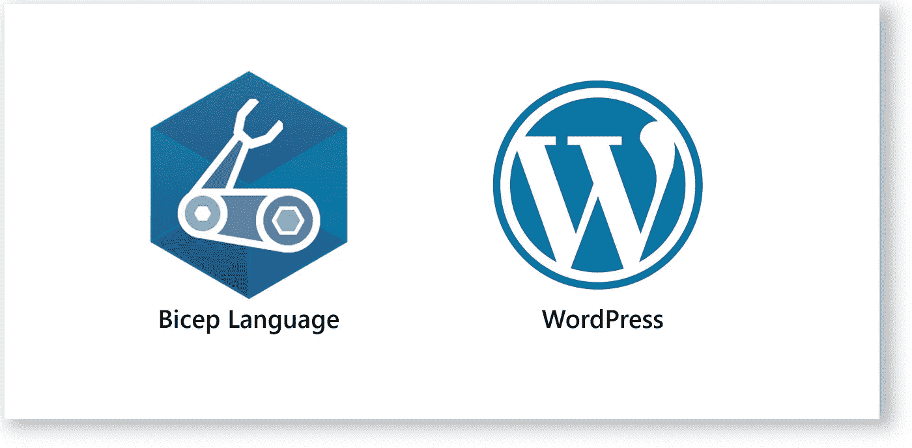
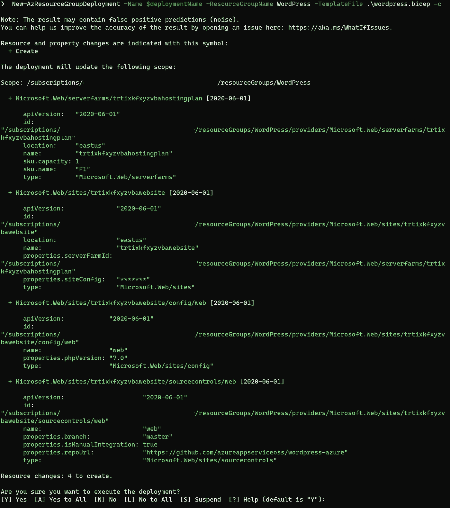
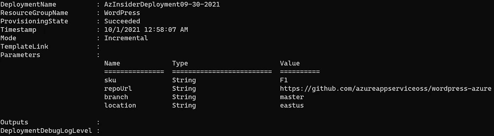

# 💪使用 Bicep 在 Azure 上部署 WordPress

> 原文：<https://medium.com/codex/deploying-wordpress-on-azure-using-bicep-ad7e1dd96065?source=collection_archive---------4----------------------->

在 Azure 中部署 WordPress 的基础设施即代码方法。



Azure 二头肌——部署 WordPress

本文旨在为您提供一个如何使用 Bicep 在 Azure 中部署 WordPress 实例的快速示例。

在之前的[文章](https://blog.azinsider.net/)中，我们讨论了为什么 Bicep 与作为云工程师的你相关，以及你如何利用这种新的特定于领域的语言在 Azure 中声明性地部署你的资源。

我们将创建一个 Bicep 模板来在 Azure 中部署一个 WordPress 实例。WordPress 是一个免费的开源内容管理系统，用 PHP 编写，配有 MySQL 数据库。

让我们从定义二头肌模板的参数开始。

# 1.WordPress Bicep 模板—参数

在下面的代码中，我们定义了几个参数:SKU、'*repoURL【T3]、分支和位置。*

```
param sku string = 'F1'
param repoUrl string = '[https://github.com/azureappserviceoss/wordpress-azure'](https://github.com/azureappserviceoss/wordpress-azure')
param branch string = 'master'
param location string = resourceGroup().location
```

注意，我们使用函数“resourceGroup()”传递位置。

下一步是定义变量。

# 2.WordPress Bicep 模板—变量

我们将定义两个变量:

*   托管计划名称
*   网站名称

```
var hostingPlanName_var = '${uniqueString(resourceGroup().id)}hostingplan'var siteName_var = '${uniqueString(resourceGroup().id)}website'
```

在上面的代码中，我们没有使用' *concat()* '函数，而是使用了字符串插值。这样，我们可以为托管计划名称和站点名称获得一个唯一的名称。

现在我们将定义资源。

# 3.WordPress Bicep 模板—变量

我们将在 Bicep 模板中定义四种资源:

*   服务器群
*   网站—应用服务
*   源代码控制
*   站点配置

让我们从定义服务器群或应用服务计划开始。

```
resource hostingPlanName 'Microsoft.Web/serverfarms@2020-06-01' = {
  sku: {
    name: sku
    capacity: 1
  }
  name: hostingPlanName_var
  location: location
  properties: {}
}
```

在上面的代码中，我们定义了 App 服务计划。我们包括 SKU 和容量。然后，我们传递托管计划的名称和位置。

要定义的以下资源是应用程序服务:

```
resource siteName 'Microsoft.Web/sites@2020-06-01' = {
  name: siteName_var
  location: location
  properties: {
    serverFarmId: hostingPlanName.id
    siteConfig: {
      localMySqlEnabled: true
      appSettings: [
        {
          name: 'WEBSITE_MYSQL_ENABLED'
          value: '1'
        }
        {
          name: 'WEBSITE_MYSQL_GENERAL_LOG'
          value: '0'
        }
        {
          name: 'WEBSITE_MYSQL_SLOW_QUERY_LOG'
          value: '0'
        }
        {
          name: 'WEBSITE_MYSQL_ARGUMENTS'
          value: '--max_allowed_packet=16M'
        }
      ]
    }
  }
}
```

在上面的代码中，我们描述了站点的名称和位置。然后，在属性中，我们引用托管计划名称 ID 和配置。

对于这个具体的例子，我们提供了一些设置来在 App 中启用 MySQL。

我们将定义的以下资源是源代码管理。

```
resource siteName_web 'Microsoft.Web/sites/sourcecontrols@2020-06-01' = {
  parent: siteName
  name: 'web'
  properties: {
    repoUrl: repoUrl
    branch: branch
    isManualIntegration: true
  }
}
```

注意，我们将其定义为子资源。父资源是应用服务。源代码管理定义包括名称和属性。

在属性中，我们引用' *repoURL* 和分支。我们还将“isManualIntegration”属性的布尔值设置为 true。

最后，我们定义站点的配置。

```
resource Microsoft_Web_sites_config_siteName_web 'Microsoft.Web/sites/config@2020-06-01' = {
  parent: siteName
  name: 'web'
  properties: {
    phpVersion: '7.0'
  }
}
```

在上面的代码中，我们将这个资源定义为子资源，并指定要使用的 *PHP 版本*。

# 4.正在部署二头肌模板。

我们将使用下面的 PowerShell cmdlet 将其部署到资源组。我们之前在 Azure 订阅中创建了一个名为' *WordPress* 的资源组。

```
$date = Get-Date -Format "MM-dd-yyyy"$deploymentName = "AzInsiderDeployment"+"$date"New-AzResourceGroupDeployment -Name $deploymentName -ResourceGroupName WordPress -TemplateFile .\wordpress.bicep **-c**
```

注意，我们在命令末尾添加了标志-c 来预览部署。

通过使用这个标志，我们使用了 WhatIf 特性，并且我们将预览部署。



Azure Bicep 部署预览

一旦我们验证了部署，我们就可以执行它。

下图突出显示了此部署的输出。



Azure Bicep 部署输出

以下是完整的二头肌模板:

```
param sku string = 'F1'
param repoUrl string = '[https://github.com/azureappserviceoss/wordpress-azure'](https://github.com/azureappserviceoss/wordpress-azure')
param branch string = 'master'
param location string = resourceGroup().locationvar hostingPlanName_var = '${uniqueString(resourceGroup().id)}hostingplan'
var siteName_var = '${uniqueString(resourceGroup().id)}website'resource hostingPlanName 'Microsoft.Web/serverfarms@2020-06-01' = {
  sku: {
    name: sku
    capacity: 1
  }
  name: hostingPlanName_var
  location: location
  properties: {}
}resource siteName 'Microsoft.Web/sites@2020-06-01' = {
  name: siteName_var
  location: location
  properties: {
    serverFarmId: hostingPlanName.id
    siteConfig: {
      localMySqlEnabled: true
      appSettings: [
        {
          name: 'WEBSITE_MYSQL_ENABLED'
          value: '1'
        }
        {
          name: 'WEBSITE_MYSQL_GENERAL_LOG'
          value: '0'
        }
        {
          name: 'WEBSITE_MYSQL_SLOW_QUERY_LOG'
          value: '0'
        }
        {
          name: 'WEBSITE_MYSQL_ARGUMENTS'
          value: '--max_allowed_packet=16M'
        }
      ]
    }
  }
}resource siteName_web 'Microsoft.Web/sites/sourcecontrols@2020-06-01' = {
  parent: siteName
  name: 'web'
  properties: {
    repoUrl: repoUrl
    branch: branch
    isManualIntegration: true
  }
}resource Microsoft_Web_sites_config_siteName_web 'Microsoft.Web/sites/config@2020-06-01' = {
  parent: siteName
  name: 'web'
  properties: {
    phpVersion: '7.0'
  }
}
```

正如您所看到的，利用 Bicep 的基础设施即代码比 ARM 模板简单得多，并且您仍然可以使用 ARM 中可用的特性(如 WhatIf)来快速验证您的部署。

[*在此加入****azin sider****邮箱列表。*](http://eepurl.com/gKmLdf)

*-戴夫·r·*