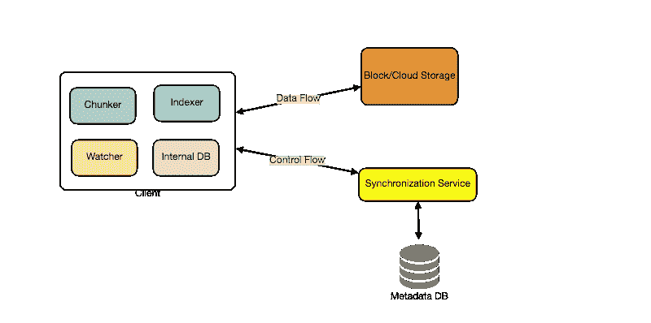

# 设计 Dropbox

> 原文：<https://medium.com/codex/design-dropbox-e82b61e5b197?source=collection_archive---------2----------------------->

## 让我们设计一个像 Dropbox 或 Google Drive 这样的文件托管服务，使用户能够将他们的数据存储在远程服务器上。

通常，这些服务器由云存储提供商维护，并通过网络(通常通过互联网)提供给用户。用户每月为他们的云数据存储付费。

类似服务:OneDrive、Google Drive

# 为什么选择云存储？

云文件存储服务最近变得非常流行，因为它们简化了多种设备之间数字资源的存储和交换。人们认为，从使用单台个人电脑到使用智能手机和平板电脑等具有不同平台和操作系统的多种设备以及随时从不同地理位置进行移动访问的转变是云存储服务大受欢迎的原因。此类服务的一些主要优势包括:

## 有效性

云存储服务的宗旨是让数据随时随地可用。因此，用户可以随时随地从任何设备访问他们的文件/照片。

## 可靠性和耐用性

云存储的另一个好处是它提供了 100%的数据可靠性和持久性。云存储通过将数据的多个副本存储在不同地理位置的服务器上，确保用户永远不会丢失数据。

## 可量测性

用户永远不必担心存储空间不足。有了云存储，只要你准备好付费，你就有无限的存储空间。

# 系统的要求和目标

我们希望从云存储系统中实现什么？以下是我们系统的最高要求:

1.  用户应该能够从任何设备上传和下载他们的文件/照片。
2.  用户应该能够与其他用户共享文件或文件夹。
3.  我们的服务应该支持设备之间的自动同步，也就是说，在一个设备上更新一个文件后，它应该在所有设备上同步。
4.  系统应该支持存储高达 1gb 的大文件。
5.  酸性是必需的。应该保证所有文件操作的原子性、一致性、隔离性和持久性。
6.  我们的系统应该支持离线编辑。用户应该能够在离线时添加/删除/修改文件，一旦他们上线，他们的所有更改都应该同步到远程服务器和其他在线设备。

## 扩展要求

系统应该支持数据快照，以便用户可以返回到文件的任何版本。

# 一些设计考虑

*   我们应该期待大量的读写量。
*   读写比率预计几乎相同。
*   在内部，文件可以存储在小部分或小块中(比如 4MB)。这可以提供许多好处，例如，所有失败的操作将只针对文件的较小部分重试。如果用户上传文件失败，则只会重试失败的块。
*   我们可以通过只传输更新的块来减少数据交换量。
*   通过删除重复的块，我们可以节省存储空间和带宽使用。
*   保留元数据的本地副本(文件名、大小等。)与客户端可以节省我们很多往返服务器的时间。
*   对于较小的更改，客户端可以智能地上传差异，而不是整个块。

# 容量估计和限制

*   Dropbox 拥有 [7 亿总用户](https://dropbox.gcs-web.com/investor-relations)，让我们假设 1 亿日活跃用户(DAU)。
*   让我们假设，平均来说，每个用户从 2 个不同的设备连接。
*   每日 [1.2B 新文件](https://www.dropbox.com/about)上传。这在 5 年内为我们提供了大约 5 万亿个文件。
*   让我们假设平均文件大小为 100KB。这将给我们带来 500 的总存储量。

5 T * 100KB ~= 500 PB

*   我们还假设每分钟有 100 万个活动连接。

# 高层设计

用户将指定一个文件夹作为他们设备上的工作空间。任何放在这个文件夹里的文件/照片/文件夹都会被上传到云端，每当文件被修改或删除，都会以同样的方式反映在云存储里。因此，用户可以在其所有设备上指定相似的工作空间。在一个设备上进行的任何修改都将传播到所有其他设备，以便在任何地方查看工作区。

在高层次上，我们需要存储文件及其元数据信息，如文件名、文件大小、目录等。以及该文件的共享者。因此，我们需要一些服务器来帮助客户端上传/下载文件到云存储，还需要一些服务器来更新关于文件和用户的元数据。我们还需要某种机制来通知所有的客户端，无论何时发生更新来同步它们的文件。

如下图所示，

*   块服务器将与客户端一起从云存储中上传/下载文件。
*   元数据服务器将在 SQL 或 NoSQL 数据库中更新文件的元数据。
*   同步服务器将处理向所有客户端通知同步的不同更改的工作流。

# 组件设计

让我们逐一检查系统的主要组件:

# 客户

客户端应用程序监控用户机器上的工作区文件夹，并将所有文件/文件夹与远程云存储同步。客户端应用程序将与存储服务器协作，将实际文件上传、下载和修改到后端云存储。客户端还与远程同步服务交互以处理任何文件元数据更新，例如文件名、大小、修改日期等的改变。

以下是客户端的一些基本操作:

1.  上传和下载文件。
2.  检测工作区文件夹中的文件更改。
3.  处理由于离线或并发更新引起的冲突。

## 我们如何高效地处理文件传输？

如上所述，我们可以将每个文件分成更小的块，以便只传输那些修改过的块，而不是整个文件。假设我们将每个文件分成固定大小的 4MB 块。我们可以根据以下条件静态计算最佳块大小

1.我们在云中使用的存储设备，用于优化空间利用率和每秒输入/输出操作(IOPS)

2.网络带宽

3.存储中的平均文件大小等。

我们还应该在我们的元数据中保留每个文件和组成它的块的记录。

## 我们应该在客户端保留一份元数据的副本吗？

保存元数据的本地副本使我们能够进行离线更新，并节省了许多更新远程元数据的往返行程。

## 客户端如何有效地监听其他客户端发生的变化？

一种解决方案是客户端定期检查服务器是否有任何变化。这种方法的问题是我们会延迟反映本地的变化。客户机将定期检查是否有变化，而服务器会在有变化时通知它们。如果客户端频繁地检查服务器的变化，这将浪费带宽，因为服务器必须在大多数时间返回空响应，并保持服务器忙碌。以这种方式提取信息也是不可伸缩的。

上述问题的解决方案可以是使用 HTTP 长轮询。对于长轮询，客户端向服务器请求信息，预计服务器可能不会立即响应。如果服务器在收到轮询时没有新的客户端数据，服务器不会发送空响应，而是保持请求打开，等待响应信息可用。一旦有了新的信息，服务器立即向客户机发送 HTTP/S 响应，完成打开的 HTTP/S 请求。收到服务器响应后，客户端可以立即发出另一个服务器请求，以便将来进行更新。

基于以上考虑，我们可以将我们的客户分为以下四个部分:

1.  **内部元数据数据库**将跟踪文件系统中的所有文件、块、版本和位置。
2.  **Chunker** 会把文件分割成更小的块，称为组块。它还将负责从文件块中重建文件。我们的分块算法会检测文件中被用户修改过的部分，只把那些部分转移到云存储中；这将为我们节省带宽和同步时间。
3.  **监视器**将监视本地工作区文件夹，并通知索引器(下面讨论)用户执行的任何动作，例如，当用户创建、删除或更新文件或文件夹时。此外，观察器还监听同步服务广播的其他客户端上发生的任何变化。
4.  **索引器**将处理从观察器接收的事件，并使用关于修改文件块的信息更新内部元数据数据库。一旦块被成功提交/下载到云存储，索引器将与远程同步服务通信，以向其他客户端广播改变，并更新远程元数据数据库。

## 客户端应该如何处理慢速服务器？

如果服务器繁忙/没有响应，客户端应该成倍地后退。这意味着，如果服务器响应太慢，客户端应该延迟重试，并且这种延迟应该呈指数增长。

## 移动客户端应该立即同步远程更改吗？

与定期检查文件更改的桌面或 web 客户端不同，移动客户端通常按需同步，以节省用户的带宽和空间。

# 元数据数据库

元数据数据库负责维护关于文件/块、用户和工作区的版本和元数据信息。元数据数据库可以是关系数据库，如 [MySQL 或 NoSQL 数据库服务](/geekculture/sql-vs-nosql-92fa8ec1758b)。由于 NoSQL 数据存储不支持有利于可伸缩性和性能的 ACID 属性，因此如果我们选择这种类型的数据库，我们需要在同步服务的逻辑中以编程方式加入对 ACID 属性的支持。然而，使用关系数据库可以简化同步服务的实现，因为它们本身支持 ACID 属性。

无论数据库的类型如何，同步服务都应该提供使用数据库的文件的一致视图，尤其是当多个用户同时处理同一个文件时。

元数据数据库应该存储有关以下对象的信息:

1.  大块
2.  文件
3.  用户
4.  设备
5.  工作区(同步文件夹)

# 同步服务

同步服务是处理客户端所做的文件更新并将这些更改应用到其他订阅客户端的组件。它还将客户端的本地数据库与存储在远程元数据数据库中的信息同步。

同步服务是系统架构中最重要的部分，因为它在管理元数据和同步用户文件方面起着关键作用。桌面客户端与同步服务进行通信，以便从云存储中获取更新，或者将文件和更新发送给云存储和其他用户。例如，如果客户机脱机一段时间，它会在联机后立即轮询系统是否有新的更新。当同步服务收到更新请求时，它会检查元数据数据库的一致性，然后继续更新。随后，向所有订阅的用户或设备发送通知以报告文件更新。

同步服务应该以这样一种方式设计，即在客户端和云存储之间传输更少的数据，以实现更好的响应时间。为了满足这一设计目标，同步服务可以采用差分算法来减少需要同步的数据。例如，我们可以传输一个文件的两个版本之间的**差异**，而不是将整个文件从客户端传输到服务器，反之亦然。因此，仅传输文件中已更改的部分。这也减少了终端用户的带宽消耗和云数据存储。

如上所述，我们将把文件分成 4MB 的块，并且只传输修改过的块。服务器和客户机可计算散列(例如，SHA-256)来查看是否更新块的本地副本。在服务器上，如果我们已经有一个具有相似散列的块(即使来自另一个用户)，我们不需要创建另一个副本；我们可以用同一块。这将在后面的重复数据删除中详细讨论。

为了提供高效且可伸缩的同步协议，我们可以考虑在客户端和同步服务之间使用一个**通信中间件**。消息中间件应该提供可伸缩的消息队列和更改通知，以支持大量使用拉或推策略的客户端。这样，多个同步服务实例可以从一个全局请求队列接收请求，通信中间件将平衡它们的负载。

# 消息队列服务

我们架构的一个重要部分是消息中间件，它应该处理大量的请求。一个支持客户端和同步服务实例之间基于消息的异步通信的可伸缩消息队列服务最适合我们的应用程序需求。消息队列服务支持异步和松散耦合

系统的分布式组件之间基于消息的通信。消息队列服务应该在一个高度可用、可靠和可伸缩的队列中高效地存储任意数量的消息。

消息队列服务将在我们的系统中实现两种类型的队列。请求队列是一个全局队列，所有客户机将共享它。客户端更新元数据数据库的请求将首先被发送到请求队列。同步服务将从那里更新元数据。对应于单个订阅客户端的响应队列负责将更新消息传递给每个客户端。由于消息一旦被客户端接收，就会从队列中删除，因此我们需要为每个订阅的客户端创建单独的响应队列，以共享更新消息。

# 云/块存储

云/块存储存储用户上传的大块文件。客户端直接与存储交互，从存储发送和接收对象。

元数据与存储的分离使我们能够使用云中或内部的任何存储。

# 文件处理工作流程

下面的序列显示了当客户端 A 更新与客户端 B 和 C 共享的文件时，应用程序组件之间的交互，因此它们应该接收更新。

如果其他客户端在更新时没有联机，消息队列服务会将更新通知保存在单独的响应队列中，直到它们稍后联机。

1.  客户端 A 将块上传到云存储。
2.  客户端 A 更新元数据并提交更改。
3.  客户端 A 得到确认，通知被发送到客户端 B 和 C。
4.  客户端 B 和 C 接收元数据改变并下载更新的块。

# 重复数据删除

重复数据删除是一种用于消除数据重复拷贝以提高存储利用率的技术。它还可以应用于网络数据传输，以减少必须发送的字节数。例如，对于每个新进入的块，我们可以计算它的散列，并将其与现有块的所有散列进行比较，以查看我们的存储中是否已经存在相同的块。

我们可以在系统中以两种方式实施重复数据删除:

## 后处理重复数据删除

使用后处理重复数据消除，新区块首先存储在存储设备上，然后某个进程分析数据以寻找重复。好处是客户端在存储数据之前无需等待哈希计算或查找完成，从而确保存储性能不会下降。

这种方法的缺点是

1.  我们将不必要地存储重复的数据，尽管时间很短
2.  重复数据将被传输，消耗带宽。

## 线内重复数据删除

或者，当客户端在其设备上输入数据时，可以实时进行重复数据消除哈希计算。例如，如果我们的系统识别出一个已经存储的块，那么只有对现有块的引用会被添加到元数据中，而不是块的完整副本。这种方法将为我们提供最佳的网络和存储利用率。

# 元数据分区

要横向扩展元数据数据库，我们需要对其进行分区，以存储关于数百万用户和数十亿文件/区块的信息。因此，我们需要开发一个分区方案，将我们的数据划分并存储到不同的数据库服务器上。

## 垂直分割

我们可以对数据库进行分区，以便在一台服务器上存储与某个特定特性相关的表。例如，我们可以将所有与用户相关的表存储在一个数据库中，将所有与文件/块相关的表存储在另一个数据库中。尽管这种方法实现起来很简单，但是它有一些问题:

1.  我们还会有规模问题吗？如果我们存储了数万亿个数据块，而我们的数据库无法支持存储如此大量的记录，该怎么办？我们如何进一步划分这样的表呢？
2.  将两个独立数据库中的两个表连接起来会导致性能和一致性问题。例如，我们必须多久联接一次用户表和文件表？

## 基于范围的划分

如果我们基于文件路径的第一个字母将文件/块存储在单独的分区中会怎么样？因此，我们将所有以字母“A”开头的文件保存在一个分区中，将那些以字母“B”开头的文件保存在另一个分区中，依此类推。这种方法称为基于范围的分区。

我们甚至可以将某些不经常出现的字母合并到一个数据库分区中。我们应该静态地提出这种分区方案，以便总是可预测地存储/查找文件。

这种方法的主要问题是会导致服务器不平衡。例如，如果我们决定将所有以字母“E”开头的文件放入一个 DB 分区，后来我们意识到有太多以字母“E”开头的文件，以至于我们无法将它们放入一个 DB 分区。

## 基于散列的分区

在这个方案中，我们获取我们正在存储的对象的散列，并基于这个散列，我们计算出这个对象应该去的 DB 分区。

在我们的例子中，我们可以采用我们正在存储的文件对象的“FileID”的散列来确定文件将被存储的分区。我们的散列函数会将对象随机分配到不同的分区，例如，我们的散列函数总是可以将任何 ID 映射到[1…256]之间的一个数字。这个数字就是我们存储对象的分区。

这种方法仍然会导致分区过载，这可以使用[一致散列](/geekculture/consistent-hashing-8e5f8b61efef)来解决。

# 贮藏

我们的系统中可以有两种缓存。为了处理热文件/块，我们可以引入块存储缓存。我们可以使用现成的解决方案，比如 Memcache，用它们各自的 id/hash 来存储整个块。在访问块存储之前，我们可以快速检查缓存是否有所需的块。

基于客户端的使用模式，我们可以确定我们需要多少缓存服务器。例如，高端商用服务器的内存最高可达 144GB 因此，一台这样的服务器可以缓存 36K 块。

类似地，我们可以有一个元数据数据库的缓存。

## 哪种缓存替换策略最符合我们的需求？

当缓存已满时，我们想用一个更新/更热的块替换一个块，我们该如何选择？[最近最少使用(LRU)](/geekculture/caching-b863bbce4bf) 可以是我们系统的合理策略。在这个策略下，我们首先丢弃最近最少使用的块。

# 负载平衡器(磅)

我们可以在系统的两个位置添加负载平衡层:

1.客户端和块服务器之间

2.客户端和元数据服务器之间

最初，可以采用一种简单的循环方法，在后端服务器之间平均分配传入的请求。这种 LB 实现起来很简单，不会引入任何开销。这种方法的另一个好处是，如果一个服务器死了，LB 将把它从轮换中去掉，并停止发送任何流量。然而，循环 LB 的一个问题是，它不考虑服务器负载。因此，如果一个服务器过载或运行缓慢，LB 不会停止向该服务器发送新的请求。

为了处理这个问题，可以放置一个更智能的 LB 解决方案，定期查询后端服务器的负载，并根据负载调整流量。

# 安全性、权限和文件共享

当用户在云中存储他们的文件时，他们最关心的问题之一就是数据的隐私和安全。尤其是因为我们的系统用户可以与其他用户共享他们的文件，甚至可以将它们公开，与所有人共享。

为了解决这个问题，我们将在我们的元数据数据库中存储每个文件的权限，以反映任何用户可以看到或修改哪些文件。