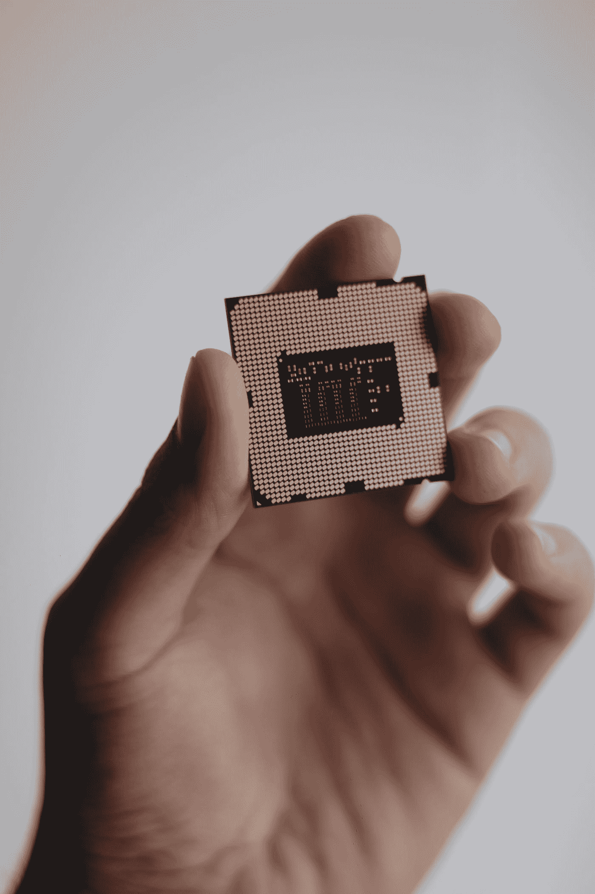
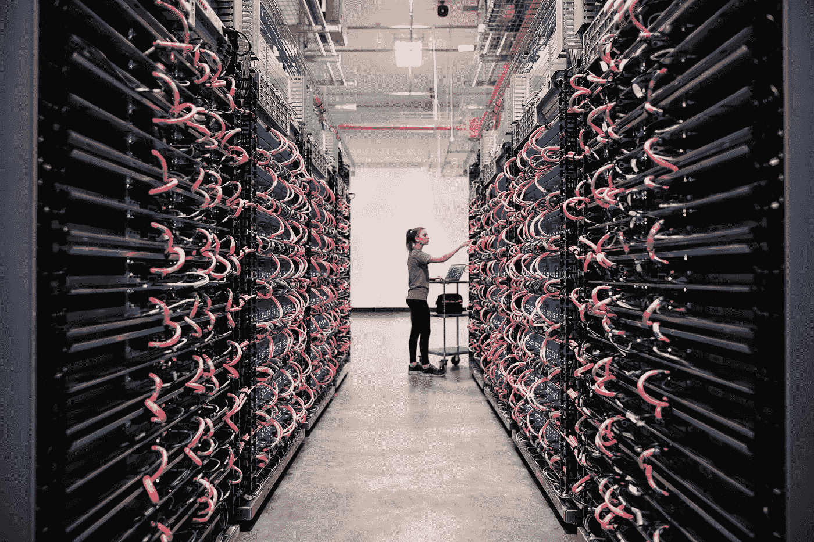

# 设计鬼！谷歌用人工智能设计人工智能芯片

> 原文：<https://medium.com/codex/design-ghost-google-uses-ai-to-design-ai-chips-3cb480daa8fe?source=collection_archive---------4----------------------->

## 谷歌正在使用人工智能设计下一代人工智能芯片，可以在 6 小时内完成

尼克·杜普在 [Unsplash](https://unsplash.com?utm_source=medium&utm_medium=referral) 上的照片

让机器设计和制造其他机器是灾难的根源。至少，所有的**科幻电影**都告诉我们这一点。计算机将会发展到对人类构成威胁的地步。这不会突然发生，但几年后，人工智能会变得有意识，对创造它的物种充满敌意。

Brian McGowan 在 [Unsplash](https://unsplash.com?utm_source=medium&utm_medium=referral) 上拍摄的照片

我们还没有完全达到**智能机**可以构建更复杂版本的地步，但是**谷歌**已经在利用人工智能设计更好的人工智能芯片。这是一项已经记录在一篇[研究论文](https://www.nature.com/articles/s41586-021-03544-w)中的成果，它清楚地表明人工智能可以改进自己的设计。

[谷歌在《自然》杂志上发表了一篇论文](https://www.nature.com/articles/s41586-021-03544-w)，详细介绍了它用来教导人工智能设计新的人工智能芯片的技术，这些芯片将比它们的前辈更快**更节能**。****

## **它有什么特别的？**

**谷歌开发的软件允许计算机在仅仅六个小时内设计出下一代人工智能芯片，而人类工程师团队需要几个月才能设计出来。该公司解释称，谷歌利用这项技术制造其最新的[**张量处理单元**](https://cloud.google.com/tpu) 芯片。**

****

**图片来源:谷歌**

## **它是如何工作的？**

**人工智能算法为谷歌做的就是画出芯片的平面图。这包括绘制系统芯片的各种组件的位置，以最大化处理速度并降低功耗。包括 CPU、GPU 和内存芯片在内的组件被放置在硅片上并连接。**

**谷歌为该算法提供了 10000 个芯片平面图，因此它可以了解和学习在芯片设计中什么是最有效的，以提高速度和效率。**

> **人工智能通过创造人类可能意想不到的设计，设法让研究人员感到惊讶。人类芯片设计师使用整齐的线条来布局组件，但谷歌的人工智能使用去中心化的方法来设计更好的 SOC。**

**正如[美国消费者新闻与商业频道](https://www.cnbc.com/2021/06/10/google-is-using-ai-to-design-chip-floorplans-faster-than-humans.html)所指出的，这并不是谷歌的人工智能第一次“反叛”并提出意想不到的解决方案。几年前，谷歌使用了不同的人工智能算法，因此[它的计算机可以击败世界上最好的围棋选手](https://www.scientificamerican.com/article/how-the-computer-beat-the-go-player/)。当时人类棋手被其他人类对手想不到的人工智能制胜招数惊呆了。**

**抛开**人工智能**启示录的场景不谈，重要的是要注意到这些复杂的算法不会自己工作或出现。机器被教会执行特定的任务，随着时间的推移，它们会变得更好。但是人工智能无法自己创造更好的人工智能芯片。从零开始，没有人教过它如何提高速度和效率。这同样适用于在任何比赛中击败人类。**

> **根据谷歌工程师的说法，谷歌开创的新芯片设计可能会对半导体领域产生“重大影响”。**

**[扬·乐纯](http://yann.lecun.com/)，脸书首席人工智能**科学家**，在[推特](https://twitter.com/ylecun/status/1402974897194868736?s=20)上表达了对这一突破的赞赏。《自然》杂志的另一篇社论也称赞了谷歌的成就，称这可能是“[加速供应链](https://www.nature.com/articles/d41586-021-01507-9)的巨大帮助。”该杂志还指出，“必须广泛分享技术专长，以确保公司的“生态系统”成为真正的全球化，”并警告说，这种技术成就不应“赶走拥有必要核心技能的人。”**