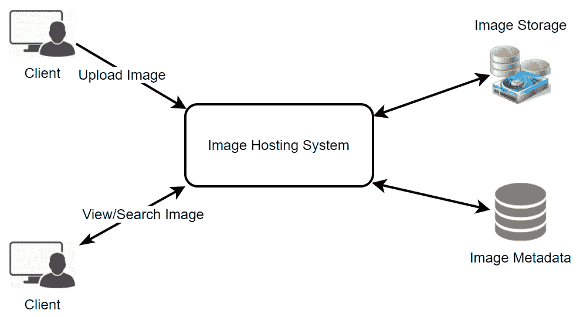
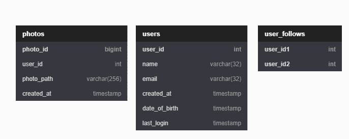
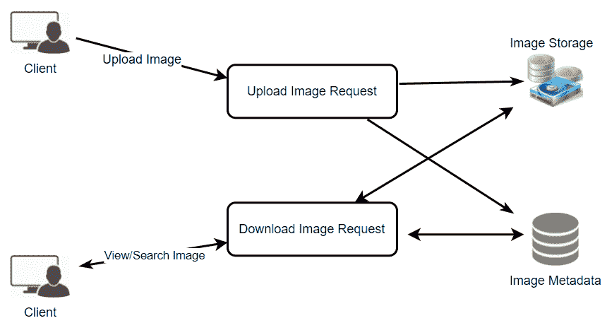
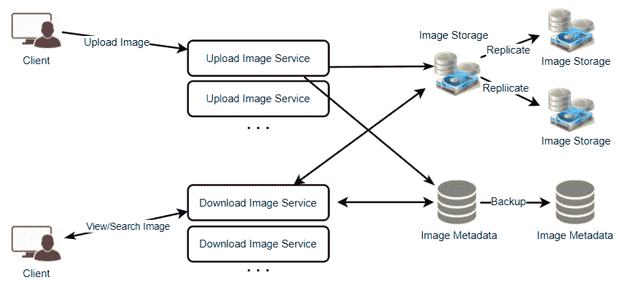

# 设计 Instagram

> 原文：<https://medium.com/codex/design-instagram-6872b41f5c61?source=collection_archive---------2----------------------->

## 让我们设计一个类似 Instagram 的照片分享服务，用户可以上传照片与其他用户分享。


由[亚历山大·沙托夫](https://unsplash.com/@alexbemore?utm_source=medium&utm_medium=referral)在 [Unsplash](https://unsplash.com?utm_source=medium&utm_medium=referral) 上拍摄的照片

# 为什么选择 Instagram？

Instagram 是一项社交网络服务，用户可以上传照片和视频，并与其他用户公开或私下分享。

我们计划为这项练习设计一个更简单的 Instagram 版本，用户可以分享照片并关注其他用户。每个用户的新闻提要将由用户关注的所有人的热门图片组成。

# 系统的要求和目标

在设计 Instagram 时，我们将重点关注以下一系列要求:

## 功能需求

1.  用户应该能够上传，下载和查看照片。
2.  用户可以关注其他用户。
3.  系统应该生成并显示一个用户的新闻提要，其中包含用户关注的所有人的热门照片。

## 非功能性需求

1.  我们的服务需要高度可用。
2.  对于新闻订阅源生成，系统的可接受延迟为 200 毫秒。
3.  一致性可能会受到影响(为了可用性)。如果用户有一段时间没有看到照片，应该没事。
4.  该系统应该是高度可靠的，任何照片/视频上传不应丢失。

我们不会涉及 Instagram 的其他功能，如标签、评论、搜索、建议等。，因为它们现在是高级概念。

# 一些设计考虑

该系统的读取量会很大，重点是建立一个可以快速检索照片的系统。

1.  实际上，用户可以上传任意多的照片。因此，在设计该系统时，高效的存储管理应该是一个至关重要的因素。
2.  读取图像时预期会有低延迟。
3.  数据应该 100%可靠。比如用户上传一张图片，系统会保证永远不会丢失。

# 容量估计

*   假设我们有 10 亿用户，每天有 5 亿活跃用户。
*   让我们假设 20%的用户每天添加一张图片，那么每天会添加 1 亿张新图片。
*   平均照片文件大小=~ 1 MB
*   存储 1 天照片所需的总空间= 100 M * 1 MB = 100 TB
*   **5 年所需的总空间** = `100 TB * 365 days * 5 years =~ 200` `PB`

您可以随意使用这个 [Excel 文件](https://docs.google.com/spreadsheets/d/1MQ780cyE5UdK3w78tDa44064AkY3vS8cP-VbqrZkl7I/edit?usp=sharing)来获得针对您系统的评估。

# 高级系统设计



我们需要在高层次上支持两个场景，一个是上传照片，另一个是查看/搜索照片。我们的服务需要一些块**存储服务器**来存储**照片**和**数据库服务器**来存储**元数据**信息。

# 数据库模式

我们需要存储关于用户、他们上传的照片以及他们追随的人的元数据。



照片表将存储与照片相关的所有数据。我们需要在(PhotoID，CreationDate)上有一个索引，因为我们需要首先获取最近的图像。

所有与照片相关的元数据都可以放在一个表中，其中的“键”是“PhotoID”,“值”是包含 PhotoLocation、UserLocation、CreationTimestamp 等的对象。

我们还需要存储用户和照片之间的关系，以了解谁拥有哪张照片。我们需要存储的另一个关系是用户关注的人的列表。因此，对于“UserPhoto”表，“键”将是“UserID”，而“值”将是用户拥有的“PhotoIDs”列表，存储在不同的列中。对于“UserFollow”表，我们将有一个类似的方案。

存储上述模式的一种直接方法是使用像 MySQL 这样的 RDBMS，因为我们需要连接。但是关系数据库也带来了挑战，尤其是当我们需要扩展它们的时候。

我们可以将上述元数据模式存储在像 [Cassandra](https://cassandra.apache.org/) 这样的宽列数据存储中。通常，键值存储总是维护一定数量的副本以提供可靠性。此外，在这样的数据存储中，删除不会立即生效。相反，数据在从系统中永久删除之前会保留几天(以支持取消删除)。

原始图像文件可以存储在分布式键值存储中，以享受 NoSQL 提供的好处，如 HDFS 的[或 S3 的](https://hadoop.apache.org/docs/r1.2.1/hdfs_design.html)。

# 元数据大小估计

让我们估计一下将有多少数据进入每个表，以及五年内我们将需要多少总存储量。

## 用户

假设每个“int”和“datetime”是四个字节，而“bigint”是八个字节，那么用户表中的每一行将是 68 个字节。

```
UserID (4 bytes) + Name (32 bytes) + Email (32 bytes) + DateOfBirth (4 bytes) + CreationDate (4 bytes) + LastLogin (4 bytes) = 76 bytes
```

如果我们有 10 亿用户，我们将需要 76 GB 的总存储。

## 照片

照片表格中的每一行都是 284 字节:

```
PhotoID (8 bytes) + UserID (4 bytes) + PhotoPath (256 bytes) + CreationDate (4 bytes) = 272 bytes
```

如果每天有 1 亿张新照片上传，我们将需要 50 TB 的存储空间持续五年。

```
100 M * 272 bytes * (365 * 5) ~= 50 TB
```

## 用户关注

UserFollow 表中的每一行都由 8 个字节组成。如果我们有 5 亿用户，平均每个用户关注 500 个用户。我们需要为用户提供 4 TB 的存储空间如下表所示:

```
1 Billion users * 500 followers * 8 bytes ~= 4 TB
```

因此，**所有元数据表**5 年所需的总空间= `0.076 TB + 50 TB + 4 TB ~= 50 TB`

您可以随意使用这个 [Excel 文件](https://docs.google.com/spreadsheets/d/1MQ780cyE5UdK3w78tDa44064AkY3vS8cP-VbqrZkl7I/edit?usp=sharing)来获得针对您的系统的估算。

# 组件设计

写入或照片上传可能会很慢，因为它们必须进入磁盘，而读取会更快，特别是如果它们是从缓存提供的。

上传用户可以消耗所有可用的连接，因为上传是一个缓慢的过程。这意味着，如果系统忙于处理所有的“写”请求，就无法提供“读”服务。我们应该记住，在设计我们的系统之前，web 服务器有一个连接限制。如果我们假设一个 web 服务器在任何时候最多可以有 500 个连接，那么它不能有超过 500 个并发上传或读取。为了解决这个瓶颈，我们可以将读取和写入拆分到单独的服务中。我们将有专门的服务器用于读取，不同的服务器用于写入，以确保上传不会占用系统。



分离读写请求还将允许我们独立地扩展和优化这些操作。

# 可靠性和冗余

丢失文件不是我们服务的选项。因此，我们将存储每个文件的多个副本，以便在一个存储服务器出现故障时，从另一个存储服务器上的副本中检索照片。

同样的原则也适用于系统的其他组件。如果我们希望系统具有高可用性，我们需要在系统中运行服务的多个副本，这样即使一些服务停止，系统也能保持可用和运行。冗余消除了系统中的单点故障。例如，如果同一服务的两个实例在生产环境中运行，其中一个出现故障或降级，系统可以故障切换到正常拷贝。故障转移可以自动发生，也可以需要手动干预。



# 数据分片

让我们讨论元数据分片的不同方案:

## 基于用户 ID 的分区

假设我们基于“UserID”进行分片，将用户的所有照片保存在同一个分片上。如果一个数据库碎片是 1TB，我们将需要 50 个碎片来存储 50TB 的元数据。让我们假设，为了更好的性能和可伸缩性，我们保留 100 个碎片。

所以我们将通过 **UserID % 100** 找到碎片号，然后将数据存储在那里。然后，为了在我们的系统中唯一地标识任何照片，我们可以为每个 PhotoID 附加碎片号。

## 如何才能生成 PhotoIDs？

每个 DB 碎片可以有自己的 PhotoID 自动递增序列，因为我们将为每个 PhotoID 添加 ShardID，这将使它在整个系统中是唯一的。

## 这种分区方案有什么不同的问题？

1.  我们如何处理热门用户(名人/有影响力的人)？有几个人关注这些热门用户，还有很多人看到他们上传的任何照片。
2.  与其他用户相比，一些用户会有许多照片，从而造成存储的不均匀分布。
3.  将用户的所有照片存储在一个碎片上可能会导致用户的所有数据不可用(如果该碎片停机),或者在服务高负载等情况下导致更高的延迟。

## 基于照片的分割

如果我们能先生成唯一的 PhotoID，然后通过 **PhotoID % 100** 找到一个碎片号，上述问题就已经解决了。在这种情况下，我们不需要为 ShardID 添加 PhotoID，因为 PhotoID 本身在整个系统中是唯一的。

## 如何才能生成 PhotoIDs？

我们不能在每个碎片中有一个自动递增的序列来定义 PhotoID，因为我们需要首先知道 PhotoID，以找到它将被存储的碎片。一种解决方案是，我们专门用一个单独的数据库实例来生成自动递增的 id。如果我们的 PhotoID 可以放入 64 位，我们可以定义一个只包含 64 位 ID 字段的表。因此，每当我们想在系统中添加一张照片时，我们可以在这个表中插入一个新行，并将该 ID 作为新照片的 PhotoID。

## 这个生成密钥的数据库不会是一个单点故障吗？

是的，会的。一种变通方法是定义两个这样的数据库，一个生成偶数编号的 id，另一个生成奇数编号的 id。对于 MySQL，以下脚本可以定义这样的序列:

**KeyGeneratingServer1:**

```
auto-increment-increment = 2auto-increment-offset = 1
```

**密钥生成服务器 2:**

```
auto-increment-increment = 2auto-increment-offset = 2
```

我们可以在这些数据库前放置一个负载平衡器，在它们之间进行循环调度，以应对停机时间。这两个服务器可能不同步，一个生成的密钥比另一个多，但这不会在我们的系统中引起任何问题。我们可以通过为用户、照片评论或系统中的其他对象定义单独的 ID 表来扩展这种设计。

**或者**，我们可以实现一个“密钥”生成方案，类似于我们在[设计 URL 缩短服务](https://crackfang.medium.com/url-shorteners-f38e87ab821f)中讨论的方案。

## 我们如何规划我们系统的未来增长？

首先，我们可以有大量的逻辑分区来适应未来的数据增长，这样，在开始时，多个逻辑分区驻留在一个物理数据库服务器上。由于每个数据库服务器可以运行多个数据库实例，所以我们可以为任何服务器上的每个逻辑分区创建单独的数据库。因此，每当我们觉得某个特定的数据库服务器有大量数据时，我们可以将一些逻辑分区从它迁移到另一个服务器。

最后，我们可以维护一个配置文件(或者一个单独的数据库)，它可以将我们的逻辑分区映射到数据库服务器，使我们能够快速地移动分区。每当我们想要移动一个分区时，我们只需要更新配置文件来宣布这个改变。

# 排名和新闻源生成

要为任何给定用户创建新闻提要，我们需要获取用户关注的人的最新、最受欢迎和相关的照片。

为了简单起见，我们假设需要为用户的新闻提要获取前 100 张照片。我们的应用服务器将首先获取用户关注的人的列表，然后获取每个用户最近 100 张照片的元数据信息。在最后一步，服务器将把所有这些照片提交给我们的排名算法，该算法将确定前 100 张照片(基于新近度、相似度等)。)并将它们返回给用户。这种方法的一个可能的问题是更高的延迟，因为我们必须查询多个表并对结果执行排序/合并/排序。为了提高效率，我们可以预先生成新闻提要，并将其存储在一个单独的表中。

## 预生成新闻提要

我们可以有专门的服务器，不断生成用户的新闻提要，并将它们存储在一个**“用户新闻提要”表**中。因此，每当任何用户需要他们的新闻提要的最新照片时，我们将简单地查询这个表并将结果返回给用户。

每当这些服务器需要生成用户的新闻提要时，它们将首先查询 UserNewsFeed 表，以查找上次为该用户生成新闻提要的时间。然后，从那时起将生成新的新闻提要数据(按照上面提到的步骤)。

## 向用户发送新闻提要内容的不同方法有哪些？

## 1.拉

客户端可以定期从服务器获取新闻提要内容，或者在需要时手动获取。这种方法可能存在的问题有:

a)在客户端发出拉请求之前，可能不会向用户显示新数据 b)大多数情况下，如果没有新数据，拉请求将导致空响应。

## 2.推

一旦新数据可用，服务器就可以将其推送给用户。为了有效地管理这一点，用户必须维持与服务器的长轮询请求以接收更新。这种方法的一个可能的问题是，一个用户关注了很多人，或者一个名人用户拥有数百万的关注者；在这种情况下，服务器必须非常频繁地推送更新。

## 3.混合物

我们可以采用混合方法。我们可以将拥有大量关注者的所有用户转移到一个基于拉的模型，只将数据推给那些拥有数百(或数千)关注者。另一种方法是，服务器以不超过一定的频率向所有用户推送更新，并让拥有大量关注者/更新的用户定期获取数据。

# 使用分片数据创建新闻订阅源

为任何给定用户创建新闻提要的最重要要求之一是从用户关注的所有人那里获取最新的照片。为此，我们需要一种机制来在照片创建时对其进行分类。为了有效地做到这一点，我们可以将照片创建时间作为照片 ID 的一部分。因为我们将有一个关于 PhotoID 的主要索引，所以找到最新的 PhotoID 会很快。

我们可以为此使用纪元时间。我们的照片将有两个部分:第一部分将代表纪元时间，第二部分将是自动递增序列。因此，要创建一个新的 PhotoID，我们可以获取当前的 epoch 时间，并从我们的密钥生成数据库中添加一个自动递增的 ID。我们可以从这个 PhotoID ( PhotoID % 100)中计算出碎片号，并将照片存储在那里。

# 我们的照片有多大？

假设我们的纪元时间从今天开始；在接下来的五年里，我们需要多少位来存储秒？

```
(24*60*60) sec/day * 365 (days a year) * 5 (years) = 160 Million seconds
```

我们需要 29 位来存储这个数(2 ⁹ ~= 5 亿)。因为平均来说，我们预计每秒钟有 1157 张新照片，所以我们可以分配 11 个额外的位来存储自动递增的序列。所以每秒钟，我们可以存储(2 = 2048)张新照片。

**照片尺寸** = `29+11 = 40 bits = 5 bytes`

我们可以每秒重置自动递增序列。

# 贮藏

我们的服务需要一个大规模的照片传送系统来服务全球分布的用户。我们的服务应该使用许多地理上分布的照片缓存服务器，并使用 cdn(有关详细信息，请参考附录中的缓存)将内容推送到离用户更近的地方。

我们可以为元数据服务器引入一个缓存来缓存热数据库行。我们可以使用 Memcache 来缓存数据。在访问数据库之前，应用服务器可以快速检查缓存中是否有需要的行。

**最近最少使用(LRU)** 对于我们的系统来说是一个合理的缓存回收策略。在这个策略下，我们首先丢弃最近最少查看的行。

# 如何才能构建更智能的缓存？

如果我们遵循二八法则，即 20%的照片日阅读量产生 80%的流量，那么特定的照片非常受欢迎，大多数人都会阅读它们。这意味着我们可以尝试缓存 20%的每日照片和元数据读取量。