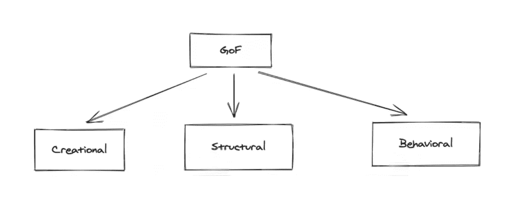
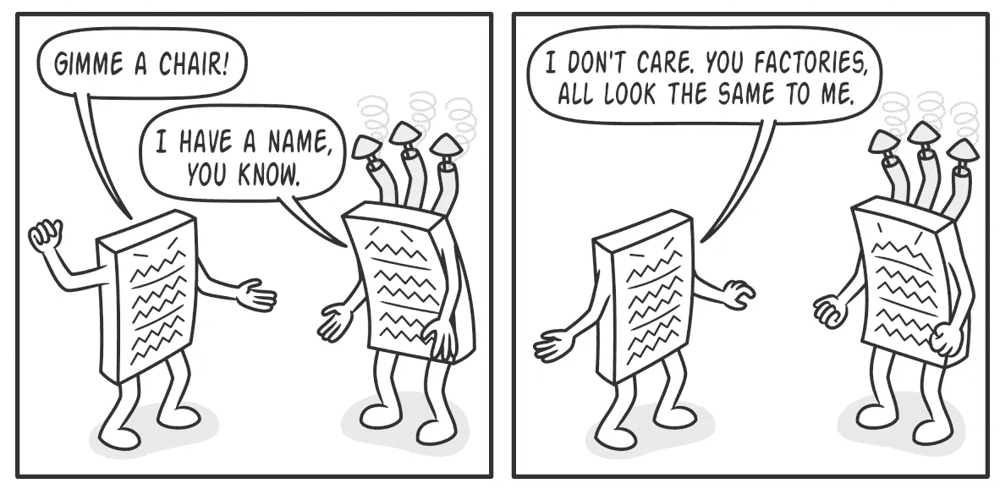
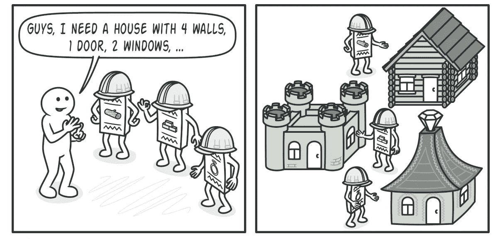
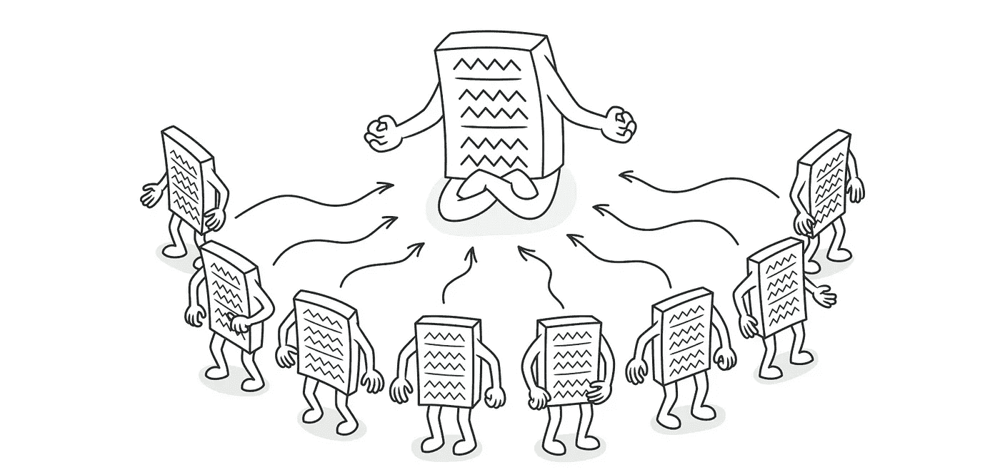

# 设计模式分类第 1 部分——创造模式

> 原文：<https://medium.com/codex/design-pattern-classifications-part-1-creational-pattern-cddcff302d29?source=collection_archive---------1----------------------->

除了经典的 23 个模式之外，还有许多非官方的和未记录在案的模式，你可能会发现它们在某些情况下很有用，你怎么知道应该学习或应用哪一个呢？一个好的起点是看一看设计模式的不同分类。虽然有三种主要的分类，但本文的重点是创造性的设计模式。我们将一起回顾什么是设计模式，以及在更详细地探究创造模式之前，用来对它们进行分类的标准。

# 设计模式评审

在我之前的[文章](https://avelonpang.medium.com/gang-of-four-design-patterns-intro-e884af24b85f)中，我们讨论了设计模式是软件设计中常见问题的成熟解决方案。您可以将它们视为预先制作的蓝图，您可以对其进行定制，以解决代码中反复出现的设计问题。设计模式不仅有用，而且被有经验的面向对象软件开发人员视为最佳实践。

# 设计模式的分类

在我们开始之前，考虑范围也很重要。范围指定模式是主要应用于类还是对象。类模式指定类和它们的子类之间的关系，而对象模式处理对象关系。

由于设计模式在细节层次、复杂性和适用范围上有所不同，因此根据它们的意图或目的对它们进行分类是很重要的。目的标准反映了模式的作用。三组主要模式，分别是*创造*模式、*结构*模式和*行为*模式。然而，出于本文的目的，我们将把重点放在创造性的设计模式上。**创建模式的目的是提供对象创建机制，增加现有代码的灵活性和重用性。下面的讨论概述了五种创造模式的适用性和优缺点。**

# ***工厂法***

当您事先不知道代码应该处理的对象的确切依赖类型时，应该考虑这种方法。它不仅提供了在超类中创建对象的接口，还允许子类改变将在其中创建的对象的类型。这是一种很好的方式，为用户或您的库或框架提供了一种扩展其内部组件的方式，同时通过使用现有对象而不是每次都重新构建它们来节省系统资源。

> 赞成的意见

*   有助于避免创作者和具体产品之间的紧密耦合
*   *单一责任原则—* 您可以将产品创建代码提取到一个地方，使代码更容易支持
*   *开放/封闭原则—* 您可以在不破坏现有客户代码的情况下向计划中引入新类型的产品

> 骗局

*   因为您需要引入许多新的子类来实现这种模式，所以代码变得更加复杂的风险很高

# ***摘要*** ***工厂***

当您的代码需要与各种系列或相关产品一起工作，但是为了将来的可扩展性而依赖于这些产品的具体类时，这是一个很好的设计。这是因为它允许您生成相关对象的系列，而无需指定它们的具体类。换句话说，抽象工厂设计创建了几个类族的实例。这可用于创建跨平台 UI 元素，而无需将客户端代码耦合到具体的 UI 类，同时保持所有创建的元素与选定的操作系统一致。

> 赞成的意见

*   避免具体产品和客户代码之间的紧密耦合
*   你从工厂得到的产品是相互兼容的
*   *单一责任原则*
*   *打开/关闭原理*

> 骗局

*   代码有可能变得比它应有的更复杂，因为随着模式的引入，引入了许多新的接口和类

# 建设者

构建器模式允许您一步一步地构建或构造复杂的对象，允许您使用相同的构造代码生成对象的不同类型和表示。如果有一个复杂的嵌套对象需要一步一步的努力，这种设计可以让你避免构建者初始化的麻烦。构建器有助于创建复杂的复合树，因为您可以对其构建步骤进行递归编程。最终，这种设计将对象构造和它的表示分离开来。

> 赞成的意见

*   您可以一步一步地构造对象，或者递归地推迟构造步骤
*   在构建产品的各种表示时，重用相同的构造代码
*   *单一责任原则—* 您可以将结构代码从产品的业务逻辑中分离出来

> 骗局

*   由于模式需要创建多个新类，增加了代码的复杂性

# 原型

这种创造性设计模式的目的是让您复制现有对象，而不使您的代码依赖于其他类。支持克隆的对象称为*原型*。当您的对象有几十个字段和数百种可能的配置时，这是一个值得考虑的好方法，因为克隆它们可以作为子类化的替代方法。

> 赞成的意见

*   克隆对象而不耦合到它们的具体类
*   摆脱重复的初始化代码，支持克隆预先构建的原型
*   更方便地生产复杂物品的能力
*   在处理复杂对象的配置预设时，获得继承的替代方法

> 骗局

*   克隆具有循环引用的复杂对象可能非常棘手

# 一个

singleton 模式允许您确保一个类只有一个实例，同时提供到该实例的全局访问点。这是可能的，因为 Singleton 的所有实现都将默认构造函数设为私有，以防止其他对象对 Singleton 类使用 *new* 操作符。当程序中的一个类只有一个实例可供所有客户端使用时，应该使用这种设计；例如，由程序的不同部分共享的单个数据库对象。当您需要对全局变量进行更严格的控制时，也应该使用单例模式。

> 赞成的意见

*   确定一个类只有一个实例
*   获得实例的全局访问点
*   singleton 对象只有在第一次被请求时才会被初始化

> 骗局

*   违反单一责任原则
*   当程序的组件彼此了解过多时，可能会出现糟糕的设计
*   可能需要在多线程环境中进行特殊处理，以便多个线程不会多次创建一个单一对象
*   可能很难对单体的客户端代码进行单元测试，因为许多测试框架在生成模拟对象时依赖于继承
*   促进应用程序中类之间的紧密耦合

# 结论

您注意到这些设计模式中的一个共同问题了吗？其中大部分都是对复杂性的担忧。**只有当这些模式对你有用并能简化代码时，才必须使用它们，而不是当它们使你的代码变得复杂时。既然您已经熟悉了创造性的设计模式，那么您将会对实现哪种设计以及何时实现有一个更好的想法。为了重申它的重要性，我鼓励您找到更多关于这些设计模式的信息，因为这是一篇介绍性文章，并且记住在生产代码中使用模式来限制代码复杂性或混淆之前，首先要单独实践它们。**

*敬请关注设计模式分类第二部分——结构模式*

编码快乐！

*   [设计模式的基本 OOP 概念视频](https://www.youtube.com/watch?v=vNHpsC5ng_E)
*   [设计模式幻灯片](https://www.slideshare.net/ElyesMejri/design-patterns-201385042)