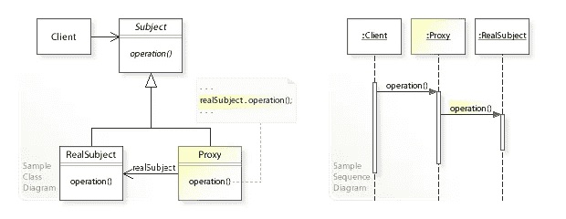
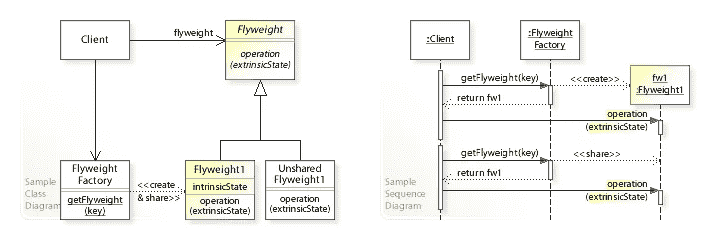
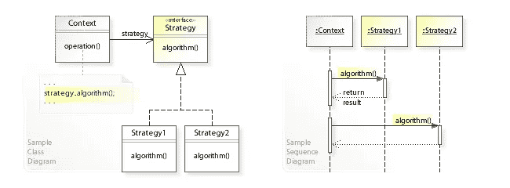

# 设计模式备忘单

> 原文：<https://medium.com/codex/design-patterns-cheat-sheet-5195330607ea?source=collection_archive---------4----------------------->

## 代理、轻量级和策略模式都在今天的餐桌上

[来自 Envato Elements 的 sianstock 的图像](https://elements.envato.com/design-team-planning-for-a-new-project-PT5DFCH)

无论您精通哪种编程语言，了解一些基本的设计模式总是很重要的，这些模式会让您的代码架构看起来更好。毕竟，没有什么能比一个写得很好的程序更容易被其他人维护了。

软件工程师发明了设计模式来模板化软件工程中的常见概念。这些模式中的大部分自然出现在许多程序中，并且模板被特别设计为在特定的设置中尽可能高效地使用。

因为我希望各种语言的开发人员都能读到这篇文章，所以我不会为每种设计模式列举代码示例，因为那些不懂这种语言的人会觉得很难理解。UML 图是通向这里的路。

# 代理模式

图片来自 wikipedia.org

当我们希望资源由代理管理而不是直接管理时，就使用代理模式。代理模式特别有效的一种情况是在 web 内容加载期间，当网络请求下载实际内容时，在屏幕上显示一个带有移动渐变的框。代理模式的其他用途是充当远程资源之间的中间人，将代码的昂贵部分抽象到另一个类中，实现对资源的访问控制，或者实现资源锁定。

代理模式由一个包含所有资源方法的接口和两个具体实现该接口的不同类组成。这些类应该有一个受保护的构造函数、虚拟的 get & set 方法和一个调用构造函数本身的静态函数。如果你的语言不支持接口，使用一个抽象类，并使这两个类成为子类。确保你覆盖了所有属于“接口”(实际上是抽象类)的方法。

其中一个子类应该是真正的资源管理器，另一个子类应该是充当资源管理器的代理。

当您的资源管理是在程序的主函数内部而不是在后台完成时，使用代理模式最有意义。

# 轻量级

图片来自 wikipedia.org

Flyweight 模式用于同时作用于几个对象，这些对象都具有几乎相同的属性。对于所有有效的常量类属性，flyweight 只使用一个类——其余需要更改的状态作为参数传递给 flyweight 对象必须支持的方法，这些方法在 Flyweight 类本身内部实现。

flyweight 类的经验法则是**永远不要更新内部状态**。它应该保持不变，以保存它给我们节省的内存。因此，所有内在状态都应该标记为私有。

可变状态应该总是通过方法参数传递，并存储在一个上下文管理器对象中，该对象对应于但不是其 flyweight 类的成员。

您仍然可以在 flyweight 类中使用层次关系，但是这必须在作为参数传递的上下文对象的类层次结构中表示。

# 战略

图片来自 wikipedia.org

策略模式允许您基于用户输入定义不同的方法来执行任务，因此使用相同的策略。这是最常用的模式之一。每当一个方法使用抽象类或接口以不同的方式计算结果时，它都在使用策略模式。策略模式旨在使代码更具可扩展性，更易于测试。

策略是使用一个接口构建的，该接口包含策略必须支持的所有操作，后面是该接口的多个不同的类实现。上下文是一个指向接口的可调用对象引用，但实际上使用的是一个实现类。

策略模式对于编写测试特别有效，因为您可以用您的类函数创建一个接口，用您的真实类创建一个实现，并创建另一个“模拟”实现，它具有所有的功能，但不影响外部状态，如数据库。您可以动态地用真实类替换模拟类。

感谢阅读。如果您对这里使用的设计模式有任何意见，请在下面留下。