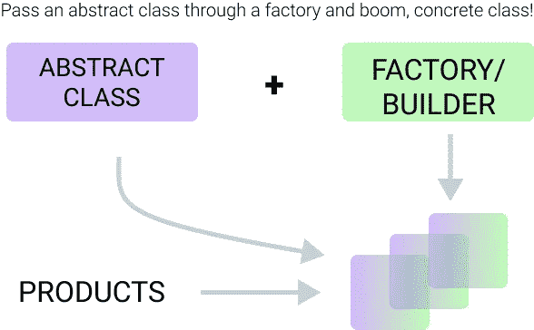

# Javascript 的设计模式—构建器模式

> 原文：<https://medium.com/codex/design-patterns-for-javascript-builder-pattern-c287c54b9b6b?source=collection_archive---------6----------------------->


设计模式——公认的做事标准是什么？

builder 模式是一种**创造**设计模式，适用于我们必须设计或构建具有多个复杂创造步骤的对象的情况。

builder 模式允许我们拥有一个基类，我们可以随时引用它，并从基类中挑选出总是可用的方法，编排它们的调用，并且通常会提出一种更直接、更简单的方法来构造目标类。

**builder 类将允许你定义创建实体、对象实例的步骤，或者也可以允许你动态地编排创建过程。**

# 一个简单的例子

假设我们有一个为团队制作茶的程序。考虑下面的代码片段

```
class Tea { constructor(chocolate, milk, sugar, honey, temperature) { return chocolate + milk + sugar + honey + temperature; }}
```

这段代码为消费者泡了一杯茶。为了简单起见，让我们假设一个非常简单的过程。将所有的材料混合在一起，然后上路。

从表面上看，这似乎很简单。接下来的几个月，这个程序可能会被第三方甚至我们自己使用，我们开始遇到一些细节问题，比如温度是四舍五入到 2 或 3 位小数吗？或者哪个先来…蜂蜜还是糖？虽然我们现在可能很容易回过头来查看类构造函数的定义，但我们可能不会一直拥有这种奢侈。这是一个我们可以使用生成器的例子。

在某种程度上，以这种方式想象一个建造者；

构建器可用于抽象精细的对象构造实现细节，并向用户呈现通用接口

如果我们把这个类写成一个 Builder 类，我们将能够抽象出一些实现细节，比如小数位数、数据类型、构造函数参数顺序等等，并把它们放到一个更友好的界面中。

目前，要构建 Tea 类的实例，我们需要执行以下代码:

设 MyTea =新茶(23，null，5，3，23.45)；

然而，使用构建器模式，我们可以按以下方式重构 Tea 类；

```
class Tea { constructor(chocolate) { // constructor now takes an argument. We could implement a zero-parameter constructor if we desire. this._chocolate = chocolate; this._milk = null; this._sugar = null; this._honey = null; this._temperature = null;} addMilk (quantity) {// we can apply transformations to the value here, much like using a setter this._milk = quantity; return this; // this is the line that does all the magic. I will explain further in a bit } addSugar (quantity) { this._sugar = quantity; return this; } addHoney (quantity) { this._honey = quantity; return this; } setTemperature (value) { let temperature = Number.parseFloat(value); // like I said, we can control how the passed values are injected into the application using this this._temperature = temperature; return this;} brewCup () { return this._chocolate + this._milk + this._honey + this._sugar + this._temperature; }}
```

现在，为了泡杯茶，我们可以这样做。

```
let MyTea = new Tea(‘Choco’);myTea.addMilk(‘milk’).addHoney(‘honey’).addSugar(‘sugar’).setTemperature(23.918).brewCup();
```

注意方法的调用顺序对最终产品并不重要。这是因为构建器模式不断地返回构建器的类实例，并且这个类实例将总是公开它的所有方法，以供消费者在任何时候调用。你真的可以做一个`.addMilk().addMilk().addMilk()`，它就会飞起来，因为由方法返回的`this`将总是携带方法。

执行构建器模式的另一种方式是使用抽象类和具体类。然而，JavaScript 没有抽象或具体实体的概念，所以如果我们不模仿抽象功能，我们可以使用的构造就很有限。然而，这个想法是你有一个创建者，一个模板/模板类叫做抽象类，你生成一个目标类或对象的实例。



为什么这可能是更好的方法？在某种程度上，目标类也可能变得足够大，以至于可以被抽象成它们自己的单独的类。为了说明构建器模式的这种方法，我们可以使用一个汽车制造公司的生产线作为例子。

假设我开一家公司，迎合中国多种交通方式。我们正在寻求大量生产自行车、汽车和轮船。我们需要建立生产线。这是生产产品的生产线。

每条线路都应适合特定的运输方式。所以，我们总共设置了 3 条生产线。

假设我们有一个工厂；

```
class VehicleFactory { constructor(builder) { this._builder = builder } build () { this._builder.step1(); this._builder.step2(); this._builder.step3(); return this._builder.getBuild(); }}
```

这是一个简单的工厂。这里没有太多的细节，虽然工厂可以变得更复杂。然而，为了本教程的目的，让我们说我们的工厂就是这么简单。

我们可以看到，这个工厂公开了一个 build 方法，然后该方法与用来初始化我们的类的 builder 进行交互，并输出一个产品。我们还可以在这里看到一个警告，我们所有的抽象类必须公开名为 step1、step2、step3 和 getBuild 的方法。然而，当我们可以创建单独的抽象类时，我们可以享受我们得到的抽象，我们享受对类的更好的控制，因为它们更小，更容易理解和思考。

```
class BicycleFactory { constructor(product) { this._product = product; } step1 () { return 'Add 2 tyres' } step2 () { return 'Add handlebar controls' } step3 () { return 'Add manual power' } getBuild () { return 'Build' }}class CarFactory { constructor(product) { this._product = product; } step1 () { return 'Add 4 tyres' } step2 () { return 'Add steering controls' } step3 () { return 'Add petrol power' } getBuild () { return 'Build' }}class ShipFactory { constructor(product) { this._product = product; } step1 () { return 'Add floatation technology' } step2 () { return 'Add rudder controls' } step3 () { return 'Add diesel power' } getBuild () { return 'Build' }}
```

我们可以看到所有三个工厂都公开了相同的接口。这就使得我们抽象的工厂有可能适应我们的工厂，创造出具体的产品。我们现在可以说

```
let AbstractCar = new CarFactory(‘car’);let AbstractBicycle = new BicycleFactory(‘bicycle’);let AbstractShip = new ShipFactory(‘ship’);let CarShop = new VehicleFactory(AbstractCar);let BicycleShop = new VehicleFactory(AbstractBicycle);let ShipShop = new VehicleFactory(AbstractShip);
```

然后，我们可以通过调用以下命令来获取具体的类:

```
CarShop.build();BicycleShop.build();ShipShop.build();
```

现在，我们再次从工厂中抽象出具体类的创建。我们已经成功地将创造的过程(实际的工厂)与产品是如何被创造出来的(抽象的工厂)分离开来；

这就是构建器模式的内容，以及如何用 Javascript 成功实现它。

# 进一步阅读

1.  [深入了解继承— OpenGenus](https://iq.opengenus.org/inheritance/)
2.  [抽象类和具体类的区别——Geeksforgeeks](https://www.geeksforgeeks.org/difference-between-abstract-class-and-concrete-class-in-java/)