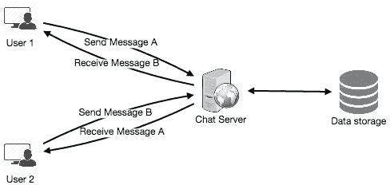
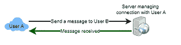
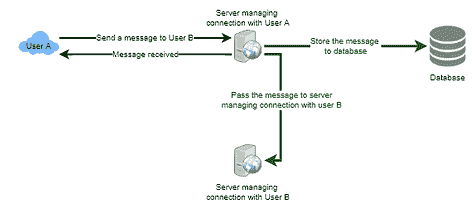
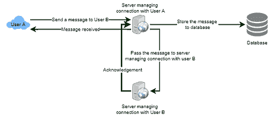
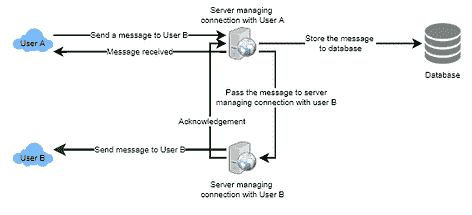
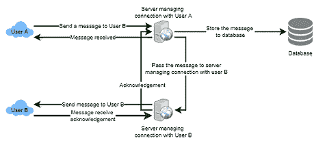
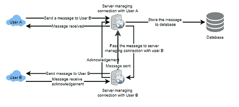
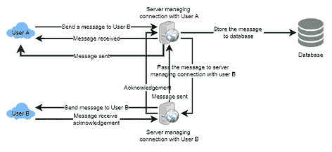
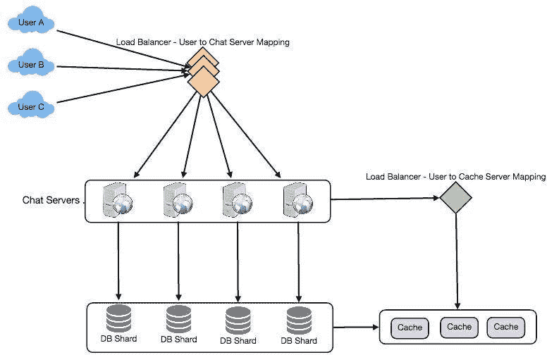

# 设计 Facebook Messenger

> 原文：<https://medium.com/codex/designing-facebook-messenger-57152a668756?source=collection_archive---------0----------------------->

## 让我们设计一个类似 Facebook Messenger 的即时通讯服务，用户可以互相发送短信。


# 什么是 Facebook Messenger？

Facebook Messenger 是一个软件应用程序，为其用户提供基于文本的即时消息服务。Messenger 用户可以通过手机和网站与他们的脸书朋友聊天。

# 系统的要求和目标

我们的信使应满足以下要求:

## 功能要求:

1.  Messenger 应该支持用户之间的一对一对话。
2.  Messenger 应该跟踪其用户的在线/离线状态。
3.  Messenger 应该支持聊天记录的持久存储。

## 非功能性需求:

1.  用户应该有一个实时聊天体验，最小的延迟。
2.  我们的系统应该是高度一致的；用户应该可以在他们所有的设备上看到相同的聊天记录。
3.  Messenger 的高可用性是可取的；为了一致性，我们可以容忍较低的可用性。

## 扩展要求:

*   群聊:Messenger 应该支持多人在一个群里互相聊天。
*   推送通知:Messenger 应该能够在用户离线时通知用户新消息。

# 容量估计和限制

假设我们有 5 亿日活跃用户，平均每个用户每天发 10 条消息；这给了我们每天 50 亿条信息。

## 存储估计

假设平均来说，一条消息是 1 KB，那么要存储一天的所有消息，我们需要 5TB 的存储空间。

50 亿封邮件* 1kb = 5tb/天

虽然 Facebook Messenger 存储了所有以前的聊天记录，但我们需要大约 10pb 的存储空间来保存五年的聊天记录。

```
5 TB * 365 days * 5 years ~= 10 PB
```

除了聊天消息，我们还需要存储用户信息、消息的元数据(ID、时间戳等。).此外，上述计算没有考虑数据压缩和复制。

## 带宽估计

如果我们的服务每天获得 5 TB 的数据，这将为我们每秒提供大约 50 MB 的传入数据。

```
5 TB / 86400 sec ~= 60 MB/s
```

由于每个传入的消息都需要发送给另一个用户，所以上传和下载都需要相同的带宽，60 MB/s。

## 高水平的估计

总信息:每天 50 亿条

每天的存储:15 TB

存储 5 年:10 PB

传入/传出数据:60mb/秒

# 高层设计

我们将需要一个聊天服务器，它将是在高层次上协调用户之间所有通信的核心部分。当一个用户想要给另一个用户发送消息时，他们会连接到聊天服务器，并将消息发送到服务器；然后，服务器将该消息传递给其他用户，并将其存储在数据库中。



详细的工作流程如下所示:

用户 A 通过聊天服务器向用户 B 发送消息。


服务器接收消息并向用户 a 发送确认。



服务器将消息存储在其数据库中，并将消息发送给用户 b。



用户 B 收到消息，并向服务器发送确认。



服务器通知用户 A，消息已经成功传递给用户 b。



# 详细的组件设计

让我们先试着构建一个简单的解决方案，所有的东西都在一台服务器上运行。在高层次上，我们的系统需要处理以下用例:

1.  接收传入消息和传递传出消息。
2.  从数据库中存储和检索消息。
3.  记录哪个用户在线或离线，并将这些状态变化通知所有相关用户。

让我们逐一讨论这些场景:

# 消息处理

## 我们如何有效地发送/接收信息？

要发送消息，用户需要连接到服务器并为其他用户发布消息。要从服务器获取消息，用户有两种选择:

*   拉动模型

用户可以定期询问服务器是否有给他们的新消息。

如果我们使用第一种方法，服务器需要跟踪仍在等待传递的消息，一旦接收用户连接到服务器请求任何新消息，服务器就可以返回所有未决的消息。为了最大限度地减少用户的延迟，他们必须非常频繁地检查服务器，大多数情况下，如果没有挂起的消息，他们将得到一个空响应。这将浪费大量资源，并且看起来不是有效的解决方案。

*   推送模型

用户可以保持与服务器的连接，并依靠服务器在有新消息时通知他们。

如果我们使用第二种方法，所有活动用户都保持与服务器的连接，那么一旦服务器收到消息，它就可以立即将消息传递给目标用户。这样，服务器就不需要跟踪未决的消息，我们将拥有最小的延迟，因为消息是在打开的连接上即时传递的。

## 客户端如何保持与服务器的开放连接？

我们可以使用 [HTTP 长轮询](/geekculture/ajax-polling-vs-long-polling-vs-websockets-vs-server-sent-events-e0d65033c9ba)。在长轮询中，客户端可以向服务器请求信息，但服务器可能不会立即响应。如果服务器在收到轮询时没有新的客户端数据，服务器不会发送空响应，而是保持请求打开，等待响应信息可用。一旦有了新的信息，服务器立即向客户机发送响应，完成打开请求。收到服务器响应后，客户端可以立即发出另一个服务器请求，以便将来进行更新。这极大地改善了延迟、吞吐量和性能。但是，长轮询请求可能会超时或收到与服务器的断开连接。在这种情况下，客户端必须打开一个新的请求。

## 服务器如何跟踪所有打开的连接，以便有效地将消息重定向到用户？

服务器可以维护一个**散列表**，其中“key”是用户 ID，“value”是连接对象。因此，每当服务器接收到某个用户的消息时，它都会在哈希表中查找该用户以找到连接对象，并在 open 请求上发送消息。

## 当服务器收到离线用户的消息时会发生什么？

如果接收者已经断开连接，服务器可以通知发送者传递失败。

如果是暂时的断开，例如，接收者的长轮询请求刚刚超时，我们应该期待来自用户的重新连接。在这种情况下，我们可以要求发送者**重试**发送消息。服务器也可以暂时存储消息，并在接收者重新连接后重试发送。

## 我们需要多少聊天服务器？

让我们为任何时候的 5 亿连接做好计划。假设一台现代服务器可以在任何时候处理 50K 个并发连接，我们将需要 **10K** 这样的服务器。

## 您如何知道哪个服务器与哪个用户保持连接？

我们可以在聊天服务器前面引入一个软件负载平衡器，将每个用户 ID 映射到一个服务器来重定向请求。

## 服务器应该如何处理“传递消息”请求？

服务器在收到新消息时需要做以下事情

1)将消息存储在数据库中

2)将消息发送给接收者

3)向发送者发送确认

聊天服务器将首先找到连接接收者的服务器，并将消息传递给该服务器，以便将其发送给接收者。

聊天服务器然后可以向发送者发送确认；我们不需要等待将消息存储在数据库中；这可以在后台发生。

## 信使如何维持信息的顺序？

我们可以为每条消息存储一个时间戳，即服务器收到消息的时间。

# 从数据库中存储和检索消息

每当聊天服务器接收到新消息时，它都需要将其存储在数据库中。为此，我们有两种选择:

1.  启动一个单独的线程，它将与数据库一起存储消息。
2.  向数据库发送异步请求以存储消息。

## 我们应该使用哪种存储系统？

我们需要有一个数据库，可以支持非常高的小更新率，并快速获取一系列记录。这是必需的，因为我们有大量的小消息需要插入数据库。在查询时，用户主要对顺序访问消息感兴趣。

我们不能使用 RDBMS/SQL 或像 MongoDB 这样基于文档的 NoSQL，因为我们无法承受每次用户接收/发送消息时从数据库中读取/写入一行。这将使我们服务的基本操作以高延迟运行，并给数据库带来巨大的负载。

像 [HBase](https://en.wikipedia.org/wiki/Apache_HBase) 这样的宽列数据库解决方案可以轻松满足我们的两个需求。HBase 是一个面向列的键-值 NoSQL 数据库，可以将一个键的多个值存储到多个列中。

*   HBase 将数据分组在一起，将新数据存储在内存缓冲区中，一旦缓冲区满了，它就会将数据转储到磁盘。这种存储方法有助于快速存储大量小数据，并通过键或扫描行范围来提取行。
*   HBase 也是存储可变大小数据的高效数据库，这也是我们的服务所需要的。

## 客户端应该如何有效地从服务器获取数据？

客户端在从服务器获取数据时应该分页。对于不同的客户端，页面大小可能会有所不同，例如，手机屏幕较小，因此我们需要在视口中显示较少的消息/对话。

# 管理用户状态

我们需要跟踪用户的在线/离线状态，并在状态发生变化时通知所有相关用户。因为我们在服务器上为所有活动用户维护一个连接对象，所以我们可以从中快速判断出用户的当前状态。在任何时候都有 5 亿活跃用户的情况下，如果我们必须向所有相关的活跃用户广播每个状态变化，这将消耗很多资源。我们可以围绕这一点进行以下优化:

1.  每当客户端启动该应用程序时，它都可以获取好友列表中所有用户的当前状态。
2.  每当一个用户向离线的另一个用户发送消息时，我们可以向发送者发送一个失败消息，并更新客户端的状态。
3.  每当用户联机时，服务器总是可以延迟几秒钟广播该状态，以查看用户是否没有立即脱机。
4.  客户端可以从服务器获取显示在用户视窗上的用户的状态。这应该不是一个频繁的操作，因为服务器正在广播用户的在线状态，我们可以暂时忍受用户陈旧的离线状态。
5.  每当客户端开始与另一个用户进行新的聊天时，我们可以提取当时的状态。

# 设计总结

客户端将打开与聊天服务器的连接以发送消息；然后，服务器会将其传递给请求的用户。每当有新消息到达时，聊天服务器会在长轮询请求上将它推送给接收用户。

所有活动用户都将保持与服务器的连接，以接收消息。服务器可以向其他相关用户广播用户的在线状态。客户端可以以较低的频率获取在客户端的视口中可见的用户的状态更新。

消息可以存储在 HBase 中，h base 支持快速的小更新和基于范围的搜索。



# 数据划分

由于我们将存储大量数据(五年 10 PB)，我们需要将数据分布到多个数据库服务器上。我们的分区方案是什么？

## 基于用户 ID 的分区

假设我们基于 UserID 的散列进行分区，这样我们可以将一个用户的所有消息保存在同一个数据库中。如果一个 DB 碎片是 4TB，我们将有“10 PB/4TB ~= 2500”个碎片持续五年。

所以我们会通过“ **hash(UserID) % 2500，**找到碎片号，然后从那里存储/检索数据。这种划分方案在获取任何用户的聊天记录时也将是快速的。

一开始，我们可以从较少的数据库服务器开始，在一台物理服务器上驻留多个碎片。因为我们可以在一个服务器上有多个数据库实例，所以我们可以很容易地在一个服务器上存储多个分区。我们的散列函数需要理解这个逻辑分区方案，以便在一个物理服务器上映射多个逻辑分区。随着存储需求的增加，我们可以添加更多的物理服务器来分布我们的逻辑分区。

## 基于 MessageID 的分区

如果我们将不同的用户消息存储在单独的数据库碎片上，那么获取一系列聊天消息将会非常慢，所以我们不应该采用这种方案。

# 隐藏物

我们可以[缓存](/geekculture/caching-b863bbce4bf)一些最近的消息(比如最近 15 条)在用户的视窗中可见的一些最近的对话中(比如最近 5 条)。因为我们决定将用户的所有消息存储在一个分片上，所以用户的缓存也应该完全驻留在一台机器上。

# 负载平衡

我们将需要一个[负载平衡器](/geekculture/load-balancing-da0bde7882f1)在我们的聊天服务器前面；它可以将每个 UserID 映射到为该用户保存连接的服务器，然后将请求定向到该服务器。

同样，我们的缓存服务器也需要一个负载平衡器。

# 容错和复制

## 当聊天服务器出现故障时会发生什么？

我们的聊天服务器与用户保持联系。如果一台服务器出现故障，我们是否应该设计一种机制将这些连接转移到另一台服务器上？

很难将 TCP 连接故障转移到其他服务器。更直接的方法是让客户端在连接丢失时自动重新连接。

## 我们应该存储用户消息的多个副本吗？

我们不能只有用户数据的一个副本，因为如果保存数据的服务器崩溃或永久停机，我们没有任何机制来恢复这些数据。为此，我们要么必须在不同的服务器上存储数据的多个副本，要么使用像[里德-所罗门编码](https://en.wikipedia.org/wiki/Reed%E2%80%93Solomon_error_correction)这样的技术来分发和复制数据。

# 扩展要求

## 群聊

我们可以在系统中拥有单独的群组聊天对象，这些对象可以存储在聊天服务器上。群聊对象由 GroupChatID 标识，并且还将维护该聊天的成员列表。

我们的负载平衡器可以根据 GroupChatID 来引导每个群聊消息。处理该群组聊天的服务器可以遍历所有聊天用户，以找到处理每个用户的连接来传递消息的服务器。

在数据库中，我们可以将所有的群聊存储在基于 GroupChatID 分区的单独的表中。

## 推送通知

在我们目前的设计中，用户只能向活动用户发送消息，如果接收用户离线，我们向发送用户发送失败消息。推送通知将使我们的系统能够向离线用户发送消息。

推送通知仅适用于移动客户端。每当有新消息或事件时，每个用户都可以从他们的设备上选择接收通知。每个手机制造商都有一组服务器，负责将这些通知推送到用户的设备上。

要在我们的系统中使用推送通知，我们需要设置一个通知服务器，它将为离线用户获取消息，并将它们发送到移动制造商的推送通知服务器，然后服务器将它们发送到用户的设备。