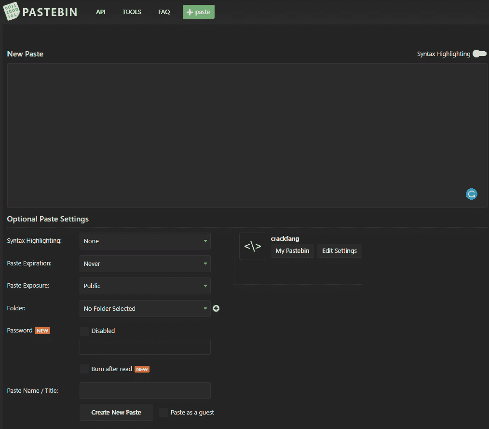
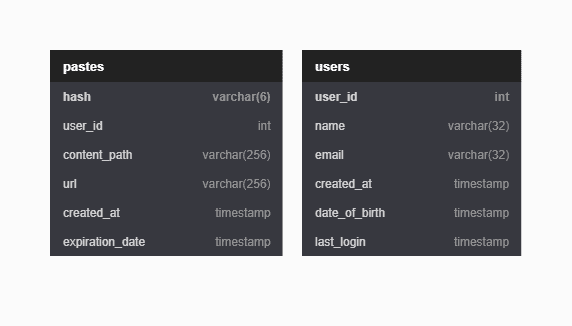
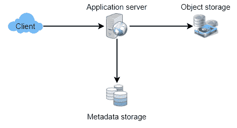
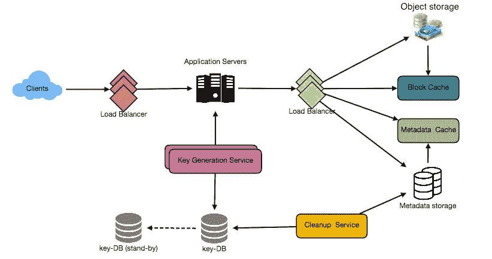

# 设计剪贴板

> 原文：<https://medium.com/codex/designing-pastebin-77e6e86172eb?source=collection_archive---------1----------------------->

## 让我们设计一个 web 服务来存储纯文本，并获得一个随机生成的 URL 来访问它。

类似服务:pasted.co、hastebin.com、chopapp.com

# Pastebin 是什么？

Pastebin.com 类似的服务使用户能够通过网络(通常是互联网)存储纯文本或图像，并生成唯一的 URL 来访问上传的数据。这种服务也用于在网络上快速共享数据，因为用户需要传递 URL 才能让其他用户看到。

如果你以前没有使用过 pastebin.com，请尝试在那里创建一个新的“粘贴”,并花一些时间浏览他们的服务提供的不同选项。这将有助于你更好地理解这一章。

# 系统的要求和目标

我们的 Pastebin 服务应满足以下要求:

## 功能需求

1.  用户应该上传或“粘贴”他们的数据，并获得一个唯一的网址来访问它。
2.  用户将只能上传文本。
3.  数据和链接将在特定时间间隔后自动过期；用户还应该指定到期时间。
4.  用户应该可以选择为他们的粘贴选择一个自定义别名。

## 非功能性需求

1.  该系统应该是高度可靠的，任何数据上传不应丢失。
2.  系统应该是高度可用的。这是必要的，因为如果我们的服务关闭，用户将无法访问他们的粘贴。
3.  用户应该能够以最小的延迟实时访问他们的粘贴。
4.  粘贴链接不应该是可猜测的(不可预测)。

## 扩展要求

1.  分析，例如，重定向发生了多少次？
2.  其他服务也应该可以通过 REST APIs 访问我们的服务。

# 一些设计考虑

Pastebin 与 URL 缩短服务有一些相同的要求，但是我们应该记住一些额外的设计考虑。

## 用户一次可以粘贴的文本数量限制应该是多少？

我们可以限制用户不要有大于 10MB 的贴子，以防止滥用这项服务。

## 我们应该限制自定义网址的大小吗？

由于我们的服务支持自定义 URL，用户可以选择他们喜欢的任何 URL，但提供自定义 URL 不是强制性的。然而，对自定义 URL 施加大小限制以获得一致的 URL 数据库是合理的(并且通常是可取的)。

# 容量估计和限制

我们的服务需要大量的阅读；与新的粘贴创建相比，将会有更多的读取请求。因此，我们可以假设读写比为 100:1。

## 交通量估计

Pastebin 服务预计不会有类似 Twitter 或脸书的流量。让我们假设每天有 100 万个新的粘贴添加到我们的系统中。假设读写比为 100:1，那么我们每天有 1 亿次读取。

每秒新贴:1M / (24 小时* 3600 秒)～= 10 贴/秒

每秒粘贴读取次数:100M / (24 小时* 3600 秒)～= 1200 次读取/秒

## 存储估计

用户最多可以上传 10MB 的数据；通常，类似 Pastebin 的服务用于共享源代码、配置或日志。这样的文本并不大，所以让我们假设每个粘贴平均包含 100 KB。

按照这个速度，我们每天将存储 100 GB 的数据。

`1M * 10KB = 100 GB/day`

如果我们希望将这些数据存储 5 年，我们将需要 180 TB 的总存储容量。

`100 GB * 365 days * 5 years ~= 180 TB`

每天有 100 万个牙膏，我们将在 5 年内拥有大约 20 亿个牙膏。

`1M * 365 * 5 ~= 2 Billion`

我们需要生成并存储密钥来唯一地标识这些粘贴。如果我们使用 base64 编码([A-Z，A-Z，0–9，.，-])我们需要六个字母的字符串:

`64⁶ ~= 68.7 billion unique strings`

如果存储一个字符需要一个字节，则存储 3.6B 密钥所需的总大小为:

`2 B * 6 = 12 GB`

12 GB 与 180 TB 相比微不足道。为了保持一定的余量，我们将假设 70%的容量模式(意味着我们不希望在任何时候使用超过总存储容量的 70%)，这将我们的存储需求提高到 260 TB。

## 带宽估计

对于每秒的写请求，我们期望每秒 10 个新的粘贴，导致每秒 1 MB 的入口。

`10 * 100 KB = 1 MB/s`

至于读请求，我们预计每秒 1000 个请求。因此，总的数据输出(发送给用户)将是 100 MB/s。

`1000 * 100 KB => 100 MB/s`

虽然总的入口和出口并不大，但在设计我们的服务时，我们应该记住这些数字。

## 内存估计

我们可以缓存一些经常访问的热粘贴。遵循 80–20 法则，也就是说 20%的热粘贴产生 80%的流量，我们希望缓存这 20%的粘贴。

由于我们每天有 1 亿个读取请求，要缓存其中的 20%,我们需要:

`0.2 * 100 M * 100 KB ~= 2 TB`

您可以随意使用这个 [Excel 文件](https://docs.google.com/spreadsheets/d/1MQ780cyE5UdK3w78tDa44064AkY3vS8cP-VbqrZkl7I/edit?usp=sharing)来获得特定于您系统的估计值。

# 数据库设计

关于我们将要存储的数据的性质的一些观察:

1.  我们需要存储大约 20 亿条记录。

`1 Million per day * 365 days * 5 years ~= 2 Billion`

1.  我们要存储的每个元数据对象都很小(小于 100 字节)。
2.  我们存储的每个粘贴对象可以是中等大小(平均 100KB，最大 10 MB)。
3.  记录之间没有关系，除非我们想存储哪个用户创建了什么粘贴。
4.  我们的服务阅读量很大。100:1 的读写比率。

## 数据库模式

我们需要两个表，一个用于存储关于粘贴的信息，另一个用于存储用户的数据。

# 高层设计

我们需要一个应用层，它将在一个高层次上服务于所有的读写请求。

应用层将与存储层通信，以存储和检索数据。

我们可以用一个数据库来隔离我们的存储层，该数据库存储与每个粘贴、用户等相关的元数据。而另一个将粘贴内容存储在某个块存储器或数据库中。这种数据划分将允许我们对它们进行单独扩展。

# 组件设计

# 应用层

我们的应用层将处理所有传入和传出的请求。应用服务器将与后端数据存储组件进行对话，以满足请求。

## 如何处理写请求？

在收到写请求时，我们的应用服务器将生成一个六个字母的随机字符串，它将作为粘贴的密钥(如果用户没有提供自定义密钥)。然后，应用服务器将把粘贴的内容和生成的密钥存储在数据库中。成功插入后，服务器可以将密钥返回给用户。

这里可能存在的一个问题是，由于重复的键，插入会失败。因为我们正在生成一个随机密钥，所以新生成的密钥有可能与现有的密钥相匹配。在这种情况下，我们应该重新生成一个新的密钥并重试。我们应该不断重试，直到我们看不到由于重复的密钥而导致的失败。如果用户提供的自定义密钥已经存在于我们的数据库中，我们应该向用户返回一个错误。

上述问题的另一个解决方案是运行一个独立的密钥生成服务(KGS ),它预先生成随机的六个字母的字符串，并将它们存储在一个数据库中(我们称之为 key-DB)。

KGS 将确保 key-DB 中插入的所有密钥都是唯一的。每当我们想要存储一个新的粘贴，我们将采取一个已经生成的密钥，并使用它。这种方法将使事情变得非常简单和快速，因为我们不用担心重复或冲突。

kg 可以使用两个表来存储密钥，一个表存储尚未使用的密钥，另一个表存储所有已使用的密钥。只要 KGS 给任何应用服务器一些密钥，它就可以将这些密钥移动到 used keys 表中。KGS 总是可以在内存中保存一些密钥，这样每当服务器需要它们时，它就可以快速地提供它们。一旦 KGS 在内存中加载了一些密钥，它就可以将它们移动到 used keys 表中。这样，我们可以确保每台服务器都获得唯一的密钥。如果 KGS 在使用所有加载到内存中的密钥之前死亡，我们将会浪费这些密钥。我们可以忽略这些键，因为我们有大量的键。

## KGS 不是单点故障吗？

是的，它是。为了解决这个问题，我们可以有一个 KGS 的备用副本，只要主服务器死亡，它就可以接管生成和提供密钥。

## 每个应用服务器可以缓存 key-DB 中的一些密钥吗？

是的，这肯定能加快速度。虽然在这种情况下，如果应用服务器在使用完所有密钥之前就死掉了，我们最终会丢失这些密钥。这是可以接受的，因为我们有 68B 个独特的六字母键，比我们需要的多得多。(我们只需要 20 亿)

## 如何处理粘贴读取请求？

收到读取请求后，应用服务层会联系数据存储。数据存储搜索该键，如果找到，则返回粘贴的内容。否则，将返回一个错误代码。

# 数据存储层

我们可以将数据存储层分为两层:

## 元数据数据库

我们可以使用像 MySQL 这样的关系数据库，或者像 Redis 或 Memcached 这样的分布式键值存储。前者更适合老牌企业，后者更适合快速成长的初创企业。有关选择数据库类型的更多详细信息，请参考本文。

## 块存储器

我们可以将我们的内容存储在分布式键值块存储中，以享受 NoSQL(如 HDFS 或 S3)提供的好处。每当我们想充分利用内容存储的容量时，我们可以通过添加更多的服务器来快速增加容量。

# 隐藏物

我们可以缓存频繁访问的粘贴。我们可以使用一些现成的解决方案，如 Memcached，它可以存储全文内容及其各自的哈希。在访问后端存储之前，应用服务器可以快速检查缓存中是否有所需的粘贴。

## 我们应该有多少缓存？​

我们可以从 20%的日流量开始，并且我们可以根据客户的使用模式来调整我们需要多少缓存服务器。根据上面的估计，我们需要 600GB 的内存来缓存 20%的日常流量。由于一台**现代服务器可以有 256GB 的内存**，我们可以轻松地将所有的缓存放入三台机器中，或者使用一些较小的服务器来存储所有这些热门 URL。

## 哪种缓存回收策略最符合我们的需求？​

当缓存满了，我们想用一个更新/更热的 URL 替换一个链接，我们该如何选择？**最近最少使用(LRU)** 可以是我们系统的合理策略。根据此策略，我们首先丢弃最近最少使用的 URL。然后，我们可以使用一个[链接的散列图](https://docs.oracle.com/javase/7/docs/api/java/util/LinkedHashMap.html)或类似的数据结构来存储我们的 URL 和散列，跟踪最近访问了哪些 URL。

为了进一步提高效率，我们可以复制我们的缓存服务器，以便在它们之间分配负载。

要了解更多细节，请参考[这篇缓存文章](/geekculture/caching-b863bbce4bf)。

## 如何更新每个缓存副本？​

无论何时出现缓存缺失，我们的服务器都会命中后端数据库。相反，每当发生这种情况时，我们可以更新缓存并将新条目传递给所有缓存副本。这也称为直写策略。参考[这篇缓存文章](/geekculture/caching-b863bbce4bf)了解更多细节。每个副本可以通过添加新条目来更新其缓存。如果副本已经有了那个条目，它可以简单地忽略它。

# 负载平衡器(磅)

我们可以在系统的三个位置添加负载平衡层:

1.客户端和应用服务器之间

2.在应用服务器和数据库服务器之间

3.在应用服务器和缓存服务器之间

最初，可以采用简单的循环法；它将传入的请求平均分配给后端服务器。这种 LB 实现起来很简单，不会引入任何开销。这种方法的另一个好处是，如果一个服务器死了，LB 将把它从轮换中去掉，并停止发送任何流量。然而，循环 LB 的一个问题是，它不考虑服务器负载。因此，如果一个服务器过载或运行缓慢，LB 不会停止向该服务器发送新的请求。为了处理这个问题，可以放置一个更智能的 LB 解决方案，定期查询后端服务器的负载，并根据负载调整流量。参考[这篇负载平衡器文章](/geekculture/load-balancing-da0bde7882f1)了解更多详情。

# 清除或数据库清理

条目应该永远保留，还是应该被清除？如果到了用户指定的到期时间，粘贴会发生什么情况？

如果我们选择搜索过期的贴子来持续删除它们，这将给我们的数据库带来很大压力。

相反，我们可以慢慢地删除过期的粘贴，做一个懒惰的清理。我们的服务将确保只有过期的粘贴将被删除，虽然一些过期的粘贴可以生存更长时间，但永远不会返回给用户。

*   每当用户试图访问过期的粘贴，我们可以删除链接，并返回一个错误给用户。
*   一个单独的清理服务可以定期运行，从我们的存储和缓存中删除过期的粘贴。该服务应该是非常轻量级的，并且被安排为仅在预期用户流量较少时运行。
*   我们可以为每次粘贴设置一个默认的到期时间(例如，两年)。
*   删除过期的粘贴后，我们可以将密钥放回 key-DB 中以供重用。

# 安全性和权限

用户可以创建私人粘贴或允许一组特定的用户访问粘贴吗？

我们可以将每次粘贴的权限级别(公共/私有)存储在数据库中。

我们还可以创建一个单独的表来存储有权查看特定粘贴的用户 id。如果我们将数据存储在 NoSQL 键值或宽列数据库中，存储权限的表的键将是“Hash”(或 KGS 生成的“key”)，列将存储那些有权查看粘贴内容的用户的 UserIDs。

如果用户没有权限并试图访问粘贴，我们可以发送一个错误(HTTP 401)回来。