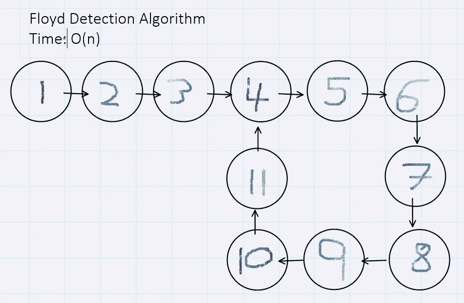

# 检测单链表中的循环

> 原文：<https://medium.com/codex/detect-a-loop-cycle-in-a-singly-linked-list-73f3cfbdb64a?source=collection_archive---------4----------------------->

## Ruby 中 Floyd 循环检测算法的详细检查

单链表中的循环的图示

在讨论 Ruby 中的数据结构和算法时，我们研究了单链表，并对它们应用了一些标准方法，包括#push、#pop、#shift、#unshift、#get、#set、#remove 和#reverse。看到[这里](/codex/data-structures-in-ruby-singly-linked-list-868cd4eb0626)和[这里](/codex/data-structures-in-ruby-singly-linked-list-part-2-42e285112bfb)的两篇文章通过…