# 使用异常检测来检测网络上的故障服务器！

> 原文：<https://medium.com/codex/detect-failing-servers-on-a-network-using-anomaly-detection-1c447bc8a46a?source=collection_archive---------6----------------------->


[来源](https://zindpublic.blob.core.windows.net/public/uploads/blog_post/image/17/big_thumb_4d7a83bc-af4a-4912-81b2-8b95d4b08322.jpg)

大家好！你过得怎么样？在本文中，我将讨论异常检测，并向您展示如何应用它来检测网络上出现故障的服务器。所以，事不宜迟，我们开始吧。

## 异常检测

异常检测是指发现**不寻常的事情、事件或观察结果**，这些事情、事件或观察结果会引起关注，因为它们与其他数据有很大差异。

## 商业世界中异常检测的例子

*   入侵检测，例如识别网络流量中的奇怪模式(这可能是黑客攻击的信号)。
*   医院健康监控系统。
*   银行信用卡交易中的欺诈检测。
*   操作环境中的故障检测。
*   检测互联网上的假新闻和错误信息。
*   行业损害检测。
*   安全和监控。

在本文中，我将使用高斯模型来检测异常的例子。我将从 2D 数据集开始。在数据集上，我将拟合高斯分布，然后找出异常。

让我们导入必要的包:

```
import numpy as np
import pandas as pd
import matplotlib.pyplot as plt
from scipy.io import loadmat
```

让我们快速加载数据集并将其可视化，

```
mat = loadmat('ex8data1.mat')
X = mat['X']
Xval = mat['Xval']
yval = mat['yval']plt.scatter(X[:, 0], X[:, 1], marker='x', alpha=0.5)
plt.xlim(0,30)
plt.ylim(0,30)
plt.xlabel("Latency (ms)")
plt.ylabel("Throughput (mb/s)")
```

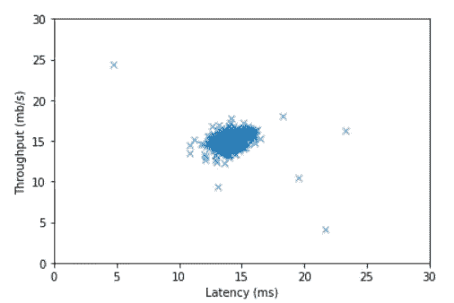

输出

我们使用**延迟**和**吞吐量**来检测网络上的故障服务器，因为我们正在寻找它们。我们可以从上面的输出中注意到它有一些异常。在本文的最后，我们会发现这样的异常。

我使用高斯模型来发现异常，如果你擅长统计，你可以跳过下一部分。如果你已经**忘记**什么是**高斯分布**，或者你不知道它是什么，那就继续读下去。而且你不需要了解太多就可以使用它，也不需要记住公式。所以不用担心。

## 高斯分布(正态分布)

比如说 x ∈ ℝ，如果 x 是一个均值为**μ，方差为**σ的分布高斯。****

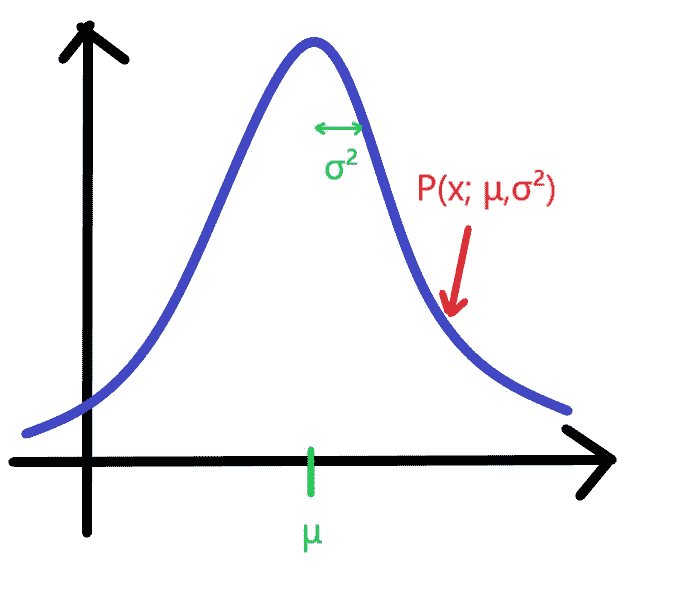

误差曲线

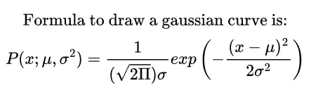

从上面的公式我们可以看出，要绘制高斯曲线，我们需要 **μ** 和 **σ** 来寻找**参数**，

假设数据集包含{x⁽ ⁾、x⁽ ⁾、…、x⁽ᵐ⁾}、x⁽ⁱ⁾ ∈ ℝ.

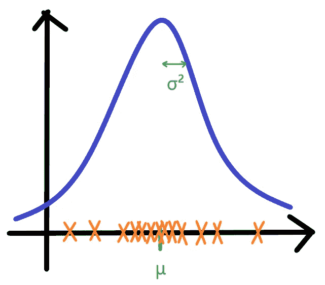

这里橙色 X 代表数据点，μ是这些数据点的平均值，方差是这些点的标准偏差。计算平均值和方差的公式如下:

## 参数估计

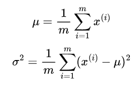

均值和方差

```
def estimateGaussian(X):
    m, n = X.shape
    mu = (1/m) * np.sum(X, axis=0)
    sigma2 = (1/m) * np.sum((X - mu)**2, axis=0)
    return mu, sigma2
```

我们使用密度估计来发现异常。

## 密度估计

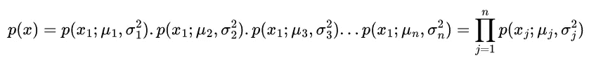

我们通过将高斯曲线公式中的每个数据点代入所得到的值相乘得到 p(x)。大写π表示从 x₁到 xₙ.取各数据点的**乘积**

## 基于高斯分布的异常检测算法

1.  选择功能 xᵢ；你认为可能预示着反常的例子。
2.  拟合参数μ₁，…，μₙ和σ₁，…，σₙ

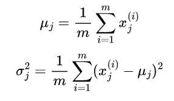

3.给定新示例 x，计算 p(x):

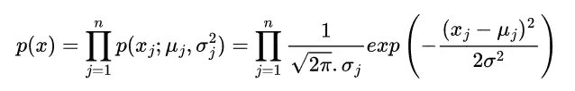

4.异常若 p(x) < ε(threshold).

## Algorithm Evaluation

1.  Fit the model p(x) on training set {x⁽¹⁾, x⁽²⁾, …, x⁽ᵐ⁾}.
2.  On a cross validation / test set example x, predict

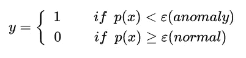

3\. Possible evaluation metrics:

*   (True, false) positive and negative,
*   Precision / Recall
*   F1 Score

4\. We can also use cross validation set to choose parameter ε.

Sometimes, it is hard for gaussian distribution to find anomalies. So, we are going to use ***多元高斯分布*** 。

## 多元高斯分布

在这项技术中，我们不采取 p(x₁)，…等。，分开。取而代之的是我们一次就得到 p(x)。

*   假设 x ∈ ℝ，不要模仿 p(x₁)，…等等。，分开。
*   型号 p(x)一气呵成。
*   参数:μ ∈ ℝⁿ，σ∈ℝⁿˣⁿ；这里σ代表**协方差矩阵**，称为**资本适马。**

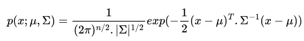

## 算法

1.  通过设置来拟合模型 p(x ):

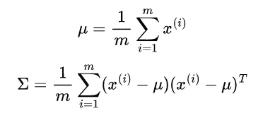

2.给定一个新的例子 x，计算 p(x)。

3.标志一个异常如果 p(x)

```
def multivariateGaussian(X, mu, sigma2):
    k = len(mu)
    sigma2 = np.diag(sigma2)
    X = X - mu.T
    p = 1/ ((2*np.pi)**(k/2) * (np.linalg.det(sigma2)**0.5)) * np.exp( -0.5 * np.sum(X @ np.linalg.pinv(sigma2) * X, axis=1))
    return pmu, sigma2 = estimateGaussian(X)
p = multivariateGaussian(X, mu, sigma2)# Visualize Distributionplt.figure(figsize=(8,6))
plt.scatter(X[:,0], X[:,1],marker="x")
X1, X2 = np.meshgrid(np.linspace(0, 35, num=71), np.linspace(0, 35, num=71))
p2 = multivariateGaussian(np.column_stack((X1.flatten().reshape(-1, 1), X2.flatten().reshape(-1, 1))), mu, sigma2)
contour_level = np.power(10, np.array([np.arange(-20, 0, 3, dtype=np.float)]))[0]
plt.contour(X1, X2, p2.reshape(X1.shape), contour_level)
plt.xlim(0,35)
plt.ylim(0,35)
plt.xlabel("Latency (ms)")
plt.ylabel("Throughput (mb/s)")
```

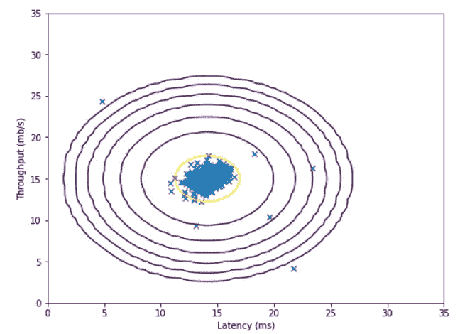

Output

From the above output, we can see that it has done some pretty distribution.

Now that we have calculated the Gaussian Distribution parameters, we can explore which examples have a very high probability and which examples have a very low probability given this distribution. The examples with a low likelihood are more likely to be anomalies. Selecting a threshold based on a cross validation set is one method for determining whether examples are anomalies.

## Select Threshold

I am not going in too detail about how to select threshold. So, I will give a link to the video, if you want to know more about it.

[**链接 1**](https://www.youtube.com/watch?v=k1JGvqr56Yk&list=PLLssT5z_DsK-h9vYZkQkYNWcItqhlRJLN&index=66) ， [**链接 2**](https://www.youtube.com/watch?v=wGw6R8AbcuI&list=PLLssT5z_DsK-h9vYZkQkYNWcItqhlRJLN&index=67) ， [**链接 3**](https://www.youtube.com/watch?v=W5meQnGACGo&list=PLLssT5z_DsK-h9vYZkQkYNWcItqhlRJLN&index=68) ， [**链接 4**](https://www.youtube.com/watch?v=5T77nG7YJhk&list=PLLssT5z_DsK-h9vYZkQkYNWcItqhlRJLN&index=69)

我们使用交叉验证集，其中标签 y=1 对应于异常示例，y=0 对应于正常示例。对于每个交叉验证的例子，我们计算 p(x_cv⁽ⁱ⁾).所有可能性的向量被传递到一个函数中，相应的标签也被传递到该函数中，该函数返回两个值ε和 F1 score。

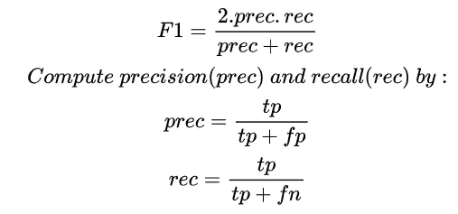

```
def selectThreshold(yval, pval):
    bestEpsilon = 0
    bestF1 = 0
    step = (max(pval) - min(pval))/1000
    epi_range = np.arange(min(pval), max(pval), step)
    for epsilon in epi_range:

        predictions = (pval < epsilon).reshape(-1, 1)

        true_positive = np.sum(predictions[yval==1]==1)
        false_positive = np.sum(predictions[yval==0]==1)
        false_negative = np.sum(predictions[yval==1]==0)

        precision = true_positive / (true_positive + false_positive)
        recall = true_positive / (true_positive + false_negative)

        F1 = (2*precision*recall)/(precision + recall)

        if F1 > bestF1:
            bestF1 = F1
            bestEpsilon = epsilon
    return bestEpsilon,  bestF1pval = multivariateGaussian(Xval, mu, sigma2)
epsilon, F1 = selectThreshold(yval, pval)
print("Best epsilon found using cross-validation:",epsilon)
print("Best F1 on Cross Validation Set:",F1)
```

选择好阈值后，我们可以看到数据集中的故障服务器。

```
plt.figure(figsize=(8,6))

plt.scatter(X[:,0],X[:,1],marker="x")

X1,X2 = np.meshgrid(np.linspace(0,35,num=70),np.linspace(0,35,num=70))
p2 = multivariateGaussian(np.hstack((X1.flatten()[:,np.newaxis],X2.flatten()[:,np.newaxis])), mu, sigma2)
contour_level = 10**np.array([np.arange(-20,0,3,dtype=np.float)])[0]
plt.contour(X1,X2,p2[:,np.newaxis].reshape(X1.shape),contour_level)

outliers = np.nonzero(p<epsilon)[0]
plt.scatter(X[outliers,0],X[outliers,1],marker ="o",facecolor="none",edgecolor="r",s=70)

plt.xlim(0,35)
plt.ylim(0,35)
plt.xlabel("Latency (ms)")
plt.ylabel("Throughput (mb/s)")
```

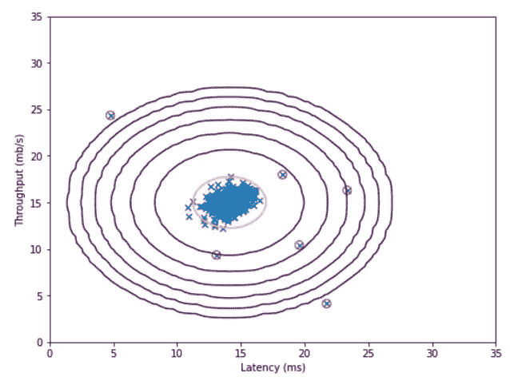

输出

## 奖金部分

在这个额外的部分，我们将在一个更真实、更困难的数据集上运行异常检测算法。在该数据集中，每个示例由 11 个特征描述，捕获计算机服务器的更多属性。

让我们加载数据集并获得参数μ和σ:

```
mat2 = loadmat("ex8data2.mat")
X2 = mat2["X"]
Xval2 = mat2["Xval"]
yval2 = mat2["yval"]mu2, sigma2_2 = estimateGaussian(X2)
```

现在，让我们将高斯分布拟合到我们的数据集，并检测其中的异常数量:

```
p3 = multivariateGaussian(X2, mu2, sigma2_2)

pval2 = multivariateGaussian(Xval2, mu2, sigma2_2)

epsilon2, F1_2 = selectThreshold(yval2, pval2)
print("Best epsilon found using cross-validation:",epsilon2)
print("Best F1 on Cross Validation Set:",F1_2)
print("# Outliers found:",np.sum(p3<epsilon2))
```

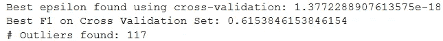

输出

它在我们的数据集中发现了 117 台故障服务器。在新的例子 x 中，它非常善于发现。

## 结论

在本文中，我们首先了解什么是异常检测，然后深入研究高斯分布，我们发现了一种比高斯分布更强大的多元高斯分布(MGD ),我们将其拟合到我们的数据集，之后我们找到了一个好的阈值并可视化我们的异常。在我们的奖金部分，我们拟合我们的数据集，有比以前更复杂的数据集，使用 MGD。最后，我们在数据集中找到了一些离群点。数据集和最终代码上传到 Github。

点击查看[。](https://github.com/jagajith23/Andrew-Ng-s-Machine-Learning-in-Python/tree/gh-pages/Anomaly%20Detection%20%26%20Recommender%20System)

# 如果你喜欢这篇文章，那么看看我以前在这个系列中关于

## 1.[什么是机器学习？](/@jagajith23/what-is-machine-learning-daeac9a2ceca)

## 2.[机器学习有哪些类型？](/codex/what-are-the-types-of-machine-learning-53360b7db8b4)

## 3.[一元线性回归](/codex/linear-regression-on-single-variable-f35e6a73dab6)

## 4.[多元线性回归](/codex/linear-regression-on-multiple-variables-1893e4d940b1)

## 5.[逻辑回归](/codex/logistic-regression-eee2fd028ffd)

## 6.[什么是神经网络？](/@jagajith23/what-are-neural-networks-3a0965e2ebfb)

## 7.[使用神经网络的数字分类器](/codex/digit-classifier-using-neural-networks-ad17749a8f00)

## 8.[利用 K 均值聚类的图像压缩](/codex/image-compression-with-k-means-clustering-48e989055729)

## 9.[使用 PCA 对人脸进行降维](/codex/dimensionality-reduction-on-face-using-pca-e3fec3bb4cee)

# 最后做的事

如果你喜欢我的文章，请鼓掌👏一个追随者将会是❤️free️❤️and 这有助于媒体推广这篇文章，以便其他人能够阅读它。*我是 Jagajith，下一集再来抓你。*