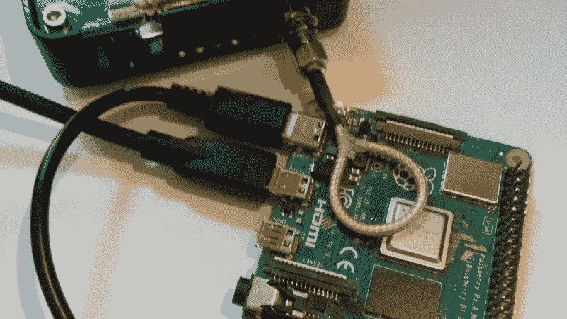

# 使用 Wireshark 检测 WiFi 干扰尝试

> 原文：<https://medium.com/codex/detect-wifi-jamming-attempts-with-wireshark-93bca4049306?source=collection_archive---------4----------------------->

作者:布莱恩·科克菲尔德

大多数 DOS 攻击是完全必要的，并利用 WPA 系统监督协会的方式中记录良好的缺陷。由于小工具用来控制这些关联的管理包是未加密的，攻击者很容易在嗅探到附近的远程信道后伪造管理包。许多设备和工具可以做到这一点，并且在互联网上有很好的记录。大多数…