# 使用机器学习检测乳腺癌

> 原文：<https://medium.com/codex/detecting-breast-cancer-using-machine-learning-c1357f2b62f8?source=collection_archive---------1----------------------->


[来源](https://www.nytimes.com/2019/10/24/well/live/machine-intelligence-AI-breast-cancer-mammogram.html)

我记得在我八年级的英语课上，有一天我们都在四处走动，说出一个我们感激的家庭成员的名字。我记得那个男孩害羞地举起手，分享他对母亲的感激，他的母亲一直在与乳腺癌作斗争。

在他分享了他母亲的故事后，许多其他人分享了他们患有乳腺癌的母亲、阿姨、祖母和近亲的名字。

这是一次令人大开眼界的经历。直到那时，我才意识到乳腺癌有多普遍。

大约八分之一的女性在她们的一生中会患上浸润性乳腺癌。每年，**仅在美国*就有超过 4 万名女性****将死于乳腺癌。*

*但更令人震惊的是，乳腺癌最显著的风险因素是性别(身为女性)和年龄(变老)。大多数乳腺癌发生在没有症状的女性身上。*

*女性无法预防或控制患乳腺癌的风险，也无法快速诊断，因为她们面临的症状和异常情况较少。*

*通过利用**机器学习**，我们可以减少被诊断患有乳腺癌和死于乳腺癌的女性人数。机器学习让我们能够更快地检测出肿瘤的存在，从而提高患者的生存机会。*

*在这个项目中，我建立了一个机器学习模型，可以将肿瘤分类为良性*，这意味着肿瘤是无害的，或者恶性*，这是一种破坏性肿瘤，可以快速生长，对患者构成严重威胁。***

***在这个项目中，我使用了三种不同的分类算法，并比较了它们的结果。我测试了逻辑回归模型、决策树分类器和随机森林分类器对肿瘤进行良性或恶性分类的结果。***

# ***1.导入库和数据集***

***构建模型的第一步是将我们的库和数据集导入到我们的 Google Colab 笔记本中。***

***我们可以从导入这个项目需要的 Python 库开始:***

```
*****import** numpy **as** np
**import** pandas **as** pd
**import** matplotlib.pyplot **as** plt
**import** seaborn **as** sns***
```

> *****pandas** :最流行的 python 库，用于数据操作和分析。在这个项目中，它主要用于数据帧操作。***
> 
> *****NumPy** :一个 python 库，提供对大型多维数组和矩阵的支持，并具有高级数学函数来帮助操作和操纵这些数组。***
> 
> *****matplotlib.pyplot** 和 **seaborn** :用于数据可视化。***

***一旦我们安装了库，我们就可以使用 pandas 导入数据集。本项目使用的数据集可以在这里下载[！它应该保存为 CSV 文件。当下载我的数据集时，我将其命名为“data.csv”，并能够导入它，如下所示。](https://www.kaggle.com/uciml/breast-cancer-wisconsin-data)***

***该程序块的最后一行将打印前 7 行数据，允许我们在**数据帧**内看到数据的输入，或**特征**，缩短为 *df* 。***

```
****from** google.colab **import** files
uploaded = files.upload()
df = pd.read_csv('data.csv')
df.head(7)**
```

**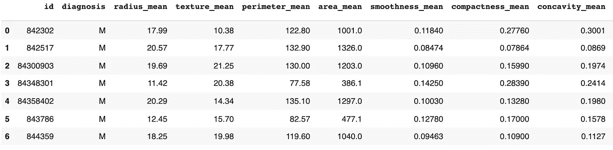**

**正如我们所看到的，第一列的标题是“id”，代表患者的 id。第二列显示患者的诊断；“M”代表 a **恶性肿瘤**，而前 7 行未显示的“B”代表**良性肿瘤**。**

**我们还可以看到其他特征，包括肿瘤的纹理、周长和面积。如果我们继续向右滚动，我们将能够在数据框中看到所有 33 个特征。**

**请注意，数据集中的第一行总是“0”因此，当我们打印前 7 行时，只打印第 0 到第 6 行，而不打印第 7 行。**

# **2.探索性数据分析**

**一旦我们导入了必要的库和数据集，我们就可以开始探索性的数据分析，这对于消除数据集中的不一致非常重要。这包括删除重复项、纠正错误和处理缺失值。**

**在项目的这一部分，我们将可视化我们的数据，并删除空值。**

**探索性数据分析的第一步是了解我们的数据包括什么和不包括什么。我们需要首先通过运行 *df.shape 来找出我们在数据集中有多少行和列。*这将返回一个“(569，33)”的输出这意味着我们有 569 行，或来自 569 名患者的数据，以及 33 列，或每个患者的 33 个输入特征。然而，并不是所有的 33 个特征都有价值。**

**接下来，我们希望看到数据框中是否存在空值，这可以通过运行 *df.isna()来实现。下一个代码块中的 sum( )* 。**

**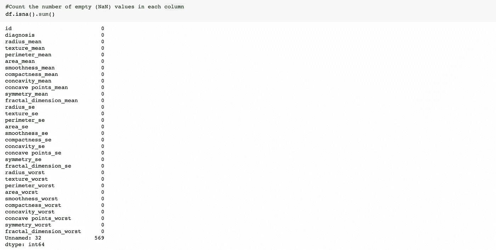**

**当我们运行这个块时，我们应该看到所有特性的列表，在右边的每一列中有空值的数量。如您所见，唯一具有空值的特性是最后一列“未命名:32”，该列完全为空。因此，我们可以通过运行 *df = df.dropna(axis = 1)* 来删除这个列。**

**如果我们在下一个代码块中运行 *df.shape* ，我们应该会看到在我们删除了其中一个特性之后，只有 32 列，或者 32 个特性。但是，仍然有 569 行，因为我们收集数据的患者数量没有变化。**

**在我们放弃这个特性后，我们可以通过运行*df[‘诊断’]来诊断是恶性(M)肿瘤还是良性(B)肿瘤。值计数()*。这表明数据集包括 357 个良性肿瘤诊断和 212 个恶性肿瘤诊断。**

**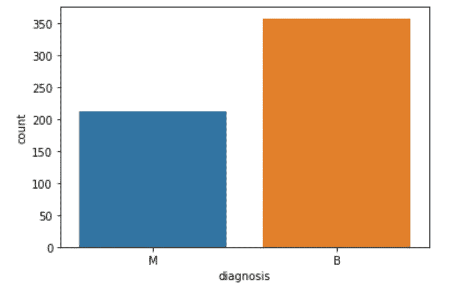**

**我们也可以通过使用 seaborn 创建一个**计数图**来可视化这些计数:**

```
**sns.countplot(df[‘diagnosis’], label=’count’)**
```

**我们探索性数据分析的下一步包括将所有数据转换或**编码为数值。在运行 *df.dtypes* 之后，我们可以看到所有的特性都是数字的(int 或 float)，除了诊断，它们都是对象数据类型。为了让算法正确使用数据，所有数据都必须是数字，这一点非常重要。****

**我们可以使用 **sklearn** 或 sci-kit learn 来实现这一点，这是一个 Python 库，具有各种分类、回归和聚类算法。**

**通过运行以下命令，我们可以在该特性中对数字数据类型进行编码:**

```
****from** sklearn.preprocessing **import** LabelEncoder
labelencoder_Y = LabelEncoder()
df.iloc[:,1] = labelencoder_Y.fit_transform(df.iloc[:,1].values)df.iloc[:,1]**
```

**在这种情况下，我们使用 *df.iloc* ，因为我们的数据帧的索引标签不是数字。使用 *df.iloc* 我们可以参考数字。例如，我们将诊断特征的值编码成数值，这是我们的数据框架中的第一列。因此，我们可以将其称为第 1 列。**

**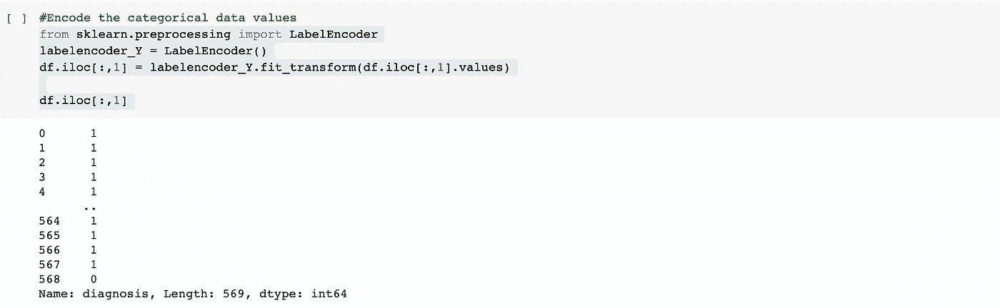**

**一旦我们这样做了，我们将能够看到用 1 和 0 表示的患者诊断。1 代表恶性肿瘤的诊断，0 代表良性肿瘤的诊断。**

**在我们将诊断编码成数值后，我们可以使用 seaborn 通过 **pairplot** 来可视化。**

**pairplot 包括来自数据帧前 6 行的信息，并将数据分成不同的颜色以显示两种可能的结果；橙色代表恶性肿瘤，蓝色代表良性肿瘤。**

**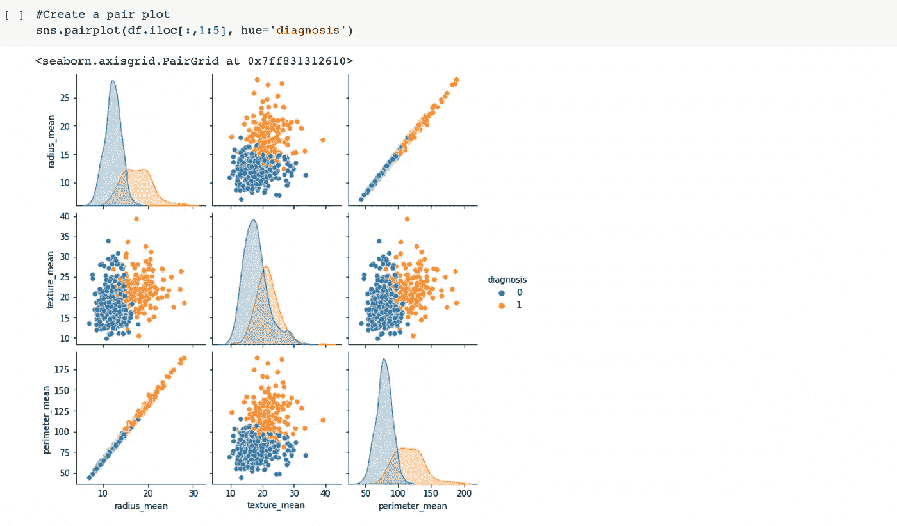**

# **3.数据可视化**

**一旦我们完成了对数据集的探索，并可视化了数据框架，我们就可以查看数据中的**相关性**。**

**首先，我们可以找到列或特征之间的相关性。以下代码将向我们展示前 12 行数据之间的相关性:**

```
**df.iloc[:,1:12].corr()**
```

**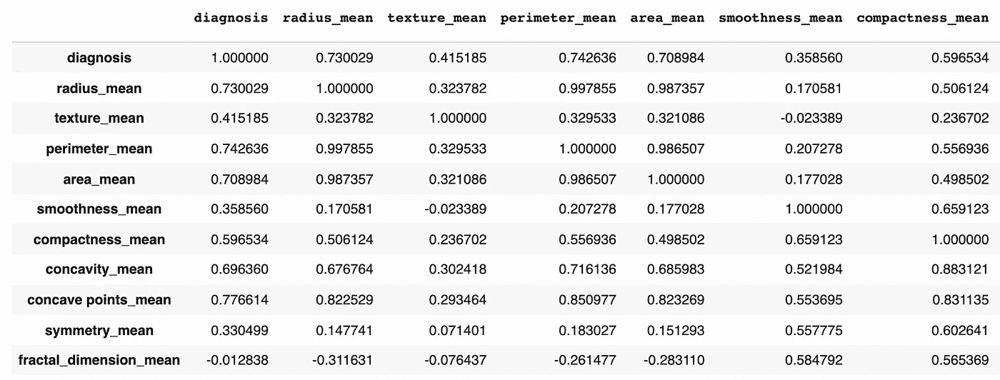**

**通过这张表，我们可以看到其他特性之间的相关性。相关性为 1 意味着存在几乎完美的相关性，而相关性为 0 意味着没有相关性。如果该值低于 0，这意味着存在反向相关性。例如，我们可以看到，与 smoothness _ mean 相比，radius_mean 对患者的诊断具有更大的影响。**

**我们还可以通过创建**热图**来可视化这种关联:**

```
**plt.figure(figsize = (10, 10))
sns.heatmap(df.iloc[:,1:12].corr(), annot = True, fmt = '.0%')**
```

***figsize* 确定了热图的大小，而第二行代码确定了热图将显示数据帧的前 12 行之间的相关性。使用 *annot = True* ，向我们显示热图中的数值，而*fmt =“. 0%”*将数值相关值转换为相关百分比。**

**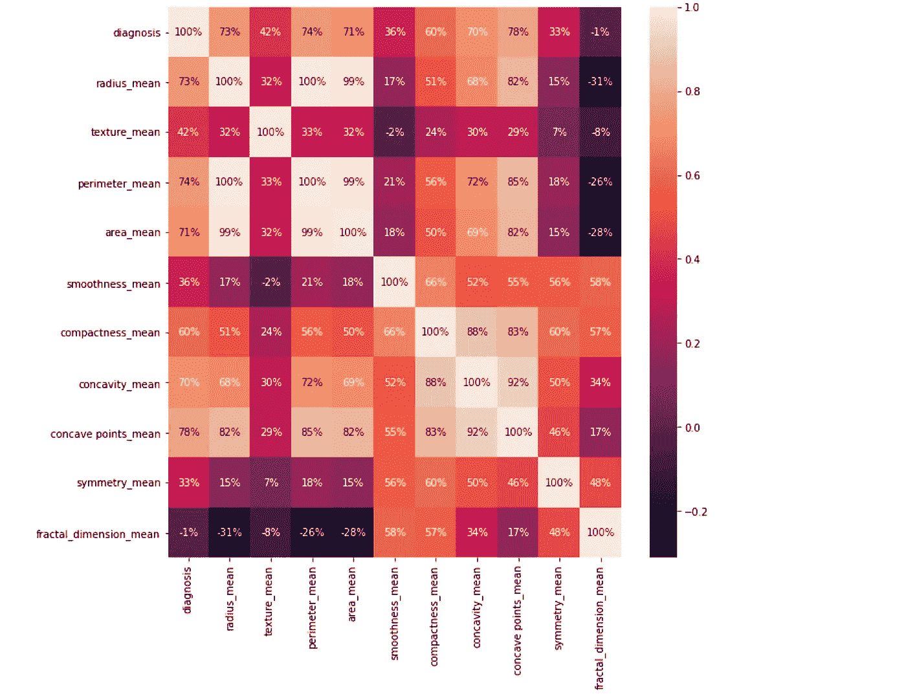**

# **4.在模型训练之前准备数据**

**在我们清理了数据并可视化了数据框架中的相关性之后，我们需要在训练模型之前准备数据。**

**首先，我们需要将数据分成独立的 X 和 Y 数据集。第一列是模型的输出，即患者的诊断，而其余 31 列是模型的特征或输入。**

```
**X = df.iloc[:,2:31].values
Y = df.iloc[:,1].values**
```

**一旦我们建立了 X 和 Y 数据集，我们可以将 75%的数据分成训练数据，25%的数据分成测试数据。**

****训练数据**仅用于训练模型。我们只需将数据输入模型，这样它就可以了解输入和输出之间的关系。**

****测试数据**在模型训练后使用。在我们完成训练和迭代之后，我们将测试数据提供给模型。模型在训练期间将永远不会看到测试数据。**

```
****from** sklearn.model_selection **import** train_test_split
X_train, X_test, Y_train, Y_test = train_test_split(X, Y, test_size = 0.25 , random_state = 0)**
```

**现在，我们需要在将数据输入算法之前对其进行缩放。缩放数据，或者说**特征缩放**，仅仅意味着我们所有的特征都符合某个范围，无论这个范围是在 0 和 1 之间还是在 0 和 100 之间。**

**为了扩展我们的数据，我们可以从 sklearn 导入 StandardScaler，并传递我们的训练和测试数据:**

```
****from** sklearn.preprocessing **import** StandardScaler
sc = StandardScaler()
X_train = sc.fit_transform(X_train)
X_test = sc.fit_transform(X_test)**
```

**现在，如果我们简单地运行 *X_train* ，我们可以看到以下值:**

**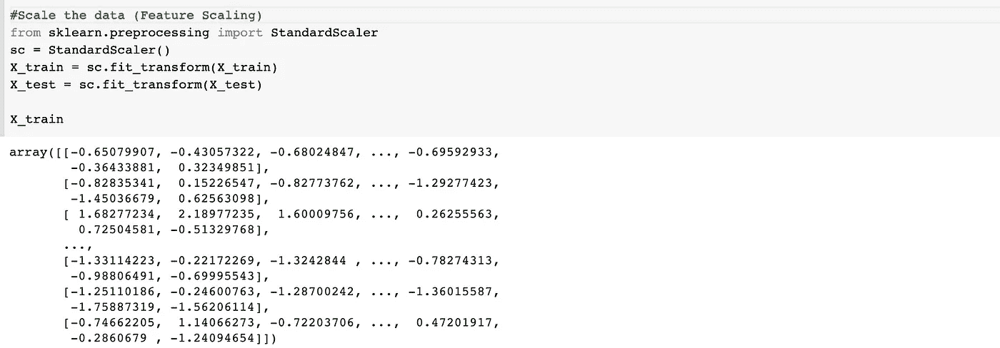**

# **5.训练和评估模型**

**在这个项目中，我测试了三种不同分类算法的准确性——逻辑回归模型、决策树分类器和随机森林分类器——并比较了它们在将肿瘤分类为良性或恶性方面的准确率。**

> ****逻辑回归:**当目标变量的值本质上是分类的时使用的算法。当数据属于一个类别或另一个类别时使用它，在这种情况下，它将肿瘤分类为良性或恶性。**
> 
> ****决策树分类:**一种树形结构形式的算法，将数据集分解成越来越小的子集。它由具有分支的决策节点和代表分类或决策的叶节点组成。
> **随机森林分类:**通过在训练时构造大量决策树来运行的算法。每个决策树都是通过随机收集数据样本构建的。**

**现在，我们对正在测试和比较的三种不同模型有了更多的了解，我们可以将我们的训练数据传递给这三种模型中的每一种:**

**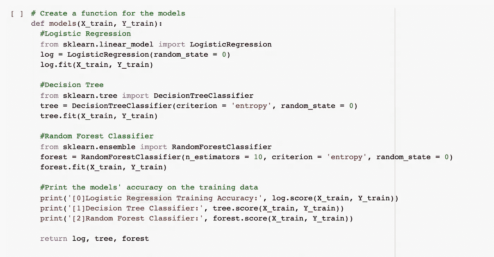**

**每个模型都遵循相似的结构。我们可以从 sklearn 中分别导入三种算法，将随机状态设置为零。在决策树分类器和随机森林分类器中，我们都需要设置 ***准则=熵*** ，用于计算决策树节点内的信息增益。**

**此外， *random_state = 0* 必须在所有三个算法中建立。将 **random_state** 设置为固定值将保证每次运行代码时生成相同的随机数序列。这有助于验证输出。**

**然后，我们可以运行 *model = models(X_train，Y_train)* 来看看这三个模型在训练数据上的准确率。**

**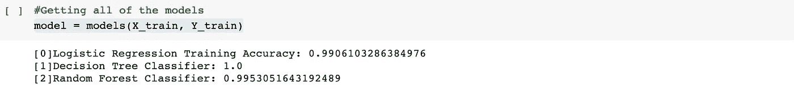**

**如我们所见，决策树分类器以 100%的准确度执行，随机森林分类器以大约 99.5%的准确度执行，而逻辑回归模型以大约 99%的准确度执行。虽然这些百分比现在可能看起来非常高，但当在测试数据上执行时，它们会下降，这是模型以前没有见过的。**

**为了在测试数据上运行模型，我们可以导入一个**混淆矩阵。**混淆矩阵将对测试数据运行模型，并告诉我们模型已分类的真阳性、真阴性、假阳性和假阴性的数量。**

******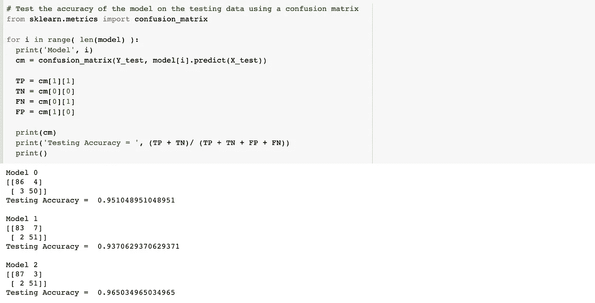**

**正如我们所看到的，模型 0，我们的逻辑回归分类器，在测试数据上已经达到大约 **95%** 的准确度。模型 1，我们的决策树分类器在测试数据上已经达到大约 **94%** 的准确度，而模型 2，我们的随机森林分类器，在我们的测试数据上已经达到大约 **96.5%** 的准确度。**

**我们可以得出结论，随机森林分类器是这个项目的最佳算法，因为它在测试数据上表现最好，尽管它在训练数据上的表现仅次于决策树分类器。**

**除了混淆矩阵之外，我们还可以为我们的每个模型编写一个**分类报告**，它测量模型所做预测的质量。**

**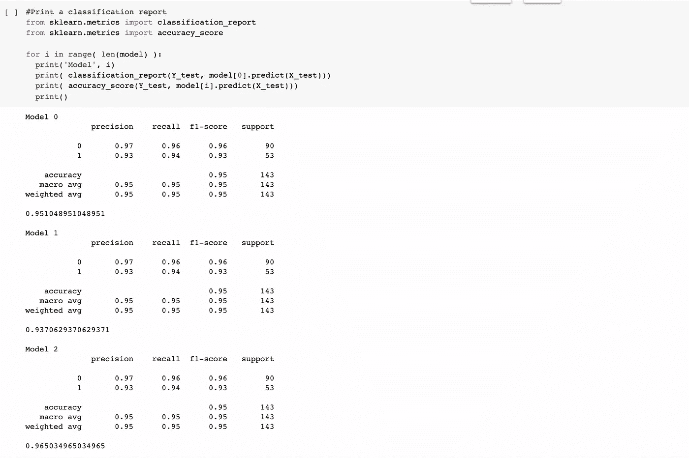**

**尽管没有一个模型表现完美，但考虑到数据的局限性，它们表现得相当好。通过继续训练模型和调整参数，我们可以继续提高预测的准确性！**

**如果你想更深入地了解这个项目是如何进行的，可以看看我用过的[教程](https://www.youtube.com/watch?v=NSSOyhJBmWY)，以及我为我的项目制作的[视频！](https://www.youtube.com/watch?v=p1wCg18f8EA&t=626s)**

> **非常感谢您阅读这篇文章！如果你从这篇文章中学到了什么，请分享！一定要[跟我联系](https://linktr.ee/manasigajjalapurna)，留下这篇文章一个掌声👏如果你喜欢的话！**

## **来源:**

**[](https://randerson112358.medium.com/breast-cancer-detection-using-machine-learning-38820fe98982) [## 使用机器学习的乳腺癌检测

### 在这篇文章中，我将向你展示如何创建你自己的机器学习 python 程序来检测乳腺癌…

randerson112358.medium.com](https://randerson112358.medium.com/breast-cancer-detection-using-machine-learning-38820fe98982) [](https://towardsdatascience.com/understanding-random-forest-58381e0602d2) [## 了解随机森林

### 该算法如何工作以及为什么如此有效

towardsdatascience.com](https://towardsdatascience.com/understanding-random-forest-58381e0602d2) [](https://towardsdatascience.com/logistic-regression-classifier-8583e0c3cf9) [## 逻辑回归分类器

### 它是如何工作的(第 1 部分)

towardsdatascience.com](https://towardsdatascience.com/logistic-regression-classifier-8583e0c3cf9) [](/swlh/decision-tree-classification-de64fc4d5aac) [## 决策树分类

### 决策树是对例子进行分类的简单表示。这是一种受监督的机器学习，其中数据…

medium.com](/swlh/decision-tree-classification-de64fc4d5aac)**