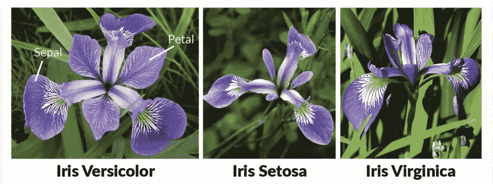
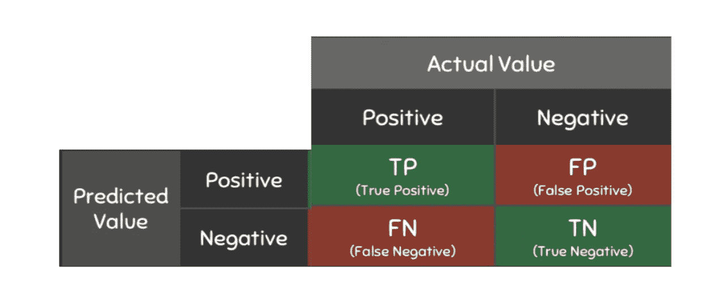

# 利用虹膜数据集检测花朵

> 原文：<https://medium.com/codex/detecting-flowers-with-the-iris-dataset-b17efe16975d?source=collection_archive---------6----------------------->



如果你正在学习机器学习，最好的方法是掌握监督学习。最受欢迎的练习之一是使用鸢尾数据集将鸢尾花分类为三个物种。这似乎是一个非常简单的问题，但对于任何正在练习机器学习的人来说，这是一个很好的起点。让我们开始吧！

# 步骤 1:提取特征和目标变量

在我们开始寻找最佳分类模型之前，我们首先需要看看数据*是否是可分类的*。首先，我从 [Kaggle](https://www.kaggle.com/uciml/iris?select=Iris.csv) 下载了数据集。从数据集中，我通过读取数据集的文件路径从数据中提取特征和目标变量:

```
import pandas as pd
import sklearn as skiris_path = "/content/drive/MyDrive/Colab Notebooks/Detecting_Flowers_Improved_Files/Iris.csv"
iris_data = pd.read_csv(iris_path)
columns = iris_data.columns
print(columns)
```

结果:

```
Index(['Id', 'SepalLengthCm', 'SepalWidthCm', 'PetalLengthCm', 'PetalWidthCm','Species'], dtype='object')
```

现在我知道花瓣长度、花瓣宽度、萼片长度、萼片宽度是我的**特征**，物种栏是我的**目标变量**。但在这一点上，我仍然不知道每个物种在数据集中的分布。这决定了我是否需要在训练我的模型之前预处理我的数据。为了进行检查，我使用了以下代码:

```
group = iris_data.groupby('Species').size()
print(group)
```

结果:

```
Species 
Iris-setosa        50 
Iris-versicolor    50 
Iris-virginica     50 
dtype: int64
```

好了，现在我知道我的数据在物种方面是平均分布的，它有六列。是时候选择我们的目标变量了。

# 步骤 2:设置目标变量和特征

使用 Scikit Learn 的 train-test-split 功能，这个步骤非常简单。它将当前数据集分成训练子集和测试子集。要导入，请使用以下代码:

```
from sklearn.model_selection import train_test_split
```

用训练子集训练所选择的模型，并且用测试子集评估该模型。代码如下:

```
features = ['SepalWidthCm', 'SepalLengthCm', 'PetalLengthCm', 'PetalWidthCm', 'Id']train_x, val_x, train_y, val_y = train_test_split(iris_data[features], iris_data['Species'], random_state = 1)
```

这就是创建训练和测试子集的全部内容。现在是有趣的部分——挑选模特！

# 步骤 3:选择要训练的模型

在选择要训练的模型时，考虑您试图解决的问题是很重要的。在这种情况下，我们试图将花分类为 Setosa、Versicolor 或 virg nica——因此在这种情况下我们需要使用分类器。对于这个问题，我使用了四种不同的分类器——K 近邻分类器、半径近邻分类器、随机梯度下降和支持向量分类器。下面是每个分类器功能的简要介绍:

1.  k-最近邻分类器(KNN):使用给定范围内的所有数据点(例如，如果 k = 3，它将使用 3 个单位范围内的所有数据)。
2.  半径邻居分类器(RN):类似于 KNNs，它测量给定半径内最近的数据点。
3.  随机梯度下降(SGD):一种训练模型以确保误差最小的方法。
4.  支持向量分类器(SVC):通过使用数据中最佳拟合线附近的训练数据点来执行多类分类。还有助于节省内存，这也是它适用于大型数据集的原因。

要了解关于这些分类器的更多信息，请查看 Scikit Learn 的文档。

现在我们对分类器有了一些了解，我们需要从 Scikit 学习库中导入它们并实现它们。

```
from sklearn.neighbors import KNeighborsClassifier
from sklearn.neighbors import RadiusNeighborsClassifier
from sklearn.linear_model import SGDClassifier
from sklearn.svm import SVC#implementing models
kNN = KNeighborsClassifier(n_neighbors=3)
rN = RadiusNeighborsClassifier(radius = 3)
sgd = SGDClassifier()
svc = SVC()
```

现在我们已经创建了我们的模型，让我们用训练数据来拟合它们，并获得它们在测试数据上的准确性分数。

```
kNN.fit(train_x, train_y)
print("KNN prediction: {}".format(kNN.score(val_x, val_y)))rN.fit(train_x, train_y)
print("RN prediction: {}".format(rN.score(val_x, val_y)))sgd.fit(train_x, train_y)
print("SGD prediction: {}".format(sgd.score(val_x, val_y)))svc.fit(train_x, train_y)
print("SVC prediction: {}".format(svc.score(val_x, val_y)))
```

结果:

```
KNN prediction: 0.9736842105263158 
RN prediction: 0.9736842105263158 
SGD prediction: 0.5789473684210527 
SVC prediction: 0.9473684210526315
```

太好了，模型可以预测结果。但是……得到一个模型的分数并不足以衡量它预测结果的能力。这将引导我们到最后一步，我们使用模型评估技术来评估我们的模型。

# 步骤 4:评估模型的三种方法

## **估计量评分法**

我们已经使用了评估分数法，它提供了一个分数，告诉我们预测结果与实际结果有多接近。这种评分方法并不完全可靠，因为它没有考虑随机数据，或者没有比较真阳性和真阴性与假阳性和假阴性。

## **K 倍交叉验证**

K-Fold 交叉验证使训练和测试数据集中使用的数据集随机化。数据集被分成 k 个子集，其中 k-1 个子集用于训练，其余的用于模型验证。这个过程不断重复 k 次。例如，如果数据被指定为分成 5 个子集，其中每个子集被命名为 s1、s2、s3、s4 和 s5。在第一次迭代中，s1 将用于验证，而 s2、s3、s4、s5 将用于训练。在第二次迭代中，s2 将用于验证，s1、s3、s4 和 s5 将用于训练。这个过程重复 5 次，总得分作为所有得分的平均值。

好吧，它随机化了数据集，但是为什么交叉验证有用呢？当数据集中存在不平衡时，这一点尤为重要。例如，如果数据集中的杂色物种比刚毛物种多，那么 k-fold 交叉验证将非常有助于评估模型。但是如果每个物种都有相同数量的样本，为什么我们要在这个例子中使用它呢？因为我们不知道物种是否在训练和测试数据集之间平分秋色，交叉验证是确保数据真正随机化的唯一方法。

下面是我们将如何实现它:

```
from sklearn.model_selection import cross_val_score
from sklearn.model_selection import KFoldkNN = KNeighborsClassifier(n_neighbors=3)
rN = RadiusNeighborsClassifier(radius = 5)
sgd = SGDClassifier()
svc = SVC()cv = KFold(n_splits=10, random_state=1, shuffle=True)
X = np.array(iris_data[features])
Y = iris_data['Species']kEval = cross_val_score(kNN, X, Y, scoring='accuracy', cv=cv, n_jobs=1)
print("KNN CV Accuracy: %s, %s" % (mean(kEval), std(kEval)))rNEval = cross_val_score(rN, X, Y, scoring='accuracy', cv=cv, n_jobs=1)
print(f"RNN CV Accuracy: {mean(rNEval)} +/-{std(rNEval)}")sgdEval = cross_val_score(sgd, X, Y, scoring='accuracy', cv=cv, n_jobs=1)
print("SGD CV Accuracy: %s, %s" % (mean(sgdEval), std(sgdEval)))svcEval = cross_val_score(svc, X, Y, scoring='accuracy', cv=cv, n_jobs=1)
print("SVC CV Accuracy: %s, %s" % (mean(svcEval), std(svcEval)))
```

结果:

```
KNN CV Accuracy: 1.0, 0.0 
RNN CV Accuracy: 0.9933333333333334 +/-0.019999999999999997 
SGD CV Accuracy: 0.7733333333333334, 0.1818424226264781 
SVC CV Accuracy: 0.9866666666666667, 0.026666666666666658
```

啊哈！现在我们看到预测并不像我们想象的那样完美，尽管我们的数据分布相当均匀。

## **分类指标(准确度)**

分类指标由四个部分组成——准确度、召回率、精确度和 F1 分数。解释这四个因素会占用一整篇文章，但是为了简单起见，我们将只测量我们的模型做出的预测的准确性。

分类模型的性能基于许多正确或不正确的预测。最好用**混淆矩阵**来说明:



鸣谢:[https://www . kdnugges . com/2020/04/performance-evaluation-metrics-classification . html](https://www.kdnuggets.com/2020/04/performance-evaluation-metrics-classification.html)

列表示真实的实际值，而行表示分类器做出的预测值。当实际值和预测值都为正时，称为真阳性(TP)，如果它们都为假，则称为假阴性(FN)。当一个预测值是正的，但实际上应该是负的，这是一个假阳性(FP)，反之为真阴性(TN)。准确度是正确预测的总数(TP + TN)除以所有做出的预测(TP + FN + FP + TN)的度量。所以这个等式看起来像这样:

```
Accuracy = (TP + FN)/ (TP + FN + FP + TN)
```

您一定会问，为什么我们要在所有四个分类指标中衡量准确性？这是因为当目标变量平衡时，准确性是有用的(在本例中就是这样！).

唷，那是一大堆*令人困惑的*素材(明白了吗？).让我们用代码实现它吧！

```
y_true = val_y #storing the actual y validation data, see how far off the model predictskNN.fit(train_x, train_y)
rN.fit(train_x, train_y)
sgd.fit(train_x, train_y)
svc.fit(train_x, train_y)kNN_y_pred = kNN.predict(val_x)
print(f"KNN accuracy: {accuracy_score(y_true, kNN_y_pred)}")rNN_y_pred = rN.predict(val_x)
print(f"RNN accuracy: {accuracy_score(y_true, rNN_y_pred)}")sgd_y_pred = sgd.predict(val_x)
print("SGD accuracy: %s" % accuracy_score(y_true, sgd_y_pred))svc_y_pred = svc.predict(val_x)
print("SVC accuracy: %s" % accuracy_score(y_true, svc_y_pred))
```

结果:

```
KNN accuracy: 0.9736842105263158 
RNN accuracy: 1.0 
SGD accuracy: 0.7631578947368421 
SVC accuracy: 0.9473684210526315
```

现在我们对模型的性能有了更多的了解！看起来 K-最近邻是我们使用的五个分类器中最好的模型。

# **为什么模型评估如此重要？**

评估模型揭示了许多关于它们的分类技术，这有助于我们微调我们的结果。例如，如果我们只使用估计值评分方法来评估模型，那么 RNs 和 KNNs 将是最好的分类器。但是在经历了所有的技术之后，很明显 KNN 是这个问题的最佳分类器。

对花卉进行分类似乎是一个简单的问题，但它揭示了大量的技能，如探索数据集，识别特征和目标变量，以及评估模型。这些技巧适用于几乎每一个监督学习问题，并且绝对是掌握的关键！

我希望你喜欢阅读这篇文章，并发现它是有帮助的。敬请关注更多内容！