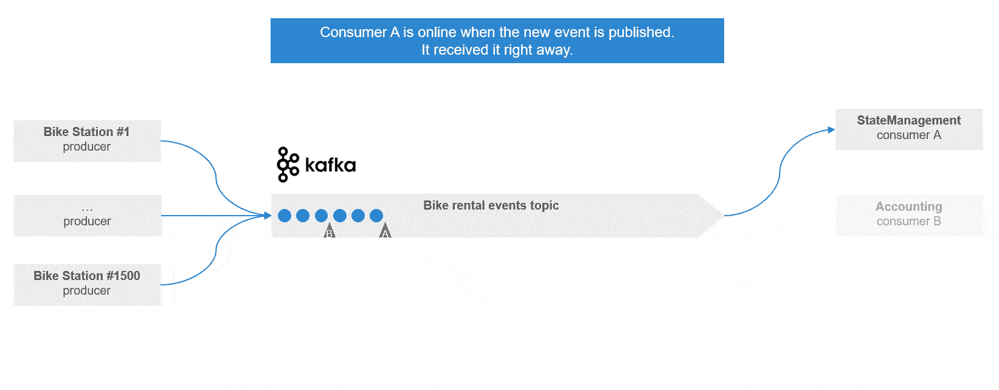
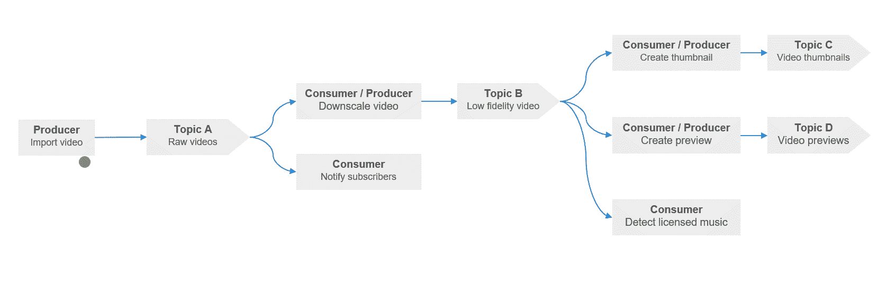
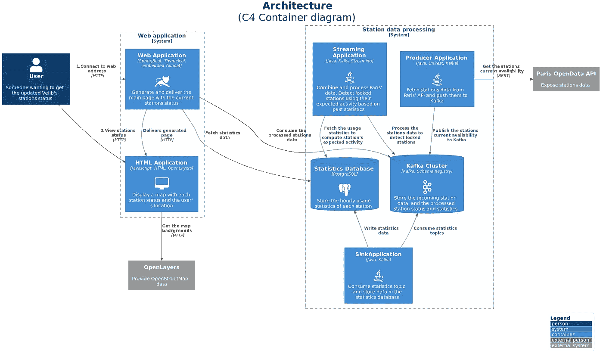
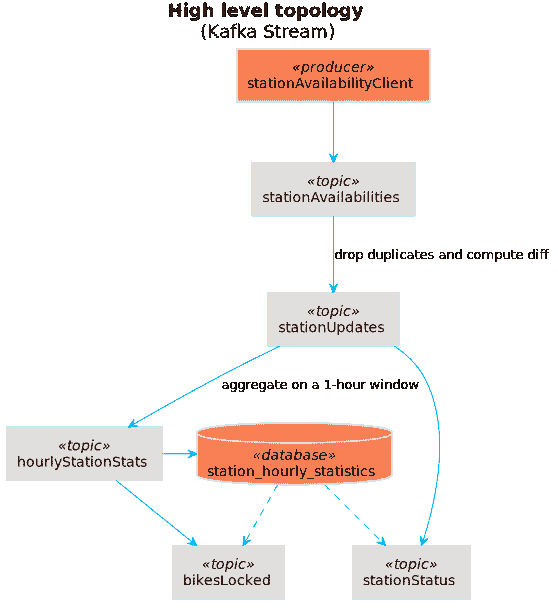
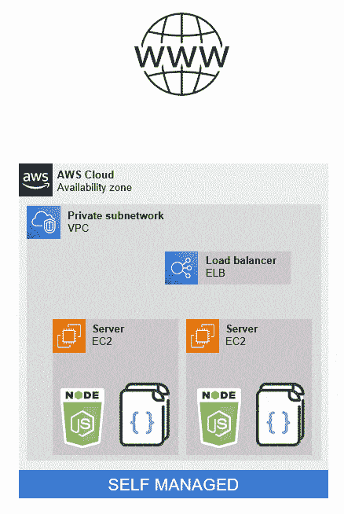
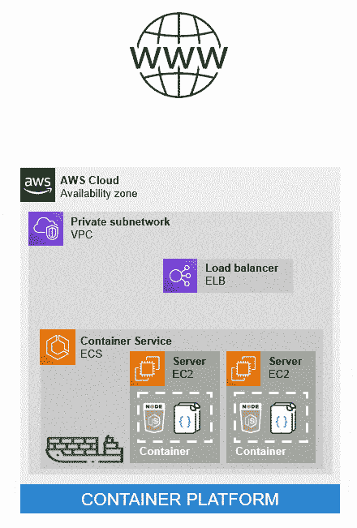
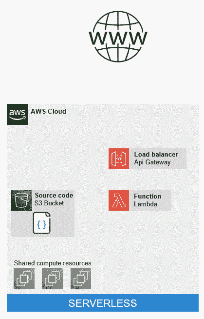
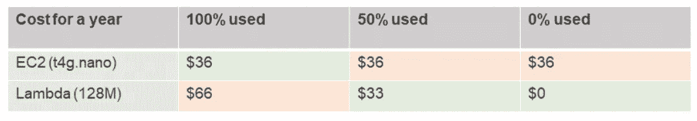
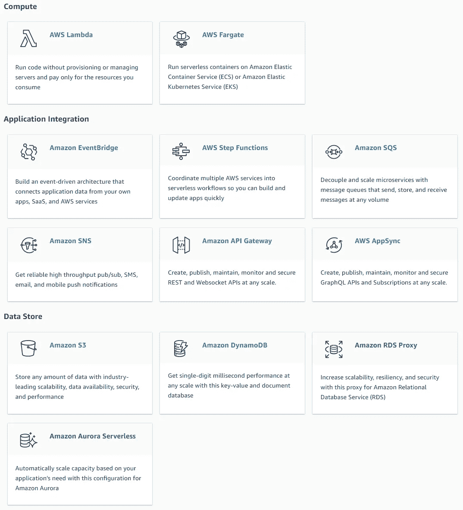
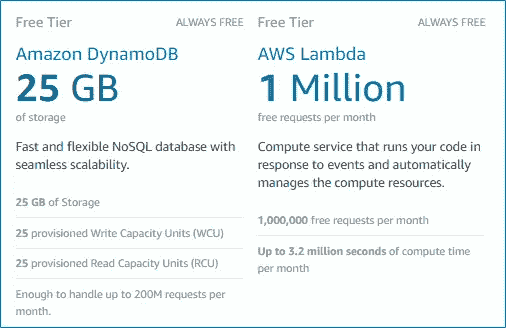

# 选择 AWS 无服务器堆栈作为原型(检测巴黎 1/5 的锁定自行车站)

> 原文：<https://medium.com/codex/detecting-locked-bicycle-stations-an-aws-serverless-story-part-1-95dcdb477649?source=collection_archive---------2----------------------->


照片由纪尧姆·邦唐/巴黎市拍摄

> 这一系列文章是关于我在学习如何使用 AWS 无服务器堆栈的同时，花了太多时间试图解决一个小问题(检测巴黎上锁的自行车站)。要查找其他文章，请跳到页面底部。

# **锁定和死站**

巴黎，2020 年 5 月，第一次封锁结束。我决定和我的一些朋友一起去野餐。因此，像许多巴黎人一样，我正前往位于城市东部边缘的巴黎最大的公园——文森公园。

天气非常适合短途骑自行车，我很快租了一辆 Velib，这是许多公共自行车中的一辆，可以在遍布城市的 1500 个车站中的任何一个出租和归还。到达公园附近后，我查看官方应用程序，寻找最近的有空位归还自行车的车站。当我靠近时，似乎有些不对劲。我看到几个人，困惑，试图出租或归还自行车。我叹气。车站被锁住了。死了。

> Velib 创建于 2007 年，很快被证明是成功的，成为世界上使用最多的自行车共享平台之一。2017 年，在最初的 10 年合同结束后，该市选择了一家新的运营商来管理和开发该网络。我们只能说改变并不顺利。三年后，主要问题已经解决，但 Velib 用户仍然面临两个常见的障碍:损坏的自行车没有被移出车站(这些自行车的座位被有问题的自行车手归还，以友好地警告下一个用户)，以及更罕见的情况是，车站被“锁定”几个小时，官方应用程序或网站上没有通知。

找到另一个电台后，我加入我的朋友，用冰啤酒洗去我的不幸。但是我不能停止想它。这不是我第一次因为一个电台不能用而不得不去找另一个电台了。为什么官方 app 没有显示该站为死站？突然停租停还自行车的站不是很容易察觉吗？有了正确的数据会有多难？

# **Velib API**

幸运的是，Velib 公开了一个[公共 API](https://www.velib-metropole.fr/donnees-open-data-gbfs-du-service-velib-metropole) 。同样的数据也可以在 Paris [OpenData](https://opendata.paris.fr/pages/home/) 项目中找到，该项目合并并公开了许多关于巴黎的公共数据(如果你曾经寻找巴黎 200，000 棵树中每一棵树的数据集，它就在那里！).

该 API 非常简单，有两个主要端点:

*   **/station_status.json** ，实时(每分钟刷新一次)返回每个站点的内容和状态。
*   **/station _ information . JSON**，返回每个站点的地理坐标和名称。

```
//station_status.json simplified structure
{
  "data": {
    "stations": [
      {
        "is_installed": 0,
        "is_renting": 0,
        "is_returning": 0,
        "num_bikes_available_types": [
          {
            "ebike": 0,
            "mechanical": 0
          }
        ],
        "num_docks_available": 0,
        "station_id": 0
      }
    ]
  }
}//station_informations.json simplified structure
{
  "data": {
    "stations": [
      {
        "lat": 0,
        "lon": 0,
        "name": "string",
        "station_id": 0
      }
    ]
  }
}
```

我本可以希望得到更多。例如，将返回给定站的过去活动的端点。或者可能是一个回调端点，它会在每次自行车被租赁或归还到车站时警告我。
但这很好。如果有足够的时间，我可以通过持续轮询 */station-status* 端点并馈送某种数据库来收集每个站点每分钟的活动。通过了解每个车站过去的活动，我应该能够知道某个车站何时停止租赁或归还自行车太久，并将其标记为“锁定”。很简单，对吧？

很久以来，我一直想了解更多关于卡夫卡和事件驱动架构的知识。接收和处理 */station-status* 端点的每次更新似乎非常适合这项技术。所以，卡夫卡，会的。

# 一次一个事件

首先，快速复习一下卡夫卡。

> Kafka 是一个可扩展的持久事件日志系统，最初是在 LinkedIn 上开发的，后来被开源了。它的一些最初的开发者离开 LinkedIn 创建了 [Confluent](https://www.confluent.io/) ，一家致力于改善 Kafka 生态系统的公司。

你可以通过两种方式与卡夫卡互动。作为发送要附加到日志(“主题”)的新事件的“生产者”。或者作为“消费者”,从主题接收事件。与消息队列相反，事件不会同步发送给使用者。它们存储在日志中，现在或以后都可以使用。卡夫卡跟踪每个消费者收到的最后一个事件，允许他们在自己的时间以自己的速度消费这些事件。如果使用者未能处理事件，事件本身不会丢失，并且可以重试。



多重消费者的卡夫卡主题

这只有一个主题。但是没有什么能阻止消费者成为另一个话题的生产者。这样，您就可以构建一个对单一源事件做出反应的应用程序，以级联方式触发不同的服务。在卡夫卡的世界里，这种由主题、消费者和生产者组成的网络被称为拓扑。



虚构的卡夫卡拓扑:Youtube 的视频导入过程

这些服务中的每一个都是独立的。它们可以用不同的语言编写。它们可以是“实时”、重复批次或一次性导出。它们可以自行扩展。

尽管如此，所有这些服务都需要与 Kafka 交互，并且经常做类似的事情:按照给定的属性对事件进行分组，丢弃其中一些事件，…

因此，发现专门用来处理这些常见任务的工具就不足为奇了。它们从轻量级库如 [Faust](https://faust.readthedocs.io/en/latest/) (python)或 [Kafka Streams](https://kafka.apache.org/documentation/streams/) (java)到全平台如 [Flink](https://flink.apache.org/) 。由于我对 Java 有一些经验，我会选择 Kafka 流。

> 事件驱动架构不仅仅是卡夫卡的事情。其他工具可以和卡夫卡一起使用，甚至混合使用。例如，Flink 支持各种事件源和接收器。

# 卡夫卡的代价

有了这些新知识，我就可以开始构建一个[小应用](https://github.com/ouvreboite/velinfo_kafka_prototype)了，它能够接收 Velib API 数据并对其进行处理，以检测(非常不精确地)锁定的站点。



基于卡夫卡的原型建筑

几个星期后，这个应用程序迅速成长为一个相当大的 Kafka+KafkaStream+PostgreSQL+spring boot+百里香叶的烂摊子。从单个 Docker 合成文件创建的整个基础设施使开发变得容易。

为了更加符合 Kafka 的“事件日志”哲学，它首先将/station-status 有效载荷转换为逐站增量更新。这基本上允许我设计应用程序的其余部分，就好像我可以订阅一个 Velib 端点，它会在每次自行车被租赁或归还到特定的站点时警告我。在此基础上，它计算每个工作站每小时的使用统计数据，并输入一个 SQL 数据库，该数据库本身用于锁定工作站检测。它还试图检测个别损坏的自行车，但没有太大的成功。



简化的卡夫卡拓扑

由此产生的 Kafka 拓扑非常简单(Kafka Stream 创建额外的隐藏主题来维护其内部状态)。总的来说，使用的主题略多于 10 个。它“有效”。但是每次我关掉我的电脑或应用程序本身，我都会在我的每小时统计数据库中创建间隙。是时候部署到生产环境中了。

这应该很简单，因为我只需要一个小型 Kafka 集群，包含大约 10 个主题和最少的复制，一个小型 SQL 实例和一两个服务器来运行其余的。由于更多地了解 AWS 也在我 2020 年的愿望清单上，我将尝试只利用 AWS 服务。

先说卡夫卡集群。有什么样的课程？

*   **完全托管**:我可以使用 [AWS MSK](https://aws.amazon.com/msk/) 。最小的实例(Kafka.t3.small)每小时的成本为 0.0456 美元。我需要全职运营它，所以这意味着…每年 400 美元
*   **自我管理**:我可以使用一个大约 2GB 内存的 [AWS EC2](https://aws.amazon.com/ec2/) 实例，并在上面安装 Zookeeper 和 Kafka。t2.small 每小时 0.023 美元，每年 200 美元。
*   **容器**:我也可以利用 Docker 并使用一个类似的 EC2 实例作为 [AWS ECS](https://aws.amazon.com/ecs) 的一部分。这将简化设置，但仍然是每年 200 美元。
*   [**AWS Kinesis**](https://aws.amazon.com/kinesis/) :和卡夫卡很像，完全管理，看起来便宜很多。但它与 Kafka Stream 不兼容，这将意味着重写应用程序的很大一部分，并选择新的流框架。
*   **树莓派**？我已经有一个树莓派了。我当然可以在上面安装我的 Kafka 集群，在我的家庭网关上打开正确的端口，并在 AWS 上托管应用程序的其余部分。我还需要向计算机之神祈祷，当我不在家修理它的时候，不要发生任何不好的事情。

看起来我可以选择花费比我预期的更多的钱(这只是为了 Kafka 集群)或者大规模修改我的应用程序。也许真正的问题不是卡夫卡的成本。也许是因为我在选择我的架构时应该考虑到我的限制。

# **回到绘图板**


Diana Polekhina 在 [Unsplash](https://unsplash.com?utm_source=medium&utm_medium=referral) 上拍摄的照片

我对这个项目有什么期望？结果应该是什么样的？

*   它应该在 AWS 上“生产”运行。
*   Velib 全天候工作，我的应用程序也应该如此。
*   如果我的月用户少于 100，我想每年花 200€ max。
*   日常运作应该是最少的。
*   用户界面看起来应该没问题。

为了减轻我的负担，我还会定义我对这个项目的期望值。

*   卡夫卡不是强制性的。在这一点上，我觉得我已经了解了很多，宁愿专注于传递一些东西。
*   锁定站检测不需要精确。我甚至不知道 Velib API 的数据是否准确。
*   我不关心代码的质量。我对架构更感兴趣，并对 AWS 有更多的了解。
*   用户界面将只有法语，因为 Velib 只在巴黎运行。
*   前端没什么特别的。我已经很熟悉 Angular 了，这样就够了。

如果我对 Kafka 的小实验教会了我一件事，如果我想保持在我的预算内，我需要更好地了解 AWS 产品及其定价。所以我要花点时间去了解一下。

# λ函数

AWS 是个大话题。每年都会增加新的服务，在试图了解这些服务时很容易迷失方向。为了帮助我专注于应用程序开发中最重要的服务，我决定通过 [AWS 认证开发者助理](https://aws.amazon.com/certification/certified-developer-associate/)认证。这花了我几个月的时间，但是我对使用 AWS 能做什么和花费多少更有信心了。它让我发现了 AWS 的无服务器产品。

> 脑海中已经有了一个副业项目，这有助于提取我一路上学到的大部分东西。所以如果你想通过这个认证，我只能建议你已经有了某种你想“移植”到 AWS 的项目

那么这个无服务器的东西是什么呢？某个地方肯定有一些服务器，对吧？

假设您想要创建某种简单的 web API。一个端点，GET */something* ，使用 NodeJs/Express 用 JavaScript 编码。



**自管理:**你租用一个“服务器”，例如，来自 AWS 的 EC2 实例。这个实例位于 AWS 内部的私有网络中(您的 [VPC](https://aws.amazon.com/vpc/) 或“虚拟私有云”)。在这种情况下，你可以随意安装任何你想要的东西。例如 NodeJs。然后您上传您的应用程序源代码/包/编译的工件，它将使用您安装的运行时运行。

如果您想扩展您的应用程序，您可以租用几个 EC2 实例，并使用一个负载平衡器将传入的请求分派给它们。您需要类似地设置它们中的每一个。



**容器平台:**为了使伸缩更容易，简化新实例的创建，可以使用容器。要么通过在每个 EC2 实例上手动安装容器服务，要么通过使用 ECS 之类的容器平台。这个平台将为您管理 EC2 实例的供应。您只需要提供容器并指定要运行的实例数量。

但是，最终，您仍然拥有这些实例，它们是您的 EC2 机群的一部分，您可以手动连接到它们。

**关于自动缩放组的快速说明:**使用自动缩放组，可以手动或自动设置您使用的实例数量。您将创建一个规则，定义实例的数量应该如何变化以及在什么范围内变化。CPU 或内存的使用经常被用来触发这种扩展。这种规则可以是:

> “如果我的实例的 CPU > 80%,则将实例数量增加到 10 个。如果我的实例的 CPU < 30%，则将实例数量减少到 1”。

关键的一点是，你总是需要至少一个实例。



**Lambda** : AWS Lambda 是一个无服务器的计算平台。您不必编写一个完整的应用程序，而是将它分成更小的“功能”，每个功能都可以独立调用。

每个函数都可以看作是一个小脚本，运行几秒或几分钟，执行一个特定的任务。例如，你可以有一个函数负责回答得到*/什么*。

当一个 Lambda 被触发时，一个可用的服务器实例被从一个全局池中取出。您的源代码被部署到它上面并运行。然后您的代码被删除，实例被释放。

一个非常简单的 Lambda 函数代码可能是这样的:

```
//a basic javascript lambda performing a REST call
const https = require('https')
let url = "[https://e](https://docs.aws.amazon.com/lambda/latest/dg/welcome.html)xample.com"exports.handler = async function(event) {
  const promise = new Promise(function(resolve, reject) {
    https.get(url, (res) => {
        resolve(res.statusCode)
      }).on('error', (e) => {
        reject(Error(e))
      })
    })
  return promise
}
```

所以你的函数仍然在服务器上运行。但你不知道是哪一个，也不在乎。

**成本呢？**

对于*自管理的*和*容器平台*，这很简单:每个实例类型作为一个小时的成本。对于 Lambdas 来说，情况稍微复杂一点:对于一个基本的 Lambda，每次调用的成本是每毫秒执行时间 0.00000002 美元(每百万 0.20 美元)+ $0.0000000021 美元，最大的一次调用高达每毫秒 0.0000001667 美元。关于 Lambda 性能的更多信息，请参阅后续文章。



最小 EC2 实例和最小 Lambda 实例之间的成本比较

最大的好处是，不用的 Lambda 是免费的。因此，对于我的项目来说，观众非常有限，高峰使用时间大约在上午 8 点和下午 5 点，使用 Lambdas 而不是让 EC2 实例大部分时间无所事事是有意义的。

# 无服务器产品

同样的原理不仅适用于计算:

*   一个数据库？DynamoDb(您为创建/读取的项目数量付费)
*   文件服务器？S3(你为创建/读取的文件数量付费)
*   负载均衡器/路由器？API 网关(您为被路由的请求数量付费)



当前的 AWS 无服务器产品

所有这些服务仍然依赖于服务器，但这些服务器是从客户机中抽象出来的，价格是根据使用情况而不是基础设施来确定的。

它们可以与经典应用程序一起使用。但是您也可以只使用无服务器服务来设计复杂的应用程序。让所有东西粘在一起的是λ函数。或者更确切地说，是什么触发了这些功能。

休息电话？一份文件被推送到 S3？SQS 发来的新消息？卡夫卡主题中的新事件？几乎任何 AWS 服务都可以触发 Lambda 函数。AWS 为更复杂的用例提供了事件管理器(如 EventBridge)和调度器(如 Step 函数)。

有些触发器非常简单(“一发不可收拾”)，但有些可能更复杂。例如，DynamoDb(一个无服务器的文档数据库)可以将事件(对象插入/更新/删除)发布为一个“流”,它本身可以触发一个函数。订阅 Dynamo 流的每个函数都有自己的事件队列，可以按照自己的节奏处理这些事件。如果 lambda 调用失败，事件将被保留以允许重试。听起来有点像卡夫卡，不是吗？

因此，结合 DynamoDb 和 Lambda，我可以重新创建与我的第一个卡夫卡原型相同的“拓扑”。

> 旁注。AWS 真正的“无服务器”卡夫卡是 Kinesis。但是，在 2020 年，DynamoDb 只支持在 DynamoDb 流中发布事件。2021 年增加了 DynamoDb 对 Kinesis 发布的支持。

让我们回到成本上。在关于 Kafka 集群成本的最初讨论中，我没有提到的一件事是 [AWS 免费层](https://aws.amazon.com/free)。

为了吸引新客户，AWS 在一些服务上提供免费服务。例如，您可以“免费”拥有一个小型 EC2 实例，但仅限于第一年。幸运的是，Lambda 和 DynamoDb 的报价非常慷慨，最重要的是，它们不会过期。



发电机和 Lambda 的 AWS 自由层

所以计划很简单:重新架构我的应用程序，以利用 AWS 无服务器服务(主要是 Lambda 和 DynamoDb ),同时保持在自由层的约束范围内。

《T2》第二部再见。


*   [第 1 部分](/codex/detecting-locked-bicycle-stations-an-aws-serverless-story-part-1-95dcdb477649):为原型选择 AWS 无服务器堆栈
*   第 2 部分:无服务器应用的主干:Lambda 函数和 DynamoDb 表
*   [第 3 部分](/codex/detecting-locked-bicycle-stations-an-aws-serverless-story-part-3-d532318dfca7):用 Lambda 函数和 DynamoDb 流实现实时检测算法
*   [第 4 部分](https://ouvreboite.medium.com/creating-a-serverless-api-and-hosting-a-frontend-with-s3-b50e61a8f707):创建一个无服务器的 API，用 S3 托管一个前端
*   [第 5 部分](/codex/performance-tuning-for-an-aws-lambda-based-api-b8b49b2d07db):基于 Lambda 的 API 的性能调优