# 无服务器应用的主干:Lambda 函数和 DynamoDb 表(检测巴黎 2/5 上锁的自行车站)

> 原文：<https://medium.com/codex/detecting-locked-bicycle-stations-an-aws-serverless-story-part-2-b1967d639699?source=collection_archive---------9----------------------->


切佩·尼科利在 [Unsplash](https://unsplash.com?utm_source=medium&utm_medium=referral) 上的照片

> 这一系列文章是关于我在学习如何使用 AWS 无服务器堆栈的同时，花了太多时间试图解决一个小问题(检测巴黎上锁的自行车站，见[第一部分](/codex/detecting-locked-bicycle-stations-an-aws-serverless-story-part-1-95dcdb477649))。要查找其他文章，请跳到页面底部。

# 获取 Velib 的数据

在[第 1 部分](/codex/detecting-locked-bicycle-stations-an-aws-serverless-story-part-1-95dcdb477649)中，为了能够检测锁定的 Velib 站，第一步是摄取 Velib API 数据。正如我们之前看到的，这个 [API](https://www.velib-metropole.fr/donnees-open-data-gbfs-du-service-velib-metropole) 公开了两个主要端点:

*   [**/station _ status . JSON**](https://velib-metropole-opendata.smoove.pro/opendata/Velib_Metropole/station_status.json)实时(每分钟刷新一次)返回每个站点的内容和状态。
*   [**/station _ information . JSON**](https://velib-metropole-opendata.smoove.pro/opendata/Velib_Metropole/station_information.json)返回每个站点的特征(地理坐标和名称)。

为了准确得到每个站内容的演变，我需要每分钟调用第一个端点。另一个可以不经常调用，因为特征很少改变。为此，我将创建两个 Lambda 函数: *FetchStationsContent* 和*fetchstations characteristics*。相应的数据将存储在 DynamoDb 表中。为了每分钟(或每小时)都“触发”我的函数，我将使用 EventBridge 规则。

下面是它的样子:

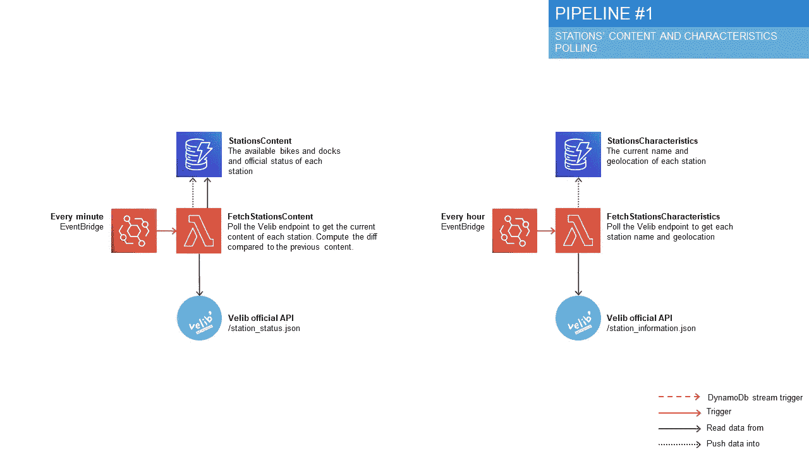

数据接收管道

# 第一功能

Lambda 函数几乎可以用任何语言编写。对于某些应用程序(如 JavaScript 或 Python)，您甚至可以将您的函数直接编码到 AWS web 控制台中。这对于快速原型来说很好，但是对于更大的项目来说并不推荐。

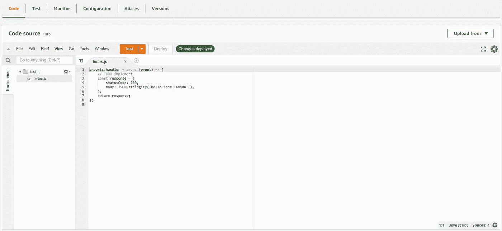

Javascript 函数的 web 编辑器

第一个 Kafka 原型的大部分代码是用 Java 编写的。但是，我将使用 Angular 作为前端，如果可能的话，我想使用单一语言，所以我将用 Typescript 编写我的函数。AWS Lambda 没有正式支持 TypeScript，但是 JavaScript 支持(您可以为您的函数选择 NodeJS 后端)，所以我只需要将我的 TypeScript 代码转换成 JavaScript，并上传到我的 Lambda。

让我们开始第一个功能(获取电台的内容)。我将首先定义一些表示域对象的类型。

然后我将使用 [Axios](https://www.npmjs.com/package/axios) 创建一个基本的 REST 客户端。

简化的 Axios 客户端

Lambda 函数本身只是使用客户端并记录内容。稍后我会将它保存在数据库中。

函数 *lambdaHandler* 就是被 Lambda 基础设施调用的*T5。之后，很简单的事情就是将它转换成 JavaScript，压缩生成的文件夹，创建函数，并使用 AWS web 控制台将代码上传到其中。*

从那里，我可以手动运行该功能，以确保一切正常。每次运行的日志将在 cloud watch(AWS 日志和警报服务)中可见。我可以看到我成功获取了 1410 个电台的内容。完美！

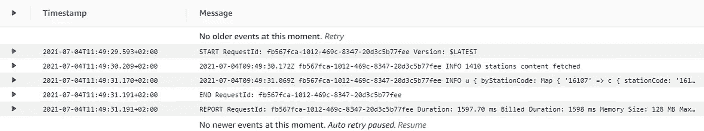

CloudWatch 中的功能日志

为了每分钟都运行这个函数，我需要返回到我的函数页面，按照步骤添加一个触发器。然后，我将选择创建一个 EventBridge 规则，并指定一个计划表达式。可以使用 CRON 表达式，以及更简单的“rate”表达式。

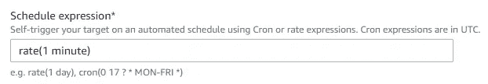

“每分钟一次”的简单 EventBridge 表达式。

如果我返回到我的函数的页面，我可以看到 EventBridge 触发器已经附加到它。该功能现在将每分钟运行一次。

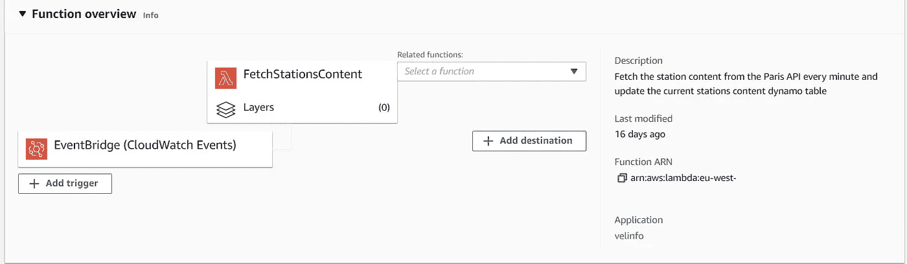

AWS web 控制台上的我的 Lambda 详细信息页面

完美。现在我有了一个非常简单的类型脚本 lambda，它将每分钟自动运行一次，并获取每个 Velib 站的当前数据。接下来，我需要将数据存储在某个地方。

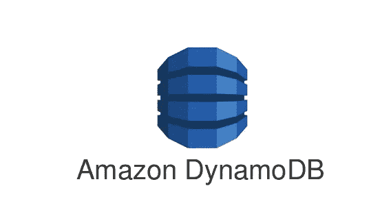

# 无服务器文档数据库 DynamoDb

DynamoDb 是一个键/值和文档的无服务器数据库。数据存储在*表*中。每个表包含*项*，它们是简单的 JSON 有效载荷。对于每个表，您必须定义项目的哪些字段将用作关键字，以唯一地标识每个项目。您可以在两个选项之间进行选择:

*   **单个*分区键*** :例如一个国家代码，如果你存储国家的特征。这就像 SQL 中一个简单的主键。
*   **一个*分区键*和一个*排序键*** :例如一个股票标识符和一个时间戳，如果你存储不同股票的历史价格。这就像 SQL 中的复合主键。

默认情况下，DynamoDb 允许您根据为表选择的键来执行 CRUD 操作。您还可以扫描所有项目，或者使用更复杂的过滤器运行查询，如果可能的话，这些过滤器还会扫描项目或利用所选的键。当您为扫描或查询的每个项目付费时(稍后将详细介绍)，避免对您的表进行完全扫描是很重要的。因此，如果您希望能够按照给定的顺序获取项目，那么拥有排序键是非常有用的。例如，如果您想要加载“最后”项，您可以使用插入时间戳作为排序关键字，并按照时间戳进行简单的查询，限制为 1。如果没有合适的排序键，您将不得不扫描所有的条目，并在代码中手动排序。

由于键的选择将影响项目的物理存储方式，一旦创建了一个表，就无法更改哪些字段用作键。您需要重新创建一个新表，并将数据迁移到该表中。

但是，如果您经常需要使用关键字以外的其他字段来查询项目，您可以定义附加索引:

*   [***【LSI】***](https://docs.aws.amazon.com/amazondynamodb/latest/developerguide/LSI.html)*允许你定义一个额外的排序键，(但你必须保持相同的分区键)。*
*   *[***全局二级索引(GSI)***](https://docs.aws.amazon.com/amazondynamodb/latest/developerguide/GSI.html) :允许你定义一对全新的分区和排序键。事实上，GSI 几乎是您的表的副本，只是存储方式不同。这意味着 GSI 可能会稍微落后于您的主牌桌，并且只被视为最终与主牌桌一致。*

*DynamoDb 还提供额外的生活质量功能，如自动删除旧项目。为此，您需要向项目添加一个字段，该字段将包含删除项目的时间戳。*

*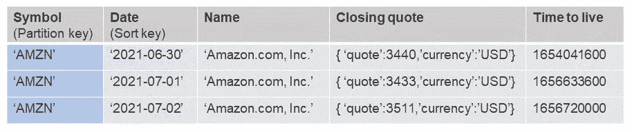*

*一个“库存”表，带有分区和分类键，以及一个生存时间字段，用于一年后自动删除。*

# *动力定价还是持续流动的方式*

*作为一种无服务器服务，DynamoDb 定价模型不是基于底层服务器实例，而是基于您如何使用服务。您需要为存储的数据量以及执行的读写操作数量付费。更准确地说，你有两个选择:*

*   *[***按需***](https://aws.amazon.com/dynamodb/pricing/on-demand/) :按本月实际完成的读/写次数付费*
*   *[***provisioned***](https://aws.amazon.com/dynamodb/pricing/provisioned/):预先定义表每秒需要多少读/写。如果您超过了，DynamoDb 将抛出一个错误，阻止您过度消费。*

*按需服务似乎更简单，但成本也更高。对于相同数量的读取/写入，调配的表的成本将降低约 6 倍。此外，Dynamo 的空闲层只涉及已配置的表，所以我将使用它。*

*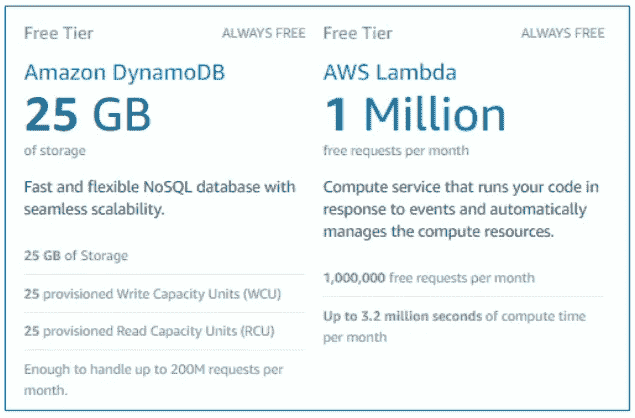*

*DynamoDb 和 Lambda 的自由层。请注意，仅涵盖“已供应”的表。*

*那么，具体来说，这种供应是如何工作的呢？*

*对于每个表，您需要定义 RCU(读容量单位)和 WCU(写容量单位)的数量。如果您希望这两个属性自动调整到给定的限制，您还可以设置自动缩放。*

*RCU 和 WCU 都表示表每秒可以支持的读写次数。更准确地说:*

*   ***1 RCU =每秒 1 次 4kb 项目的一致读取。或者每秒 2 次不一致地读取 4kb 项目** (DynamoDb 使用非锁定复制过程，这意味着写操作可能需要几秒钟才能传播到集群中的所有节点。因此，根据您的用例，您可能绝对需要一致的数据，或者您可能不介意获取陈旧的数据)。如果读取大小超过 4Kb 的项目，则每增加一个 4Kb 的块需要 1 个 RCU。*
*   ***1 WCU =每秒 1 次 1kb 项目的写入。**如果您编写的项目大小超过 1Kb，那么每增加 1Kb 的块就需要 1 个 WCU。*

> ***举例:**
> 如果你每秒(持续)读两个大小各为 8Kb 的条目，需要 4 个 RCU。阅读(不一致的)相同的项目只需要 2 RCU。写这些需要 16 个 WCU。
> 遗憾的是，如果每秒读取/写入一个大小为 0.01Kb 的项目，您仍然需要至少 1 个 RCU 和 1 个 WCU，因为 4Kb 和 1Kb 分别是读取和写入操作的最小大小。*

*但是，计划每秒的读写似乎几乎是不可能的。这就是为什么 DynamoDb 允许“突发”读写。不使用的操作最多可累积 300 秒(5 分钟)。*

> ***例子** :
> 用 1 个 RCU，如果你 2 分钟(120 秒)什么都不读，就意味着你可以在很短的时间内从你的表中(持续)读取 120s * 1 RCU * 4Kb = 960Kb 的数据。*

*因此，如果您预先知道大约每 5 分钟从您的表中读取和写入的数据量，您应该能够选择 rcu 和 wcu 的最佳数量。在我的例子中，数据代表(几乎)固定数量的站点，并且每分钟都被获取，所以这应该是可行的。*

# *成本设计*

*整个应用程序只有 25 个 rcu 和 25 个 wcu，我真的需要优化每个表。*

*让我们看看第一个表，它将存储每个站点每分钟的内容(可用自行车的数量和状态)。我如何组织数据(以及我选择哪些键)将影响我需要的 RCU/WCU 的数量。*

*那么，我可以用什么钥匙呢？*

***#1 使用车站代码作为分区关键字，日期时间作为分类关键字:***

*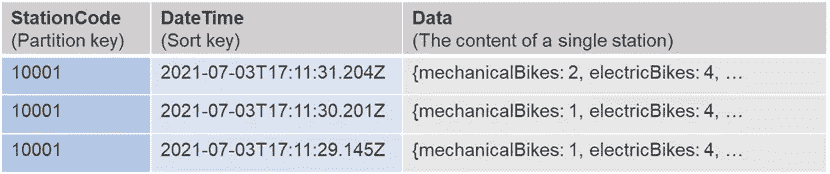*

*似乎很明显。访问特定电台的内容变得非常简单。问题是我有~1.500 个站，每个站的内容代表一个很小的有效载荷(大概 160b)。每次我想更新所有站点的内容时，我需要执行大约 1.500 次写入。即使有突发(我每 60 秒才获取一次内容)，也将达到 1.500/60 = 25 wcu！*

***#2 使用日期时间作为分区键:***

*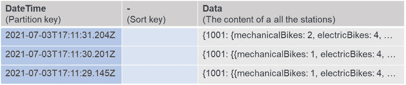*

*为了减少所需的写操作数量，我可以将每个工作站的内容存储为一个对象(使用 JavaScript 字典)。这样我将得到一个 230Kb 的大对象(低于 DynamoDb 的 400Kb 大小限制),并且我将更好地使用我的 rcu 和 wcu。但是分区键不能用于排序数据，这意味着我不能有效地获得最后更新的内容。*

***#3 仅使用日期时间作为排序关键字**:*

*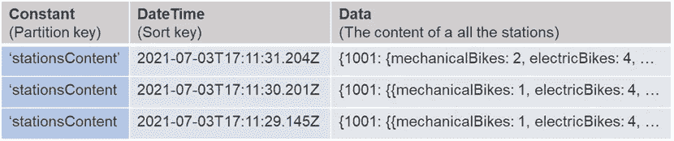*

*这在技术上是禁止的，因为分区键是强制的。但是没有什么可以阻止我使用一个简单的常量作为分区键。这样，我可以得到与解决方案#2 相同的大小优化，并且我可以很容易地基于日期时间进行排序。*

*平心而论，就性能而言，这并不是一个好的解决方案。拥有一个分区意味着 DynamoDb 将不能最优地分配我的数据。但是成本是我最大的限制。*

*让我们回顾一下每个解决方案的不同特征。*

*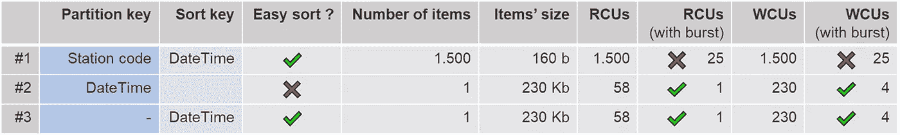*

*存储每个电台内容的不同解决方案，以及它们各自的成本和特点*

*解决方案#3 显然是赢家。*

*使用 AWS web 控制台创建表格只需几秒钟。*

*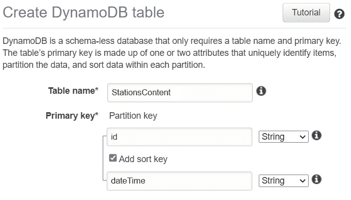*

*我不会详述如何用 TypeScript 编写 DynamoDb 存储库，因为官方 SDK 文档已经很完整了。从 TypeScript 对象到 JSON 的封送/解封时要小心。[型变压器](https://www.npmjs.com/package/type-transformer)对此很有用。不要忘记为您的函数附加正确的角色，以便它可以访问您的表。*

*而且很管用！使用的写容量刚好低于我为此表定义的 4 WCU。*

*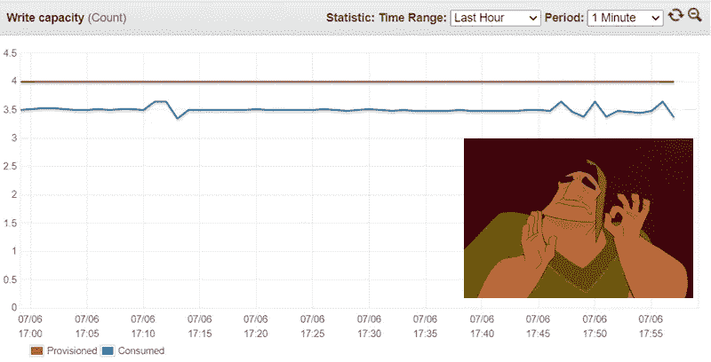*

*供应的与消耗的 wcu*

*这些成本问题在我的第一个 Kafka 原型中实现“事件”的方式和在无服务器解决方案中实现“事件”的方式之间引入了一个重大转变:以前，有了 Kafka，我可以负担得起每个工作站一个事件，结果每分钟约 1.500 个事件。现在，一个事件代表了整个电视台网络。*

# *计算增量*

*我将在 *FetchStationsContent* 函数*中做最后一件事。**

*我将为每个站点计算站点中现在的自行车数量与一分钟前的自行车数量之间的差异，并将其包含在内容数据中。如果给定的站没有发生任何事情，我还将计算它最后一次看到一些活动的时间。只要一个站没有活动，这个*无效自*属性就会复合。*

*这样，内容将不再代表车站在给定时间的状态，而且还代表这些车站发生了什么(自行车是租出去的还是还回来的？从什么时候开始它不动了？).*

*为此，我需要获取当前电台的内容(使用 Axios 客户端)和我的 Dynamo 表中最后插入的内容(使用 Dynamo 存储库)。在这里，我的 Dynamo 排序键将非常方便，可以避免扫描整个表。这两个操作可以使用 *Promise.all* 并行完成，一旦都完成了，我就可以计算 delta。*

# *基础设施作为代码*

*另一个函数*fetchstations characteristics*的工作非常相似。我需要创建一个函数，上传一些代码，创建一个 EventBridge 规则，创建一个表，并将正确的角色附加到该函数。*

*我们已经看到了无服务器方法的局限性:我们需要创建许多小功能，并为每个功能定义正确的基础设施，而不是拥有几个“大”应用程序。*

*第一次使用 AWS web 控制台是可以的，但是这是不可伸缩的。我应该手动创建数十个函数和表吗？如果我想改变所有函数的一些共同特征，该怎么办？如何轻松回滚基础架构更改？这很快就会变得很难看。幸运的是，这里有几个工具可以帮助我。*

*CloudFormation 是一种 AWS 服务，允许在 YAML 或 JSON 中定义应用程序所需的不同资源，甚至更好的是，在必要时创建和更新这些资源。需要一个新函数和一个新的 DynamoDb 表吗？只需将它们添加到您的 CloudFormation 文件(或*模板*)中，部署它，一切都会相应地创建或更新。*

*下面是一个模板示例，它定义了一个 Lambda 函数、一个 DynamoDb 表以及该函数更新和查询该表所需的角色:*

*定义函数和表非常简单，但是定义角色需要一些工作。*

*幸运的是，我们可以使用 SAM 简化这一过程。*

*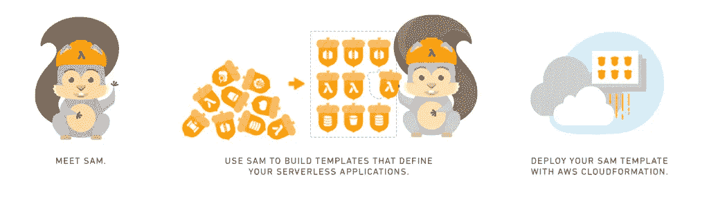*

*SAM，无服务器应用程序模型*

*[SAM](https://aws.amazon.com/serverless/sam/) ，或无服务器应用模型，是一个开源框架，用于在 AWS 上构建无服务器应用(由 AWS 开发)。它由两件事组成:*

*   *CloudFormation 的扩展，为最常见的无服务器服务提供简化的资源*
*   *CLI，允许您在本地构建、测试和部署您的应用程序*

*由于 SAM 的资源更简单，相同的 Lambda 函数和 DynamoDb 表可以这样描述:*

*没有更多的角色需要精心定义。SAM 将把简化的模板转换成充实的 CloudFormation 模板，并创建所需的角色。而且，如果需要的话，您仍然可以在同一个模板中使用“成熟的”云信息资源。*

*为了构建和部署我的两个函数及其对应的表，我只需要编写 SAM 模板并运行以下命令。*

```
*sam build
sam deploy*
```

*这是行不通的…因为 SAM 并不真正知道如何处理 TypeScript 编译过程。有几种解决方案可以解决这个问题。我可以创建一个[专用层](https://evilmartians.com/chronicles/serverless-typescript-a-complete-setup-for-aws-sam-lambda)(一种给你的 Lambda 增加额外能力的方法)。但是我发现使用 sam-webpack-plugin 更容易。
所以，现在我的流程将是:*

```
*npm run build
sam deploy*
```

*这将把我的 TypeScript 函数转换成 JavaScript，把源代码上传到 S3 桶，把简化的 SAM 模板转换成完整的 CloudFormation 模板，然后部署一切。*

*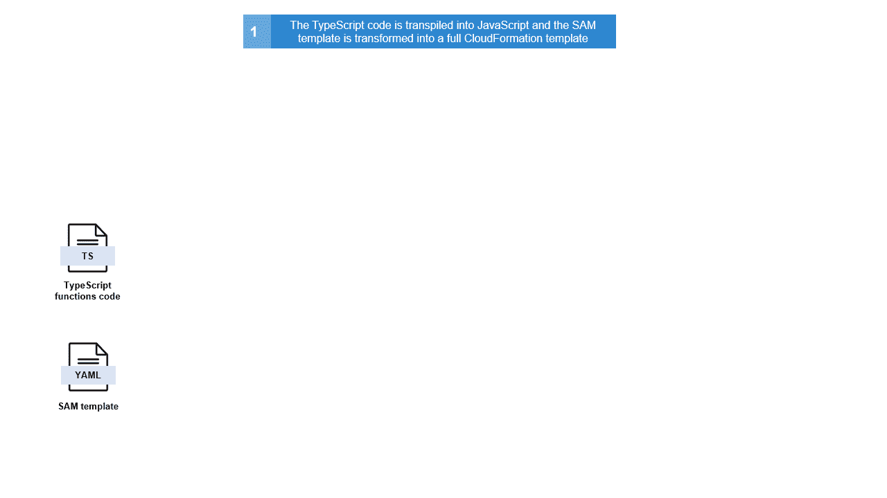*

*构建和部署过程*

*在创建新的函数和表时，我可以啜饮咖啡。*

> *还有其他工具可以简化无服务器应用程序的开发。例如，[无服务器](https://www.serverless.com/)提供了与 SAM 类似的功能，同时允许您与其他云提供商合作。它还提供了更强大的测试和警报功能。*

*这是一个好的开始。现在我能够存储每个站点随时间变化的内容，我应该能够计算给定站点的通常活动，并使用它来检测站点何时似乎被锁定。*

*第 3 部分再见！*

**

*   *[第 1 部分](/codex/detecting-locked-bicycle-stations-an-aws-serverless-story-part-1-95dcdb477649):为原型选择 AWS 无服务器堆栈*
*   *[第 2 部分](https://ouvreboite.medium.com/detecting-locked-bicycle-stations-an-aws-serverless-story-part-2-b1967d639699):无服务器应用的主干:Lambda 函数和 DynamoDb 表*
*   *第 3 部分:用 Lambda 函数和 DynamoDb 流实现实时检测算法*
*   *第 4 部分:创建一个无服务器的 API，用 S3 托管一个前端*
*   *[第 5 部分](/codex/performance-tuning-for-an-aws-lambda-based-api-b8b49b2d07db):基于 Lambda 的 API 的性能调优*