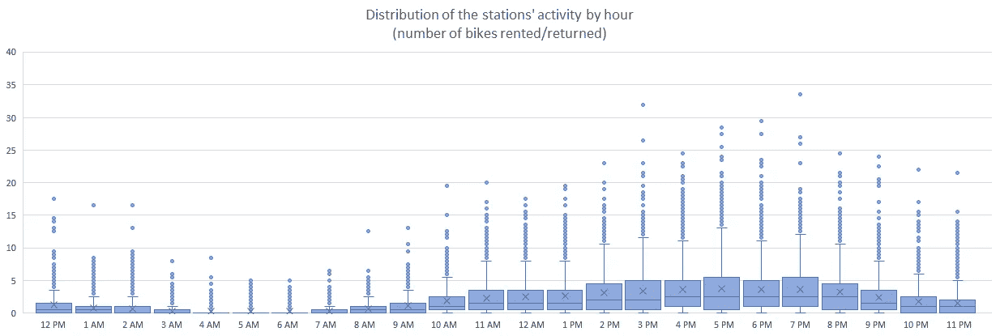
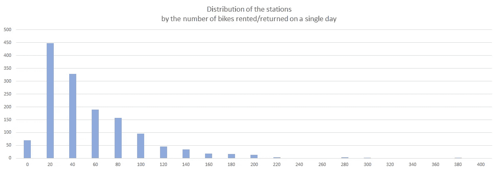
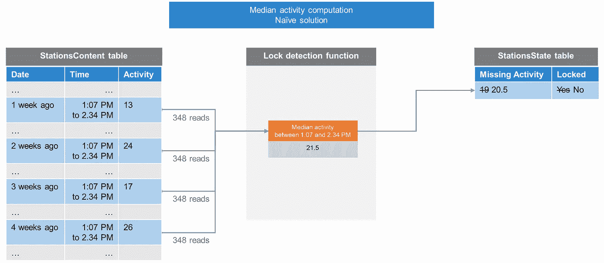
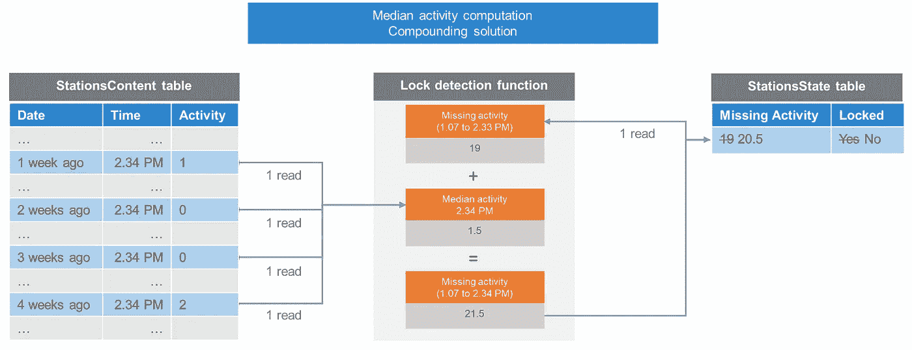
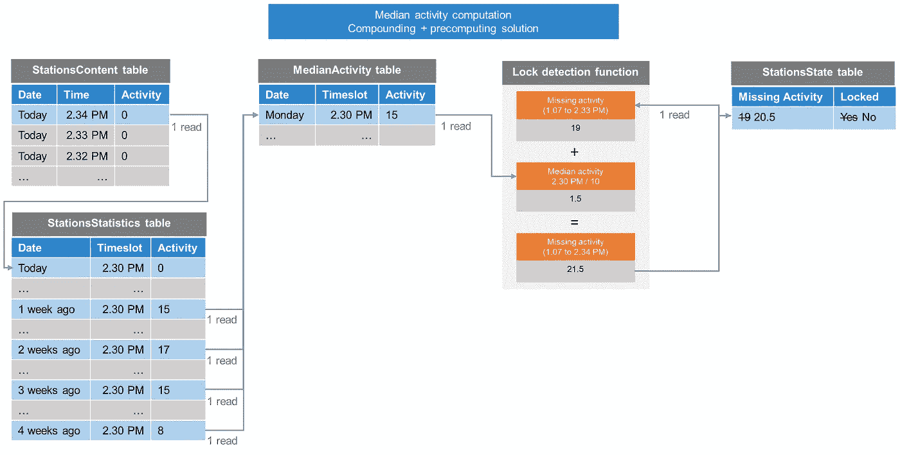
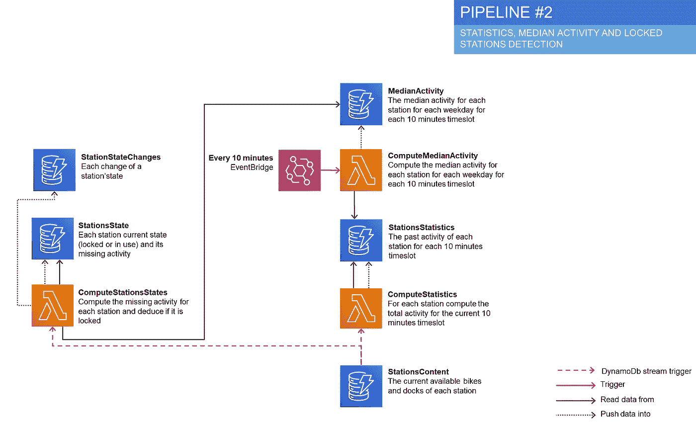
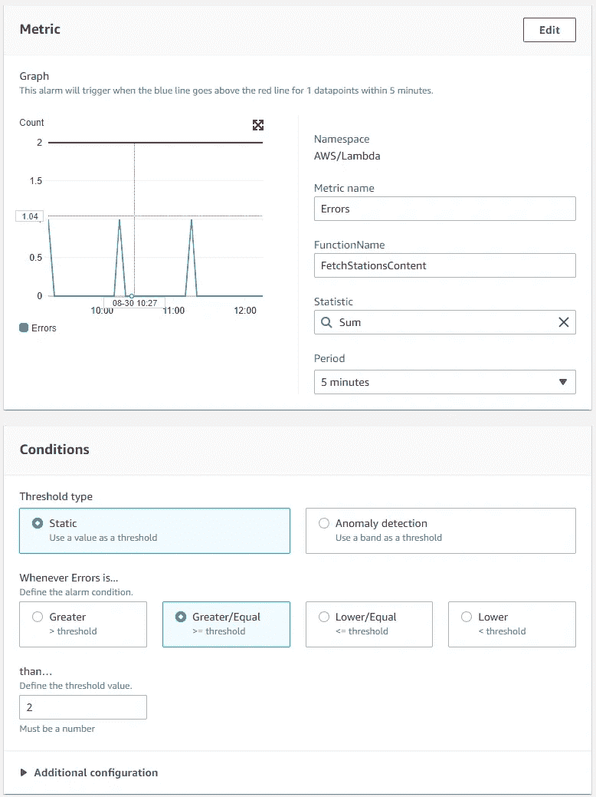
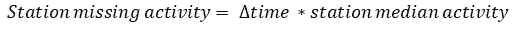
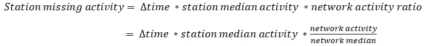

# 使用 Lambda 函数和 DynamoDb 流实现实时检测算法(检测巴黎 3/5 个上锁的自行车站)

> 原文：<https://medium.com/codex/detecting-locked-bicycle-stations-an-aws-serverless-story-part-3-d532318dfca7?source=collection_archive---------6----------------------->

安德鲁·古克在 [Unsplash](https://unsplash.com?utm_source=medium&utm_medium=referral) 上的照片

> 这一系列文章是关于我在学习如何使用 AWS 无服务器堆栈的同时，花了太多时间试图解决一个小问题(检测巴黎上锁的自行车站，见[第一部分](/codex/detecting-locked-bicycle-stations-an-aws-serverless-story-part-1-95dcdb477649))。要查找其他文章，请跳到页面底部。

# 检测锁定的电台

在第 2 部分的[中，我创建了几个 Lambda 函数和 DynamoDb 表来获取和存储每分钟每个 Velib 站的内容。我还计算了一个站点最近一次活动的时间(例如，一辆自行车从这个站点被租借或归还)。有了这些数据，我将尝试检测锁定的电台。](/codex/detecting-locked-bicycle-stations-an-aws-serverless-story-part-2-b1967d639699)

一个非常简单的算法是将任何在给定时间内没有活动的站视为被锁定。*a 站已经 3 个小时没见什么流量了，肯定是锁了*对吧？

这就引出了一个问题:站点的活动在一天中是均匀分布的吗？所有的站点都是相等的吗？

没有。

典型工作日车站每小时活动的[箱线图](https://en.wikipedia.org/wiki/Box_plot)。例如，在晚上 7 点，其中一个站点达到了 34 辆出租或归还的自行车，而 1500 个站点的中位数只有 2.5 辆。

大多数加油站一天能租出 20 到 40 辆自行车。但少数能达到 200 及以上。

这有点出乎意料:凌晨 4 点和下午 4 点的交通状况完全不同。更糟糕的是，在某一天，一些站点的流量可能接近 400，而大约 60 个站点的租赁或归还自行车不到 20 辆(其中少数站点的日平均流量接近 0)。

在这种程度的差异下，简单的硬编码阈值是无效的。如果太低，它将产生假阳性，或者如果太高，它将检测不到锁定的站。

# 为了寻找更好的度量标准

如果唯一的时间阈值无效，也许我可以尝试根据每个站点过去的活动为其计算一个自定义的时间阈值。但这似乎很复杂。

让我们后退一步。与其关注自上一次活动以来的时间，为什么不关注在这段时间内应该被租借或归还的自行车数量呢？换个说法:*a 站闲置 X 分钟，通常这段时间应该已经租出或归还了 20 辆单车，所以可能被锁定*。

我们仍然可以有一个非常基本的门槛(20 辆自行车)。但是对于更“活跃”的站，将更快地达到这个阈值，而对于不太活跃的站，将花费更多的时间。车站之间活动的差异是在这个度量中建立的。

# 计算缺失的活动

现在是下午 2 点 34 分，一个电台似乎从下午 1 点 07 分就不活动了。我怎么知道在那 87 分钟里应该发生了什么程度的活动？

*   **#1 查看昨天的数据**:我可以加载昨天同一时间段的站点内容，并统计出租或归还的自行车数量。但是我们是周一，昨天是周日，所以周日的流量真的有代表性吗？如果昨天同一时间电视台已经有麻烦了呢？那将不会返回流量。用一天作为参考是不安全的。
*   **#2 使用平均速度:**我可以很容易地计算出每个站点的平均速度(每分钟看到的自行车数量)，然后乘以 87 分钟。但是，正如我们前面看到的，流量在一天(和一周)内变化很大，所以这种方法是不准确的。
*   **#3 使用同一工作日和时间段的平均流量**:我可以查看同一工作日同一时间段的平均流量，而不是加载昨天的内容。这看起来不错，但是给定站点的流量会随着时间而变化。可能是夏天用的比较多，可能是旁边新开了一家商场。平均汇率需要很长时间来调整。
*   **#4 使用同一个工作日和时间段的滚动中值汇率**:我可以使用过去四周的中值，而不是平均值。这样，我的预期流量将很快适应一个站点上的新使用模式。这也将丢弃更多的“例外”日，并正确地表示“真实的”预期流量。

# 最佳化

让我们采用解决方案 4。

我每分钟都会接收电台的内容，所以我会每分钟对每个看起来不活跃的电台执行一次“锁定电台检测”。

现在是下午 2 点 34 分，一个电台似乎从下午 1 点 07 分就不活动了。我需要找到 87 分钟内的平均流量。这意味着我需要从我的 StationsContent 表中获取大约 87 分钟* 4 周= 348 个项目。太多了！更糟糕的是，一个站不活动的时间越长，我需要获取的物品就越多。

> 如果你还记得[之前的部分](/codex/detecting-locked-bicycle-stations-an-aws-serverless-story-part-2-b1967d639699)，我只能用 25 RCU 来完成这个应用。对于 60 秒的突发累积周期和 230KB 的项目大小，这意味着我实际上可以获取:25 RCU * 60 秒* 4KB / 230 KB =每分钟 26 个项目。如果我把所有的 rcu 都用在这张桌子上。

我如何避免做这么多读取操作？

## **复利**

我不需要每次都重新计算整个“窗口”,而是可以计算过去一个节拍(分钟)内丢失的活动，并将其复合。简而言之，对于在给定时间点没有活动的每个工作站，我可以计算出这一分钟内缺少的活动，并将其添加到另一个表中的“缺少活动”状态。因此，在给定时刻，我只对知道一分钟的中值流量感兴趣，而不是几个小时的窗口，这意味着只获取 4 个项目。问题是我需要在 StationsContent 表中保存一个月的分分秒秒的历史记录，这将占用我 25GB 的空闲空间。

## **预计算**

但是我真的需要精确到每分钟的预期流量吗？我可以用一种统计表来总结 10 分钟固定窗口内每个站点的流量。这将为我提供足够的准确性，并将我需要长期存储的数据量除以 10(甚至更多，因为我只能存储这个时隙上的活动，而不是 StationsContent 中的其他属性)。

我也可以预计算这个时隙的中间值。如果以后我想显示给定电台的预期活动，这可能会很有用:我只需要查看 MedianActivity 表。

这看起来更复杂，但如果我想降低成本，这是我需要做的权衡。我受到自由层限制(读/写操作和表大小)的约束，但是我可以创建我想要的多少个表，所以我利用这一点将中间计算存储在专用表中，而不是对较大的数据进行更多的调用。

注意，站状态表包含每个站的当前*状态。为了更容易地跟踪一天中车站状态的变化，我将创建另一个表(StationStateChanges ),每次车站状态发生变化时，我都将在该表中插入一项。*

# 使用 DynamoDb 流和 EventBridge 实现

实施将需要三个新表(Statistics、MedianActivity 和 StationState)和三个新函数(ComputeStatistics、ComputeMedianActivity 和 ComputeState)。

每次在 StationsContent 表中添加新项目时，我都希望运行 ComputeStatistics 和 ComputeStationsState。所以我会依靠 [DynamoDb Steams](https://docs.aws.amazon.com/amazondynamodb/latest/developerguide/Streams.html) 。这允许在每次从 Dynamo 表中添加/更新/删除项目时触发 lambda 函数。

为了使用 CloudFormation/SAM 设置它，我不能再使用来自 SAM 的*AWS::server less::simple table*类型。我需要切换到更复杂的 *AWS::DynamoDB::Table* ，它公开了 StreamSpecification 属性。然后，我必须在我的函数上声明一个 *DynamoDB* 事件。

Lambda 函数将在事件被触发时接收该事件作为参数，我可以访问刚刚插入到 StationsContent 表中的对象。之后，我只需要获取对应于该时隙的统计数据，用新事件的内容更新它们，并存储它们。

中位数每 10 分钟独立更新一次。因此，我可以使用 EventBridge 规则(如第 2 部分所示)来实现这一点。

## 自动重试

默认情况下，如果您的 Lambda 函数在处理 DynamoDB 流事件时失败，该事件将被一次又一次地重试。如果您的问题是暂时的，这是完美的，因为重试几次后可能会成功。

但是如果您的问题是永久性的(假设您推出了一个新的有问题的函数版本)，那么重试将会一次又一次地发生。更糟糕的是，失败的事件会越积越多。在我的情况下，每分钟一个事件，如果我花一个小时来修复一个新的 bug，这将意味着大约 60 个事件将等待重试。这可能会对我精心调整的 DynamoDB 表及其精心选择的 rcu 和 wcu 造成破坏。

幸运的是，我在*AWS::server less::Function*资源上有两个参数可供我使用:[MaximumRecordAgeInSeconds](https://docs.aws.amazon.com/AWSCloudFormation/latest/UserGuide/aws-resource-lambda-eventsourcemapping.html#cfn-lambda-eventsourcemapping-maximumrecordageinseconds)和 [MaximumRetryAttempts](https://docs.aws.amazon.com/AWSCloudFormation/latest/UserGuide/aws-resource-lambda-eventsourcemapping.html#cfn-lambda-eventsourcemapping-maximumretryattempts) 。

## 监视

我开始有一些整天运行的功能。目前，发现它们是否工作的唯一方法是查看日志和 web 控制台中的每个 Lambda 指标。如果每当一个函数失败时我能得到通知(例如通过邮件)就更好了。

为此，我可以设置一些 CloudWatch 警报。例如，这里有一个警报，当 FetchStationsContent 在过去 5 分钟内至少失败两次时就会响起(Velib API 可能有点不稳定，所以我允许它偶尔失败)。

当然，我也可以在 CloudFormation/SAM 模板中定义警报，而不是在控制台中进行设置。

**注意:**您需要一个 SNS 主题来发送您的警报结果。我发现通过 web 控制台创建它更快。所以我将在我的 CloudFormation/SAM 模板中提供它作为一个参数。

# 恶劣的天气和假期

几周后，应用程序运行良好。我可以看到我的统计数据和中间值表被填满，我可以查看 StationStateChanges 以了解检测到的工作站是否被锁定，以及它们的状态在活动重新开始时是否会发生变化。

然后，下雨了。很多。我看到几乎五分之一的车站在一个下午就被发现被锁定。我去了离我的公寓最近的车站，在过去的 3 个小时里，那里没有任何车辆，并且被标记为锁着。我浑身湿透了，但我毫无问题地租到了一辆自行车。

发生了什么事？你已经明白:没有人愿意在瓢泼大雨中租一辆自行车。但是我的应用程序不能区分“合法的”活动减缓或单个站点问题。

一周后，我们在法国过公共假期。早上也发生了类似的事情:一些电视台在早上 7 点到 9 点之间客流量很少，而这通常是他们最繁忙的时段。

想想看，我也担心两年一次的夏令时变化的影响。

*我如何解释天气、公共假日和夏令时的变化？*

*   我可以使用天气 API(例如 https://openweathermap.org/current 的)在下雨、刮风或者非常冷的时候改变我的阈值。
*   我可以为法国公共假日找到某种 API(例如[https://www.abstractapi.com/holidays-api](https://www.abstractapi.com/holidays-api))，并使用这些日子的“周日”中值活动。
*   我可以对未来 10 年的夏令时变化进行硬编码，并在变化后的几天应用一个系数。

这似乎很乏味。每一种新问题都需要一个特定的数据源和对我的算法的特定修改。我不喜欢它。我更喜欢单一的、全球性的解决方案。

所有这些问题有什么共同点？整个网络受到影响，流量低于或高于平时。那么，为什么不用整体流量变化作为输入呢？

我可以计算一个“网络活动比率”，即网络的全局活动除以给定时间的预期中值流量。并在我的算法中使用这个全局比率。

所以我的公式是这样的:

对此:

有了这个更新的算法，我的检测更加稳健。检测误报或漏报超出了我的能力范围(我没有时间每小时测试 1.500 个站点中的每一个)。但是我对我的结果很满意。

应用程序的核心现在已经完成，但是我缺少一个前端来显示每个工作站的状态。

第 4 部分再见！

*   [第 1 部分](/codex/detecting-locked-bicycle-stations-an-aws-serverless-story-part-1-95dcdb477649):为原型选择 AWS 无服务器堆栈
*   [第 2 部分](https://ouvreboite.medium.com/detecting-locked-bicycle-stations-an-aws-serverless-story-part-2-b1967d639699):无服务器应用的主干:Lambda 函数和 DynamoDb 表
*   [第 3 部分](/codex/detecting-locked-bicycle-stations-an-aws-serverless-story-part-3-d532318dfca7):用 Lambda 函数和 DynamoDb 流实现实时检测算法
*   第 4 部分:创建一个无服务器的 API，用 S3 托管一个前端
*   [第 5 部分](/codex/performance-tuning-for-an-aws-lambda-based-api-b8b49b2d07db):基于 Lambda 的 API 的性能调优