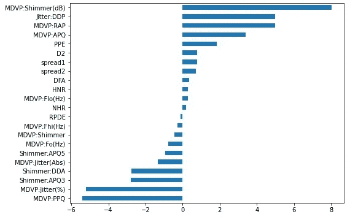
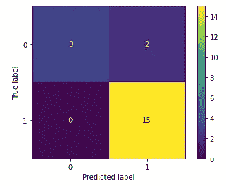
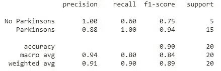
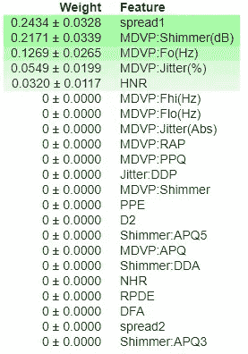
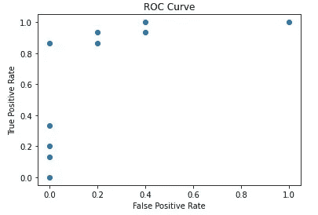
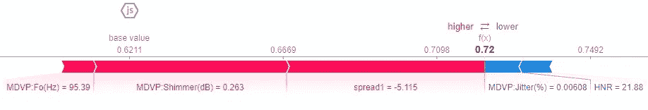

# 用语音分析检测帕金森病

> 原文：<https://medium.com/codex/detecting-parkinsons-disease-with-voice-analysis-89e034f4f6f4?source=collection_archive---------9----------------------->

帕金森病(PD)在数年内发展缓慢，目前没有实验室测试或生物标志物来检测它。相反，诊断依赖于对身体症状的全面评估，如震颤、步态和行动缓慢。诊断帕金森病可能需要几天或几年的时间。然而，在使用语音分析来准确诊断患者方面，有一些有前途的研究。

Max A. Little、Patrick E. McSharry、Eric J. Hunter、Lorraine o . Ramig(2008 年“帕金森病远程监护发声障碍测量的适用性”)进行的一项研究将发声障碍作为帕金森病的一种症状进行了检查。损伤可能是音量减小、呼吸困难或声音颤抖等。这项研究记录了 31 名受试者的声音，其中 23 名患有帕金森病，并测量了他们的频率和振幅的变化。如果一台计算机能够根据声音样本准确诊断帕金森病，它就有可能通过智能手机应用程序打开广泛或早期检测的大门。

利用他们的[数据集](http://archive.ics.uci.edu/ml/datasets/Parkinsons)，我建立了一个机器学习模型来预测受试者是否患有 PD，这是一个二元分类模型。目标已从训练数据中删除，以避免泄漏。在创建每个模型之后，我回顾了它的特性重要性，以确认没有剩余的特性是泄漏的。要克服的大多数基线是 75%，这是患有帕金森病的受试者人数。

由于这是一个小数据集(195 个观察值)，我拿出 10%的观察值作为我的测试集，并使用交叉验证来训练和验证其余的 90%。我对分割进行了分层，以保持训练集和测试集中 PD 受试者的比例相同，这适用于小型不平衡数据集。

以下是我测试过的不同型号:

# **逻辑回归**

逻辑回归是一个简单的二元分类模型。我将数据标准化，拟合模型，并使用 k-folds 交叉验证评估准确度分数。十个 k 倍的平均得分为 85%。我使用了一个随机交叉验证搜索来寻找一组更好的超参数，**，这使得准确率达到了 87%** 。提醒一下，基线是 75%。

下面是模型系数的可视化。研究中观察到 22 个特征，各种声音特征的频率和振幅。较大的正系数和负系数表明这些特征对模型很重要。系数越接近零的特征越不重要。

逻辑回归模型的系数

# **随机森林分类器**

接下来是随机森林分类器模型，我也使用了交叉验证随机搜索来调整超参数。**得到的模型给出了 91%** 的分数，优于逻辑回归模型(87%)。

因为数据集是不平衡的，所以我绘制了一个混淆矩阵来检查测试数据的 F1 分数。这是为了确保模型的高精度分数不会产生误导。

混淆矩阵

测试数据的加权平均值为 ***F1 分的 89%*** 。与 84%的宏观平均值相比，在处理不平衡数据时，加权平均值是一个更好的指标。F1 的高分让我对模型的高准确度充满信心。

F1 分数

# **XGBoost**

最后，我创建了一个 XGBoost 模型，并使用早期停止来优化超参数。**该模型的准确率为 93%** ，优于随机森林分类器模型的 91%。

选择了性能最好的模型后，我再次重组了模型，以简化它供将来使用。使用排列重要性，我确定了对模型有贡献的特征，并从训练数据中排除了其余的特征。

排列重要性

第二个 XGBoost 模型只使用了五个突出显示的特征，仍然产生相同的准确度分数。

# **测试数据说话**

模型必须通过的最重要的测试是对未知数据的测试，所以我在最终的 XGBoost 模型上使用了维持测试数据。**准确率为 90%** 。

这里是一张 **ROC** (接收器操作特性)图，显示了 XGBoost 模型做出正确预测概率的频率。用于测量该图的度量标准是 **AUC** (曲线下面积)，其为 **96%** 、**、**(超出可能的 100%准确度 **)** 。

下面是一个 Shapley 图，展示了每个特征在确定目标预测概率中的作用。越接近 1，患帕金森病的概率越高。

# **结论**

正如这些模型所展示的，您可以使用语音分析来高精度地诊断帕金森病。在对不同的模型进行实验后，最终的模型具有更精确的优点，并且只需要 5 个特征，计算成本低廉。

[*在 Github 上查看我的代码。*](https://github.com/TemsyChen/temsychen.github.io/blob/master/_posts/2021-1-4-Detecting-Parkinsons.md)