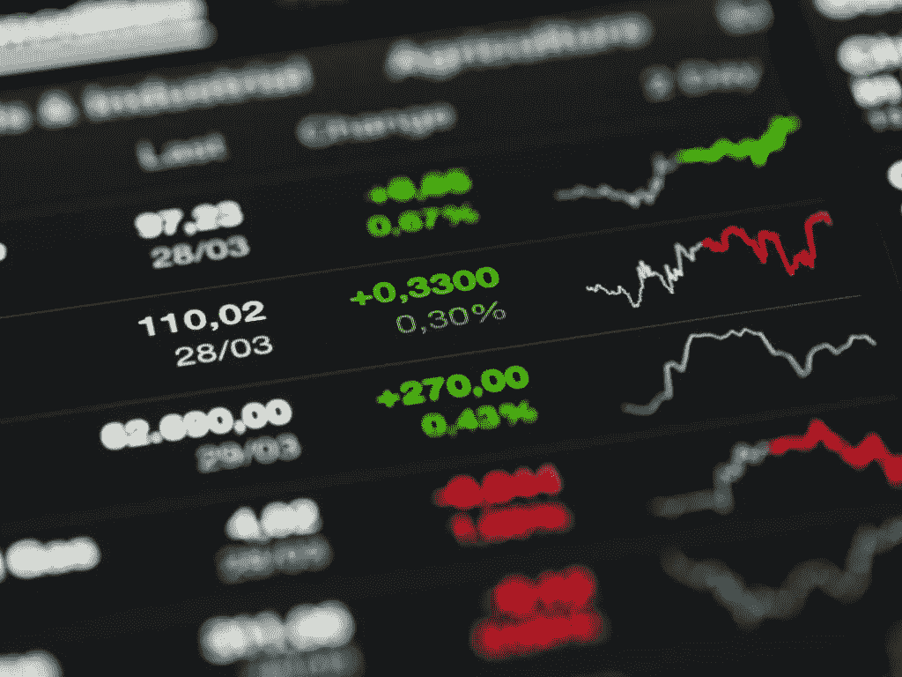
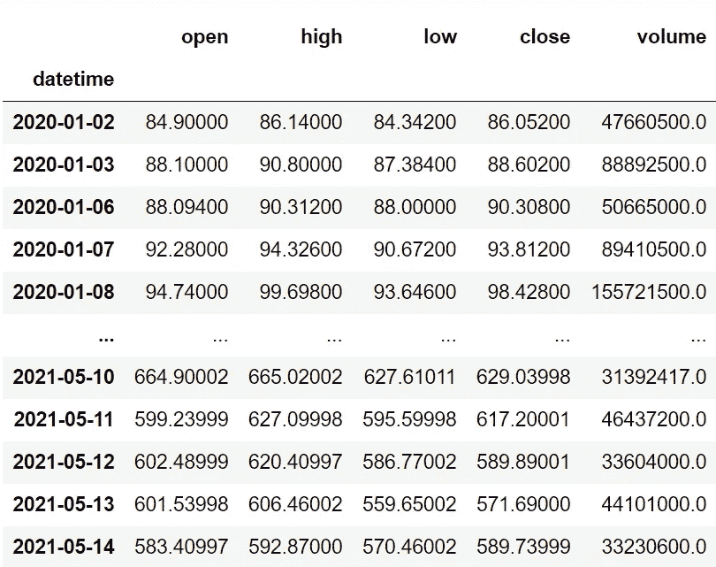
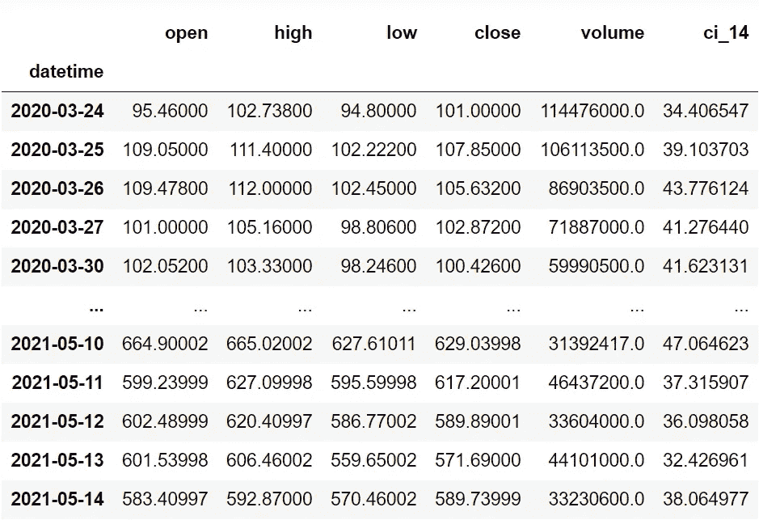
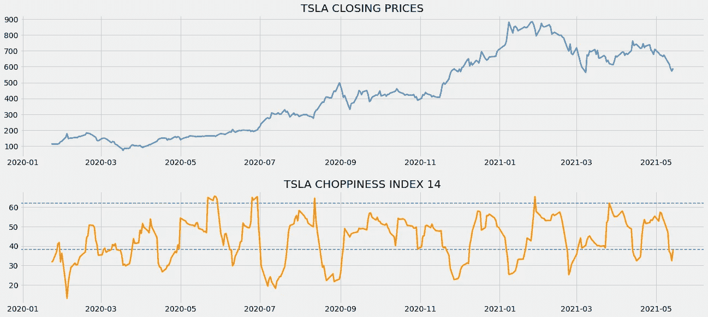

# 使用 Python 中的波动指数检测市场范围和趋势

> 原文：<https://medium.com/codex/detecting-ranging-and-trending-markets-with-choppiness-index-in-python-1942e6450b58?source=collection_archive---------1----------------------->

## 这是一个非常有用的指标，可以让你远离陷阱



[来源](https://wallpapercave.com/stock-exchange-wallpapers)

# 介绍

每一个技术指标都有其独特的视角和用途。但是，他们中的大多数人总是会掉进一个陷阱，那就是波动市场。什么是测距市场？波动市场是指没有趋势或动力，但在特定的高价位和低价位之间来回波动的市场(这些市场也称为波动市场、横向市场和平面市场)。当市场波动时，技术指标容易显示错误的进场点和出场点。幸运的是，我们有一套专门用来观察市场是否在波动的指标。这种指标被称为波动指标。

有很多都属于波动指标的范畴，但是主导游戏的是波动指数。在本文中，我们将首先理解波动指数的概念及其计算方法，然后用 python 从头开始编写该指标的代码。我们还将讨论如何使用波动指数来检测市场的波动和趋势周期。

在继续之前，如果你想在没有任何代码的情况下回溯测试你的交易策略，有一个解决方案。这是[回测区](https://www.backtestzone.com/)。这是一个平台，可以免费对不同类型的可交易资产的任意数量的交易策略进行回溯测试，无需编码。点击这里的链接，你可以马上使用这个工具:【https://www.backtestzone.com/ 

# 波动率和 ATR

在开始探索波动指数之前，有必要对两个重要的概念有一些基本的了解，这两个概念就是波动性和平均真实范围(ATR)。波动性是衡量价格变化或分散程度的尺度。波动性越高，风险越高，反之亦然。拥有这方面专业知识的人将有可能在市场中占据巨大优势。我们有大量的工具来计算市场的波动性，但没有一个工具能够达到百分之百的准确性，但是，有一些工具有可能计算得更准确。一个这样的工具是平均真实范围，简称 ATR。

由怀尔德·怀尔斯(Wilder Wiles)创立的平均真实范围(Average True Range)是一个技术指标，用于衡量一项资产的平均波动幅度。这是一个滞后指标，意味着它考虑了资产的历史数据来衡量当前价值，但它不能预测未来的数据点。在使用 ATR 时，这不被认为是一个缺点，因为它是更准确地跟踪市场波动的指标之一。ATR 是一个滞后指标，也是一个非方向性指标，意味着 ATR 的运动与市场的实际运动成反比。要计算 ATR，必须遵循两个步骤:

*   **计算真实范围(TR):** 资产的真实范围通过取三个价格差的最大值来计算，这三个价格差是:市场高点减去市场低点，市场高点减去先前的市场收盘，先前的市场收盘减去市场低点。它可以表示如下:

```
**MAX** [ {**HIGH - LOW**}, {**HIGH - P.CLOSE**}, {**P.CLOSE - LOW**} ]where,
MAX = Maximum values
HIGH = Market High
LOW = Market Low
P.CLOSE = Previous market close
```

*   **计算 ATR:** 平均真实范围的计算很简单。我们只需对指定数量的周期取之前计算的真实范围值的平滑平均值。平滑平均线不是普通的均线或均线，而是怀尔德·怀尔斯自己创造的一种平滑平均线，但是使用其他均线没有任何限制。在本文中，我们将使用 SMA，而不是指标创始人创建的自定义移动平均线，以使事情变得简单。以 14 作为周期数的传统设置来计算 ATR 可以表示如下:

```
**ATR 14** = **SMA 14** [ **TR** ]where,
ATR 14 = 14 Period Average True Range
SMA 14 = 14 Period Simple Moving Average
TR = True Range
```

当使用 ATR 作为交易指标时，交易者必须确保他们比以往更加谨慎，因为该指标非常滞后。现在我们已经了解了什么是波动性和平均真实范围。让我们深入了解这篇文章的主要概念，波动指数。

# 波动指数

波动指数是一个波动指标，用于识别市场是波动还是趋势。波动指数的特征几乎与 ATR 相似。它是一个滞后的、无方向性的指标，当市场必定会盘整时，它的值会上升；当市场表现出高动量或价格波动时，它的值会下降。波动指数的计算包括两个步骤:

*   **ATR 计算:**在这一步中，资产的 ATR 以 1 作为指定的期数来计算。
*   **波动性指数计算:**使用传统设置 14 作为回望期来计算波动性指数，计算方法是首先取之前计算的 ATR 1 的 14 天总和除以 14 天最高价和 14 天最低价之间的差值得到的值的 log 10。然后，该值除以回看周期的 log 10，最后乘以 100。这听起来可能令人困惑，但一旦您看到计算的表示形式，就会很容易理解:

```
**CI14** = **100** * **LOG10** [**14D ATR1 SUM**/(**14D HIGHH** - **14D LOWL**)] / **LOG10**(**14**)where,
CI14 = 14-day Choppiness Index
14D ATR1 SUM = 14-day sum of ATR with 1 as lookback period
14D HIGHH = 14-day highest high
14D LOWL - 14-day lowest low
```

这就结束了我们关于波动指数的理论部分。现在让我们用 Python 从头开始编写指示器的代码。在继续之前，关于免责声明的说明:这篇文章的唯一目的是教育人们，必须被视为一个信息，而不是投资建议等。

# 用 Python 实现

我们的流程从将基本包导入 python 环境开始。然后，我们将使用 twelvedata.com 的(非附属链接)提供的 API 提取特斯拉的历史股票数据。之后，我们将从头开始构建波动指数。

## 步骤 1:导入包

将所需的包导入 python 环境是一个不可跳过的步骤。基本的包将是处理数据的 Pandas，处理数组和复杂函数的 NumPy，用于绘图的 Matplotlib，以及进行 API 调用的请求。

**Python 实现:**

```
import pandas as pd
import requests
import matplotlib.pyplot as plt
import numpy as np

plt.style.use('fivethirtyeight')
plt.rcParams['figure.figsize'] = (20, 10)
```

既然我们已经将所有基本的包导入到 python 环境中。让我们继续用 [twelvedata.com 的](https://twelvedata.com/)强大的股票 API 来拉特斯拉的历史数据。

## 步骤 2:从[twelvedata.com](https://twelvedata.com/)中提取数据

在这一步中，我们将使用由[twelvedata.com](https://twelvedata.com/)提供的 API 端点提取特斯拉的历史股票数据。在此之前，关于[twelvedata.com](https://twelvedata.com/)的一个说明:十二数据是领先的市场数据提供商之一，拥有针对所有类型市场数据的大量 API 端点。它非常容易与十二数据提供的 API 进行交互，并且拥有有史以来最好的文档。此外，确保您在[twelvedata.com](https://twelvedata.com/)拥有账户，只有这样，您才能访问您的 API 密钥(使用 API 提取数据的重要元素)。

**Python 实现:**

```
def get_historical_data(symbol, start_date):
    api_key = 'YOUR API KEY'
    api_url = f'https://api.twelvedata.com/time_series?symbol={symbol}&interval=1day&outputsize=5000&apikey={api_key}'
    raw_df = requests.get(api_url).json()
    df = pd.DataFrame(raw_df['values']).iloc[::-1].set_index('datetime').astype(float)
    df = df[df.index >= start_date]
    df.index = pd.to_datetime(df.index)
    return df

tsla = get_historical_data('TSLA', '2020-01-01')
tsla
```

**输出:**



作者图片

**代码解释:**我们做的第一件事是定义一个名为‘get _ historical _ data’的函数，它以股票的符号(‘symbol’)和历史数据的起始日期(‘start _ date’)作为参数。在函数内部，我们定义了 API 键和 URL，并将它们存储到各自的变量中。接下来，我们使用“get”函数提取 JSON 格式的历史数据，并将其存储到“raw_df”变量中。在对原始 JSON 数据进行清理和格式化之后，我们将以干净的 Pandas 数据帧的形式返回它。最后，我们调用创建的函数来提取特斯拉从 2020 年开始的历史数据，并将其存储到“tsla”变量中。

## 步骤 3:波动指数计算

在这一步中，我们将使用之前讨论过的波动指数公式，以 14 作为回望期来计算波动指数的值。

**Python 实现:**

```
def get_ci(high, low, close, lookback):
    tr1 = pd.DataFrame(high - low).rename(columns = {0:'tr1'})
    tr2 = pd.DataFrame(abs(high - close.shift(1))).rename(columns = {0:'tr2'})
    tr3 = pd.DataFrame(abs(low - close.shift(1))).rename(columns = {0:'tr3'})
    frames = [tr1, tr2, tr3]
    tr = pd.concat(frames, axis = 1, join = 'inner').dropna().max(axis = 1)
    atr = tr.rolling(1).mean()
    highh = high.rolling(lookback).max()
    lowl = low.rolling(lookback).min()
    ci = 100 * np.log10((atr.rolling(lookback).sum()) / (highh - lowl)) / np.log10(lookback)
    return ci

tsla['ci_14'] = get_ci(tsla['high'], tsla['low'], tsla['close'], 14)
tsla = tsla.dropna()
tsla
```

**输出:**



作者图片

**代码解释:**首先我们定义一个名为“get_ci”的函数，它将股票的高价数据(“high”)、低价数据(“low”)、收盘价数据(“close”)和回望期作为参数。

在函数内部，我们首先找到了计算真实范围所必需的三个差异。为了计算 TR，我们使用 Pandas 软件包提供的“max”函数从这三个差值中选取最大值。回望周期为 1 时，我们使用“滚动”和“均值”函数计算 TR 的 SMA，以计算平均真实指数，并将值存储到“atr”变量中。接下来，我们将定义两个变量“high”和“lowl ”,以存储股票在特定回看期间的最高价和最低价。现在，我们将所有计算值代入之前讨论过的公式，以获得波动指数的值。

最后，我们调用定义的函数来获得特斯拉的波动指数值，传统的回望周期为 14。

# 使用波动指数

波动指数的值在 0 到 100 之间，因此作为一个范围振荡器。数值越接近 100，波动性越高，反之亦然。通常，在波动指数图的上方和下方构建了两个级别，用于确定市场是波动还是趋势。上述水平通常在更高的阈值 61.8 处绘制，如果波动指数的值等于或高于该阈值，则市场被认为是在波动或盘整。同样，下方水平是在 38.2 的下限绘制的，如果波动指数的读数等于或低于这个阈值，那么市场被认为是趋势性的。波动指数的使用可以表示如下:

```
IF **CHOPPINESS INDEX >= 61.8** --> **MARKET IS CONSOLIDATING**
IF **CHOPPINESS INDEX** **<= 38.2** --> **MARKET IS TRENDING**
```

现在，让我们通过用 python 绘制计算值，使用波动指数来确定特斯拉的波动和趋势市场周期。

**Python 实现:**

```
ax1 = plt.subplot2grid((11,1,), (0,0), rowspan = 5, colspan = 1)
ax2 = plt.subplot2grid((11,1,), (6,0), rowspan = 4, colspan = 1)
ax1.plot(tsla['close'], linewidth = 2.5, color = '#2196f3')
ax1.set_title('TSLA CLOSING PRICES')
ax2.plot(tsla['ci_14'], linewidth = 2.5, color = '#fb8c00')
ax2.axhline(38.2, linestyle = '--', linewidth = 1.5, color = 'grey')
ax2.axhline(61.8, linestyle = '--', linewidth = 1.5, color = 'grey')
ax2.set_title('TSLA CHOPPINESS INDEX 14')
plt.show()
```

**输出:**



作者图片

上面的图表分为两个面板:上面的面板是特斯拉的收盘价，下面的面板是特斯拉 14 天波动指数的值。正如你所看到的，在波动指数图的上面和下面画了两条线，代表了用来识别市场运动的两个阈值。特斯拉是一只价格波动较大的股票，经常低于 38.2 的下限。这意味着，特斯拉表现出巨大的势头和较高的波动性。我们可以通过平行观察实际的价格变动来确认波动指数的读数。同样，在一些地方，波动指数读数超过了 61.8 的较高阈值，这表明股票正在盘整。这是在现实市场中使用波动指数的传统而正确的方法。

# 最后的想法！

经过长期的理论和编码过程，我们已经成功地对波动指数及其计算和使用有了一些了解。这可能看起来是一个简单的指标，但它在交易时非常有用，可以防止你耗尽资本。因为波动指数非常滞后，所以在使用它进行交易时，你要比以往更加谨慎。此外，你不应该完全依赖波动指数来产生进场点和出场点，但它可以作为你实际交易策略的过滤器。在现实市场中使用波动指数时，要记住两件事:

*   **策略优化:**波动性指数不仅仅是阈值的上限和下限，而是有可能更高。所以，在进入现实世界的市场之前，确保你有一个稳健和优化的交易策略，使用波动指数作为过滤器。
*   **回溯测试:**仅仅通过对一个资产的算法进行回溯测试来得出结论是无效的，有时甚至会导致意想不到的转变。现实世界的市场每次都不一样。为了做更好的交易，试着用不同的资产对交易策略进行回溯测试，如果需要的话修改策略。

就是这样！希望你能从这篇文章中学到一些有用的东西。如果您忘记了遵循任何编码部分，不要担心。我在文章末尾提供了完整的源代码。快乐学习！

## 完整代码:

```
import pandas as pd
import requests
import matplotlib.pyplot as plt
import numpy as np

plt.style.use('fivethirtyeight')
plt.rcParams['figure.figsize'] = (20, 10)

def get_historical_data(symbol, start_date):
    api_key = 'YOUR API KEY'
    api_url = f'https://api.twelvedata.com/time_series?symbol={symbol}&interval=1day&outputsize=5000&apikey={api_key}'
    raw_df = requests.get(api_url).json()
    df = pd.DataFrame(raw_df['values']).iloc[::-1].set_index('datetime').astype(float)
    df = df[df.index >= start_date]
    df.index = pd.to_datetime(df.index)
    return df

tsla = get_historical_data('TSLA', '2020-01-01')
print(tsla)

def get_ci(high, low, close, lookback):
    tr1 = pd.DataFrame(high - low).rename(columns = {0:'tr1'})
    tr2 = pd.DataFrame(abs(high - close.shift(1))).rename(columns = {0:'tr2'})
    tr3 = pd.DataFrame(abs(low - close.shift(1))).rename(columns = {0:'tr3'})
    frames = [tr1, tr2, tr3]
    tr = pd.concat(frames, axis = 1, join = 'inner').dropna().max(axis = 1)
    atr = tr.rolling(1).mean()
    highh = high.rolling(lookback).max()
    lowl = low.rolling(lookback).min()
    ci = 100 * np.log10((atr.rolling(lookback).sum()) / (highh - lowl)) / np.log10(lookback)
    return ci

tsla['ci_14'] = get_ci(tsla['high'], tsla['low'], tsla['close'], 14)
tsla = tsla.dropna()
print(tsla)

ax1 = plt.subplot2grid((11,1,), (0,0), rowspan = 5, colspan = 1)
ax2 = plt.subplot2grid((11,1,), (6,0), rowspan = 4, colspan = 1)
ax1.plot(tsla['close'], linewidth = 2.5, color = '#2196f3')
ax1.set_title('TSLA CLOSING PRICES')
ax2.plot(tsla['ci_14'], linewidth = 2.5, color = '#fb8c00')
ax2.axhline(38.2, linestyle = '--', linewidth = 1.5, color = 'grey')
ax2.axhline(61.8, linestyle = '--', linewidth = 1.5, color = 'grey')
ax2.set_title('TSLA CHOPPINESS INDEX 14')
plt.show()
```