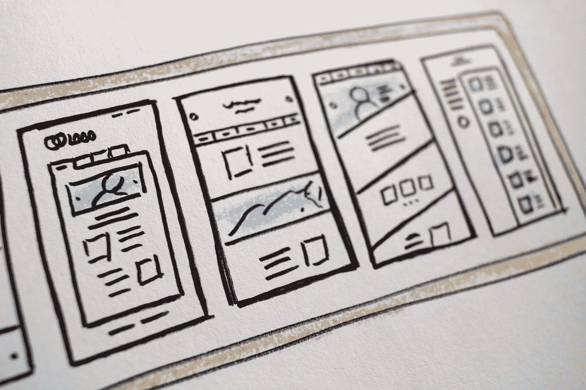

# UX 设计师开发基础

> 原文：<https://medium.com/codex/dev-fundamentals-for-ux-designers-920d8077a716?source=collection_archive---------15----------------------->

## 在这篇文章中，我们将讨论网页开发的基础知识，以及它们与 UX 设计的关系。

哈尔·盖特伍德在 [Unsplash](https://unsplash.com?utm_source=medium&utm_medium=referral) 上拍摄的照片

作为一名 UX 设计师，你需要从根本上了解开发过程。这样，您可以更好地与您的开发团队协作，并创建可行的设计。在这篇文章中，我们将讨论网络的基础…