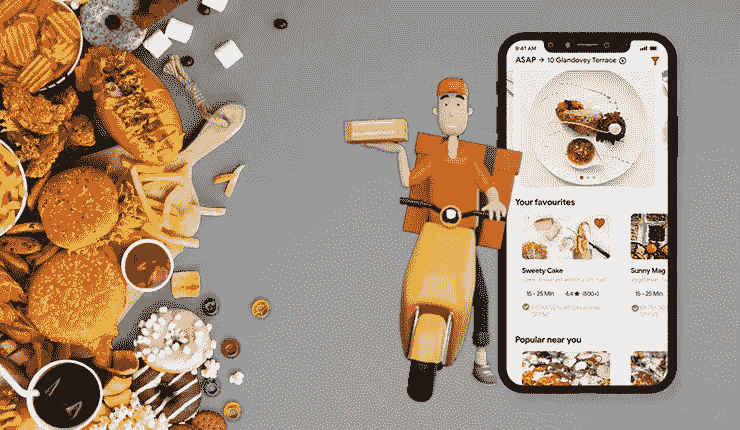
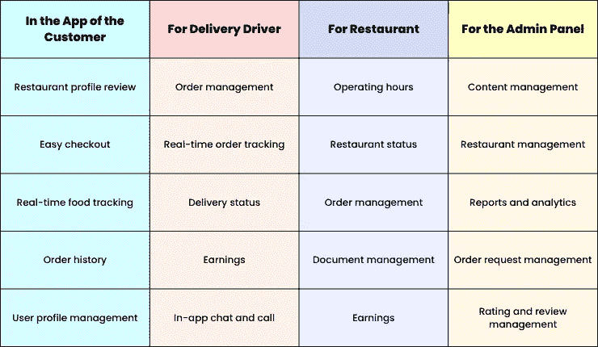

# 开发送餐应用程序，打造独特的送餐体验

> 原文：<https://medium.com/codex/develop-a-food-delivery-app-for-unique-meal-delivery-experiences-d14145251e64?source=collection_archive---------13----------------------->

送餐 App

饥饿感无疑是最糟糕的。然而，随着按需送餐应用的出现，客户只需点击应用上的几个按钮就可以满足他们的饥饿感。因此，这些解决方案越来越受欢迎。它还支持帮助食品配送业务成为一个有利可图的市场。

如果我们按照 Statista 的预测，到 2027 年，市场收入将达到 4662 亿美元。

这些数字足以暗示该解决方案的整体盈利性质。因此，大多数食品配送初创公司都在拥抱它的建立，以成为这个十亿美元市场的一部分。

如果你是这些企业中渴望成为这个创收市场的一部分，请阅读这篇文章。

# 按需送餐应用受欢迎的原因

1.帮助当地餐厅成功地在应用程序上列出自己，让更高比例的客户深入了解他们提供的服务、菜单上的食物等。

2.顾客可以方便地将食物送到他们家门口，这样他们就可以在不需要走出家门的情况下快速饱餐一顿。

3.它可以让餐馆老板增加客流量。换句话说，该应用程序继续为客户增加订单数量。

4.通过提供通过不同模式进行支付的便利性和额外的安全级别，顾客可以非常方便地支付所订购的食物。

知道了这款应用受欢迎的原因，我相信你能理解为什么开发一款送餐应用是个好主意。

在下面的几行中，我讨论了在您构建解决方案时会派上用场的不同步骤。

# 如何开发一款送餐 App？要遵循的步骤

## 1.研究——做好它

当你开发一个送餐类的应用时，竞争对手的研究是绝对必要的。检查他们的菜单，他们在应用程序中的用户界面/UX，客户给他们留下的评论等等是一个好主意。

**这将有助于你更加清晰地评估以下几个方面-**
1。应用程序中缺少的元素，以及包含这些元素是否会为您的应用程序增加价值
2。应用程序的改进范围(如果有)

检查这些区域很重要。它们有助于你了解哪些因素会让更多的顾客参与进来。

## 2.对不同的商业模式有想法

当您踏上食品订购和交付应用程序开发服务之旅时，您需要了解两个主要模型。

**它们是-**
【聚合模式】
【餐厅对消费者模式】

下面我来解释一下这两个模型。

> 聚合器模型

这种模式侧重于客户从第三方或应用程序下单。此后，顾客在家门口就能收到饭菜。

这种模式依赖于 GrubHub、Eat24 等应用。确保你知道这种模式及其好处，如节省成本和方便。

了解了第一种模式，现在让我向你介绍第二种模式——餐馆对消费者模式。

> **餐厅对消费者模式**

在这种模式中，餐馆或食品联合企业直接向顾客出售食品。这包括三个部分——食品所有者、顾客和送货司机。

以必胜客、多米诺骨牌等为例。由于可用于业务扩张的资源有限，因此，这种模式有助于他们获得可观的收入。这是在没有任何第三方在场的情况下。

有了这些模型的知识，了解如何让你的应用程序最大限度地稳定运行是最理想的。

因此，下一个需要关注的关键领域是特性。

 [## 使用 UberEats 克隆应用程序，让您的食品配送事业如虎添翼

### ankit Patel 2022 年 6 月 2 日 7 分钟阅读接近 10 亿人每天在网上订餐。感谢…

www.peppyocean.com](https://www.peppyocean.com/blog/empower-food-delivery-venture-with-ubereats-clone-app/) 

# 了解支持强大应用操作的特性

在为您的食品交付应用程序选择模型时，了解应用程序中的不同部分可以相互订购、接收和发送食品的功能。

为了简单起见。

在你的应用中包含所有这些功能，你可以确保所有这些细分市场的参与度都将保持在较高水平。它会让你的创业公司以一种相当成功的方式成长。

# 保持技术堆栈的理念，实现强大的应用程序操作

对于一个流畅、功能强大的按需送餐应用程序来说，重要的是你要专注于功能和技术。

因此，要了解两种技术——后端和前端。确保您在后端和前端使用正确的技术堆栈，以便应用程序顺利扩展。

> 对于后端

服务器— Nginx
框架— Laravel
数据库— MySQL 和 Redis
托管 AWS 和 VULTR

> 对于前端

跨平台——React and Flutter
iOS——Objective-C 和 Swift
Android——Java 和 Kotlin

> 除了前端和后端技术，了解集成和不同的 API，你应该包括使你的食品交付应用程序独特。

用于邮件——Gmail、Firebase 云消息
推送通知——Twilio、Nexmo
用于社交媒体——Twitter、脸书等。
·支付——Stripe、Braintree 等
·餐厅 API 解决方案——GrubHub、Foursquare Places

一旦你对这些领域有了深入了解，你就需要联系一家食品配送应用开发公司。

这同样在下面几行中讨论过。

联系一家食品交付应用程序开发公司

从头开始构建一个应用程序会消耗大量的时间和资金。尤其是当你是一家初创公司时，当你踏上应用开发之旅时，你必须保持明智。尤其是作为一家食品配送初创公司，最好的方式是与一家食品配送应用开发公司建立联系。外包这些服务，因为它将节省基础设施和招聘。
此外，由于他们将为您提供一个可随时启动和修改的解决方案，因此，您可以以适合您的方式扩展您的业务，并与您的业务需求保持同步。最后，由于应用程序的直观用户界面，因此，您可以确保您的客户会发现通过您的应用程序导航很容易，并通过它顺利地执行不同的食品交付服务。
最后，关注成本非常重要。

# 食品交付应用程序开发服务的预计成本

在美国和英国，开发者对[食品订购和交付应用程序开发服务](https://www.peppyocean.com/)收取每小时 70 美元到 225 美元的费用。另一方面，在亚洲，费用将在每小时 10 美元到 80 美元之间。

基于特性的复杂性，这是值得添加的。，价格可能会上涨。因此，最理想的是让应用程序尽可能简单，并提供对餐厅、送货司机、用户和送餐业务等细分市场非常有用的功能。这将确保您节省预算异常。

# 包扎

送餐应用已经让送餐业务成为一个十亿美元的市场。这是因为该解决方案易于操作。这也是因为方便的应用程序让顾客在家门口就能获得快餐。因此，它开始流行起来。如果你是一家初创公司，希望成为这个 600 亿美元利润丰厚的食品配送市场的一部分，请立即使用该应用程序来增强你的业务。今天就联系一家离岸食品交付应用程序开发公司，获得一款随时可用的应用程序。它将有助于为您的企业提供最大的价值，并通过客户从它那里获得的方便的食品配送服务，从第一天起就获得良好的回报。