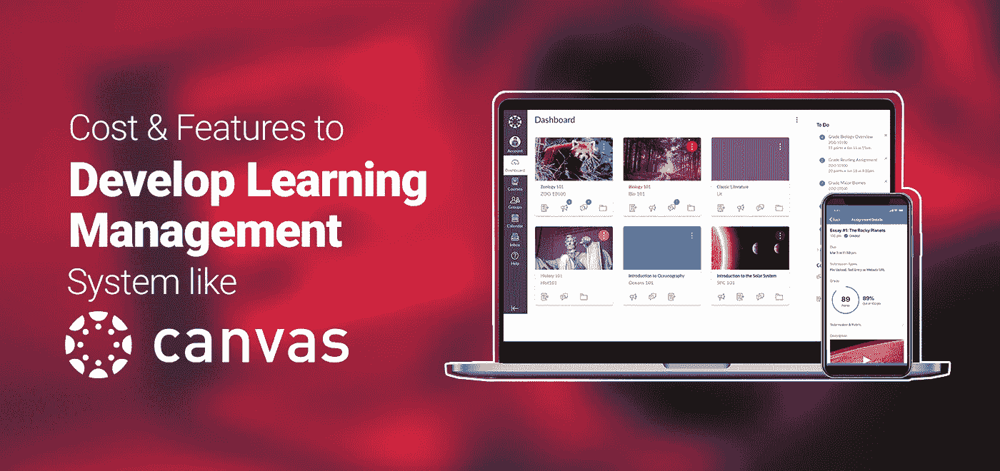
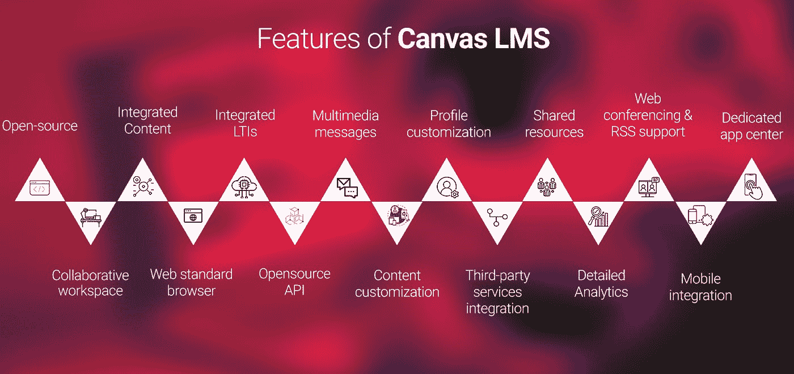

# 像 Canvas 一样开发学习管理系统

> 原文：<https://medium.com/codex/develop-learning-management-system-like-canvas-d942118d1df4?source=collection_archive---------12----------------------->

# 开发学习管理系统(如 Canvas)的成本和功能

你可能听说过 Canvas 这个名字，它是市场上最流行的学习管理系统之一。该工具有一个体面的用户界面，并提供了许多功能，可以增加您的业务价值。人们可能会在画布 LMS 中发现的唯一缺点是他们提供服务的价格点，或者是它是一个基于云的在线系统这一纯粹的事实。有成千上万的企业在寻找一个学习管理系统，就像一个稍微添加了一些功能的画布，那么开发像画布 LMS 这样健壮的东西的成本会是多少呢？在这篇文章中，我们将讨论完全相同的内容，所以请确保你一直读到最后。

学习管理系统是电子学习服务和员工培训的关键要素之一。虽然在过去，这种系统的应用仅限于拥有大量用户的电子学习平台，但现在每个企业、每个电子学习平台，无论规模如何，都在使用 LMS。甚至像陆军和国防部这样的中央集权部门也采用了 ALMS，因为他们的主要关注点是为他们部队的新成员提供有效的训练。这些系统功能强大，有助于在学习过程中建立一个完美的层次结构。所有数据都可以在一个目的地获得，使学生更容易访问他们的课程。此外，管理变得超级容易，因为现在专家只需点击几下鼠标就可以控制每个学生。该系统带来了透明度，因为所有专家都可以跟踪学习者的进度，甚至学习者可以知道他们在他们的批次中的确切位置。

总的来说，LMS 是一个小时的需求，canvas LMS 可以被认为是企业视野的理想匹配。既然您已经了解了 LMS 的用例及需求，那么让我们开门见山，直接跳到成本和特性上。

**设计类似画布的东西需要什么特性？**

有这么多的 [**定制 LMS 开发**](https://www.a3logics.com/custom-lms-development) 公司可以帮你把你的愿景变成现实，按照你的要求草拟一个完美的学习管理系统。然而，当你谈论创建像 canvas 这样的东西时，你需要知道该软件提供的 USPs，以及你如何才能实际达到相同的水平。如果你想在市场上购买任何东西，你需要有一个你寻找的功能列表，LMS 也一样。如果你还没有弄清楚你的学习管理系统必须有什么样的属性，那么看看下面提到的特性，因为这些是 canvas LMS 提供的最受欢迎的特性

1.  开源
2.  协作工作空间
3.  集成内容
4.  Web 标准浏览器
5.  集成 LTIs
6.  开源 API
7.  多媒体消息
8.  内容定制
9.  配置文件定制
10.  第三方服务集成
11.  共享资源
12.  详细分析
13.  网络会议和 RSS 支持
14.  移动集成
15.  专用应用中心

所有这些特性以及一个简单的机制带来了一个很棒的用户界面，这就是 Canvas 的优势。当涉及到 UI 时，每个系统都需要有一个独特的身份；然而，为了创造独特的用户体验，将功能集成在一个简单的界面中要比将表示复杂化好得多。所有这些特性都是吸引消费者的亮点，因此在市场上寻找 LMS 解决方案的人会选择 canvas LMS。

**开发类似 Canvas 的 LMS 的成本**

现在，你已经知道你必须集成的特性，你需要一个健壮的 LMS 的功能，试着理解你自己开发像 Canvas 这样的东西的确切成本是多少。您手中的优势之一是 canvas 是一个开源产品，可以根据您的需求进行建模。目前，品牌本身有多种支付结构，他们提供给他们的客户。他们也有 2 周的免费试用方法，但这是他们向大众展示产品的方式，如果您是一家正在寻找更强大、更高效的定制 LMS 以满足您自己的需求和愿景的企业，您实际上可以根据您的预算完成它，但是，成本实际上取决于各种因素，如-

1.  **用户数量&平台规模**

了解你将如何使用这个平台是非常重要的。有可能您是一个电子学习品牌，想要为您平台上的数千名学生提供一个集中的 LMS，也有可能您需要一个 LMS 来维护新员工学习计划的记录，并了解哪个新生已经准备好继续前进。对于每种类型的解决方案，资源都是有限的，因此可以相应地设置成本。它还可以让您很好地了解系统运行后您可能需要承担的维护成本。

**2。集成**

有时，组织会在他们的 LMS 中寻找集成来使事情变得更容易。例如，CRM-LMS 集成或任何类型的工具可以与 LMS 同步工作，这反过来节省了大量的时间和精力，同时保持了您生成的数据的质量和完整性。此外，你可以放心，你所有的学生都做得很好，完成了课程，因为你得到了线索积累在一个地方。增加这些集成可能会增加普通 LMS 的成本。Canvas 确实支持集成，因此您还需要确保它是否有用。

**3。团队&专家**

如果你想创建一个内部解决方案，你将需要雇佣开发人员、质量分析师和团队中所有其他重要的成员，他们将专门为你创建最终产品。优化这一成本的最佳选择是将定制 LMS 开发外包给一家已经具备所有方面的公司。否则，你将不得不花钱雇人，这可能会增加当前的成本。你永远不能否认，为此目的召集一个真正优秀的团队可能会变得令人头疼，因此这个决定很大程度上决定了你的预算以及如何优化预算。

**4。新增功能**

不一定你在 Canvas 中找到的所有特性都是你所需要的，很有可能你会考虑一些额外的东西。例如，您可能希望在多个部分中实现游戏化，而不是将其限制在仪表板中。平心而论，这就像自助餐，你选择你想吃的。唯一的区别是你只为你选择的东西付费。当您进行定制 LMS 开发时，您可以轻松地添加或删除任何功能，因此您有能力控制并获得一个类似于 Canvas LMS 的系统。

这些因素与团队的辛勤工作和愿景相结合，可以创建一个 LMS，甚至可能比当前的画布更好。每当你有一个定制开发公司的专家团队，你就可以最大化结果，最小化开发成本。

**总之**

如果你正在寻找一个数字的成本，只有一个定义明确的公司可以给你，但是，你需要明白，你将不得不花费数千美元，如果你想实现像帆布 LMS。当然，你可以通过去正确的定制 LMS 开发公司来最小化成本，最重要的是，要实现一个准确的愿景。如果你现在不知道你到底想要什么，你可以咨询任何 IT 服务。其中一些像 A3logics 甚至免费提供讨论。犹豫不决是没有意义的。希望这篇文章能帮助你理解 canvas LMS 的成本和特性背后的核心概念，以及开发一个像 canvas 一样的 [**学习管理系统**](https://www.a3logics.com/blog/learning-management-system) 需要什么。祝你好运！