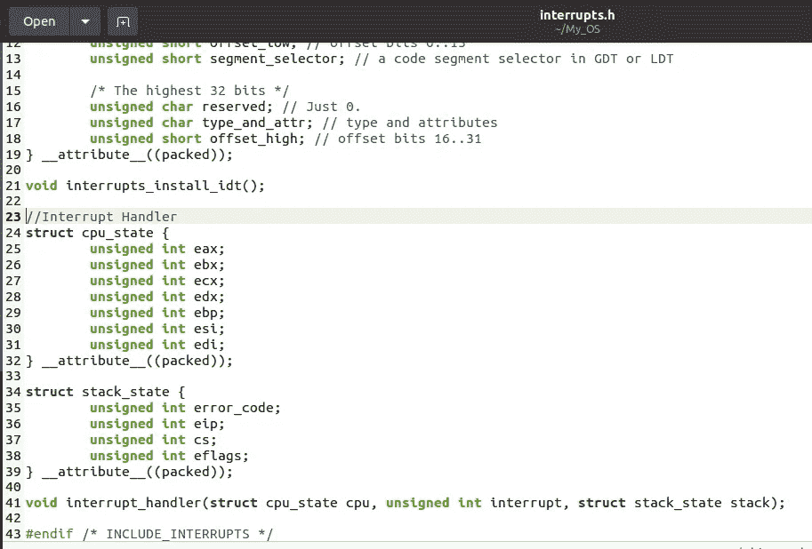
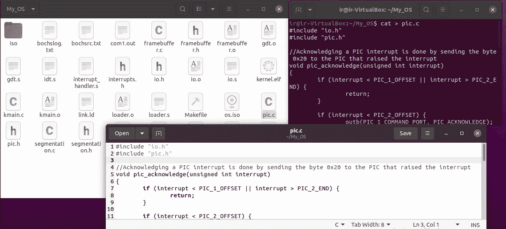

# 开发您自己的 x86 操作系统(OS) #6

> 原文：<https://medium.com/codex/develop-your-own-x86-operating-system-os-6-68605f50d522?source=collection_archive---------7----------------------->

## 中断处理和从键盘读取输入。

您的操作系统目前支持许多功能。由于您的操作系统被开发为在控制台上产生输出，因此通过这篇文章，让我们看看如何改进我们的操作系统以从键盘获得输入。操作系统必须能够处理*中断*，以便从键盘读取信息。因此，我们也将讨论操作系统系统开发中的中断处理。

如果您还没有阅读关于在操作系统中通过段(分段)访问内存的系列文章的第四篇，您可以从[这里](https://isuruni-rathnayaka0508.medium.com/develop-your-own-x86-operating-system-os-5-27743b500fab)阅读它，因为它的内容对于了解本文的内容非常重要。


# 中断

**中断**是一种需要立即关注的情况，导致微处理器暂时工作在不同的任务上，然后返回到之前的任务。中断可以是内部的也可以是外部的。

在 x86 处理器中，有 3 种类型的中断:硬件中断、软件中断和异常。

**硬件中断**由硬件设备触发。当硬件设备(如键盘、串口或定时器)向 CPU 发出设备状态已经改变的信号时，就会发生这种情况。然后处理器停止正在做的事情，执行处理硬件中断的代码。硬件中断通常是异步的——它们的发生与发出时正在执行的指令无关。例如:当你在键盘上打字时，键盘触发一个硬件中断并处理键盘输入(通常是将你按下的键读入内存中的缓冲区)。

**软件中断**用于将控制转移给操作系统内核中的功能。软件中断由 *int* 汇编代码指令触发，通常用于系统调用。例如:指令“int 14h”触发中断 0x14。

**异常**由 CPU 自身生成，以响应程序错误，例如当程序引用它无权访问的内存时，或者当程序将一个数除以零时。这些中断被称为异常。处理器将检测到这个问题，并将控制转移给一个处理程序来处理这个异常。这个处理程序可能会在更改一些值后重新执行有问题的代码，或者如果做不到这一点，导致异常终止的程序。

中断条件向处理器发出警报，并在允许时请求处理器中断当前正在执行的指令。如果请求被接受，处理器通过暂停其当前活动、保存其状态并执行一个名为*中断处理程序*的函数来处理该中断。

# 中断处理程序

中断处理是识别已经发生的准确中断并对识别的中断执行相关响应的过程。**中断处理程序**的工作是服务中断并阻止它中断。中断有三种不同的处理程序:

*   任务处理程序
*   中断处理程序
*   陷阱处理器

任务处理程序使用特定于英特尔 x86 版本的功能。中断处理程序和陷阱处理程序之间的唯一区别是中断处理程序禁用中断，这意味着在处理中断的同时不欢迎任何中断。在我们的过程中，我们将使用陷阱处理程序，并根据需要手动禁用中断。

在 x86 架构中，中断由**中断描述符表(IDT)** 处理。

# **中断描述符表(IDT)**

中断描述符表(IDT)是一个 x86 系统表，包含中断处理程序的描述符(IDT 为每个中断描述一个中断处理程序)。处理器使用 IDT 来确定对中断和异常的正确响应。IDT 有 256 个条目，其中中断编号从 0 到 255。中断 *i* 的处理程序定义在表中第*和*位置。


“英特尔架构软件开发人员手册中的 IDT”

中断描述符表类似于我们在上一篇文章《结构》中讨论的全局描述符表。在实施 IDT 之前，一定要确保您有一个工作的 GDT。

## 在 IDT 中创建条目

IDT 条目被称为盖茨。它可以包含中断门、任务门和陷阱门。中断处理程序的 IDT 中的一个条目由 64 位组成。最高 32 位如下图所示:


下图显示了最低的 32 位:


偏移量是一个指向要执行的代码的指针，可能是一个汇编代码标签。例如，要为代码从 *0xDEADBEEF* 开始并在特权级别 0 下运行的处理程序创建一个条目，将使用两个字节 *0xDEAD8E00* 和 *0x0008BEEF* 。

如果 idt 被表示为一个*无符号整数 IDT，*那么为了将上面的例子注册为中断 0(被零除)的处理程序，将使用下面的代码:

idt [0] = 0xDEAD8E00

idt [1] = 0x0008BEEF

不要使用字节或无符号整数，最好使用我们在上一篇文章中讨论过的打包结构，使代码更具可读性。

为了创建一个到 IDT 的入口，首先在工作目录中创建一个名为 interrupts.h 的文件来保存下面的 C 函数声明:


“现在你会在你的工作目录中看到 interrupts.h”

让我们现在跳过函数定义，因为我们必须学习更多来提出它们。

## 装载 IDT

IDT 加载有 *lidt* 汇编代码指令，该指令获取表中第一个元素的地址。我们包装这条指令，并在 C 中使用它，如下所示:

在您的工作目录中创建 idt.s，并将上面的代码保存在其中，如下图所示:


"现在你会看到 idt.s 文件"

# 处理中断

当中断发生时，CPU 将把有关中断的一些信息压入堆栈，然后在 IDT 中查找适当的中断处理程序并跳转到它。中断时的堆栈如下所示:

```
[esp + 12] eflags
[esp + 8]  cs
[esp + 4]  eip
[esp]      error code?
```

错误代码后面的问号是因为不是所有的中断都会产生一个*错误代码*。将错误代码放入堆栈的特定 CPU 中断是 8、10、11、12、13、14 和 17。中断处理程序可以使用错误代码来获取有关已发生中断的更多信息。此外，中断号不会被压入堆栈。因此，只有知道正在执行的代码才能识别已经发生的中断。例如:如果为中断 14 注册的处理程序正在执行，那么中断 14 已经发生。

一旦中断处理程序完成了它的任务，它就使用 *iret* 指令返回。指令 *iret* 期望堆栈与中断时相同。因此，中断处理程序压入堆栈的任何值都应该从堆栈中弹出。在返回之前， *iret* 通过从堆栈中弹出值来恢复 *eflags* ，然后最终跳转到堆栈上的值所指定的 *cs: eip* 。


中断处理程序使用的所有寄存器必须通过将它们压入堆栈来保存。因此，中断处理程序必须用汇编代码编写。原因是被中断的代码不知道这个中断，因此期望它的寄存器保持不变。但是，用汇编代码编写中断处理程序的所有逻辑将是令人厌烦的。因此，我们可以在汇编代码中创建一个处理程序，保存寄存器，调用 C 函数，恢复寄存器，最后执行 *iret* 。

C 处理程序应该获取寄存器的状态、堆栈的状态和中断的数量作为参数。可以使用以下定义:

现在用上面的代码更新 interrupts.h 文件，如下所示:



"现在你的 interrupts.h 文件看起来像这样"

中断处理程序的功能定义也可以在以后的进一步研究中完成。

# 创建通用中断处理程序

编写一个通用的中断处理程序并不容易，因为 CPU 不会将中断号推入堆栈。让我们看看如何使用宏来完成它。为每个中断编写一个版本不是一个好主意，所以最好使用 NASM 的宏功能。由于只有一些中断产生错误代码，对于没有错误代码的中断，值 0 将被声明为“错误代码”。下面的代码显示了如何做到这一点:

在工作目录中创建 interrupt_handler.s 文件，并将上面的代码保存在其中:


"现在你会看到 interrupt_handler.s 文件"

常见的中断处理程序执行以下操作:

*   推送堆栈上的寄存器。
*   调用 C 函数中断处理程序。
*   从堆栈中弹出寄存器。
*   给 esp 加 8。
*   执行*指令*返回被中断的代码。

由于宏声明了全局标签，当创建 IDT 时，可以从 C 或汇编代码中访问中断处理程序的地址。

# 可编程中断控制器

可编程中断控制器用于管理来自不同硬件设备的硬件中断，并将它们发送到相应的系统中断。因此，为了首先开始使用硬件中断，必须配置可编程中断控制器(PIC)。PIC 使得将硬件信号映射到中断成为可能。

配置 PIC 的原因是:

*   重新映射中断。默认情况下，PIC 使用中断 0–15 作为硬件中断，这与 CPU 中断相冲突。因此，PIC 中断必须重新映射到另一个时间间隔。
*   选择要接收的中断。
*   为 PIC 设置正确的模式。


开始时只有一个 PIC (PIC 1)和八个中断。由于增加了更多硬件，8 次中断是不够的。因此，作为解决方案，另一个 PIC (PIC 2)链接到第一个 PIC 上。


来自 PIC 的每个中断必须通过向 PIC 发送确认该中断已被处理的消息来确认。如果这没有完成，PIC 将不会产生更多的中断。

确认 PIC 中断的过程是通过向引发中断的 PIC 发送字节 *0x20* 来完成的。因此，实现 *pic_acknowledge* 功能可以如下进行:

为了 PIC 的完整功能，让我们创建一个名为 pic.h 的文件，并在其中保存以下代码:


“现在您将看到 pic.h 文件”

之后，包括 *pic_acknowledge* 在内的函数定义应保存在一个名为 pic.c 的文件中，如下所示:



# 从键盘读取输入

现在我们的操作系统可以处理中断，所以我们准备好从键盘获取输入。在这一部分，让我们看看我们可以怎么做。

键盘不生成 ASCII 字符，而是生成扫描代码。扫描代码代表一个按钮，更具体地说，代表特定按钮的按压和释放。地址为 *0x60* 的键盘数据 I/O 端口可用于读取代表刚刚按下的按钮的扫描代码。下面的示例显示了如何实现这一点:

下一步是编写一个函数，将扫描代码翻译成相应的 ASCII 字符。为此，首先创建一个 keyboard.h 文件，并保存以下宏定义和函数声明:


"现在你会看到 keyboard.h 文件"

因此，让我们用上述函数的定义创建 keyboard.c 文件:


"现在你会看到 keyboard.c 文件"

由于键盘中断是由 PIC 引发的，所以必须在键盘中断处理程序的末尾调用 pic_acknowledge。此外，键盘不会给你任何更多的中断，直到你从键盘上读取扫描码。

现在，我们已经了解了创建我们之前跳过的 interrupts.c 文件的所有必要细节。它包含中断中所述功能的定义。h .以下代码可用于此:


“现在你会看到 interrupts.c 文件”

以下两个函数应该包含在 interrupts.h 文件中，它们是 NASM 的包装器。

> void load_idt(无符号 int IDT _ address)；
> 
> void 中断处理程序 33()；

如下所示:


"现在你的 interrupts.h 文件看起来像这样"

我们从键盘输入的内容将输出到我们在以前的文章中介绍的 com1.out 文件中。所以，让我们对我们在 serial_port.c 文件和 serial_port.h 文件(在本系列的第四篇文章中创建)中声明的 serial_write 函数做一个小小的改动。使用以下函数定义更新 serial_port.c 文件，使用以下声明更新 serial_port.h 文件:


“现在，您的 serial_port.c 和 serial_port.h 文件将如下所示”

像往常一样，是时候更新我们的 kmain.c 文件了，如下所示:


然后更新 Makefile 的对象变量，如下所示:


"更新的生成文件"

使用“make run”命令引导您的操作系统，并使用键盘在控制台上(标记的地方)输入您想要的内容。


现在用文本编辑器打开 co1.out 文件，您将看到您的输入保存在文件中。


“我输入欢迎使用 myos，这是我的 com1.out 文件的样子”

现在，您已经开发了自己的操作系统来处理中断并从键盘读取输入。在下一篇文章中，我们将讨论如何在内核模式下轻松执行一个小程序。从[这里](https://isuruni-rathnayaka0508.medium.com/develop-your-own-x86-operating-system-os-7-49d494f5116b)读出来。

参考

[LittleOSBook](https://littleosbook.github.io/)

[中断](https://en.wikibooks.org/wiki/Microprocessor_Design/Interrupts)

[中断描述符表](https://wiki.osdev.org/Interrupt_Descriptor_Table)

[x86 汇编/可编程中断控制器](https://en.wikibooks.org/wiki/X86_Assembly/Programmable_Interrupt)

希望你理解处理中断和从键盘读取输入的步骤。让我们来看看开发自己的 x86 操作系统(OS)系列的下一篇文章。非常感谢您的阅读！！！！！！！！！！

伊苏鲁尼·拉特纳亚卡