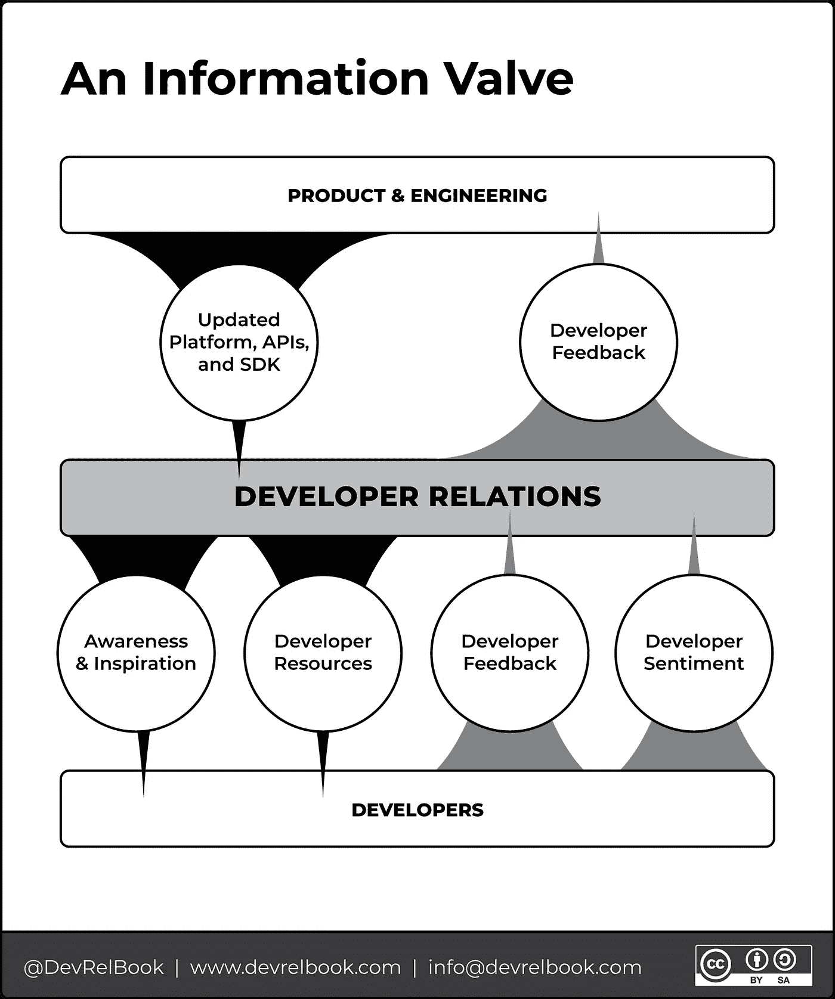

# 开发者宣传不等于开发者关系

> 原文：<https://medium.com/codex/developer-advocacy-doesnt-equal-developer-relations-90be91e2aeb5?source=collection_archive---------5----------------------->

通常，当考虑开发人员关系时，首先想到的是开发人员宣传。事实上，十有八九，新的 DevRel 团队雇佣的第一个角色是开发者倡导者。以至于开发者宣传经常被认为是开发者关系中唯一或者最重要的角色。

> DevRel 不仅仅是支持开发者。

这种误解有很多原因，也有一堆历史。早在 80 年代初，当开发者关系首次与苹果合作时，作为首席传道者的盖伊·川崎是一个如此积极的推动者，以至于在 DevRel 领域留下了不可磨灭的印记。直到今天，开发者拥护者/传播者( [1](https://devrelbook.substack.com/p/developer-advocacy-doesnt-equal-developer#footnote-1) )通常是你的 DevRel 项目在外部技术社区中最引人注目的代表，并且通常在你的技术营销工作的前面。这并不奇怪，因为他们的任务和技能集技术技能和沟通技能于一身。

可以肯定的是，开发人员倡导的角色和理念是为开发人员服务并代表他们进行倡导，这是 DevRel 的一个重要功能，它为围绕 DevRel 的文化定下了基调。

**开发者拥护者充当公司的信息阀门(见下面的图 1)。**在这个角色中，他们与开发社区进行交流，并在公司内部扮演“开发人员之声”的角色，提供关于产品、开发人员体验以及贵公司在开发人员圈子中的声誉的宝贵反馈。

正如我们在博客[开发者关系框架](https://devrelbook.substack.com/p/a-framework-for-developer-relations)中所述，我们提出 DevRel 由四个功能区域组成:

1.  开发者营销
2.  开发者体验
3.  开发者教育
4.  开发者成功

都是为社区服务的。

我们收到了一些反馈，对宣传未被列为职能领域之一表示惊讶。我们的回应是——**支持开发人员必然发生在所有四个功能领域**，这解释了为什么开发人员支持者经常被称为“瑞士军刀”或“各行各业的杰克/吉尔”

**通过**检查陷阱，尤其是在早期团队中:

> 仅仅因为有人可以在 DevRel 中做一点点事情，并不一定期望他们做一点点事情就可以成功。

此外，我们经常发现开发人员倡导者享有高度的授权和自主权，但通常被雇佣到 IC(个人贡献者)角色中。因此，他们可能不会密切参与整个项目的战略规划和预算设置。

因此，如果您的团队中有一名开发倡导者:

1.  忽视一个发展倡导者的见解，后果自负。
2.  从整体上考虑他们和你的团队的职业发展道路。

此外，为了给你的 DevRel 程序最好的成功机会，我们鼓励你从更高和更具战略性的角度来看待 DevRel。倡导是关键，但不要忘记对你的项目有贡献的所有其他角色。这些角色将存在于核心 DevRel 团队中，以及相邻团队中需要与您的 DevRel 团队合作的同事，以交付最佳且无摩擦的[开发者之旅](https://devrelbook.substack.com/p/the-developer-journey-map)。

访问 DevRelBook.com 的***了解更多关于我们的书和免费 DevRel 资源的信息，包括开发者关系计划目录，其中包含 700 多个开发者关系计划的数据。***

**您的 DevRel 策略需要帮助吗？了解有关我们的* [*DevRel 咨询服务*](https://email.mg2.substack.com/c/eJxFUMluxCAM_ZrhiMCBLAcOvfQ3IhZ3SksgApJM_r5kcqhkWZa3t1hd8ZnyqdZUKrnSXM8VVcSjBKwVM9kK5tk7JRj0fBhJqxwf5Uh8mb8y4qJ9UDVvSNbNBG919SleByDlMEryrcw4ge6MYAL6wWjJ0VoGnXSuGyU4e-PqzXmMFhXumM8UkQT1XetaHt3HAz5bHMdBHe4Zg0npl9q0tGZjt3uLhXgFDIBx4EwKCZICNQIaBWvRSd4oWPra_Tpxtj4EW55Ay2ZK1fb9imT1oxcsbRR0dC3wtbZMI9ZL2dx2li36es4YtQnobtH1tu5tw_zEiLlZ6mZdFe8FDKKboJesuzVeNg4dAzZJ0sBdaldR_Wv6A68Ahxg) *的更多信息，包括指导、互动研讨会、开发人员旅程摩擦审计、开发人员喜爱的文档和博客等等…**

*( [1](https://devrelbook.substack.com/p/developer-advocacy-doesnt-equal-developer#footnote-anchor-1) ) *今天更常用的是开发者倡导者，而不是开发者福音传播者，因为倡导者被视为一个更全面的术语，多了一个为开发者服务的人，而不是简单地推广或福音传播产品。**