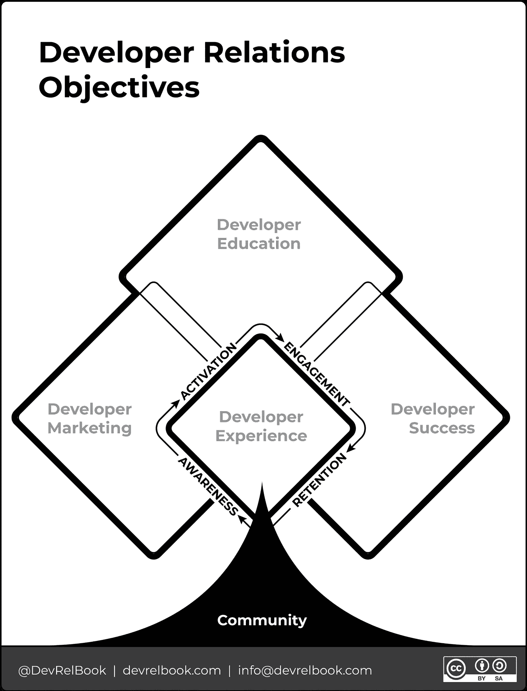

# 开发者关系:开发者关系的框架

> 原文：<https://medium.com/codex/developer-relations-a-framework-for-developer-relations-2132797947c5?source=collection_archive---------13----------------------->

有没有人问过你，“开发者关系到底是什么？”或者也许你才是提出这个问题的人。鉴于 DevRel 的范围，这是一个困难的问题，所以我们挑战自己提出一个简洁的框架。

早在一月份，我们分享了一些[关于**开发者关系框架的早期想法**](https://devrelbook.substack.com/p/the-developer-relations-framework)，试图描述开发者关系的表面区域，它的组成部分，以及它们如何相交。

出版《V1》在社区中激发了一场真正有建设性的讨论。当我们第一次公开分享这个框架时，我们对它并不是 100%满意，所以反馈正是我们挑战和塑造我们思维所需要的。谢谢大家！

在本帖中，我们将介绍**开发者关系框架**的 V2，以及我们的[书](https://www.devrelbook.com/)中包含的内容。

# 需要改变什么

具体来说，把开发者关系放在原始框架的中心是行不通的。在 V1,“开发人员关系”既被用于包含框架所有组成部分的总括术语的上下文中，也作为框架内的一组特定活动进行规划。这显然造成了混乱。

从我们在**开发者之旅框架**的工作来看，显然**开发者体验(DX)**包括产品和文档，应该是框架的核心。如果你的 DX 很差，在注册、入职和产品使用工作流程中造成摩擦，你的成功机会将会受到严重阻碍。

从收到的反馈中得出的最后一个结论是**开发人员教育(DevEd)** 的重要性日益增加。我们已经暗示了大量学习资源的重要性，但是仔细想想，我们觉得 DevEd 的势头和重要性是不可否认的。考虑到 COVID 对传统开发商实地宣传的影响，情况尤其如此。将它视为 DevRel 的核心组件是正确的。

新的图表反映了如图 1 所示的变化。

# 那么 DevRel 是什么？

DevRel 是一种专业实践，专注于开发人员作为产品主要用户的参与。它也是公司的一个项目和一系列活动，通常被称为开发者项目。开发人员框架概述了在开发人员使用您的产品和公司的过程中与他们进行交互所激活的核心组件。

下面是 DevRel 框架各个组件的概述:

1.  **开发者营销** —推广和参与活动，以提高知名度并促使开发者使用你的产品。
2.  **开发者教育** —产品文档和教育资源，帮助学习并与您的产品和社区建立密切关系。
3.  **开发者体验(DX)** —包括开发者门户、产品和文档，以最小的摩擦激活开发者。
4.  **开发人员成功** —在开发人员构建和扩展您的产品时培养他们的活动，包括保留。
5.  **社区** —就像树的树干和树根一样，一个社区必须得到滋养，才能成长并保持健康，才能实现成功、可持续的项目。

我们希望你现在能够自信地回答这个问题，“什么是 DevRel？”

我们总是乐于接受反馈。DevRel 框架在这里以 CC:BY:SA license 共享，所以请让我们知道您的想法，并随时修改它以不断提高它的实用性。

***开发者关系——如何建立和发展一个成功的开发者计划*** *现可通过 press &亚马逊* *预订* [*。*](https://www.devrelbook.com/)