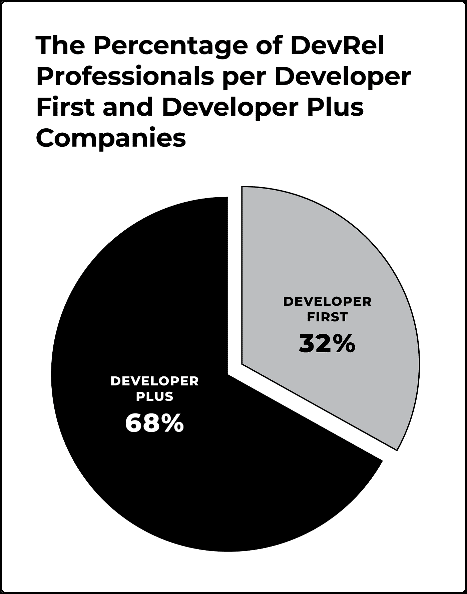

# 开发者关系:开发者优先&开发者加公司

> 原文：<https://medium.com/codex/developer-relations-developer-first-developer-plus-companies-d4fa3d311893?source=collection_archive---------14----------------------->

# 了解公司背景的重要性。

很容易对 DevRel 做出假设。这可能取决于你听说过什么，或者你工作过的公司。

根据我们自己的经验，以及我们为这本书所做的研究，很明显，你的组织环境决定了世界的不同。让我们深入探讨一下，分享一下我们学到的东西。

# 两种类型的 DevRel 公司

在我们的书中，我们定义了两种类型的 DevRel 公司:

1.  **开发者优先** —主要专注于创造和销售专为开发者设计的产品的公司(也称为开发商对开发商，或 B2D)。想想 Twilio，Stripe，MongoDB，Arduino，Unity，PerceptiLabs 等等。
2.  **开发者加**——主要专注于为企业(又称企业对企业，或 B2B)或消费者(又称企业对消费者，或 B2C)创造和销售产品的公司。这些公司也向开发者提供产品或服务，他们认为这些产品或服务会在某种程度上有利于或增加他们的战略。增加 B2D 方法可能带来的好处包括打开新的市场渠道、扩展到新的使用案例、促进创新战略或优化或增强现有产品的新方法。例子包括高通、苹果、福特、桑坦德、微软、Salesforce、亚马逊和谷歌。

[2020 年开发者关系报告](https://www.reverecommunications.com/post/state-of-developer-relations-2020-report)发现超过 2/3 的 DevRel 专业人员在 **Developer Plus** 公司工作，如图 1 所示。

图 Dev First 或 Dev PLus 公司中的 DevRel 专业人员。来源:【2020 年开发商关系状况报告

# 为什么理解公司背景很重要

根据公司的类型和范围，您自己的运营情况可能会有很大的不同。当你试图建立和扩展你的项目时，这些个别的情况将决定你必须投入多少时间在战略联盟和利益相关者管理的内部事务上，而不是投入到开发者社区和推动你的开发者工具或产品的采用上。这种环境也会影响你吸引和留住顶尖人才的能力，也会影响你执行想法的自由。

也许并不奇怪，总的来说，对于一个 DevRel 专业人员来说，在一个 **Developer First** 公司里，生活要容易得多。毕竟， **Developer First** 公司的唯一目的是为开发者开发工具，因此人们希望，对于一些简单的问题，比如，“*为什么开发者很重要？*"在 **Developer First** 公司中的摩擦往往是由于部门或投资者之间缺乏沟通，对上市策略和指标的分歧，或者对 *good* 看起来像什么缺乏理解，而不是更根本的生存危机，质疑是否需要一个 DevRel 团队。

在 **Developer Plus companies** 中，始终要意识到你的活动可能不被视为业务的核心，因为根据定义，它不是。因此，你的工作必须包括教育你的利益相关者，以确保你有蓬勃发展所需的空中掩护。想办法将你的努力与你的部门和整个公司的核心目标和优先事项联系起来。将这些点联系起来，证明在你的项目上花一美元比在业务的其他地方花一美元能获得更好的回报。

如果你在一家更大的跨国公司工作，你将会面临更多的挑战。公司文化可能不太适合培育 DevRel 的成果。DevRel 要想取得成功，就必须开放，愿意在一个支持和协作的环境中分享信息，接受反馈并采取行动，并具有企业家和伙伴关系的心态。虽然你可能会建立足够的动力来启动一个 DevRel 程序，但你可能会发现自己陷入了一场与公司“抗体”的虚弱战争，这些抗体会攻击和杀死任何不属于主机内部的东西。部门和个人可以有意或无意地努力从事任何被认为是不正常的活动。

组织变革既影响**开发者优先**又影响**开发者加**公司。招聘、解雇和重组是常态，所以永远不要自满。你的利益相关者会改变，有时是每六个月一次。新入职的高管希望引起轰动，改变现状，通常会招募他们以前共事过的人。你的项目会受到持续的审查。即使事情看起来进展顺利，混乱和分心也可能隐藏在角落里。

要了解更多关于在 **Developer First** 和 **Developer Plus** 公司领导 DevRel 计划的含义，以及如何将您的 DevRel 工作与您公司的目标保持一致，请拿起一份***Developer Relations——如何建立和发展一个成功的 Developer Program*** *，现在可以通过 press & Amazon* *预订* [。](https://www.devrelbook.com/)