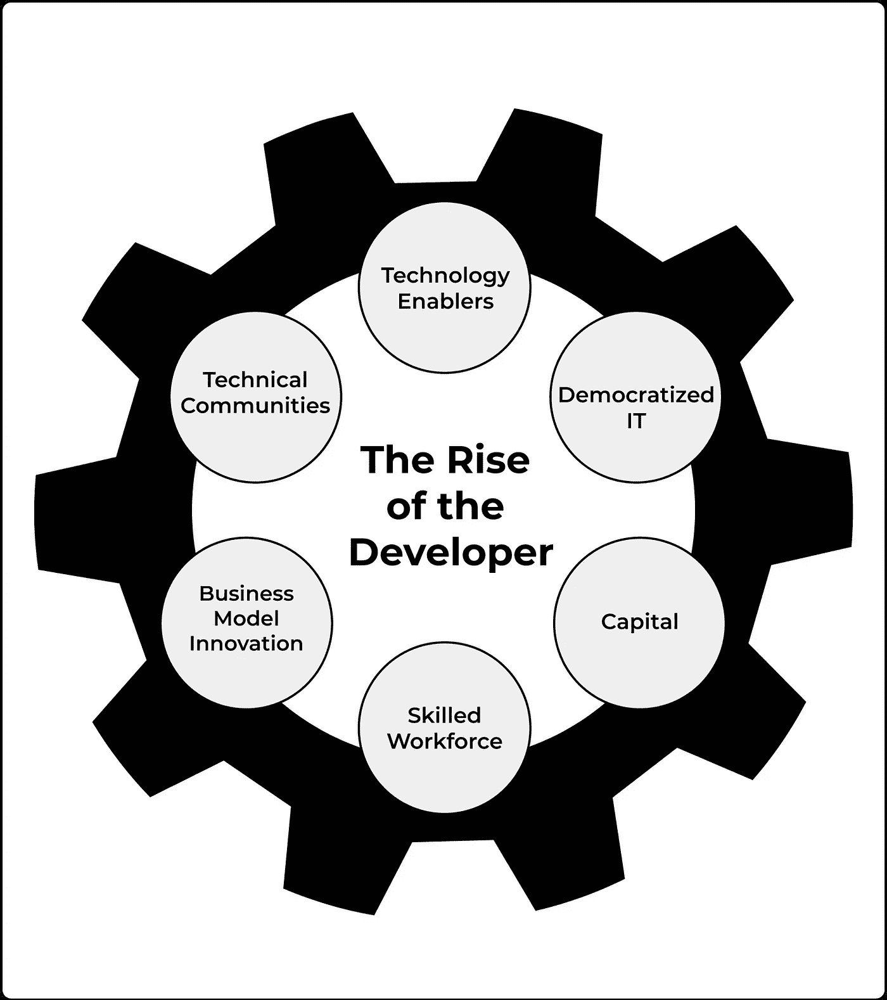
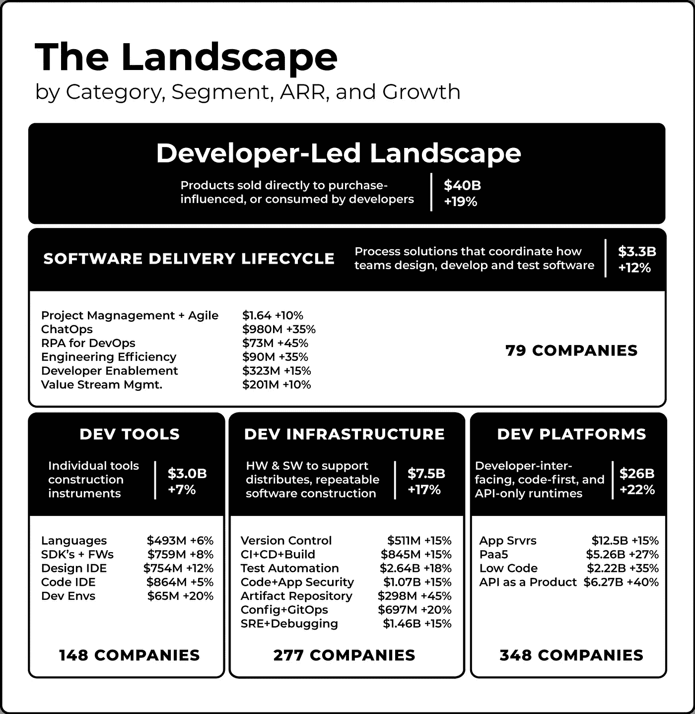

# 开发者关系正在蓬勃发展——原因如下

> 原文：<https://medium.com/codex/developer-relations-is-booming-heres-why-cf4a31704e33?source=collection_archive---------7----------------------->

# 创新=开发者！同意的请举手。

根据 Robert Tercek 的说法，在过去的二十年里，许多行业已经蒸发了，因为软件创造了新产品和新的商业模式。这才刚刚开始。工业 4.0 将会看到数十亿用户、应用和传感器结合在一起，形成无限数量的连接——在云和边缘。人工智能(AI)和机器学习(ML)、机器人、5G 和其他通信技术将会有所进步，区块链正在加速 Web3 的到来，当然还有利用增强现实和虚拟现实技术的流行语“今日 T2”【元宇宙】。

在此期间，我们不能忽略 API 的爆炸性增长——使软件能够连接和通信，增加软件的功能并降低开发成本，以及催生一个全新的公司类别。

# 这种创新与开发人员的联系很简单。

代码是基础构件。谁写代码呢？那就是软件开发人员。然而，为了创建，开发人员需要各种各样的工具，如 API、SDK 和平台。这些开发者产品一致爆炸。

但这只是等式的一部分，如果重写为:

## 创新=开发者(创造者+决策者)

开发者既是创造者，也是决策者。对开发人员是决策者的认识为针对软件开发人员的工具和服务的提供者创造了一个全新的类别和市场机会。

我们确定了在过去 20 年中促成开发人员的*崛起的六个关键趋势，这六个趋势加在一起导致全球软件开发人员在过去 4 年中增长了 55%，达到 2430 万开发人员。*

我们的等式还需要一点调整:

## 创新=开发者(创造者+决策者)x 价值

将开发者作为进入市场的途径必须证明其价值，如果人们相信的话，好消息是——确实如此。泰勒·朱厄尔的开创性工作现在对开发者主导的经济的估值为 490 亿美元，跟踪了 1000 多家公司，这些公司的产品被出售给了开发者或者受到了开发者的影响。我们自己的工作跟踪了向开发者提供某种产品或服务的 [700 家公司。GGV 资本公司的 Glenn Solomon 预测，以开发者为中心的软件公司将催生一个新的](https://www.devrelbook.com/devreldirectory)[1 万亿美元的企业技术市场。](https://www.forbes.com/sites/glennsolomon/2021/05/20/why-the-next-1-trillion-software-wave-is-still-underway-despite-the-tech-downturn/?sh=2c0b98c770d2)

# 这就是开发者关系的用武之地。

这些开发人员工具和开发人员需要强大的开发人员计划来推广这些工具，并通过确保开发人员拥有所需的资源和灵感来尽可能以最有创意、最高效、最顺畅的方式构建工具，从而鼓励他们采用这些工具。

# 还玩世不恭？

开发者关系现在已经走出了艰难的青少年时期——它已经和万维网一样存在了很久。看看那些将开发者作为进入市场途径的领先公司是如何繁荣发展的——sales force、Shopify、微软、亚马逊、高通。

一个全新的专门提供以开发者为中心的产品的公司类别已经诞生，我们称之为[开发者优先公司](https://devrelbook.substack.com/p/developer-first-and-developer-plus) — Twilio、Atlassian、Datadog、Okta、Crowdstrike、MongoDB、Stripe、Snowflake 和 HashiCorp 等等。

*访问*[*DevRelBook.com*](https://email.mg2.substack.com/c/eJxFkMtuwyAQRb8mLBGMwY8Fi276GxaGSUKLAQGO478vjheVRqPRvK7ONbriI-ZDpVgqOdNcj4Qq4F481oqZbAXz7KwSDHo-jKRVlo9yJK7M94y4audVzRuStC3eGV1dDOcBSDmMkjyVFVbIu7aD7NldcIYcWLeIXjJcUEh96erNOgwGFb4wHzEg8epZayq37usG3y32facWXxn9EuMvNXFtTeIUMADGgTMpJEgKdBHQpI1BK_kE2tD3y6WJs3QTbH0ALdtSqjafFySrH71iaSOvg22B79QyDVhPorntrFtw9Zgx6MWjvWDrZdkHf35gwNystLOuivcCBtFN0AC7i-20b-gYsEmSJm5juwrqn-UP81mDsg)*了解更多关于我们的书和免费 DevRel 资源的信息，包括开发者关系计划目录，其中包含 700 多个开发者关系计划的数据。*

您的 DevRel 策略需要帮助吗？了解有关我们的 [*DevRel 咨询服务*](https://email.mg2.substack.com/c/eJxFUMluxCAM_ZrhiMCBLAcOvfQ3IhZ3SksgApJM_r5kcqhkWZa3t1hd8ZnyqdZUKrnSXM8VVcSjBKwVM9kK5tk7JRj0fBhJqxwf5Uh8mb8y4qJ9UDVvSNbNBG919SleByDlMEryrcw4ge6MYAL6wWjJ0VoGnXSuGyU4e-PqzXmMFhXumM8UkQT1XetaHt3HAz5bHMdBHe4Zg0npl9q0tGZjt3uLhXgFDIBx4EwKCZICNQIaBWvRSd4oWPra_Tpxtj4EW55Ay2ZK1fb9imT1oxcsbRR0dC3wtbZMI9ZL2dx2li36es4YtQnobtH1tu5tw_zEiLlZ6mZdFe8FDKKboJesuzVeNg4dAzZJ0sBdaldR_Wv6A68Ahxg) *的更多信息，包括指导、互动研讨会、开发人员旅程摩擦审计、开发人员喜爱的文档和博客等等…*