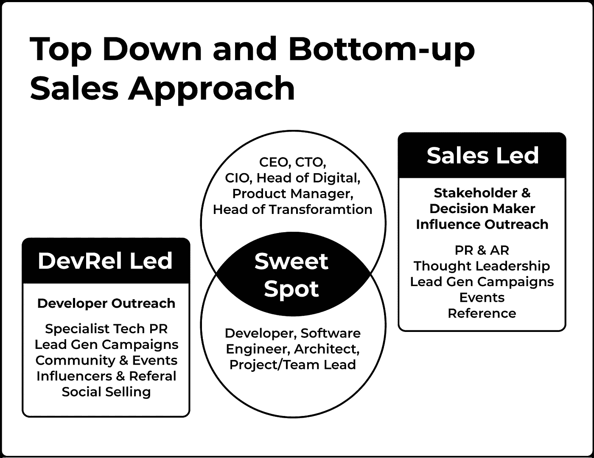
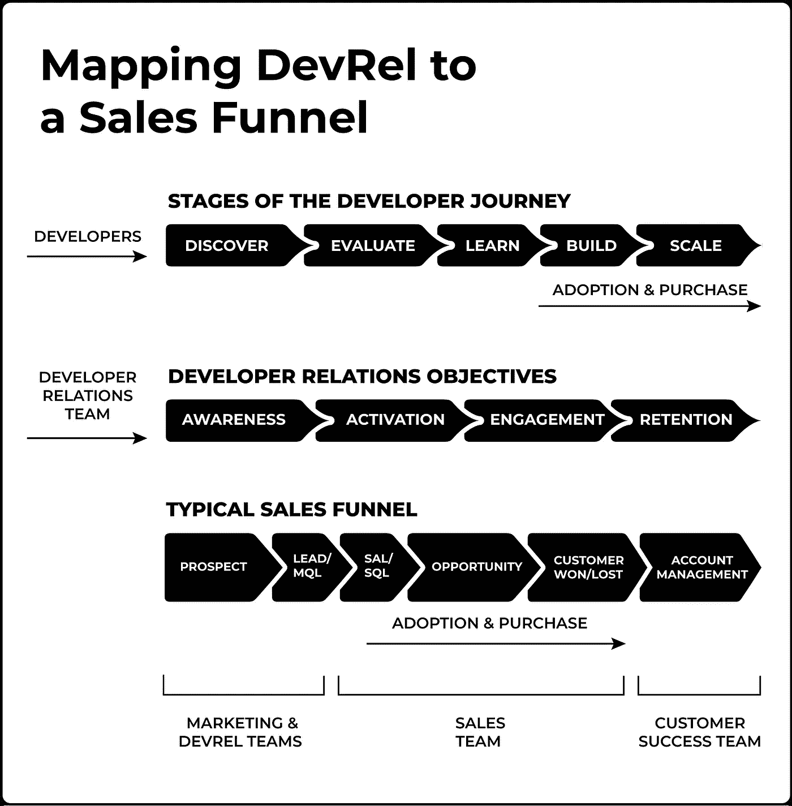

# 开发者关系:销售和开发者坐在树上，k-i-s-s-i-n-g

> 原文：<https://medium.com/codex/developer-relations-sales-devrel-sitting-in-a-tree-k-i-s-s-i-n-g-b8158d87bed4?source=collection_archive---------4----------------------->

由 [Unsplash](https://unsplash.com/s/photos/sitting-in-tree?utm_source=unsplash&utm_medium=referral&utm_content=creditCopyText) 上的 [Spring Fed Images](https://unsplash.com/es/@spring_fed_images?utm_source=unsplash&utm_medium=referral&utm_content=creditCopyText) 拍摄

如果您阅读过我们的书或关注过我们的时事通讯，您就会知道我们的主要动机是帮助提高对开发人员关系的认识，将其作为与更传统的业务部门(如营销、销售、产品和工程)一起的一种独特实践。最终，我们主张在公司的 C 级中设立一个以开发人员为中心的角色——首席开发官**或 CDO。**

在这个过程中有一些障碍需要清除，包括通用术语、框架、流程的标准化和开发，以及解决可能阻止 DevRel 向前迈出集体一步的态度障碍。

全球有成千上万的人在 DevRel 中工作，所以可以预料，许多人对 DevRel 的角色和范围有不同的看法。同样重要的是，提出新的想法来促进我们的集体思维和 DevRel 的影响。然而，就一组集体定义和最佳实践达成一致，对于创建该专业的基础是必要的。在基本原则上达成一致后，我们可以将花费在争论和改造基本 DevRel 主题上的精力重新导向职业的进步。

我们提到了“态度障碍者”。许多 DevRel 的比喻仍然存在:“*开发人员讨厌营销*”、“*他们不了解开发人员*”(“T10”“通常指高级管理人员)，或者“*不可能衡量我做了什么*”。也许我们会在某个时候分别写下所有这些，但是这篇文章的主题是我们个人最喜欢的:“ *DevRel 不是关于销售的*”

除了开源项目，我们想不出哪个 DevRel 角色不为公司赚钱。开发者拥护者正在积极说服开发者采用他们公司的技术。DevEd 正在创建内容和文档来帮助开发人员更快地采用该技术。支持正在消除采用该技术的障碍。客户/开发人员成功地找到了在其客户中扩大技术使用的方法。这样的例子不胜枚举。

尽管如此，经常听到 DevRel 圈子里的人说他们与销售无关，销售人员不了解开发人员，他们不与开发人员讨论定价，因为这在某种程度上“玷污了”对话。说真的，开发者很清楚你的技术不是免费的。否认这一点对你的工作为公司创造价值的影响是有害的。

除了 DevRel 团队在销售中的作用，在公司发展的某个阶段，你将开始建立一个专门的销售团队。在许多公司，尤其是 [Developer Plus 公司](https://devrelbook.substack.com/p/developer-first-and-developer-plus)，销售团队很可能在 DevRel 出现之前就已经存在了。

在[开发者优先](https://devrelbook.substack.com/p/developer-first-and-developer-plus)创业公司中，销售投资的触发因素通常是:

1.  通过瞄准通常不通过自助服务购买的大型企业来增加收入的内部压力。
2.  随着你声誉的增长，新的购买角色会出现。你不再只和开发者交流。你现在会遇到“商业”职位，这些职位不太专业，使用不同的标准进行评估，需要不同的参与策略。

**那么 DevRel 和销售是如何合作的呢？**他们不是油和水。他们可以*也必须*混合。

作为一个 DevRel 团队，你的活动主要集中在目标组织内部的开发人员和相关的技术职位上。销售将与您的 DevRel 活动并行运作，以在同一组织内寻找、接触和影响“业务职位”。

所有这些都集中在“最佳点”在这里，公司中所有相关的决策者和决策影响者都站在一起支持你的产品。

**阿米尔·巴德里曾在多家高增长公司领导销售工程团队，包括 Netlify、Twilio 和 Salesforce:**

> *在 Twilio，我们拜访了许多客户，DevRel 团队已经为他们预热了机会。我们经常听到，哦，我看到有人在这个会议上发言。它创造了一种熟悉感。当然，我们还有许多工作要做，但这为我们迈出了第一步。*
> 
> *在过去的 5 年里，我看到了显著的变化，DevRel 和销售像油和水一样混合的日子已经一去不复返了。在 Netlify，DevRel 团队与销售人员一起参加客户会议，并帮助制作与销售相关的内容。两个团队都专注于解决客户问题和增加收入。*

自下而上/自上而下的销售活动只是其中的一部分。为了取得成功，您还必须调整您的活动，以便您可以准确地跟踪您的销售漏斗，并衡量您所有活动的投资回报，包括营销、开发和销售。

在下图中，我们绘制了:

*   **开发者背景**通过我们的[开发者旅程图的各个阶段](https://devrelbook.substack.com/p/the-developer-journey-map)
*   **DevRel 团队视角**通过 DevRel 团队的典型目标
*   **商业视角**通过典型的销售漏斗。

协调后，您将获得整体的性能视图。

您将会看到 DevRel 目标*确实*与销售漏斗一致——我们做了功课:)

因为大多数开发者程序都有某种零风险试用，开发者可以不花钱就成为活跃用户(即他们完成注册)。这就是为什么在我们的 DevRel 目标中，激活先于参与。如果您没有“先试后买”的优惠，那么在激活之前进行接洽可能更合适。

当开发人员处于试验阶段(Learn)时，他们被认为是销售用语中的“机会”,因为他们仍然有可能从未在产品中实现任何东西或购买您的产品。

只有当开发商开始花钱时，他们才成为“赢得的客户”。这就是为什么构建阶段的顺序与赢得/失去的客户一致。这就是问题所在，开发者是否真的打算采用你的技术就变得很明显了。

一旦开发人员在生产中成功地实现了一些东西，重点就转移到培养和保留上来，以确保他们长期保持客户，并探索其他创收机会。这就是规模与保留、客户管理和客户成功相关的原因。

你们公司是怎么做的？我们很想听听您关于 DevRel 和销售如何合作的故事。