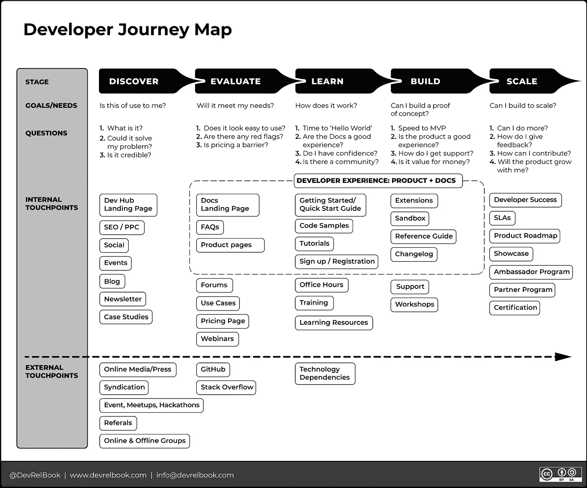

# 开发者关系:开发者旅程图

> 原文：<https://medium.com/codex/developer-relations-the-developer-journey-map-36bd4619f5f3?source=collection_archive---------4----------------------->

# DevRel 程序中开发人员的端到端生命周期。

在本书的开发过程中，可能没有其他工具或框架经历了**开发者旅程图**那么多的修订。这是我们最雄心勃勃的框架，因为它试图记录开发人员与您的 DevRel 程序交互的端到端生命周期。

因此，在这本书里，有六个章节，总共超过 15000 字，致力于探索**开发者旅程图**。这篇文章只能触及这个主题的表面，但希望能作为一个有用的概念介绍。

# 什么是开发者旅程图？

## 阶段、目标、问题、接触点。

像客户之旅一样，**开发者之旅图**是一个可视化的标识，标识了开发者遵循和经历的路径。当他们在各个阶段从左到右移动时，他们的*互动*水平会随着你的品牌、团队和产品而提高。它是 DevRel 中最有价值的工具之一，因为它帮助你从开发者的角度整体考虑体验*同时为你提供非常实用的指南。*

你的目标是让你的开发人员从左到右尽可能快地进步，以增加产品采用率和收入潜力。

那些*交互*，我们称之为*开发者接触点*，用于描绘开发者一路上的经历——他们如何参与，他们参与什么和谁，他们的感受如何，以及他们的反应如何。将这些接触点组织成一张地图有助于您识别缺点或*摩擦*，然后您可以对其进行优化以创造更好的整体体验。

# 五个阶段

## 发现、评估、学习、构建、扩展

地图的五个阶段表明开发商的*意图和行动*发生了重大变化。它们并不意味着逝去的时间。

例如，如果开发人员投入时间，他们很可能在同一天完成前三个或四个阶段，而你已经提供了一个无摩擦的体验。相反，如果你激起了开发者的兴趣，成为用户的采纳周期可能需要一年，但他们还没有找到合适的用例或项目来构建你的产品。开发者产品的类型也很重要——例如，一个 API 通常比一个 IOT 硬件板有更快的运行时间。

请注意，每个阶段都有一个为开发人员设定的*目标*。如果目标实现了，开发人员将进入下一个采用阶段。每个目标都有*关键问题*，你需要为开发者回答这些问题，以实现该阶段的总体目标。对于您的项目，目标和相关问题可能有所不同。这很好。重要的是你已经确定了它们，并且可以为开发人员的进步提供必要的答案。

作为 DevRel 的领导者，开发和优化每个“接触点”是你的工作，确保你回答他们的所有问题，并达到旅程每个阶段的目标。

# 接触点

## 拥有和获得

自有接触点是贵公司拥有和控制的属性和内容。您可以完全控制什么是接触点，它做什么，以及它如何贡献。示例包括您的网站、开发者中心、文档、您在社交媒体上的消息、您的广告、定价信息、代码示例、支持等。

外部接触点则相反。你不能直接控制他们，但是，他们是你接触现有用户和潜在客户的关键资源和渠道。确保您的品牌和工具在这些资产上可见、被讨论并得到支持，对于确保认知度增长、声誉提升和采用率上升至关重要。示例包括面向开发者的媒体、行业分析师、第三方社区、外部论坛等。

在上面的**开发者旅程图**中，我们包括了 42 个接触点供您考虑。我们还把它们放在通常第一次遇到它们的地方。当然，接触点可能与旅程的多个阶段相关。在我们的例子中，不要因为这些是什么或它们在哪里而感到受限制——做适合你的事情。我们鼓励你重复我们的例子。

**开发者旅程图**在 [CC:BY:SA license](https://creativecommons.org/licenses/by-sa/4.0/) 下分享，所以让我们知道你的想法，并随时调整它以不断提高它的效用。

# 如何发现你的旅程是否成功？

我们建议您在最初创建您的程序时使用这个**开发人员旅程图**,并定期通过持续的审查和测试来审核您旅程的有效性。关键是消除你旅途中的所有摩擦。

这里有三种方法可以定量和定性地识别摩擦，以了解你的旅程是否处于最佳状态:

1.  问问你的社区
2.  摩擦测井/摩擦审计
3.  行程数据评估和测量

您的**开发者旅程图**是您将创建的最重要的文档之一。它可以用来记录和平衡开发人员对公司各个方面的互动和经验的理解。它还标出了您的客户和潜在客户花费时间的主要外部(或获得的)场所。

要了解更多关于开发者之旅的地图，请拿起一份 ***开发者关系——如何建立和发展一个成功的开发者计划*** *，现在可以通过 Apress &亚马逊* *预订* [*。*](https://www.devrelbook.com/)