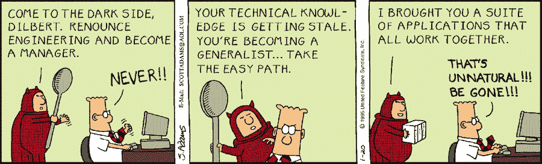

# 开发者现在是决策者

> 原文：<https://medium.com/codex/developers-are-now-decision-makers-96d3c227098d?source=collection_archive---------21----------------------->

科技领域在不断发展，这是无可避免的。你不可能学了一件很酷的事情，然后希望能坚持到你职业生涯的辉煌结束。为了与其他车手并驾齐驱，你需要不断学习和提高技能。你必须适应变化，并且有能力去适应。这并不意味着你必须蹲在一个黑暗的房间里整天编码。你只需要了解技术领域的变化，以及如何利用这些变化让你的组织变得更好。

我来自 DevOps 背景，见过不同的团队互相指责。我的工作角色由此而生，在开发、QA 和运营之间架起了一座桥梁。我管理整个代码交付过程，每天向现场观众推送多达 500 个代码变更。这似乎解决了我上面提到的问题。然而，工程团队和经理之间的冷战仍然存在。工程师一般都很好奇，乐于学习。但是，对于大多数管理人员来说，这可能不是他们的强项。由于技术的不断变化，经理们开始意识到他们不能简单地提出一个产品想法，然后交给工程师去制造。相反，工程师必须从一开始就参与决策过程。在我的案例中，我的财富 50 强客户要求我选择一个私有云和一个敏捷板来跟踪整个项目数百万美元的价值交付流。在打电话之前，我不得不花了几个星期的时间进行研究，并为我的决定提出一个坚实的理由。(并不是说从来没有人要求过)。

权力越大，责任越大。因此，工程师必须能够理解业务是做什么的，以及为什么要这样做。他们应该能够从他们的决策中衡量价值。例如，如果您想要实现一个连续的代码交付管道，您需要测量手动构建和部署代码所花费的时间。你需要针对不同的环境进行计算。您还需要计算这些管道出现故障的次数，检查它们出现故障的原因。获取他们的统计数据。只有这样，你才能衡量你从这种方法中获得的价值。

这里的要点是，如果工程师是构建产品的人，他们应该决定使用哪种编程语言或者匹配哪种类型的数据存储。工程师必须再次放心地戴上管理帽子，并基于可靠的分析做出关键任务决策。管理层应该放心地信任他们的工程师。这种类型的心态可以带来一个伟大的工作场所和伟大的产品。

既然你来这里期待着呆伯特的推荐。

