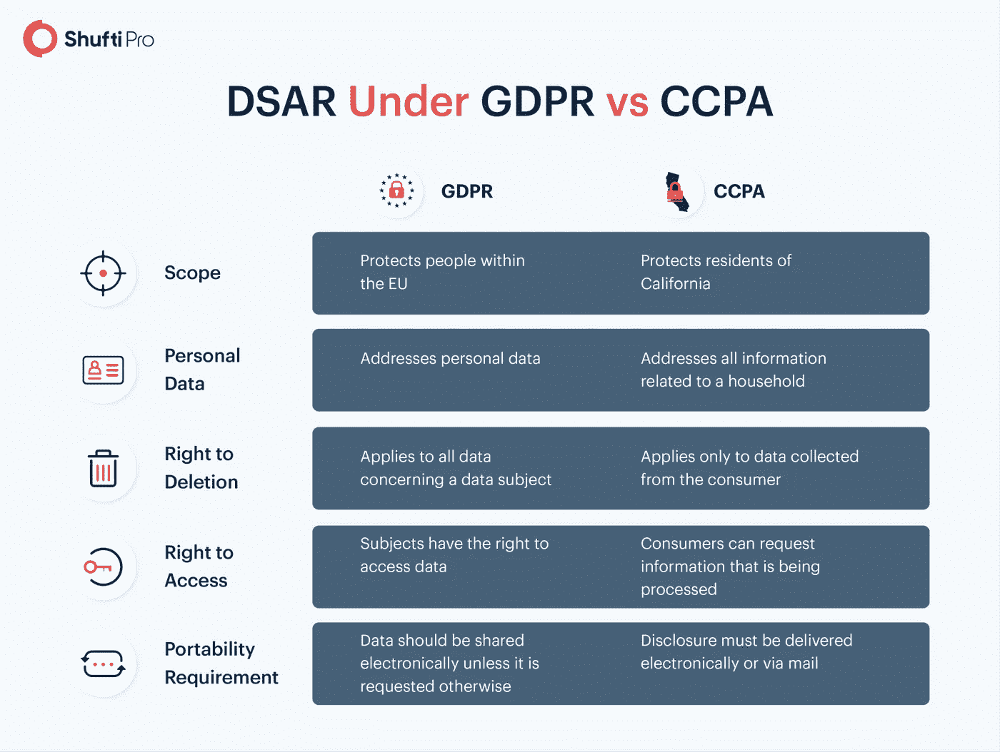

# 银行应用中身份验证 API 的开发人员指南

> 原文：<https://medium.com/codex/developers-guide-for-id-verification-apis-in-banking-apps-661c64fc0e9?source=collection_archive---------13----------------------->

在所有其他部门中，银行必须处理最敏感的数据，即金融信息。这些机构获取客户的财务详细信息，必须防范内部或外部威胁。银行业的安全漏洞会破坏整个企业系统。近年来，KYC(了解你的客户)和反洗钱(反洗钱)做法已从限制转向监管，以保证安全。根据一份报告，通过使用 AML/KYC 合规性扩展技术，一家传统银行可以 [***节省高达 1000 万欧元***](https://www.realwire.com/releases/KYC-compliance-costing-banks-50-million-a-year-as-financial-sanctions-soar) 。

# 远程身份验证——银行的高科技保护

在当今技术进步的时代，身份验证可以通过在线平台进行，无需面对面的会面。在线身份验证已被证明是减少身份欺诈、金融诈骗和潜在洗钱的有效可行的方法。使用人工智能模型，IDV 现在可以通过自动化解决方案而不是人工来执行，该软件只授权合法用户访问银行账户的错误可以忽略不计。

身份验证解决方案可用于验证和认证两个阶段。让我们来讨论第一种方法，通过验证政府批准的身份证件(如护照)来验证客户的身份，并将照片 ID 与面部生物特征进行匹配。在第二种情况下，在验证过程中，将现场拍摄的自拍与之前存储的生物特征进行比较。IDV 解决方案可以通过 API 集成到银行应用和网站中。

# 选择第三方 API 时要考虑什么！

软件开发人员在开发银行应用程序或网站时，必须集成扩展的人工智能驱动技术。他们必须付出额外的努力，同时开发用于 [***面部识别***](https://shuftipro.com/blog/all-you-need-to-know-about-facial-recognition/#How-Does-Facial-Recognition-Technology-Work) *、文档验证和数据提取的模块。*

*既然可以轻松外包整个流程，为什么还要开发内部解决方案呢？*

软件工程师在购买 API 之前应该考虑以下事项。

## 定义最终用户

直接使用软件或产品的个人被称为最终用户。开发人员和企业总是识别和定义他们的最终用户，从而为他们提供相应的服务。有不同的因素对最终用户进行分类，如人口统计和客户的年龄组，更不用说他们的社会经济状况和他们为什么使用软件。

API 解决方案应该反映最终用户的需求，没有额外的功能。它应该是用户友好的，不需要额外的培训。由于银行拥有来自社会各阶层的大量客户，从外行到大学教授，API 的功能必须是通用的。

确保您向 API 提供商清楚地描述了您的最终用户…

一旦定义了最终用户，确保 API UX 和 UI 符合最终用户的需求。API 接口应该易于最终用户使用…

## 用户体验和界面

用户与软件产品交互或使用软件产品的方式被称为用户体验，视觉设计、布局和排版被称为用户界面。由于用户可能来自不同的背景和地区，所以颜色，界面和语言应该适合他们。

最终用户应该容易理解验证流程。它应该是不言自明的，因为数字 IDV 的整个思想是无缝和平滑的身份验证。

## 数据保护

如前所述，数据是银行业中最重要的元素。ID 图片将与 API 提供者共享以供验证。如果这些数据被用于任何其他目的，如销售给营销公司，它可能会导致数据隐私的法律诉讼。

数据应该加密并存储在云服务器中(这样就可以在全球范围内访问)，遵守国际数据保护标准，如 *GDPR* 。此外，最终用户必须有权在特定时间后移除/删除数据。

## 轻便

操作系统(OS)和版本的独立性决定了一个软件在未来可以使用多久。如果软件不能升级到相应的操作系统版本，那么从长远来看，它自我维持的机会很少。该软件应能在所有主要操作系统(Android、iOS 和 Windows)上运行，以便拥有更广泛的用户。选择 API 之前必须研究其可移植性，因为它会限制用户数量。

API 应该通过这些可移植性测试；

**可安装性:**检查安装在各种系统、环境和版本上的有效硬件配置。还测试了库和相关文件的分配。

**兼容性:**一个模块(软件)能与其他模块成功运行的特性。

**适应性:**软件适应变化的环境或组件而无需任何额外动作的能力。

## 市场价值

这是挑选产品的最佳策略，例如，用户在下载应用程序之前会看到它的评级。为银行应用程序选择 API 也可以这样做。可以通过研究提供商的客户评论来分析市场价值。在研究 IDV 解决方案等身份管理(IDM)软件的市场价值或客户满意度时，Salesforce Appexchange 是最值得信赖的来源之一。

# 为什么选择第三方 API？-

可以这样想，如果软件工程师可以开发一个完整的银行 app，那么也可以开发一个身份验证模块。

*在开发 IDV 解决方案之前，先看看第三方 API 的好处。*

## -更快的发展

它节省了开发团队的时间，因为他们必须处理完全不同的功能和模块。通过集成以前开发的 API，可以将几个月的时间缩短到几天。在 SDLC 期间，这段时间可用于其他重要任务。

## -降低成本

预算对软件开发的影响最大。开发一个内部解决方案可能需要几个月的时间，因此必须向开发人员支付更多的工资。通过 API 集成，预算可以减少，并可以投资于改进功能和消除应用程序的错误。

## -巧妙的开发

开发团队并不精通软件工程的所有方面。使用第三方 API 可以提供最好的特性——就像熟练的现场开发人员开发的那样，还可以消除开发过程中不必要的障碍。

## -增强的可扩展性

内部软件无法达到现代 IDV 解决方案所提供的可扩展性水平。由于这些解决方案已经过测试并不断升级以进行改进，新软件将需要很长时间才能达到这一水平。

IDV 软件在数千个数据集上接受训练，以发现身份证件中的异常情况，并检测欺诈企图。新软件还不够成熟，无法以同样的效率进行验证。

# 最后的想法

开发银行移动应用程序或网站需要驱动程序技能，这可能会增加时间和成本，但是，以前开发的 API 可以从第三方购买。身份验证 API 和 SDK 可用于遵守 KYC/反洗钱法规，而无需投入额外的精力进行开发。